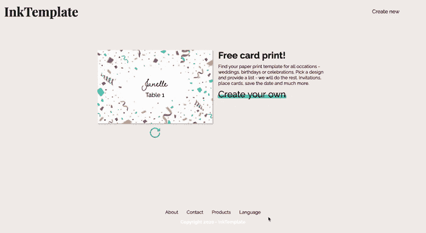

# 让我们下五彩纸屑雨吧！不要担心混乱🎉

> 原文：<https://javascript.plainenglish.io/lets-make-it-rain-confetti-don-t-worry-about-the-mess-a492ecb4a6b8?source=collection_archive---------7----------------------->

## 五彩纸屑很有趣，但可能会有点乱。下面是你如何在 React 中创建一个五彩纸屑飞溅的屏幕。我保证——之后不会打扫🙏



Screenshot from [InkTemplate.com](http://www.inktemplate.com)

我创建了一个名为 [InkTemplate](http://www.inktemplate.com) 的新应用——一项为任何活动、生日或婚礼创建定制的可打印餐桌卡、位置卡、菜单等的服务。你只需带上你的客人名单，InkTemplate 提供了 150 多种设计、字体和颜色供你选择。我想围绕为客人准备的节日部分进行设计，并从一个五彩纸屑的设计中获得灵感。我想给页面和五彩纸屑添加一些颜色和乐趣！

你也想加点五彩纸屑吗？

# 👩‍💻让我们做一些编码

首先，我们需要使用`npm`或`yarn`安装[反应五彩纸屑](https://github.com/alampros/react-confetti):

```
$ npm install react-confetti$ yarn add react-confetti
```

闪屏是一个全屏幕的封面，你可以在等待与 API 通信时使用。

你可以考虑让你的闪屏持续几秒钟，这样不仅可以让它飞溅起来，而且不会有任何纸屑显示。由于闪屏和等待屏一样是一个设计元素，如果你愿意，你可以添加一个定时器。

# 🎉瞧啊。

你现在有自己的五彩纸屑飞溅屏幕。

反应-五彩纸屑有许多你可以改变的参数，比如重力(五彩纸屑落下的快慢)，不透明度和五彩纸屑的颜色等等。看看所有五彩纸屑道具的[文档](https://github.com/alampros/react-confetti#props)。

快乐编码👩‍💻

## **简单英语的 JavaScript**

喜欢这篇文章吗？如果有，通过 [**订阅解码，我们的 YouTube 频道**](https://www.youtube.com/channel/UCtipWUghju290NWcn8jhyAw) **获取更多类似内容！**