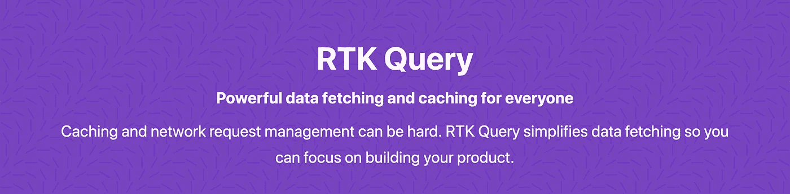

# Redux 工具包查询综述

> 原文：<https://javascript.plainenglish.io/lets-review-rtk-query-392e1c8b78e3?source=collection_archive---------7----------------------->

RTK Query — Powerful data fetching and caching solution built on Redux

RTK Query 是 Redux 家族的最新成员，它为使用 Redux 管理客户端状态的应用程序带来了一个非常需要的数据提取解决方案。

GitHub:[https://github.com/rtk-incubator/rtk-query](https://github.com/rtk-incubator/rtk-query)T2【Docs:[https://rtk-query-docs.netlify.app/](https://rtk-query-docs.netlify.app/)

在撰写本文时，该库还处于 alpha 版本，所以预计会有变化。

## 概观

新的库带来了一个简单的数据获取 API，类似于 Redux 提供的 [ReactQuery](https://react-query.tanstack.com/) 和 [SWR](https://swr.vercel.app/) 。

根据我的经验，从事大型项目和每天阅读来自使用 Redux 的开发人员的在线讨论，最大的问题是 Redux 的巨大灵活性和粒度控制(听起来这些*应该是*好事情，对吗？).对于管理复杂状态来说，这种灵活性是惊人的，但是当您获取数据时，它也给您留下了相当多的样板代码。

看看这篇文章[https://blog . log rocket . com/data-fetching-in-redux-apps-a-100-correct-apps-4d 26 e 21750 fc/](https://blog.logrocket.com/data-fetching-in-redux-apps-a-100-correct-approach-4d26e21750fc/)就知道了，这篇文章已经过时了(虽然只有 2 年的历史),但是它显示了您需要编写多少代码来处理 Redux 中的基本状态和缓存。

Redux Toolkit 是一个巨大的进步，确实减少了需要编写的样板代码的数量，但即使在官方文档中，也很难理解如何设置大多数应用程序需要的简单数据获取。

你可能会想，任何优秀的开发人员都会在项目开始时创建一个抽象，但你会惊讶地发现，由于这样或那样的原因，这种情况并不经常发生。即使你做了，你是在处理所有可能的状态吗？您是否处理轮询、预取和重新获取？

ReactQuery 和其他类似的库确实填补了这个领域的一个空白；提供了一个非常小，简单和一致的方式来获取和缓存数据。他们允许开发人员避免为每个项目编写复杂的代码，并专注于构建应用程序。

RTK Query 遵循这些其他库(迟做总比不做好😉)但是背后有更大的 Redux 生态系统的权重。

## **哪里合适？**

我认为一旦 RTK Query 可以投入生产，它将是任何应用程序的一个非常好的选择。

对于只需要**简单数据获取**的应用程序，您可以自己使用该库，由 ApiProvider 为您引导 Redux 存储。

正在进行更复杂的**客户端状态管理的应用程序**可以将库设置为[与其现有的 Redux 商店](https://rtk-query-docs.netlify.app/introduction/getting-started#add-the-service-to-your-store)一起工作。这很好，因为它允许应用程序开始使用 RTK Query，不必担心实现单独的解决方案或重写，因为他们意识到他们需要更灵活的东西……只需设置 [RTK](https://redux-toolkit.js.org/) 就可以了！

## 结论

我很高兴看到这个非常需要的 [Redux Toolkit](https://redux-toolkit.js.org/) 的补充发布，并很兴奋尝试一下。对几个月前第一次提交发布的时间印象深刻。

和 Redux 项目的大部分一样，docs 非常棒，在它的背后有一个惊人的社区，这是一个庞大的+1🔥。

对于任何已经在使用 RTK 或者预计将需要 Redux 功能的应用程序来说，这都是轻而易举的事情。

如果您*只需要*一个数据获取解决方案，那么我仍然建议使用 ReactQuery，原因很简单，因为目前它是一个更成熟的解决方案，并且以更小的捆绑包大小提供了一些额外的功能( [7.2kB](https://bundlephobia.com/result?p=react-query@2.26.3) 对比 [12.8kB](https://bundlephobia.com/result?p=@rtk-incubator/rtk-query@0.1.0-alpha.0) 缩小+ gzipped)。