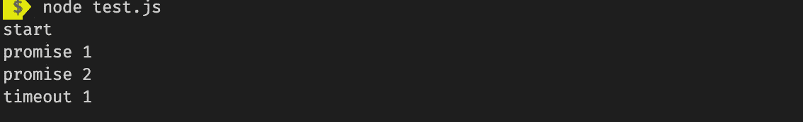
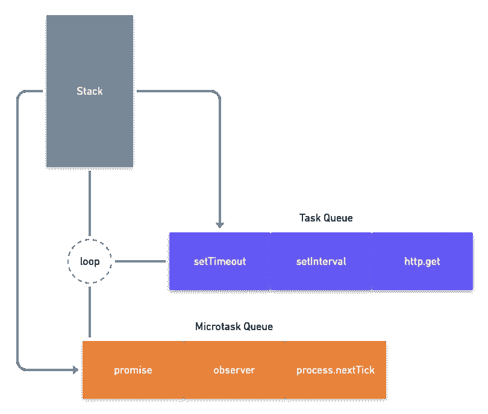

# 让我们旋转事件循环

> 原文：<https://javascript.plainenglish.io/lets-spin-the-event-loop-by-ashish-mishra-8ec4d1412376?source=collection_archive---------5----------------------->

## 深入探究事件循环工作的内部及其古怪之处。


Photo by [Lysander Yuen](https://unsplash.com/@lysanderyuen?utm_source=unsplash&utm_medium=referral&utm_content=creditCopyText) on [Unsplash](https://unsplash.com/s/photos/loop?utm_source=unsplash&utm_medium=referral&utm_content=creditCopyText)

我们知道，事件循环是 javascript 运行时环境提供的一种机制，用于使用 JS 引擎处理代码块的执行。

理解事件循环的工作方式对于优化很重要，有时对于正确的架构也很重要。

# 用例

尝试预测以下用例的输出顺序:



output order

乍一看，输出顺序似乎令人困惑，因为承诺在 setTimeout 之前执行，而且两者都是异步的。

似乎事件循环并没有以同样的方式对待每个异步任务。我们稍后将访问这个用例以获得详细的解释，但是让我们深入挖掘以找到这个行为背后的原因。

# 宏观和微观任务

事件循环有多个任务队列，一个用于 ***任务/宏任务*** (术语可互换使用)，一个用于 ***微任务、*** 现在明显的问题是如何将任务识别为这些类型之一。

根据规范`parser`、`events`、`callbacks`、`resource fetching`、`DOM manipulation`被认为是宏任务，作为任务队列进行管理。其中 as `promises`、`mutation observers`、`intersection observers`被视为微任务，由微任务队列管理。

事件循环使用不同类型的队列来隔离基于类型的任务，这决定了它们的优先级和执行顺序，这就是事件循环如何进行优化。



event loop (representational image)

# 事件循环及其执行步骤

为了便于理解，我们来看看事件循环的大致实现。

Rough implementation of event loop

事件循环旋转时采取的步骤-

Steps of execution

*   任务队列是为不同类型的任务创建的，运行时环境可以决定队列和它们的优先级，这就是为什么输出的顺序有时会在不同的环境中有所不同，但我们将遵循这里的规范。
*   为微任务维护一个队列。
*   首先执行下一个宏任务(只有一个)。
*   之后，所有存在的微任务被执行。

> 这里要注意的是，一个微任务可以触发另一个微任务被添加到队列中，并且这个过程一直持续到微任务队列被耗尽。

*   执行循环的渲染部分，并按以下顺序调度事件-

Render events orders

*   并且循环继续。

# 回到这个例子

现在，在看到执行步骤后，您可能会认为 setTimeout 是一个宏任务，应该首先执行，是的，您是对的，但是调度回调本身被认为是一个任务。因此，当事件循环开始循环时，它会找到一个应该放在任务队列中的 setTimeout 任务，然后继续调度和执行微任务，参见步骤:

**第 1 周期-**

*   setTimeout 计划为一项任务。
*   承诺按微距询问计划。
*   调用堆栈现在是空的，微任务被执行。

**第 2 周期-**

*   执行计划的 setTimeout 回调。

> 请记住一点，一个微任务可能会触发另一个微任务，该微任务应在同一周期内执行。
> 所以，如果我们考虑创建&将微任务调度为微任务本身，那么为什么承诺(微任务)会在调度之后被选择和执行，而不是 setTimeout(宏任务)，这是有道理的。

> 现在尝试获取此用例的顺序，并对您的答案进行评论。

This looks intimidating 😰

# 更好地理解任务的重要性！

> 因为您的代码运行在同一个线程中，使用同一个事件循环，作为浏览器的用户界面，如果您的代码阻塞或进入一个无限循环，浏览器本身将会停止。即使是缓慢的性能，无论是由 bug 还是由您的代码完成的复杂工作引起的，都可能导致用户遭受缓慢的浏览器——MDN。

到目前为止，我们已经知道这两种类型的任务对浏览器来说都是渲染阻塞的，所以如果你在像 setTimeout 这样的异步调用中执行繁重的计算/ CPU 消耗任务，直到任务执行，浏览器将不再响应用户事件(这就是为什么浏览器给出的页面不响应警告会持续更长时间)，

为了克服这个问题，我们可以将任务分成多个块，这样浏览器就不会长时间阻塞用户事件。

还有其他的选择，比如[网络工作者](https://developer.mozilla.org/en-US/docs/Web/API/Web_Workers_API/Using_web_workers)就是其中之一，我不会在这里详细讨论，因为我们正在探索事件循环。但这里重要的一点是，web 工作人员有自己的事件循环，称为 ***工作人员事件循环*** 不同于浏览器用于活动窗口及其子窗口的 ***窗口事件循环—*** 事件循环。

## ***排队微询问***

***queueMicrotask()***API*由窗口或工作器顾名思义提供，可用于将微任务排队，即在当前任务完成其工作后，当没有其他代码等待运行时，将执行上下文的控制权返回到事件循环中。*

*将微任务入队也有其他技巧，例如通过创建一个可以立即解决的承诺，但是创建和销毁承诺需要额外的时间和内存开销，而将微任务正确入队的函数可以避免这些开销。*

***怎么了？***

```
*queueMicrotask(() => {
  /* code to run in the microtask here */
});*
```

***什么时候？** 它在 JavaScript 执行上下文的主体退出之后，但在任何事件处理程序、超时和间隔或其他回调被处理之前运行，如事件循环算法所示。*

*   *可以使用微任务的一个场景是，如果异步任务创建是有条件的，在这种情况下，操作的顺序可以变化，那么一个示例可以更好地解释这一点。*

```
*customElement.prototype.getData = url => {
 if (this.cache[url]) {
    this.data = this.cache[url];
    this.dispatchEvent(new Event("load"));
 } else {
    fetch(url).then(result => result.arrayBuffer()).then(data => {
      this.cache[url] = data;
      this.data = data;
      this.dispatchEvent(new Event("load"));
    });
 }
}// execute
element.addEventListener("load", () => console.log("Loaded data"));
console.log("Fetching data...");
element.getData();
console.log("Data fetched");// Order when data is present in cache | // when its fetched async
1\. Fetching data...              | 1\. Fetching data...          
2\. Loaded data.                  | 2\. Data fetched
3\. Data fetched                  | 3\. Loaded data*
```

*操作和事件的顺序根据数据是否存在于缓存中而变化，为了确保顺序的一致性，我们可以使用 queueMicrotask()将出现在 *if* 块中的任务包装起来。*

```
*customElement.prototype.getData = url => {
 if (this.cache[url]) {
  queueMicrotask(() => {
  this.data = this.cache[url];
    this.dispatchEvent(new Event("load"));
  });
 } else {
    fetch(url).then(result => result.arrayBuffer()).then(data => {
      this.cache[url] = data;
      this.data = data;
      this.dispatchEvent(new Event("load"));
    });
 }
}*
```

> *这个特性是现代基于浏览器的 JavaScript 开发提供的专门特性，允许您调度代码在一长串等待发生的事情中跳到其他事情的前面。滥用这种能力会导致性能问题。*

# *结论*

*我希望这篇文章能帮助你了解事件循环的工作原理及其细节，现在你理解并能更好地使用这些概念。在这里，我们还探索了**微任务**，并了解了如何使用 **queueMicrotask API** 将**微任务**排队，以及它是如何有用的。*

*在 medium 上，我试着根据我的学习和经验写一些关于 web 开发的文章，所以如果你想在未来读到一些令人惊奇的东西，你可以在 Medium 上关注我。*

*欢迎评论您对本文的想法、反馈和建议，再见！*

## *用简单英语写的 JavaScript 的注释*

*我们已经推出了三种新的出版物！请关注我们的新出版物，表达对它们的喜爱:[**AI in Plain English**](https://medium.com/ai-in-plain-english)，[**UX in Plain English**](https://medium.com/ux-in-plain-english)，[**Python in Plain English**](https://medium.com/python-in-plain-english)**——谢谢，继续学习！***

***我们也一直有兴趣帮助推广高质量的内容。如果您有一篇文章想要提交给我们的任何出版物，请发送电子邮件至[**submissions @ plain English . io**](mailto:submissions@plainenglish.io)**，并附上您的 Medium 用户名，我们会将您添加为作者。另外，请让我们知道您想加入哪个/哪些出版物。*****

## *****[编辑]*****

*****(26/04/2020)*****

*   *****感谢 [ARKAPRAVA GHOSH](https://medium.com/u/bff6c3ffbea4?source=post_page-----8ec4d1412376--------------------------------) 指出错别字。*****
*   *****感谢 anindia Ghosh 的宝贵意见。*****

## *******【参考文献】*******

*   *****[https://html . spec . whatwg . org/multipage/web app APIs . html # event-loops](https://html.spec.whatwg.org/multipage/webappapis.html#event-loops)*****
*   *****[https://developer . Mozilla . org/en-US/docs/Web/API/HTML _ DOM _ API/Microtask _ guide](https://developer.mozilla.org/en-US/docs/Web/API/HTML_DOM_API/Microtask_guide)*****
*   *****[https://developer . Mozilla . org/en-US/docs/Web/API/HTML _ DOM _ API/Microtask _ guide/In _ depth](https://developer.mozilla.org/en-US/docs/Web/API/HTML_DOM_API/Microtask_guide/In_depth)*****
*   *****[https://www.youtube.com/watch?v=8aGhZQkoFbQ](https://www.youtube.com/watch?v=8aGhZQkoFbQ)*****