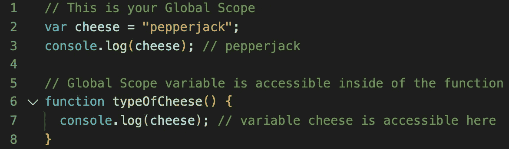
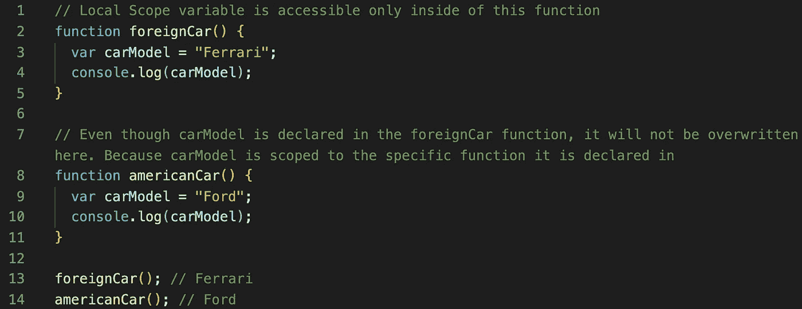
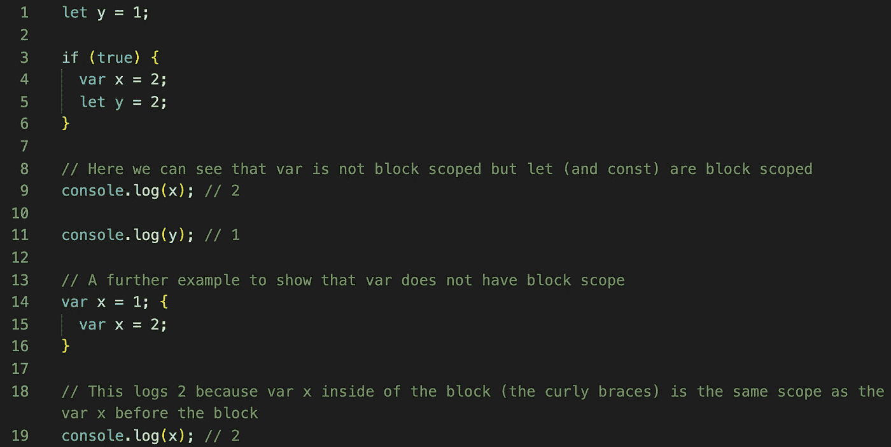
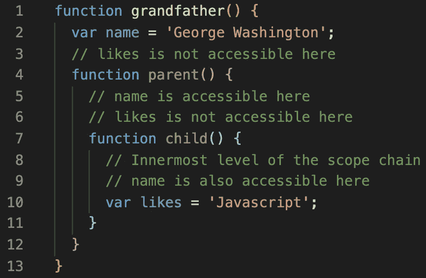

# 我们来谈谈范围，宝贝！

> 原文：<https://javascript.plainenglish.io/lets-talk-about-scope-baby-3241c6dff1e4?source=collection_archive---------2----------------------->

## *不要介意绍特-N-佩帕的引用*🤦🏽‍♂️

在 JavaScript 中，作用域有多种类型。那么范围到底是什么？

范围决定了在代码中何处/如何使用和访问变量或其他元素。

有全局、局部、函数、块和词法范围。让我们来分解一下:

## 全球范围

全局范围在 JS 代码中只存在一次。基本上，你的功能之外的区域被认为是全局范围。如果在这里声明变量，它们可以在代码中的任何地方使用。通常不建议这样做，因为代码会变得更长更复杂。

Example of Global Scope variable

## 局部范围

局部范围包含在函数内部定义的变量。此外，每个函数都有自己的作用域。因此，在一个函数中，如果你声明了一个名为 *sum* 的变量，而在另一个函数中声明了另一个名为 *sum* 的变量，它们不会相互冲突或覆盖。为什么？因为局部范围。这些变量的作用域是声明它们的函数。

局部作用域又分为函数作用域和块作用域。块范围相对较新，因为它是在 ES6 中与 *const* 和 *let* 一起创建的。

Local Scope example with same variable name carModel

## 功能范围

上面提到的功能范围在本地范围“保护伞”下这意味着在函数内部声明的变量只限于该特定函数。这个特殊的变量只能在声明它的函数内部被访问。如果你试图在函数之外调用它，它将抛出一个错误。有些人认为局部作用域和函数作用域是一样的，因为在函数内部声明的变量对于该函数来说是局部的。

## 块范围

块作用域相对较新，所以有些人可能以前没有见过。然而，它基本上是函数中花括号{}内的代码。我们通常在 *if* 语句、 *switch* 语句、循环(for、while 等)中看到这种类型的结构。随着你进一步深入 ES6，你会意识到 *let* 和 *const* 将允许你在块范围内声明变量。

Block Scope example and difference between var and let scopes

## 词法范围还是静态范围

词法范围(有时称为静态范围)与上面讨论的其他范围有点不同。这意味着内部函数(子函数)可以访问父作用域中的变量。子函数在词汇上与其父函数的执行上下文绑定在一起。

Lexical Scope example with grandparent, parent and child

关于 ES6 变量声明的更多范围信息， *var* ，*让*和 *const* 看看我的另一篇博文吧！