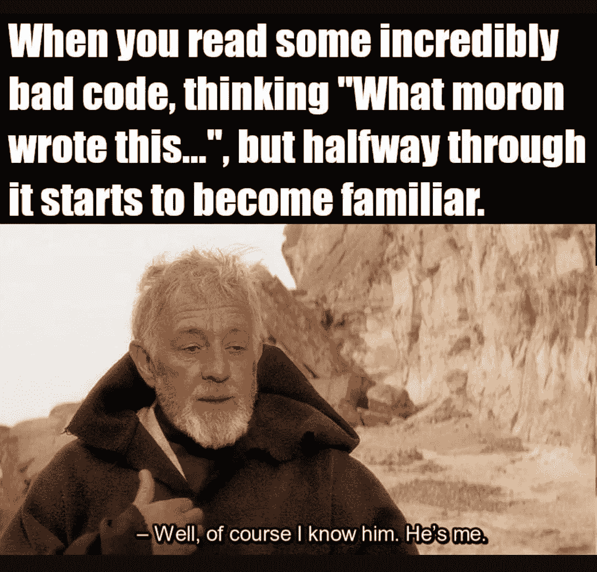
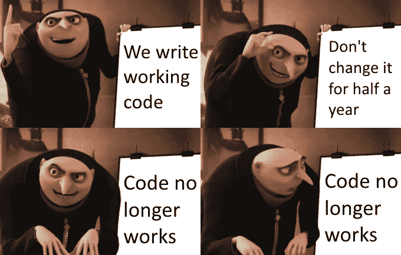
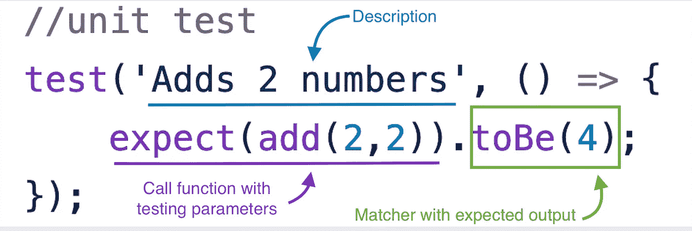
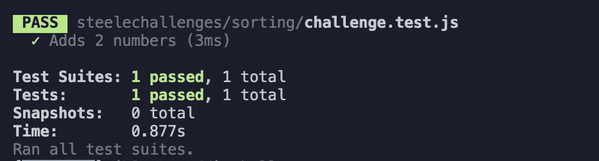
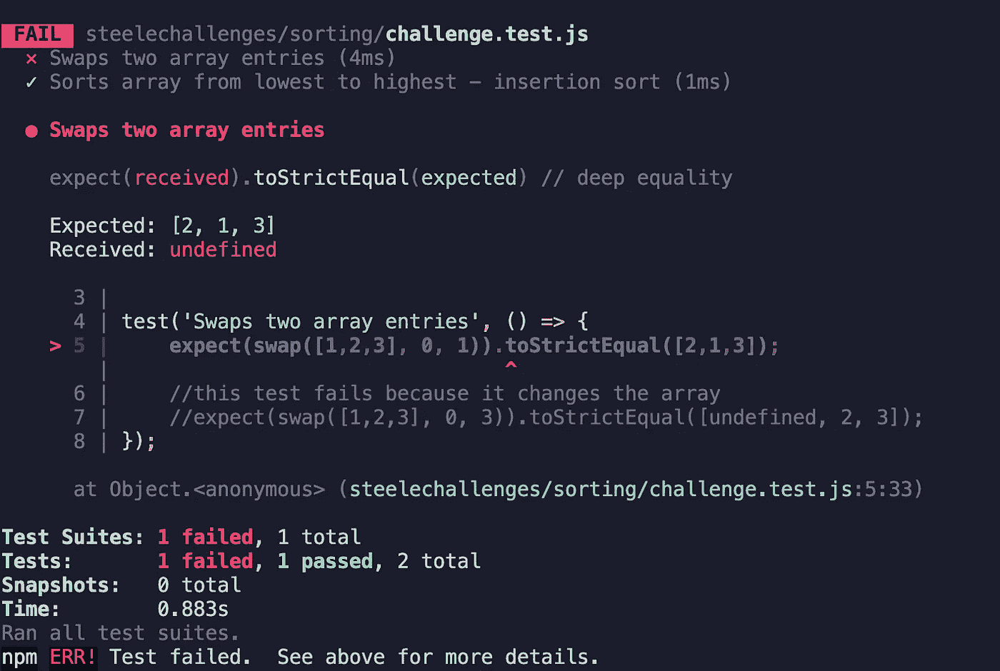

# 我们来谈谈测试吧，宝贝

> 原文：<https://javascript.plainenglish.io/lets-talk-about-tests-baby-dbc51c6d316c?source=collection_archive---------9----------------------->

## …以及所有可能的好事和坏事

测试和测试驱动开发是开发人员工具箱中最有价值的技能之一。当我说测试时，我不是指像使用 debugger/console.log (JS)或使用 Pry/Byebug (Ruby)这样的快速手动测试。我说的是用 Jest (JS)或 Rspec (Ruby)这样的库编写单独的测试文件。

“所以你是说我必须写代码来测试我刚刚写的代码？”



#relatable

# 为什么要测试？

编写测试在多个方面对您的代码有益。

**它让你思考你的代码。当编写测试时，你必须考虑所有可能或不可能通过的边缘情况。如果在应该是字符串的地方传入一个数字会发生什么？或者如果某个东西最终未定义或为空呢？编写测试相当于自我检查，并允许您返回并重构——这本身就是另一个好处。**

**它帮助你写出更干净的代码**。如果您有一个调用其他函数的封装函数，而这个封装函数失败了，那么就很难确定您的逻辑出了什么问题。测试有助于您将代码重构为可重用的、模块化的片段，这些片段可以在测试它们的集成之前进行单独测试。如果你在写测试的时候在遵循你的代码方面有困难，你认为其他人如果不得不使用你的代码会有什么感觉？

它帮助你的代码适应未来。测试不仅使代码更加清晰易读——而且测试本身可以帮助他人理解你的逻辑。它还可以帮助您重新访问一段时间没有看到的代码。测试自动化带来了另一个好处。如果您需要添加一个功能或更改已经有测试的代码，测试可以帮助您找到新代码中的错误，并防止这样的错误出现在构建中。



Should have written tests….

# 测试类型

现在我们知道了为什么测试很重要，让我们看看不同种类的测试。

## 单元测试

单元测试是最孤立的测试类型。它们通常只涉及测试一个功能，或者几行代码。它们最容易编写，也最容易推断出可能的结果。程序员编写的大多数测试都是单元测试。

## 集成测试

集成测试针对的是被*集成*在一起的代码片段，就像一个函数调用其他函数一样。它们更难编写，因为错误会在更多的地方出现(这就是为什么我们有单元测试)。集成测试没有单元测试频繁，但同样重要。

## **端到端测试**

端到端测试确保无论编写什么代码都会在浏览器中得到反映，这些测试有时被称为 UI 测试。一个例子是在添加、删除或更改某些元素后验证 DOM。这些是最复杂的测试，因为它们通常有多个步骤，并且需要额外的设置来运行。

When your unit tests work but your integration tests don’t

# 设置

许多测试库将两个或所有三个必要的测试工具集成到一个框架中，但是许多框架允许与其他库集成，因此您可以相应地定制您的测试。

*   测试运行器(Test Runner)—一个执行你编写的测试并总结结果的工具。例子:摩卡(JS)、黄瓜(Ruby/多国语言)
*   **断言库** —定义测试逻辑条件的工具。例如:Chai (JS)，Rspec (Ruby)
*   **无头浏览器** —一个模拟浏览器交互进行端到端测试的工具。例如:木偶师(JS)，水豚(Ruby/多语言)

# 测试示例:Jest

在下面的例子中，我将使用 Jest——一个基于 JavaScript 的测试框架，它将测试运行器和断言库合二为一。为了使用 Jest，我们需要使用以下命令将其添加到我们的开发依赖项中:

```
npm install --save-dev jest
```

为了运行我们的测试，我们需要将“test”脚本改为在我们的包中运行“jest”。

```
"scripts": {
   "test": "jest"
},
```

在我们进入示例之前，让我们分解一下样本测试的基础。这是我们正在测试的功能:

```
function add(num1, num2){
   return num1 + num2 
}
```

这是我们为它编写的测试:



Diagram of a Jest Test

并非所有的测试示例都完全相同，但它们通常都包含这些部分。蓝色下划线的部分是**描述**——它应该描述这个测试在做什么。这是一个一般性的描述，但是如果可以的话，你可以而且应该更具体一些——比如“2 + 2 等于 4”。Jest 中的“test”函数接受两个参数，描述和一个回调函数。回调函数使用关键字“expect”并接受您正在测试的**代码、**和带有预期输出的**匹配器。**

匹配器是最重要的部分，你可以把它看作是单词形式的比较。有很多匹配器像 toBeNull，toStrictlyEqual，toBeTruthy 等。甚至可以加上”。如果您测试的是与预期输出相反的结果，则不要在匹配器前使用“not”。每个框架都有大量的匹配器，所以要确保为你的测试找到正确的匹配器——当涉及到数据类型时，它们很重要。我们上面使用的匹配器是 toBe(它几乎与 toEqual 相同)，但这只是因为我们期望的输出是一个原始类型——一个数字。如果我们匹配一个数组，toBe 将测试每个数组的字符串是否相同，它将**而不是**测试数组是否有相同的元素。

测试应该在命令行中输出类似这样的内容。



Command line testing summary.

让我们尝试一个更健壮的例子。这是我们将要测试的文件:

2 functions, one of which is integrated into the other

我们需要在另一个同名的文件中编写我们的测试。test”——我上面的文件是“app.js ”,所以我的测试文件被命名为“app.test.js”。注意我们用来导出函数的语法——我们在 node 中工作，所以我们需要使用“module.exports”和下面的“require”语法，以便我们的测试能够正常运行。

A unit test and some integration tests

您可能已经注意到，在我们的集成测试函数中有两个测试。如果对组织有意义，我们可以将多个测试堆叠到一个函数中。让我们进行测试，看看会发生什么。



Our unit test fails… but the integration test works??

当我们的单元测试工作时，我们的集成测试是如何失败的？？这是一个奇怪的情况，在测试中误差是*实际上是*。我们的函数在交换两个元素后没有返回数组，所以我们的测试期望得到一个数组，但却得到了“未定义”，因为我们的交换函数**没有返回任何东西。**您还应该看看我们的测试为失败提供的所有信息——它们告诉我们匹配器在寻找什么，结果是什么而不是我们期望的，甚至告诉我们测试代码中失败的部分。

Back to passing tests!

我们没有改变原来的函数，而是简单地将交换后的数组保存到一个变量中，并测试该变量以确保交换正确发生。上面的文件还演示了测试并不严格要求将函数调用附加到匹配器上——在这种情况下，测试只验证函数输出的变量是正确的。

我在下面提供了一些资源，以获得更多关于测试以及如何运行端到端测试的信息。

# **资源**

[](https://medium.com/the-mission/end-to-end-e2e-testing-react-apps-with-selenium-webdriver-and-node-js-is-easier-than-you-think-bfa71f289786) [## 端到端(e2e)用 Selenium WebDriver 和 Node.js 测试 React 应用比你想象的要简单

### 端到端(e2e)测试是针对真实浏览器执行测试场景以测试整个堆栈的过程…

medium.com](https://medium.com/the-mission/end-to-end-e2e-testing-react-apps-with-selenium-webdriver-and-node-js-is-easier-than-you-think-bfa71f289786) 

[https://medium . com/@ gianfranconuschese/what-automation-can-do-for-you-rake-in-ruby-on-rails-ce 6a 729984 e](https://medium.com/@gianfranconuschese/what-automation-can-do-for-you-rake-in-ruby-on-rails-ce6a729984e)