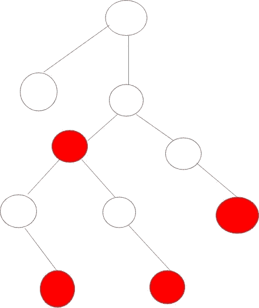

# React 上下文是如何工作的？

> 原文：<https://javascript.plainenglish.io/lets-talk-context-b188ffe59b20?source=collection_archive---------3----------------------->

## 关于 React 上下文 API 的简单教程


image of code from unsplash

众所周知，Reactjs 是一个库，它简化了原本复杂的 UI 的创建，具有声明式 API，并且它利用了常规 JavaScript 的大部分实现，这使得 react 非常容易使用；你所要做的就是学习 React 背后的一些哲学，一些语法和工具，然后嘣！你很快就会写出反应。

**现在，我们来看一下手头的主题，上下文 API。**

> “要完全理解某样东西是什么，你必须首先知道两件事，那东西的目的是什么，它能解决什么问题”——**泰勒·麦金尼斯**

让我们从这句话的后一句开始。在 React 中，有时我们需要在组件之间共享状态。我们通过 props 将状态数据传递给组件来实现这一点。然而，当我们需要深入嵌套在应用程序组件树中的组件的状态数据时，这是如何工作的呢？实际上非常简单，只需将状态数据移动到最近的父组件，并通过 props 传递下去。

这听起来很棒，几乎是直觉，对吗？🙂。不幸的是，这很快就会变得很麻烦，尤其是当你的应用程序越来越大，越来越难以管理的时候😓。让我举一个用例，假设您创建了一个应用程序，但不是有一个组件需要一条状态数据，而是有多个组件在不同的位置和深度需要该状态数据。类似这样的东西👇



I created this; designers, please be gentle🙂

在这种结构中，我们可靠的“父组件解决方案”成为了一个问题，因为我们不必要地需要通过中间组件传递所需的状态数据才能到达目的地。正如我之前所说，这不是最佳选择，而且在较大的应用程序中很难跟踪数据流。

值得庆幸的是，可靠的 React 团队已经为这个问题添加了一个解决方案: **Context。**

> “上下文提供了一种通过组件树传递数据的方式，而不必在每一层手动传递属性。”——React Docs

简而言之，这意味着使用 context API，我们可以将某些数据暴露给组件树中的任何组件，不管它的嵌套有多深。您可能已经猜到了，它解决了某些组件无法访问某些数据的问题。您可以为想要公开的任何新的唯一数据创建一个新的上下文。这可以这样做👇

```
let myContext = React.createContext()
```

嗯，看起来很简单；然而，这还不是全部。有了这段代码，变量`myContext`将有两个我们关心的属性:`Provider`和`Consumer`。

```
const {Provider, Consumer} = myContext
```

这两个属性只是组件。你可以把`Provider` 想象成一家银行，因为就像银行一样，它保存着你可能想用来消费的所有钱(数据)。类似地，`Consumer`——与我们的银行业类似——就像一张信用卡/借记卡，可以用来在世界任何地方获取你的可用资金(数据)。

现在让我们用更专业的术语来重新表述。`Provider`组件保存我们希望在整个组件树中可用的数据，而`Consumer`允许我们在组件树中的任何组件中使用“**公开的**数据。

# 语法

既然我们已经对上下文 API 的用途以及它所解决的问题有了一些了解，那么现在是时候转到本文中我最喜欢的部分了:代码🔥🔥。

**注意:我将在这个例子中使用一些钩子，所以如果你不熟悉它们，我建议你浏览一下** [**React 钩子文档**](https://reactjs.org/docs/hooks-intro.html)

使用上下文的方式相当简单。让我们尝试一个简单的主题化例子

```
const ThemeContext = React.createContext()
const ThemeProvider = ThemeContext.Provider
const ThemeConsumer = ThemeContext.Consumer
```

现在我们已经声明了变量，让我们继续我们的虚拟应用程序结构。让我们假设我们已经有了一个`NavBar`和`Home`组件。

```
function App() { const [theme, setTheme] = React.useState('light'); const toggleTheme = () => setTheme((*theme*) => (theme === 'light' ?      'dark' : 'light')); return ( <ThemeProvider *value*={theme}> <div *className*={theme}> <div *className*='container'> <NavBar *toggleTheme*={toggleTheme} />

             <Home /> </div> </div> </ThemeProvider> );}ReactDOM.render(<App />, document.getElementById('app'));
```

正如您所看到的，我们希望所有组件都可以使用的数据被作为一个价值道具传递给了`ThemeProvider`。此外——你们有些人可能已经猜到了——我们需要用`ThemeProvider`包装整个应用程序，这样我们的数据(在本例中是`theme`)就可以在整个应用程序中使用。

接下来，让我们的`Home`组件知道我们应用程序的主题状态。

```
function Home() { return (
   <ThemeConsumer> {(theme) => ( <div className={theme}> <h1>Hello  world </h1> </div> )} </ThemeConsumer> )
}
```

通过用`ThemeConsumer`包装我们的`Home`组件，我们可以通过[渲染道具](https://reactjs.org/docs/render-props.html)访问我们的状态数据。

# 结论

React 的上下文 API 是该库的一大亮点；但是，不应该过分依赖它，只应该在必要的时候使用。

> **Context 主要用于当不同嵌套层次的*多个*组件需要访问某些数据时。请谨慎使用它，因为它使组件重用更加困难。如果只是想避免一些道具通过很多关卡，** [**组件构成**](https://reactjs.org/docs/composition-vs-inheritance.html) **往往是比上下文更简单的解决方案。**
> 
> — **反应文件**

为了简洁，并尽可能使文章易于理解，还有一些其他的技术、问题和用例我没有在本文中涉及。尽管如此，如果你想了解更多，你可以访问 [React 文档](https://reactjs.org/docs/context.html)，那里有关于这个 API 的详细介绍。

无论是 React pro 还是初学者，希望这篇文章对你有所帮助。

快乐编码🔥🚀。