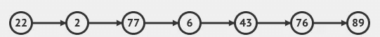

# 让我们来谈谈单链表

> 原文：<https://javascript.plainenglish.io/lets-talk-singly-linked-lists-29fe52a93410?source=collection_archive---------13----------------------->

Photo by [Kelly Sikkema](https://unsplash.com/@kellysikkema?utm_source=medium&utm_medium=referral) on [Unsplash](https://unsplash.com?utm_source=medium&utm_medium=referral)

当我说学习数据结构有点枯燥时，我想我代表了大多数开发人员。经验丰富的开发人员或 Udemy 指导者会在网上给出许多建议，告诉你要一小口一小口地吃，并且要经常休息，以获得保留信息的最佳机会。

我个人可以说，这种策略帮助我保持信息的直线性，甚至在处理 Leetcode 之类的问题时能够从记忆中回忆起来。

这篇博客(系列文章的第一篇)将讨论一些数据结构的基础知识，以及我们可以为它们编写的一些方法，为它们提供一些内置于更常见的数据结构(如数组和对象)的功能。

我绝不是专家，阅读这篇博客也不会让你成为专家，但也许我解释某些事情的方式会帮助你坚持下去，或者让你走上一条掌握这些事情的好道路。

## 那么什么是单链表呢

单链表是一个节点的集合，每个节点都有一些数据，还有一个“指针”指引你到链表中的下一个节点。

在图表中画出来可能是这样的。

在上面的例子中，每个圆圈代表一个节点。它的*值、*或它存储的数据是数字*、*(但也可以是字符串、对象等。)箭头代表一个*指针*指示我们到下一个节点。

单链表有几个特征，或者说我们跟踪的东西，它们将帮助我们更容易地处理数据结构，并帮助我们证明我们编写的方法以我们期望的方式工作。

## 头

头部只是我们列表中的第一项。记住，链表中的节点不像数组那样被索引，指针只指向一个方向。

## 尾巴

你猜对了，尾巴是我们列表中的最后一项。关于尾巴的关键是它没有指针。因为它是我们列表中的最后一项，所以它没有什么可指向的。

## 长度

长度只是我们的列表包含多少节点的数字表示。数组有内置的`.length`方法来给我们这些信息，对于链表，我们自己来管理这些信息。

# 给我看看代码！

一旦你知道了它的形状，为一个节点(列表项)和一个单链表创建一个类是非常简单的。

就其本身而言，这些类定义有潜力，但是现在真的不是很实用。我对数组的热爱部分来自于我用来遍历、过滤、添加、提取、搜索这些数组和解决问题的内置方法。

由于这个链表是我们自己创建的，我们很高兴自己编写这些方法(当然，我们可以添加更多的方法来满足我们特定的个人需求。

让我们添加两个方法来开始

# 推送()

将允许我们开始往清单上添加东西。更具体地说，它将像`Array.push()`一样工作，并将我们传入的值添加到列表的末尾。

## **伪代码**

*   定义名为`push()`的函数
*   它有一个参数，你想添加到列表末尾的值
*   使用传入的值创建一个新节点
*   如果列表是空的，那么头部和尾部应该被设置为我们的新节点
*   否则，当前尾部应该指向我们的新节点，然后该尾部应该被重新分配给我们的新节点
*   将长度增加一
*   返回链表

我鼓励你自己尝试一下，看看你会有什么发现。我将在下面分享最终的代码

Photo by [Gaelle Marcel](https://unsplash.com/@gaellemarcel?utm_source=medium&utm_medium=referral) on [Unsplash](https://unsplash.com?utm_source=medium&utm_medium=referral)

你试过吗？这是我想到的。

这个不要太混乱。我们首先使用传递给函数的值创建一个新节点(列表项)。我们首先检查一个空列表；我通过查看`!this.head`做到了这一点，但是你也可以检查`this.length === 0`。如果我们有一个至少包含一个条目的列表，我们点击`else`块，并继续将当前的 tail 设置在新创建的`node`之后，我们可以将`this.tail`设置为`node`，增加长度，并返回列表。

我们再来一次。

# 流行()

在我看来更有挑战性。`*pop()*`将从列表中删除最后一项。

## 伪代码

*   定义一个名为 pop()的函数，它没有参数
*   如果列表为空，则返回未定义
*   查找列表中的倒数第二个值
*   将它指定为我们列表的尾部；将其下一个属性设置为 null
*   减少长度
*   如果删除项目后列表为空，请确保头部和尾部都设置为空
*   返回从列表中删除的节点。

尝试一下，我会在下面向你展示我的想法

Photo by [Gaelle Marcel](https://unsplash.com/@gaellemarcel?utm_source=medium&utm_medium=referral) on [Unsplash](https://unsplash.com?utm_source=medium&utm_medium=referral)

你表现如何？

请看下面我的实现，然后我会一步一步来。

编写这个方法有两大障碍。

1.  要正确移除最后一个项目，您必须将尾部重新分配给倒数第二个项目。这保留了我们的链表结构
2.  我们的`nodes`没有索引。为了得到链表中倒数第二个条目，你需要遍历每一个条目直到找到它(因为我们的指针只指向一个方向)

为了遍历列表，我使用了 while 循环。

我用一个`current`变量来跟踪我正在迭代的列表项，用`newTail`来跟踪当前的 之前的*项。当我们到达名单的末尾时，这将是倒数第二个项目。*

当我们到达列表末尾时，while 循环被退出，因为`current`(应该是`this.tail`)没有 next(指针)

我们将`this.tail`设置为`newTail`，并通过将新分配的`this.tail`的`.next`设置为`null`来确保移除与旧尾巴的连接

然后我们递减`this.length`，看看我们的列表现在是否为空。如果是，我们确保将`this.head`和`this.tail`设置为空。(去掉这个条件，并检查其行为以了解原因)

一旦你记下了这些方法，试着实现一些你喜欢的内置方法——shift()、unshift()、insert() —甚至其他一些对你有用的方法——reverse()、get(index) set(index)。

数据结构有时很难。见鬼，我大胆猜测，说大多数时候它们很难。一点一点地做，用调试器或者手写的例子一步步地测试你的代码。更好的方法是找到一个算法可视化工具来帮助你看到它的发生，然后用伪代码来解释正在发生的事情。我甚至向一个八岁的孩子解释，用绳子连接到写有数字的卡片上，强迫自己用最简单的术语解释，然后一步一步地分解。

我包括了一些我用来学习的资源，以及我为单链表编写的更多方法的要点，如果你想查看的话。

黑客快乐！

# 资源:

 [## visual go——通过动画可视化数据结构和算法

### VisuAlgo 是 Steven Halim 博士在 2011 年提出的概念，作为一种帮助他的学生更好地理解数据结构的工具…

visualgo.net](https://visualgo.net/en)  [## JavaScript (JS)算法和数据结构大师班

### 嗨！我是柯尔特。我是一名热爱教学的开发人员。过去几年我一直在教人们…

www.udemy.com](https://www.udemy.com/course/js-algorithms-and-data-structures-masterclass/)  [## 数据结构—极客论坛

### 完整的数据结构列表，练习题，测验，数组，链表，堆栈，队列，树，堆，图表…

www.geeksforgeeks.org](https://www.geeksforgeeks.org/data-structures/) 

# 与我联系:

 [## 罗伯特·凯勒——志愿者——软件工程师——战斗流行病| LinkedIn

### 我喜欢做东西，通常用代码，有时用木头，总是有很高水平的细节。我曾经解决过…

www.linkedin.com](https://www.linkedin.com/in/robert-keller-dev/)  [## MisterRK —概述

### 我喜欢构建东西，通常是用代码，但总是有高水平的细节。我曾经为…解决问题

www.github.com](https://www.github.com/MisterRK) 

## 简单英语的 JavaScript

你知道我们有三份出版物和一个 YouTube 频道吗？在 [**寻找一切的链接 plainenglish.io**](https://plainenglish.io/) ！