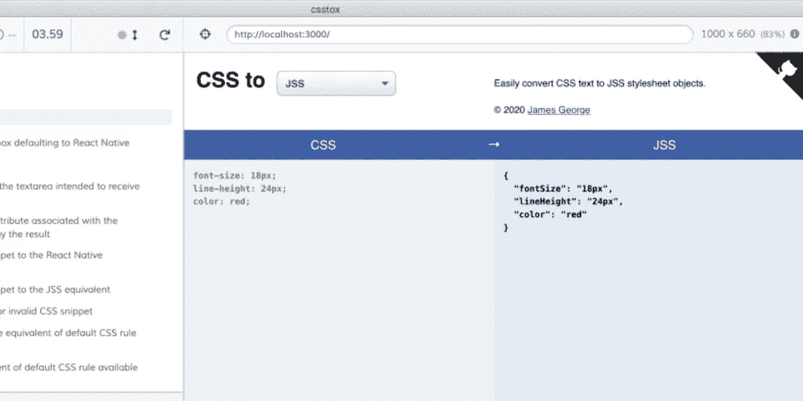

# 让我们用 Cypress 为 React 应用程序编写 e2e 测试

> 原文：<https://javascript.plainenglish.io/lets-write-e2e-tests-for-a-react-application-with-cypress-653dc10c301d?source=collection_archive---------14----------------------->



端到端测试是一种测试方法，通过测试所谓的用户流来检查应用程序是否如预期的那样工作。

让我们为我制作的 React 应用程序之一编写几个 e2e 测试: [csstox](https://csstox.surge.sh/) ，这是一个简单的实用程序，使用它可以轻松地将 CSS 片段转换为 React 本机/JSS 样式表对象。请在这里通读背后的故事[。](https://dev.to/jamesgeorge007/csstox-convert-css-snippets-to-react-native-jss-stylesheet-objects-with-ease-2500)

# 入门指南

如标题所示，我们将使用 Cypress 作为测试框架。首先，我们需要将 cypress 作为 devDependency 安装。

下面的命令根据 Cypress 的需要创建几个文件和目录。

```
./node_modules/.bin/cypress open
```

或者使用快捷键`npm bin`

经过几次调整后，测试设置的目录结构如下所示:

试验

└──·e2e

├──一体化

│ ├── basic.spec.js

│ └──行为. spec.js

└──截图

接下来，我们需要根据所做的更改来配置 Cypress，为此我们已经有了`cypress.json`文件。

让我们让 Cypress 知道它必须在`tests/e2e/integration`目录中搜索想要的文件:

```
"integrationFolder": "tests/e2e/integration",
```

最终版本如下所示:

此外，Cypress 会要求我们的应用程序在开始执行测试之前启动并运行。让我们安装一个实用程序来完成这项工作。

```
yarn add -D start-server-and-test
```

让我们继续将以下脚本添加到`package.json`

```
"cy:run": "cypress open", "test:e2e": "start-server-and-test :3000 cy:run"
```

这样我们就可以用`yarn run test:e2e`启动测试设置了。

默认情况下，start-server-and-test 会寻找一个启动脚本，幸运的是我们就是这样。否则，我们需要提供相关的脚本名称作为第一个参数，后跟本地服务器 URL 和测试脚本。我们已经准备好开始为我们的应用程序编写测试了。

正如您可能已经从上面的目录结构中注意到的，有两个测试套件:

1.  基本的工作流程——这有点像冒烟测试，它确保事情准备好执行进一步的测试用例。
2.  行为——它包括确保应用程序端到端行为的测试用例。

# 基本工作流程

*   首先，我们需要确保我们的应用程序是否启动并运行。

```
it("renders without crashing", () => {
    cy.visit("/");
  });
```

*   我们有一个选择框作为用户界面的一部分，默认值为“本地反应”。Cypress 提供了各种命令来与 DOM 交互，就像真正的用户一样。这里，我们需要一个实用程序来选择选择框，并确保它的默认值为“React Native”。

```
it("expects to find the select box defaulting to React Native", () => {
    cy.visit("/")
      .get("[data-testid=selectbox]")
      .should("have.value", "React Native");
  });
```

您可能已经注意到使用了属性(`data-testid`)选择器而不是类选择器，您可能想知道为什么。在 Cypress docs 网站上列出了一些最佳实践，你可以发现[选择元素](https://docs.cypress.io/guides/references/best-practices.html#Selecting-Elements)就是其中之一。CSS 类随时会发生变化，导致测试用例失败，而使用`data`属性不会出现这种情况。正如所料，我们已经重构了[各自的组件](https://github.com/jamesgeorge007/csstox/blob/e1916115adff82f3ee980fcb4b46b6477f6e3b05/src/components/select-box/SelectBox.js#L12)，使其具有了一个`data-testid`属性。

Cypress 提供了一些可以从断言库中选择的断言，比如`chai`、`sinon`等。我们可以用`should()`创建一个断言，现在我们已经有了一个更好的图片。

# 行为

万岁，我们刚刚完成了第一个测试套件的测试用例。现在我们开始编写测试，详细描述应用程序的行为。

我们有两个`textarea`元素用于不同的目的。左边的一个应该允许用户粘贴一个 CSS 片段，而另一个应该显示 React Native/JSS 的相同内容。这需要在相应的`textarea`元素中输入一些 CSS 代码片段。幸运的是，我们有一个由 Cypress 为此提供的`type()`函数。

```
it("is possible to enter text to the `textarea` intended to receive input CSS snippet", () => {
    const cssSnippet = "padding: 10px;";
    cy.visit("/")
      .get("[data-testid=input]")
      .type(cssSnippet)
      .should("have.value", cssSnippet);
  });
```

*   如前所述，两个`textarea`元素扮演不同的角色。右边的一个应该显示 React 本地/JSS 等价物，用户应该使其不可编辑。我们如何为这个场景编写一个测试用例呢？嗯，这很简单。只要确保相应的`textarea`元素有一个`readonly`属性。

```
it("expects to find readonly attribute associated with the textarea intended to display the result", () => {
    cy.visit("/").get("[data-testid=output]").should("have.attr", "readonly");
  });
```

*   现在我们需要编写一个测试用例来确保应用程序是否符合它的目的，也就是说，一个输入的 CSS 代码片段是否被转换成了相应的等价物。

```
it("converts an input CSS snippet to the React Native equivalent", () => {
    const inputCSSRule = "transform: translate(10px, 5px) scale(5);";
    const result = {
      transform: [{ scale: 5 }, { translateY: 5 }, { translateX: 10 }],
    };
    cy.visit("/")
      .get("[data-testid=input]")
      .type(inputCSSRule)
      .get("[data-testid=output]")
      .should("have.value", JSON.stringify(result, null, 2));
  });
```

*   JSS 的同行向我们提出了新的挑战。选择框的默认值为“反应本地”，我们需要将该值更改为 JSS，赛普拉斯用`select()`来救援。

```
it("converts an input CSS snippet to the JSS equivalent", () => {
    const inputCSSRule = "margin: 5px 7px 2px;";
    const result = {
      margin: "5px 7px 2px",
    };
    cy.visit("/")
      .get("[data-testid=selectbox]")
      .select("JSS")
      .get("[data-testid=input]")
      .type(inputCSSRule)
      .get("[data-testid=output]")
      .should("have.value", JSON.stringify(result, null, 2));
  });
```

*   我们已经进行了验证，以确保提交无效的 CSS 规则会导致在输出`textarea`元素中显示适当的警告。好吧，让我们为它写一个测试用例。

```
it("shows an error message for invalid CSS snippet", () => {
    const inputCSSRule = "margin: 5";
    const result = `Error translating CSS`;
    cy.visit("/")
      .get("[data-testid=input")
      .type(inputCSSRule)
      .get("[data-testid=output]")
      .should((el) => {
        expect(el).to.contain(result);
      });
  });
```

*   如果输入元素`textarea`为空，我们就有了一个占位符，等效的版本显示在输出元素`textarea`上。

```
it("generates the React Native equivalent of default CSS rule available as placeholder", () => {
    const result = {
      fontSize: 18,
      lineHeight: 24,
      color: "red",
    };
    cy.visit("/")
      .get("[data-testid=output]")
      .should((el) => {
        expect(el).to.contain.text(JSON.stringify(result, null, 2));
      });
  });
```

*   和 JSS 的对应方。

```
it("generates the JSS equivalent of default CSS rule available as placeholder", () => {
    const result = {
      fontSize: "18px",
      lineHeight: "24px",
      color: "red",
    };
    cy.visit("/")
      .get("[data-testid=selectbox]")
      .select("JSS")
      .get("[data-testid=output]")
      .should((el) => {
        expect(el).to.contain.text(JSON.stringify(result, null, 2));
      });
  });
```

差不多就是这样。我们只了解了赛普拉斯提供的一些东西，请从[官方文件](https://docs.cypress.io/guides/overview/why-cypress.html)中了解更多。感谢您通读。

如果你想了解我的工作，请在 twitter 上关注我。

*原载于 2020 年 5 月 5 日*[*https://dev . to*](https://dev.to/jamesgeorge007/let-s-write-e2e-tests-for-a-react-application-with-cypress-4a8i)*。*

## **简明英语团队的笔记**

简明英语刚刚推出了一个 YouTube 频道！我们希望您现在就通过 [**订阅来支持我们！**](https://www.youtube.com/channel/UCtipWUghju290NWcn8jhyAw)