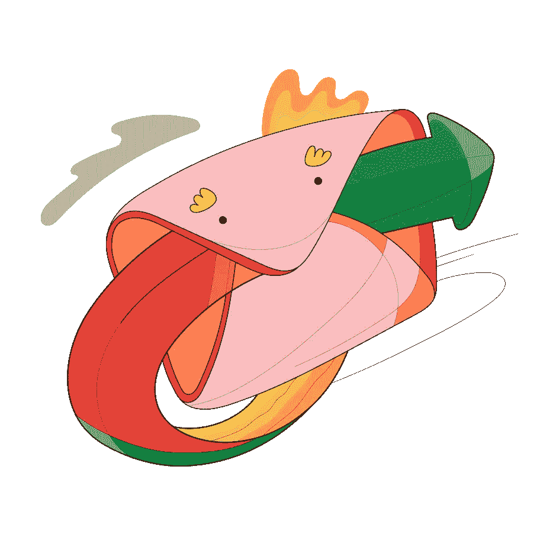
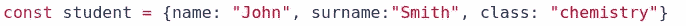
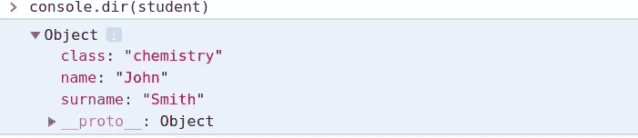
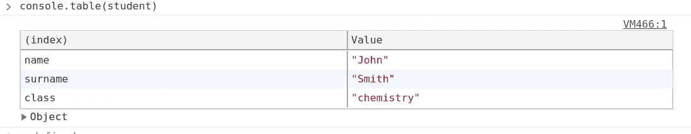
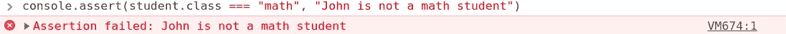
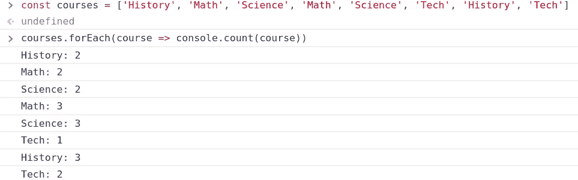
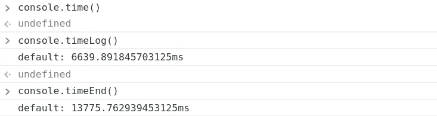
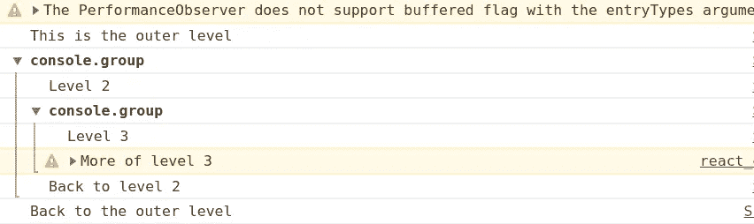
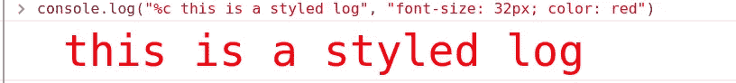

# 释放控制台日志隐藏的力量

> 原文：<https://javascript.plainenglish.io/liberating-the-hidden-power-of-console-logs-9876d9a3787f?source=collection_archive---------1----------------------->

继续使用它，但比任何人都好。

Message sent. *Source* [*Icons8*](https://icons8.com/ouch/illustration/surr-message-sent)*.*

我确信，像所有的开发人员一样，**每天都有一套基本的工具围绕着你的开发角色**。其中之一就是简单明了的`console.log()`。您可能用它来检查从服务器调用返回的数据。或者调试产品中一些难以理解的片段。

现在最重要的是:“*你能不能把你已经日常使用的无故障工具变得更好？*

答案是肯定的。因为`console.log()`只是你如何*格式化/利用/样式化*你的开发控制台输出的冰山一角。让我们概述一下有用的命令列表，给你一些额外的东西。

## Console.dir()

让我们为这个例子创建一个对象

通过简单地使用`console.log`，你阻止了自己更好地可视化`student`物体。

用`console.dir()`代替这个，真正享受更好的视野。

## Console.table()

我明白；您希望您的长服务器响应日志更加清晰。使用`console.table()`可能是你的解决方案

这个方法将以一种清晰的方式打印你的对象和数组。允许难以读取的数据最终被解密。

## Console.assert()

我敢打赌，你可以自信地说，基本上每天都为这个功能执行了完美的操作。考虑使用日志来发现一个对象是否包含一些数据。或者记录一些条件的流程。使用`console.assert()`可以记录条件为假时的数据，如下所示:

## Console.count()

不用创建计数器，或者挤挤眼睛去数某个东西被打印了多少次，只需使用`console.count()`。您可以为该函数提供一个标签，每当该标签显示要打印时，该函数将记录一个递增的计数器。

## console . time()—timeLog()—time end()

对你来说是个好时机。每当你必须计算一段时间，使用这三个函数的组合。使用`console.time()`启动计时器。然后`console.timeLog()`打印计时器启动后经过的时间。最后，当你使用完`console.timeEnd()`时，停止定时器。

## Console.group() / groupEnd()

了解如何使用这两个函数打印许多日志而不会造成混乱。

输出结果是:

## 弯曲风格的原木

如果你想让你的日志更酷，只需在你的日志字符串前使用“%c”并传递 CSS 样式作为另一个参数:

## 结论

这篇文章的重点是展示一个简单的原则:**仅仅因为你每天都在做一件事，并且做得很好，并不意味着你不能试着把它做得更好**。新的伐木方式证明了这一点。

希望你能发现新的东西！

— *皮耶罗*