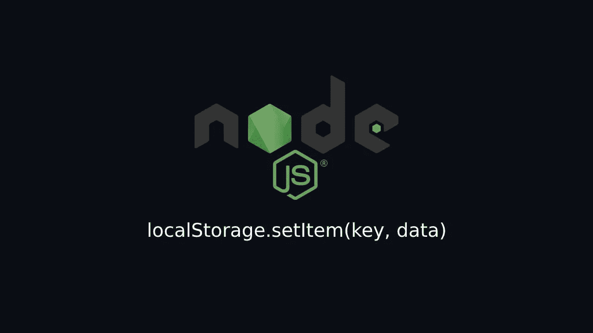
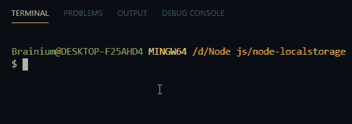
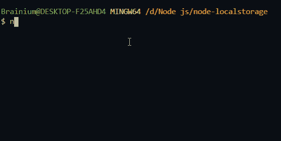

# 用于在 Node.js 项目中使用 localStorage 的库

> 原文：<https://javascript.plainenglish.io/libraries-for-using-localstorage-in-your-node-js-project-3ff5ac1a3512?source=collection_archive---------0----------------------->



你曾经尝试过在你的 node js 项目中使用 localStorage 并得到一个`undefined`错误吗？当然，您会得到一个未定义的错误，因为 node js 是一种服务器端技术，而 localStorage 是一种仅在浏览器中可用的客户端特性。但是，仍然有一些库，您可以通过它们在 node js 项目中使用 localStorage like 特性。所以让我们看看如何使用它们。

出于教程的目的，我们将首先创建一个简单的 node js 项目，然后看看如何一个接一个地使用这些库。

1.  创建一个目录并初始化您的项目。

```
npm init -y#or yarn init -y
```

2.现在，在您的项目目录中创建三个名为 **index.js** 、 **store.js** 和 **usage.js** 的文件。

**index.js** —该文件将成为我们项目的主文件。

这个文件将用于存储我们所有的本地存储数据。

**usage.js** —这个文件将用于从我们的本地存储中检索数据。

3.这一步是可选的。如果你想使用**导入**而不是**要求**你需要做的就是在你的 **package.json** 文件中声明`"type": "module"`，在导入文件的时候你需要调用带有扩展名的文件名。例如进口`"./store.js"`而不是`"./store"`。

## 1.[节点本地存储](https://www.npmjs.com/package/node-localstorage)

node-localstorage 是在 node.js 上运行的浏览器本机 localStorage API 的一个插件替代程序，它被广泛用作 node js 的 localstorage 的替代程序。您可以访问本地存储的所有方法，如 **length、setItem、getItem、clear** 等。

**用法**

安装:`npm install node-localstorage`或`yarn add node-localstorage`

导入:`const {localStorage} = require("node-localstorage");`或`import {localStorage} from "node-localstorage"`

存储:在你的`store.js`文件中粘贴下面的代码

将下面的代码粘贴到你的`usage.js`文件中。

运行:现在将您的文件导入到 **index.js** 文件中，并在您的终端中运行`node index.js`命令。



Output

## 2.[本地存储](https://www.npmjs.com/package/localStorage)

这是一个很小的库，可以用来替代 node js 的 localStorage API。这个库使用起来非常简单，只需导入模块并开始使用 localStorage 方法。

**用途**

安装:`npm install localStorage`或`yarn add localStorage`

进口:`const localStorage = require("localStorage");`或`import localStorage from "localStorage"`

存储:在你的`store.js`文件中粘贴下面的代码

将下面的代码粘贴到你的`usage.js`文件中。

运行:现在将您的文件导入到 **index.js** 文件中，并在您的终端中运行`node index.js`命令。


Output

## 3.[商店 2](https://www.npmjs.com/package/store2)

Store2 是下载最多的库，作为 node.js 使用 localStorage 和 sessionStorage 的替代，这个库有一些额外的方法，比如 **transact、setAll、getAll、each、**等。除了本地存储方法。

**用法**

安装:`npm install store2`或`yarn add store2`

导入:`const store = require("store2");`或`import store from "store2"`

存储:在你的`store.js`文件中粘贴下面的代码

Get-Item:将以下代码粘贴到您的`usage.js`文件中。

运行:现在将您的文件导入到 **index.js** 文件中，并在您的终端中运行`node index.js`命令。



[**store**](https://www.npmjs.com/package/store) 是我们可以使用的另一个库，但它类似于 [store2](https://www.npmjs.com/package/store2) ，方法更少。

使用这些库中的任何一个，您都可以将数据从一个文件交换到另一个文件，而无需导入和导出整个模块。有这么多不同的方法可以使用这些库，我甚至无法在本教程中单独解释。希望我会在另一个教程中介绍高级部分。

感谢阅读。下面我分享了 GitHub 的资源库，供参考。

[](https://github.com/Mediumtutorial/node-localstorage) [## 介质教程/节点-本地存储

### 在 Node js 项目中使用 localStorage 的库 GitHub 是超过 5000 万开发人员一起工作的家…

github.com](https://github.com/Mediumtutorial/node-localstorage)