# 程序员的生活在简单的笑话中，让你开怀大笑

> 原文：<https://javascript.plainenglish.io/life-of-a-programmer-in-simple-jokes-that-will-make-you-laugh-52ccfbf77438?source=collection_archive---------0----------------------->

## 你不必是一个程序员也能对他们的幽默一笑置之。

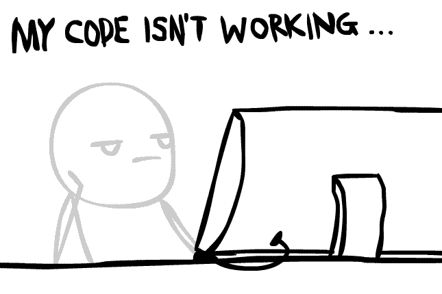

Credit: gfycat.com

程序员整天编码，整夜调试，检查成千上万行代码。但并不代表编程就是他们都知道并擅长的。

他们都有幽默感，即使我们不是程序员，也能让我们所有人发笑。

## 1.当程序员夜以继日地工作时

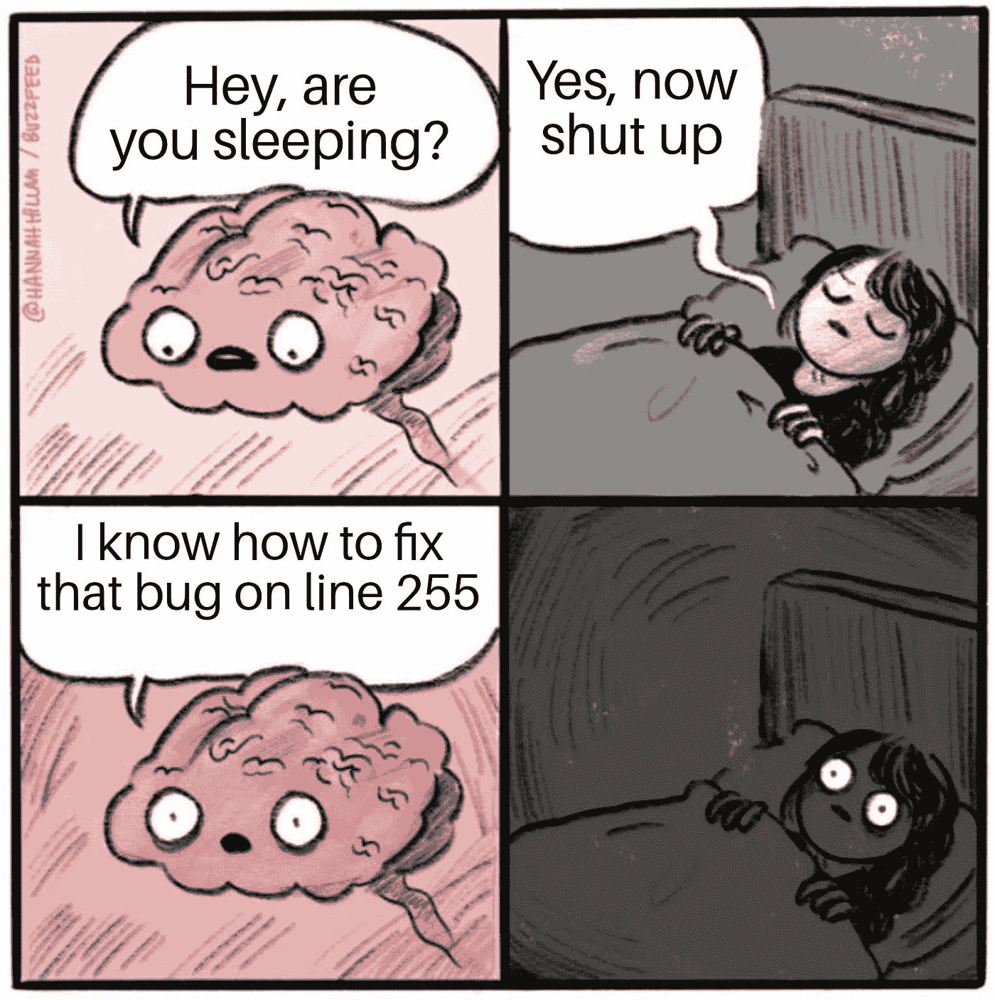

Credit: reddit.com/r/ProgrammerHumor

## 2.程序员睡姿(程序员从不睡觉)

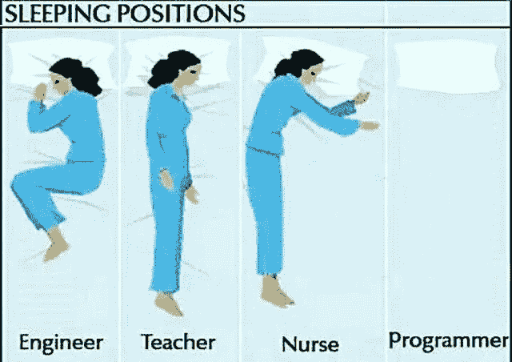

Credit: pinterest.com/pin/541487555182388241/

## 3.每个程序员的梦想

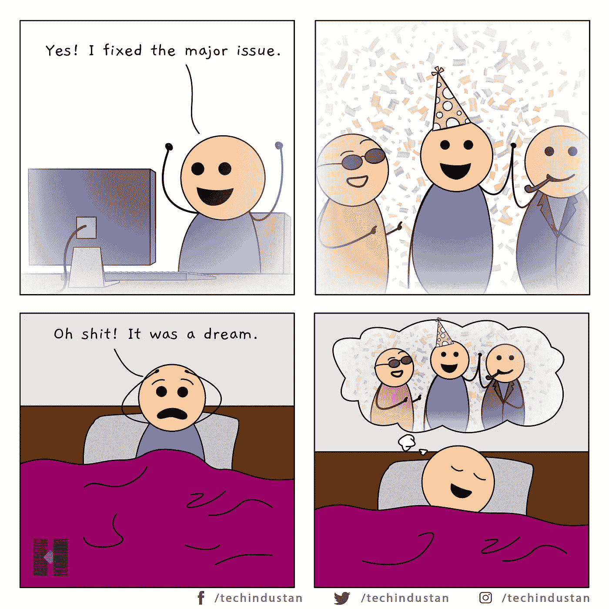

Credit: pinterest.com/pin/386817055495862590/ — techindustan

## 4.程序员睡眠周期

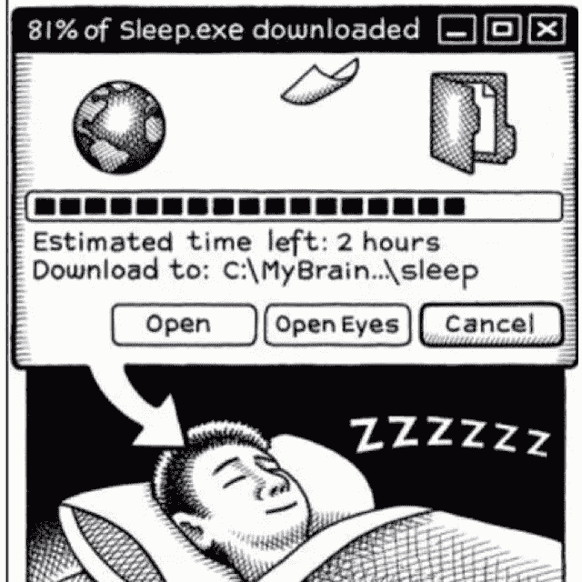

## 5.普通人和程序员的睡眠模式

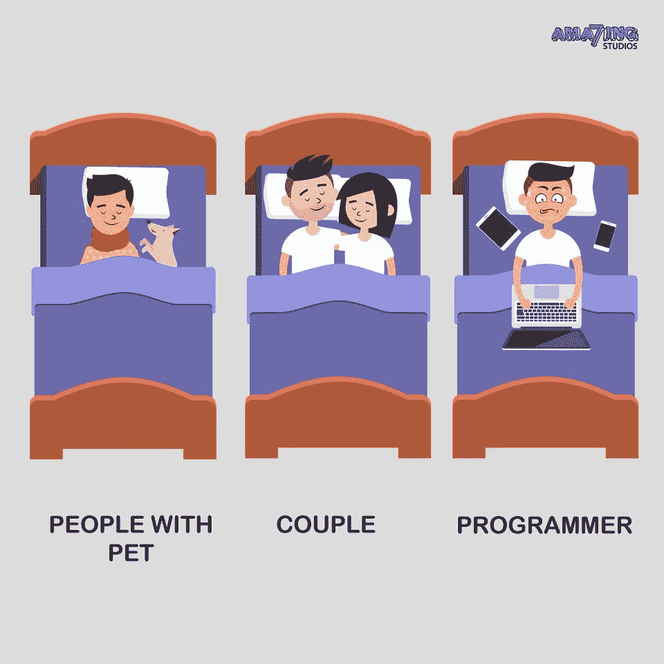

Credit: amazing7.com

## 6.努力 100%学习任何编程语言

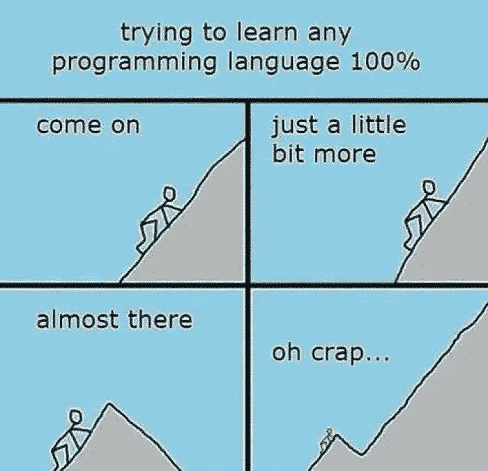

Credit: freelancinggig.com

## 7.当程序员用另一个问题发现这个问题时

Credit: Monkeyuser.com

## 8.当编程就是生活

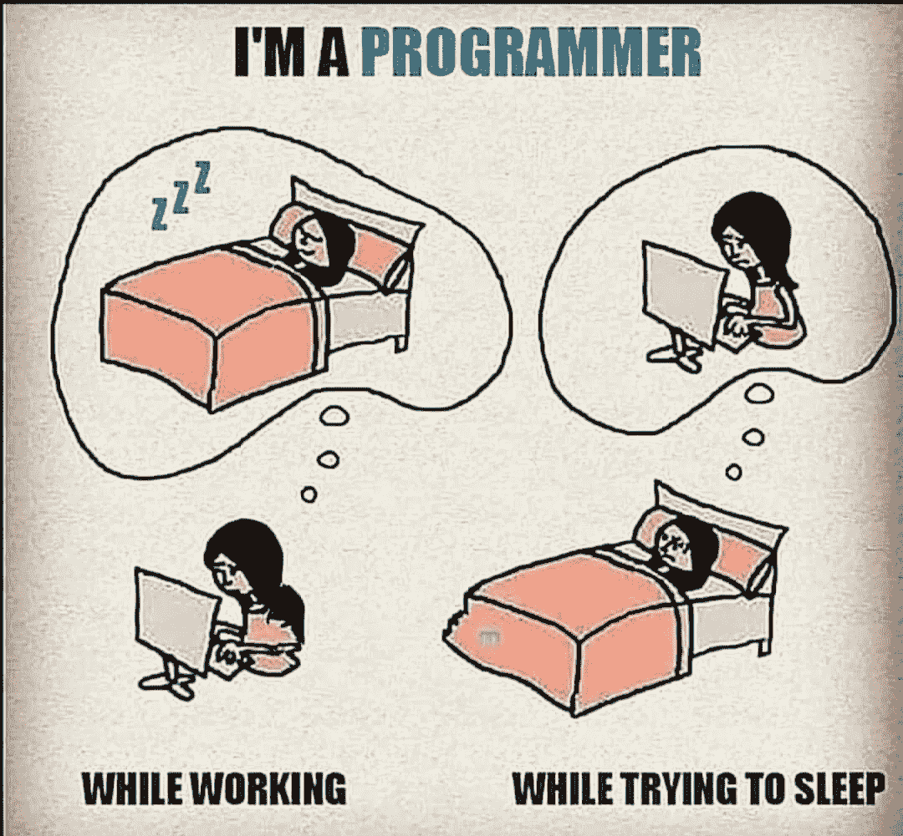

Credit: reddit.com/r/ProgrammerHumor

## 9.其他人认为程序员做的事情

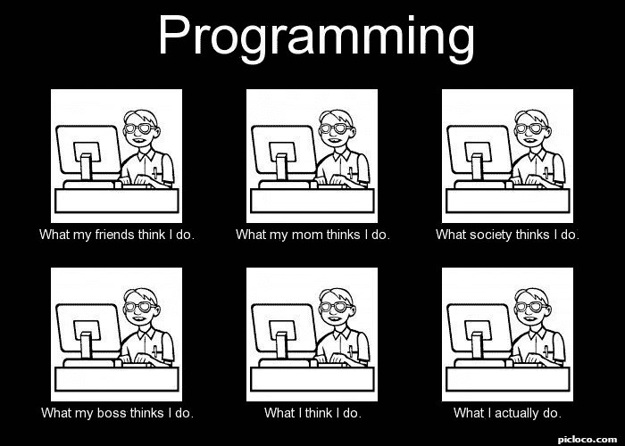

Credit: Picloco.com

## 10.当一个程序员被抓到在工作时睡觉

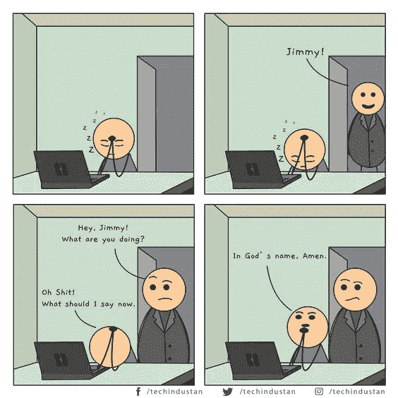

Credit: Techindustan

## 11.一个程序员的新年庆典

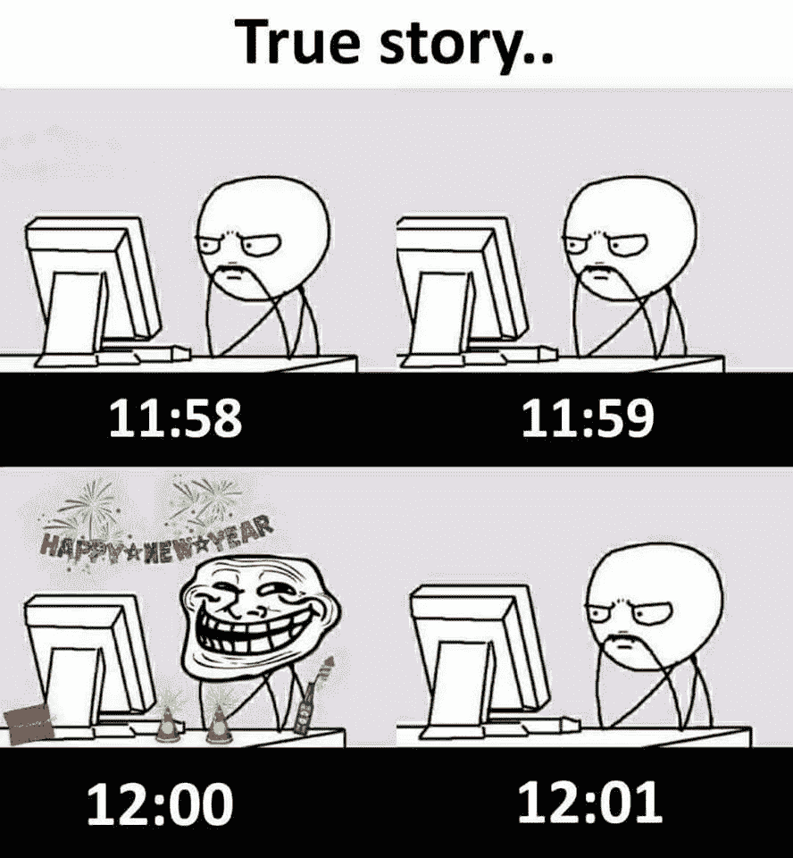

Credit: facebook.com/ProgrammersCreateLife/

## 12.工作狂程序员的生活

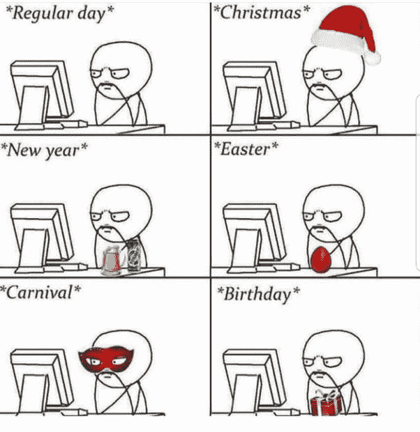

Credit: https://www.quora.com/q/programmingmemes/

## 13.平常日子和周末的程序员(总是这样)

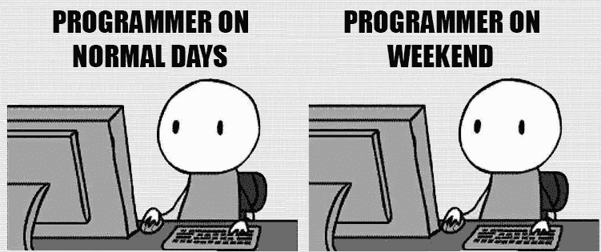

## 14.做程序员十年(什么都没变)

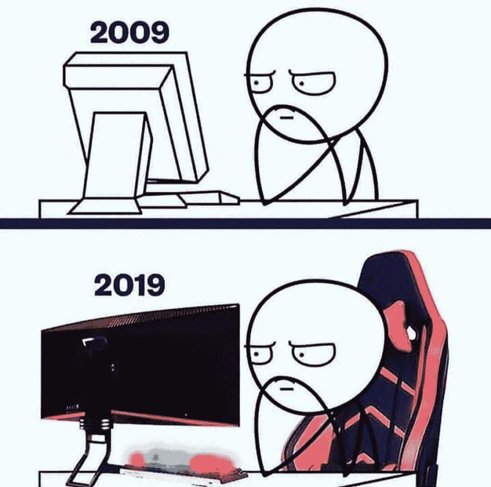

Credit: thecoderpedia.com

## 15.当一个程序员把他的代码留给另一个程序员时

Credit: reddit.com/r/ProgrammerHumor/comments/ittuqq/handover/

## 16.在家工作的程序员

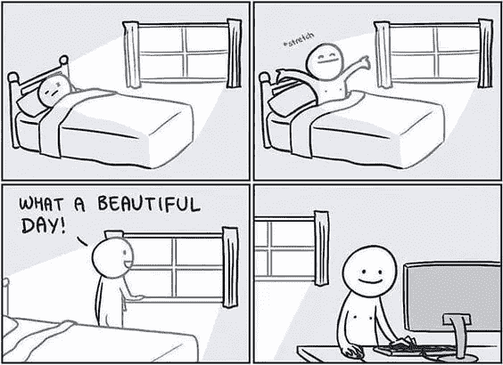

Credit: https://twitter.com/baltazar223/status/964309926620393472/photo/1

## 17.程序员生活总结三张图(吃饭、睡觉、代码)

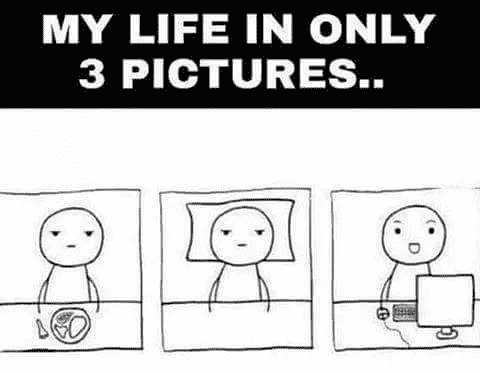

Credit: devrant.com/rants/573268/eat-sleep-code-repeat

## 18.当程序员调试他们自己的代码时

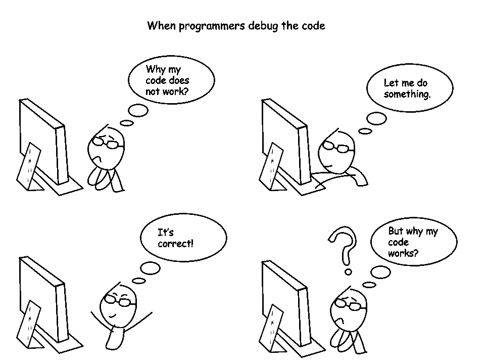

Credit: pinterest.com/pin/461548661787582178/

## 19.程序员的工作生活

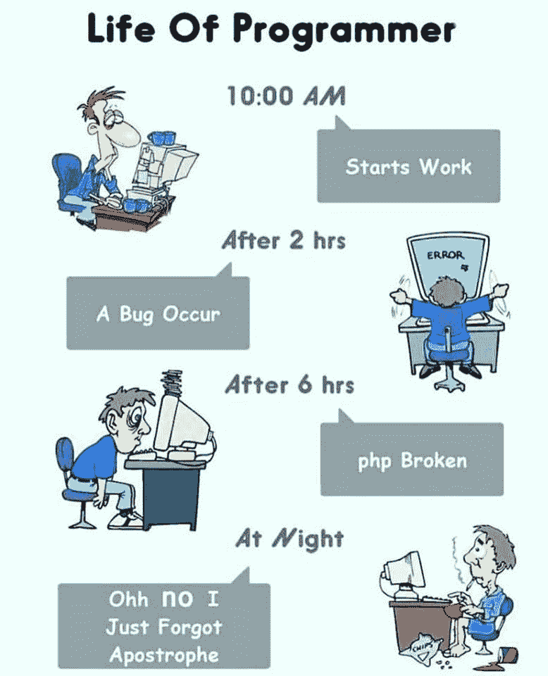

Credit: facebook.com/ProgrammersCreateLife/

## 20.与程序员结婚的两难境地(没有时间欺骗，但也没有时间给你)

Credit: pinterest.com/pin/461548661787698699/

## 发现关于编程的迷因和笑话的更多地方:

*   [https://www.reddit.com/r/ProgrammerHumor/](https://www.reddit.com/r/ProgrammerHumor/)
*   https://www.facebook.com/ProgrammersCreateLife/
*   【https://twitter.com/programmersmeme?lang=en 
*   [https://www.instagram.com/realprogrammerhumor/](https://www.instagram.com/realprogrammerhumor/)