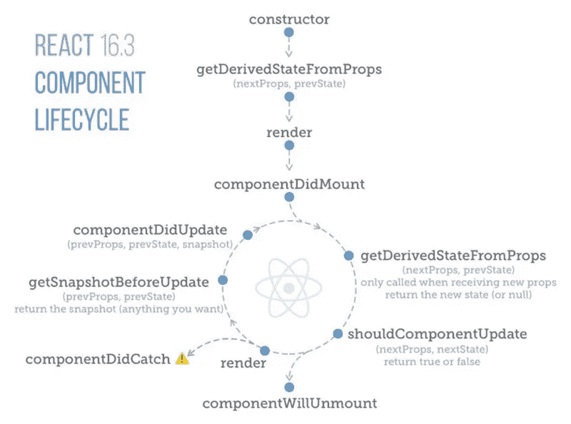
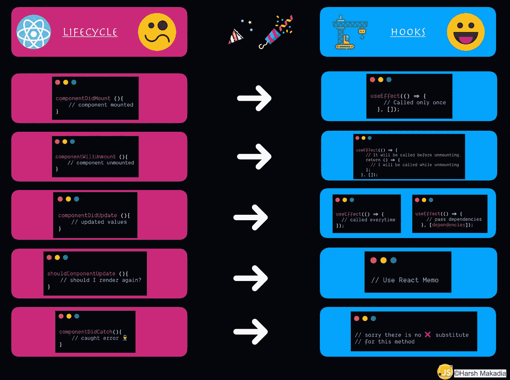

# 用 React 挂钩替换生命周期方法

> 原文：<https://javascript.plainenglish.io/lifecycle-methods-substitute-with-react-hooks-b173073052a?source=collection_archive---------0----------------------->

## 当你有钩子的时候为什么要使用类组件🤩🧨


现在离 Hooks 发布已经一年多了。越来越多的开发人员在传统的基于类的组件上转向钩子实现。即使基于钩子的实现在开始时很难理解，但最终改用钩子是值得的。🎉

在我们开始研究替换方法之前。让我们看看 React 16 中使用的经典生命周期事件



React 16 Lifecycle Methods

生命周期图像积分—[https://twitter.com/dceddia](https://twitter.com/dceddia)

让我们来看看它们中的每一个，以及如何替换它们。

# componentDidMount()

该方法通常在组件第一次完成呈现时调用。在组件安装完成后，它在整个生命周期中只被调用一次。

***带挂钩:***

```
function MyExample() {
  const [count, setCount] = useState(0);

  useEffect(() => {
    document.title = `You clicked ${count} times`;
  }, []); // Pass an empty array to run only callback on mount only.

  return (
    <div>
      <p>You clicked {count} times</p>
      <button onClick={() => setCount(count + 1)}>
        Click me
      </button>
    </div>
  );
}
```

# `componentDidUpdate( )`

这个方法在应用程序生命周期中被多次调用。它在更新发生后立即被调用。初始呈现时不调用此方法。

有两种处理方式，

1.  **在每次渲染时调用钩子**
    正如你可以看到的，如果下面的例子钩子中的第二个参数为空，意味着它将每次渲染。

```
function MyExample() {
  const [count, setCount] = useState(0);

  useEffect(() => {
    document.title = `You clicked ${count} times`;
  }); // No second argument, so run after every render.

  return (
    <div>
      <p>You clicked {count} times</p>
      <button onClick={() => setCount(count + 1)}>
        Click me
      </button>
    </div>
  );
}
```

**2。当特定属性(依赖关系)改变时调用钩子** 在这个实现中，我们需要将第二个参数传递给 useEffect，每当依赖关系改变时，它将被自动触发。

***带挂钩:***

```
function MyExample() {
  const [count, setCount] = useState(0);

  useEffect(() => {
    document.title = `You clicked ${count} times`;
  }, [count]);

  return (
    <div>
      <p>You clicked {count} times</p>
      <button onClick={() => setCount(count + 1)}>
        Click me
      </button>
    </div>
  );
}
```

# ComponentWillUnmount()

顾名思义，这个方法将在组件被卸载时被调用，并且在组件的生命周期中只被调用一次。

***带钩子:***在`useEffect`的回调参数中返回一个回调，在卸载前会被调用。

```
function MyExample() {
  const [count, setCount] = useState(0);

  useEffect(() => {
    // It will be called before unmounting.
    return () => {
      console.log('componentWillUnmount!');
    };
  }, []);

  return (
    <div>
      <p>You clicked {count} times</p>
      <button onClick={() => setCount(count + 1)}>
        Click me
      </button>
    </div>
  );
}
```

# `shouldComponentUpdate( )`

默认情况下，这个生命周期方法在组件每次渲染时被调用，当你必须渲染组件或避免渲染时，你可以返回 true/false。

但是由于钩子只能在功能组件中使用，并且功能组件内部处理 shouldComponentUpdate()方法来使用。您已经可以使用`React.PureComponent`或`React.memo`在组件级别实现这一点。用于防止子组件的重新呈现。

***带挂钩:***默认情况下，只会浅浅地比较道具对象中的复杂对象。如果您想要控制比较，您也可以提供一个定制的比较函数作为第二个参数。

```
import React from 'react'function areEqual(prevProps, nextProps) {
  /*
  return true if passing nextProps to render would return
  the same result as passing prevProps to render,
  otherwise return false
  */
}const Weather = ({weather}) => {
    return (<div>
             <p>{weather.city}</p>
             <p>{weather.temperature}</p>
             {console.log('Render')}
            </div>
    )
}

export default React.memo(Weather, areEqual)
```

# `getDerivedStateFromProps( )`

`getDerivedStateFromProps`在调用 render 方法之前被调用，无论是初始挂载还是后续更新。它应该返回一个对象来更新状态，或者返回 null 来不更新任何东西。

***带挂钩:***

```
function ScrollView({row}) {
  const [isScrollingDown, setIsScrollingDown] = useState(false);
  const [prevRow, setPrevRow] = useState(null);

  if (row !== prevRow) {
    // Row changed since last render. Update isScrollingDown.
    setIsScrollingDown(prevRow !== null && row > prevRow);
    setPrevRow(row);
  }

  return `Scrolling down: ${isScrollingDown}`;
}
```

示例参考—[https://react js . org/docs/hooks-FAQ . html # how-do-I-implement-getderivedstatefromprops](https://reactjs.org/docs/hooks-faq.html#how-do-i-implement-getderivedstatefromprops)

# **无生命周期方法替换**

根据 react 文档，下面是一些没有任何生命周期方法替代钩子的方法:

1.  **componentiddcatch()**
2.  **getsnapshotbefore update()**
3.  **getDerivedStateFromError()**

下面是所有方法的快速预览



感谢阅读这篇文章。我希望你们都准备好开始将传统的基于类的组件替换成基于钩子的实现。

快乐学习！💻 😄

## **用简单英语写的 JavaScript 笔记**

我们已经推出了三种新的出版物！请关注我们的新出版物:[**AI in Plain English**](https://medium.com/ai-in-plain-english)[**UX in Plain English**](https://medium.com/ux-in-plain-english)[**Python in Plain English**](https://medium.com/python-in-plain-english)**—谢谢，继续学习！**

**我们也一直有兴趣帮助推广高质量的内容。如果您有一篇文章想要提交给我们的任何出版物，请发送电子邮件至[**submissions @ plain English . io**](mailto:submissions@plainenglish.io)**，使用您的 Medium 用户名，我们会将您添加为作者。另外，请让我们知道您想加入哪个/哪些出版物。****