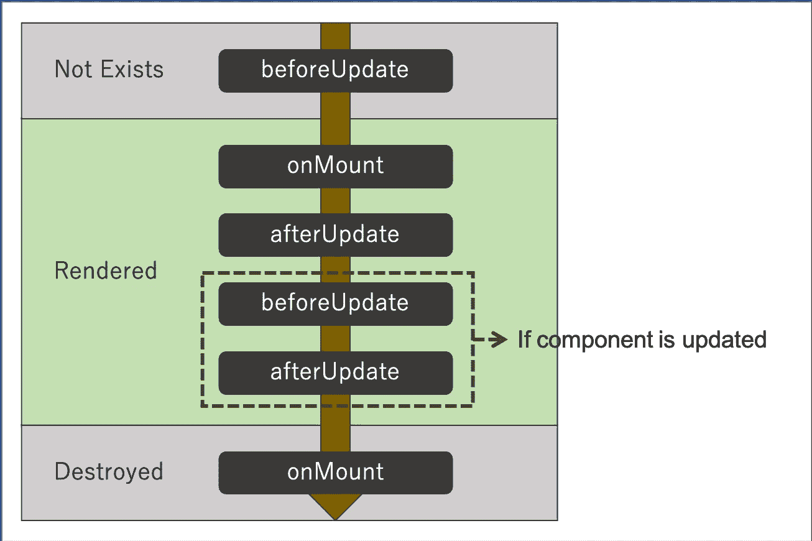

# 苗条组件的生命周期

> 原文：<https://javascript.plainenglish.io/lifecycle-of-the-svelte-component-ef00c1969a4a?source=collection_archive---------12----------------------->

## 理解组件的生命周期对实现很重要。

Logo of the Svelte

这篇文章是苗条教程系列之一。

1.  [苗条地开始运行](https://medium.com/javascript-in-plain-english/svelte-tutorials-1-1f49699da2c0)
2.  [如何苗条地处理事件](https://medium.com/javascript-in-plain-english/svelte-tutorials-2-e965737edf63)
3.  [如何将数据绑定到瘦组件中](https://medium.com/javascript-in-plain-english/how-binding-data-into-svelte-component-3909c9fb3bdb)
4.  苗条组件的生命周期

## 生命周期功能

苗条身材有一些生命周期功能。

Lifecycle of the Svelte Component

1.  `onMount`:在组件第一次呈现到 DOM 后运行**。**
2.  `onDestroy`:组件销毁时运行。
3.  `beforeUpdate`:在 DOM 更新前运行。
4.  `afterUpdate`:在 DOM 更新后运行(它是`beforeUpdate`的对应)。
5.  `tick`:与其他功能不同(我会在这篇文章的最后部分描述)。

## 生命周期

**结果**

有趣的是，子组件的 onDestroy 函数在父组件之后运行。

## 滴答声

`tick`是特殊功能。与其他生命周期函数不同，除了组件首次初始化时，它可以在任何时候被调用。

它返回一个承诺，一旦任何挂起的状态更改被应用到 DOM，该承诺就会立即解决。

## **用简单英语写的 JavaScript 笔记**

我们已经推出了三种新的出版物！请关注我们的新出版物:[**AI in Plain English**](https://medium.com/ai-in-plain-english)[**UX in Plain English**](https://medium.com/ux-in-plain-english)[**Python in Plain English**](https://medium.com/python-in-plain-english)**——谢谢，继续学习！**

**我们也一直有兴趣帮助推广高质量的内容。如果您有一篇文章想要提交给我们的任何出版物，请发送电子邮件至[**submissions @ plain English . io**](mailto:submissions@plainenglish.io)**，使用您的 Medium 用户名，我们会将您添加为作者。另外，请让我们知道您想加入哪个/哪些出版物。****