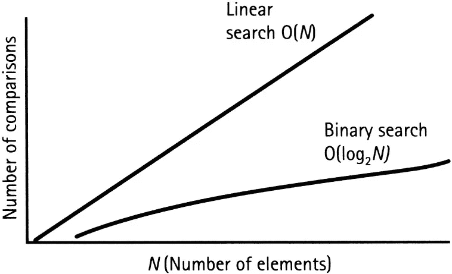

# 线性搜索算法 101

> 原文：<https://javascript.plainenglish.io/linear-search-algorithms-101-38eb2a0e8240?source=collection_archive---------10----------------------->

## 掌握线性搜索算法以及如何用 JavaScript 实现


Photo by [Darius Bashar](https://unsplash.com/@dariusbashar?utm_source=medium&utm_medium=referral) on [Unsplash](https://unsplash.com?utm_source=medium&utm_medium=referral)

被恐吓？害怕吗？不要害怕，基础并不像有些人想象的那么差。根据我的经验，文章和在线指南对于初级开发人员来说有点太快，难以消化，并且包含了许多不像一些高级开发人员认为的那样常见的假设。

***所以我们先从基础说起。***

**这是给谁的？**本文旨在帮助初级开发人员牢固掌握线性搜索算法以及如何用 JavaScript 实现。如果您不是 JS 开发人员，不要担心，语法非常容易理解，我将详细地指导您完成每个步骤。

**什么是算法？**好问题，算法是帮助解决问题或完成任务的非常具体的指令或步骤的列表。重要的是要明白，算法是一个相当严格的概念，没有解释或主观性的空间。**每次我给一个算法输入一个特定的输入，我都能确定它会产生完全相同的结果。这实际上是一个算法的全部要点:获取一个输入值，通过一系列编程步骤运行它，并产生一个始终可重复的最终结果。**

作为一名开发人员，你将很快学会爱上算法和它们给你的代码带来的效率。任何人都不愿意花 4 个小时 ***手动*** 在数据库中查找一条信息。随着算法的力量在你的指尖，你不会有！

这里有一个逐步的例子来进一步说明这一点。

```
1\. You need to find out whether a data set includes a specific value.*If the data set only included 10 elements it wouldn't be a big deal. You could do that manually in a few seconds. But if the data set grew to 100,000 elements that would take a lot longer. Regardless of size, an algorithm is going help you find that value in some data set way faster.2\. Give your algorithm an input (the value you want find).3\. The algorithm will check the data set, step by step, to see if it has the input value you asked for.4\. After running through the data set, it will return true or false letting you know if the value exists in the data set.
```

太好了，我们对什么是算法以及它们要做什么有了更高层次的理解。 ***现在…什么是线性搜索算法，我们如何构建？***

**线性搜索算法**是一组指令，它遍历/移动一个数据集，并检查集合中的每个元素，直到它找到您要求的任何值，或者直到整个数据集都被搜索完。

再一次，让我们看一个*演练*来真正挖掘这个概念。

```
[1, 2, 3, 4, 5] <-- an array in JavaScript (our data set)We need to create an algorithm that checks each element in the array. In most coding languages there are simple ways of checking or comparing the value of two elements. These conditional lines of code are executed every time the algorithm moves to a new element in the array.Example of a conditional:if (element === 4) { 
  // do something!
}*Remember array's start at index 0\. 1) Check element at index 0 (the number 1)
2) Check element at index 1 (the number 2)
3) Check element at index 2 (the number 3)... moving all the way through the array until we find the number we are looking for OR we just keep moving to the end of the array
```

# 履行


Photo by [Lidya Nada](https://unsplash.com/@lidyanada?utm_source=medium&utm_medium=referral) on [Unsplash](https://unsplash.com?utm_source=medium&utm_medium=referral)

干得好，跟着我！接下来，我们将看看这个算法在 JavaScript 中的具体实现。

正如您可能已经猜到的，这不是一个理解或实现起来过于复杂的算法。事实上，很有可能你已经在一个项目中实现了它，甚至不知道。

我们将介绍在一个值数组中移动的三种方式，并向您展示如何用每种方式实现这个算法:

*   **循环**
*   **方法**
*   **递归**

请记住，这个列表并不详尽，强烈建议您尝试下面没有讨论的各种模式和技术。

# **循环**

**老派的回环**

```
const array = [1, 2, 3, 4, 5];for (let i = 0; i < array.length; i++) { 
  // some code...
};A straight forward way of iterating though an array that every JS developer must know.const OldForLoop = (arr, target) => {
  for (let i = 0; i < arr.length; i++) {
    if (arr[i] === target) {
      return true;
    }
  }
  return false;
};
```

**While 循环**

```
const array = [1, 2, 3, 4, 5];while (count < array.length) { 
  // some code...
};A common alternative to the old school for loop that achieves the same thing.const WhileLoop = (arr, target) => {
  let count = 0;
  while (count < arr.length) {
    if (arr[count] === target) {
      return true;
    }
    count++;
  }
  return false
};
```

**循环的形成**

```
const array = [1, 2, 3, 4, 5];for (let element of array) { 
  // some code...
};A newer for loop that was introduced with ES6\. Simple, clean and easy to read.const ForOfLoop = (arr, target) => {
  for (let element of arr) {
    if (element === target) {
      return true;
    }
  }
  return false;
};
```

# **方法**

**。forEach()**

```
const array = [1, 2, 3, 4, 5];array.forEach(element => { 
  // some code...
};A built in method that is easy to use, versatile and quick to write.const forEachMethod = (arr, target) => {
  let result = false;
  arr.forEach(element => {
    if (element === target) {
      result = true;
    }
  }); 
  return result;
};
```

# 递归

**递归函数**

```
const array = [1, 2, 3, 4, 5];const recursiveFun () => { 
  // some code... 
  recursiveFun(); // the function is called again
};A useful technique that allows functions to call themselves in order to move through a data set.const recursion = (arr, target, i = 0) => {
  let len = arr.length - 1;
  if (i > len) { 
    return false
  };
  if (arr[i] === target) { 
    return true 
  };
  recursion(arr, target, i + 1);
};
```

太棒了。我们做到了，我们用 JavaScript 实现了线性搜索算法。一个小问题。

> **线性搜索算法相当慢……**

抱歉，坏消息是他们不太好。事实上，许多面试官会期望你用更快、更高效的算法来解决技术测试。使用像线性搜索这样的强力 方法实际上可能会在技术性工作面试中对你不利。

它们被设计成从一端到另一端检查整个数据集(它们也可以反向运行)。这基本上意味着，对于足够大的数据集，线性搜索可能需要很长时间来执行。

> **简单线性搜索算法的时间复杂度为 O(n)。**

不去探究关于大 O 符号或时间和空间复杂性的太多细节( ***肯定是另一篇文章*** 的主题)，我们可以有把握地说，给线性搜索的输入越大，将直接增加算法完成所需的时间。

这里有一个简单的图表，可以帮助你在线性搜索算法中可视化时间和输入大小(或长度)之间的关系。



An Introduction to the Time Complexity of Algorithms ([Aditya Dehal](https://www.freecodecamp.org/news/author/bw99214/) @ freeCodeCamp)

关于时间复杂度的更多信息，请查看[**【Aditya Dehal】**](https://www.freecodecamp.org/news/author/bw99214/)关于[**【FreeCodeCamp.com】**](https://www.freecodecamp.org/news/time-complexity-of-algorithms/)的这篇 精彩文章。

> 你可能想知道为什么我给你展示了线性搜索算法的五个实现，如果它们都有相同的(慢的)时间复杂度？

事实是，有时候你不得不用蛮力的方法来完成事情。也许你正在开发一个新的应用程序原型，需要快速完成一些事情，或者你确信你正在使用的数据集不会变得很大。 ***无论是哪种情况，总有另一种方法可以提高应用程序的效率和速度。***

这就是为什么使用不同的实现会有很大的不同。要查看每个实现的执行时间的完整示例，请点击这里查看我的 Github Repo:[**linearSearchPerformance**](https://github.com/twjsanderson/linearSearchPerformance)。

我编写了一个简单的 Node.js 应用程序，它将帮助 Junior 处理不同代码实现的时间性能。

这就是线性搜索算法和 JavaScript 实现的全部内容。感谢阅读！

对于想要了解更多信息的人，这里有一些补充资源:

**亚当·霍瓦特关于搜索性能比较的优秀论文:**

[https://www . researchgate . net/publication/284494241 _ Two _ way _ Linear _ Search _ Algorithm](https://www.researchgate.net/publication/284494241_Two_way_Linear_Search_Algorithm)

**时间和空间复杂度的伟大概述:**

[](https://www.hackerearth.com/practice/basic-programming/complexity-analysis/time-and-space-complexity/tutorial/) [## 时间和空间复杂性教程&笔记|基础编程|黑客地球

### 有时候，解决问题的方法不止一种。我们需要学习如何比较不同的性能…

www.hackerearth.com](https://www.hackerearth.com/practice/basic-programming/complexity-analysis/time-and-space-complexity/tutorial/) 

**Nitin Arora**[**关于线性搜索算法的有趣论文**](https://www.researchgate.net/profile/Nitin_Arora16) **:**

[https://www . research gate . net/publication/284494241 _ Two _ way _ Linear _ Search _ Algorithm](https://www.researchgate.net/publication/284494241_Two_way_Linear_Search_Algorithm)

## **用简单英语写的 JavaScript 笔记**

我们已经推出了三种新的出版物！请关注我们的新出版物:[**AI in Plain English**](https://medium.com/ai-in-plain-english)，[**UX in Plain English**](https://medium.com/ux-in-plain-english)，[**Python in Plain English**](https://medium.com/python-in-plain-english)**——谢谢，继续学习！**

**我们也一直有兴趣帮助推广高质量的内容。如果您有一篇文章想要提交给我们的任何出版物，请发送电子邮件至[**submissions @ plain English . io**](mailto:submissions@plainenglish.io)**，使用您的 Medium 用户名，我们会将您添加为作者。另外，请让我们知道您想加入哪个/哪些出版物。****