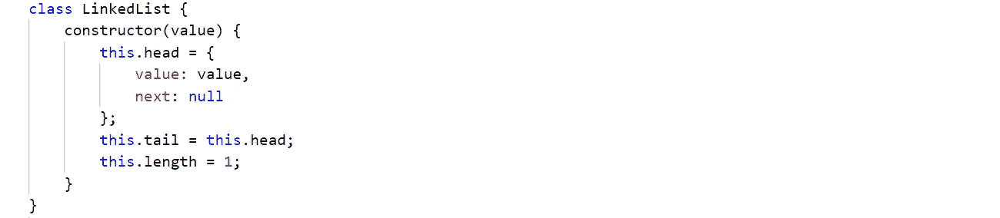
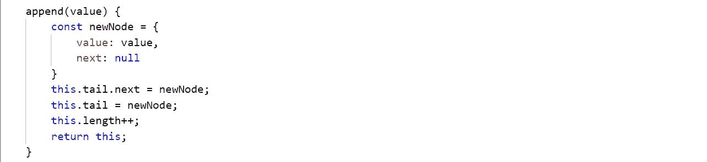
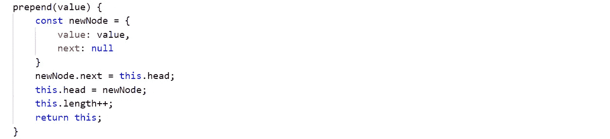
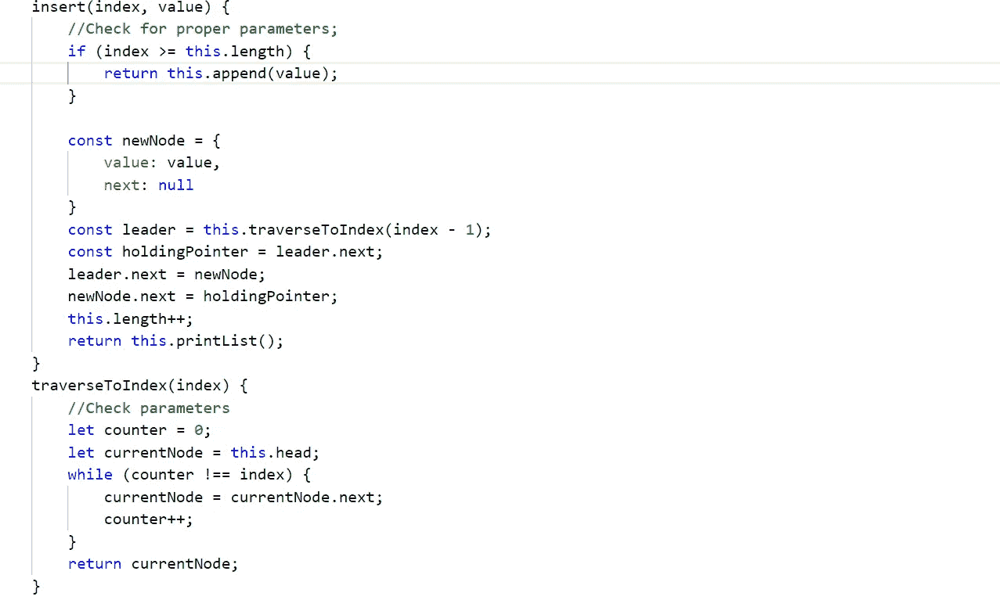
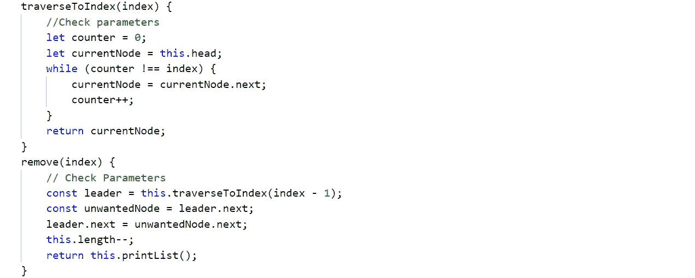
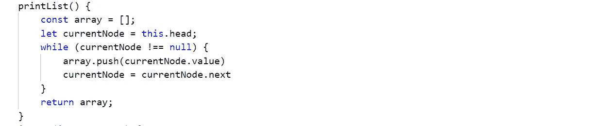

# JavaScript 中的链表

> 原文：<https://javascript.plainenglish.io/linked-list-in-javascript-d0224a6f15f7?source=collection_archive---------1----------------------->

## 这篇文章解释了如何用 JavaScript 实现一个链表

因为 JavaScript 不像 C 语言那样有指针，所以我们将引用来链接 JavaScript 中的节点。如果你不熟悉对象引用的概念，可以看看我之前的文章[https://medium . com/@ anu PAM 1996/object-referencing-in-JavaScript-9 ECB 6 ba 29 e 22](https://medium.com/@anupam1996/object-referencing-in-javascript-9ecb6ba29e22)

**让我们来复习一下链表中的核心概念和操作。**

链表由不同的节点组成，这些节点通过指针或引用链接在一起。每个节点存储一些值和一个指针，该指针指向或存储下一个节点的地址。链表中的最后一个节点指向空。

**追加** 链表中的插入操作必须是 O(1)。
**前置**
链表中的前置操作必须再次为 O(1)。
**插入** 链表中的插入操作为 O(n)。 **打印** 链表中的打印操作也用 O(n)表示。 **删除** 删除操作也是 O(n)。

所以我们先做一个类链表。

类 **LinkedList** 由三个属性
1 组成。 **head** - > head 是我们链表的起始节点。
2。**尾** - >尾是指向头部的指针。
3。 **length** - > length 表示链表的长度。

让我们从操作 Append 开始。

在 Append 中，我们创建了一个存储新值的新节点。现在，由于尾节点引用的第一个节点是我们的头节点，所以现在 **this.tail.next = newNode** 即意味着头节点 next 指针现在指向 newNode。由于尾节点是我们的指针， **this.tail = newNode** 即 tail 现在指向新节点。

现在让我们看看操作 **Prepend。**

在 Prepend 中，我们只需在链表的开头添加一个新节点。因此，我们创建一个新节点，并将其指向头部，即第一个节点。现在，由于 newNode 应该是第一个节点， **this.head = newNode** 使 newNode 成为头节点。

现在让我们来看看**插入的操作。**

在 Insert 中，我们在给定的索引后添加一个新的节点。首先我们需要检查索引是否等于或大于链表的长度，这就变成了一个追加操作。如果不是这样，我们创建一个包含值和下一个指针的 newNode。为了找到需要插入新节点的节点的位置，我们创建了一个函数 **traverseToIndex** ，它返回指向需要插入新节点的节点的指针。变量 **holdingPointer** 存储我们需要插入新节点的节点的下一个节点。然后我们将首节点 next 指针改为 newNode，newNode next 指针改为 **holdingPointer** 。

现在让我们看看**移除**操作在链表中是如何工作的。

删除操作类似于插入操作。给定要删除的节点的索引，使用 **traverseToIndex** 函数，我们找到要删除的节点的前一个节点地址，即 leader。现在我们找到要删除的节点的下一个节点。指向上一个节点下一个指针指向要删除的节点的下一个节点。

现在让我们**打印**我们的链表。

打印一个链表非常简单。只需从头节点开始，使用下一个指针遍历，直到最后一个节点。

好的，但是对于你们中的一些人来说，可能会有一个困惑，我们删除的所有对象去了哪里？它们仍然存储在内存中还是被永久删除。因此，在 JavaScript 中，我们不需要担心这些事情，因为所有这些事情都是由 JavaScript 的垃圾收集在内部管理的。