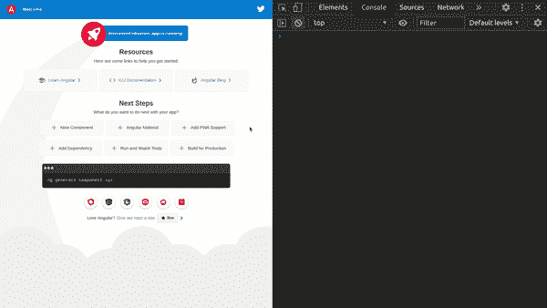

# 使用 Angular 中的可观察对象监听任何 DOM 事件

> 原文：<https://javascript.plainenglish.io/listen-to-any-dom-event-using-an-observable-in-angular-342ffdb798a7?source=collection_archive---------8----------------------->

## 使用可观察对象监听 Angular 中的 DOM 事件


QwsdtPhot[o by Pablo Heim](https://unsplash.com/@pabloheimplatz?utm_source=medium&utm_medium=referral)plat[z on Uns](https://unsplash.com?utm_source=medium&utm_medium=referral)plash

# 介绍

在本指南中，我将向您展示如何使用 Rxjs Observables 来监听和响应各种 HTML DOM 事件。

HTML DOM 事件允许 JavaScript 在 HTML 文档中的元素上注册不同的事件处理程序。

可观察值是一个简单的函数，它随时间向观察者返回一系列值。基于这个定义，您可以将 DOM 事件看作是返回一些数据流的可观察对象。例如，当鼠标单击事件发生时，总是会发出一个事件。

# 创建角度应用程序

为了说明如何监听 DOM 事件，我们将创建一个简单的 Angular 应用程序，并用它来监听一些 DOM 事件。您可以通过 CLI 使用以下命令来完成此操作。

```
ng new dom-event-observer --defaults
```

# 创建可观察的事件

Rxjs 有 ***fromEvent*** 函数，我们可以用它将 DOM 事件转换成一个可观察的序列。fromEvent 的格式如下`fromEvent (target, eventname: string)`，并带有两个参数。

1.  第一个参数是事件目标，在我们的例子中，它是文档(DOM)。
2.  第二个参数是我们想要监听的事件的名称，类型为 string。

我们可以监听的 DOM 事件有很多，但是为了方便起见，我们在这个例子中只使用四个，分别是: *click* 、 *auxclick* 、 *mouseover* 和 *wheel* 。其他值得注意的 DOM 事件有*拖动*、*放下*、*聚焦*和 *keyup* 。

要获得更全面的 DOM 事件列表，请点击这里查看 w3schools [的参考文章。](https://www.w3schools.com/jsref/dom_obj_event.asp)

复制并将以下代码粘贴到您的 ***app.component.ts 文件*** *中。*

```
import { Component, OnInit } from '@angular/core';
import { fromEvent, Observable } from 'rxjs';@Component({
    selector: 'app-root',
    templateUrl: './app.component.html',
    styleUrls: ['./app.component.css']})export class AppComponent implements OnInit {
  title = 'dom-event-observer'; click$: Observable<any> = fromEvent(document, 'click');
  rightClick$: Observable<any> = fromEvent(document, 'auxclick');
  mouseOver$: Observable<any> = fromEvent(document, 'mouseover');
  wheel$: Observable<any> = fromEvent(document, 'wheel'); private subscribeToObservables() {
   this.click$.subscribe(()=> console.log(`Mouse click event!`))
   this.rightClick$.subscribe(() => console.log(`Right click event!`));
  this.mouseOver$.subscribe(() => console.log(`Mouse over event!`));
  this.wheel$.subscribe(() => console.log(`Mouse wheel event!`));
 } ngOnInit() {
  this.subscribeToObservables();
 }}
```

这基本上就是代码所做的。

*   从事件导入**，从 rxjs 导入**可观察**。另外，我已经从 Angular core 导入了 **OnInit** 。**
*   我已经创建了四个可观察的属性，并给它们分配了各自的 DOM 事件。每当我们监听的事件发生时，我们只需记录到控制台。属性以 **$** 结尾，这是命名可观察属性的常见约定。
*   最后，当组件在 ngOnInit()中初始化时，我们通过调用 subscribeToObservables 方法来订阅不同的观察值。

如果您想监听其他 DOM 事件，您可以简单地创建一个 Observable 属性，并使用 fromEvent 操作符将它分配给正确的事件，就像我们在上面的代码中所做的那样。

# 行动中的可观察事物

现在，应用程序代码已经连接好了，我们可以继续使用下面的命令为应用程序提供服务。

```
ng serve -o
```

因为我们使用了`-o`标志，所以应用程序将自动在您的默认网络浏览器中打开。

打开你的浏览器开发者工具，通常情况下，按下`f12`键即可进入。

现在尝试我们正在收听的事件；将鼠标悬停在对象上，单击页面或使用鼠标滚轮。您可以看到，随着不同事件的发生，相应的消息被记录到控制台中。



# 结论

这就是使用 Rxjs Observable 和 fromEvent 函数监听 HTML DOM 事件的简单方法。

Observables 非常擅长处理数据流，DOM 事件就是可以用 Observables 很好地处理数据流的一个很好的例子。