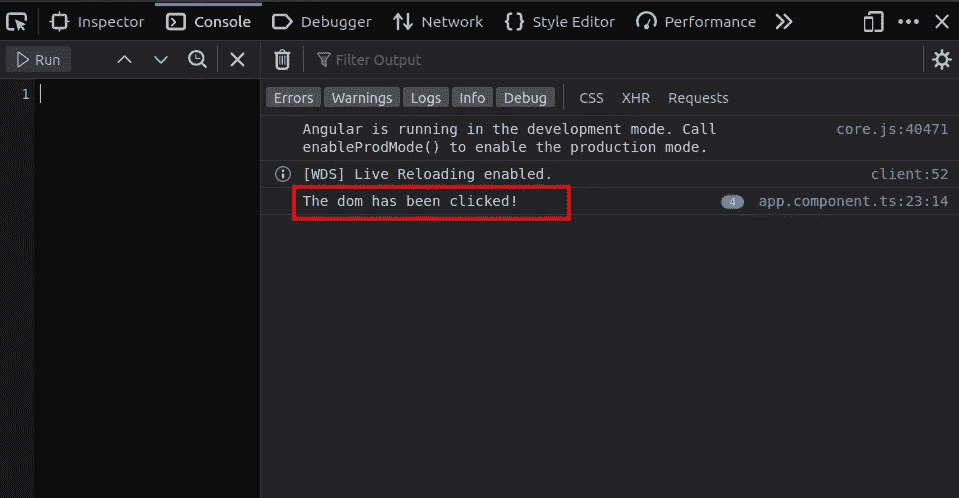

# 使用角度可观测值监听鼠标点击事件

> 原文：<https://javascript.plainenglish.io/listening-to-mouse-click-event-using-an-observable-in-angular-2446eafcc890?source=collection_archive---------5----------------------->

## RxJS 中可观察对象的简要介绍


Image by [mohamed Hassan](https://pixabay.com/users/mohamed_hassan-5229782/?utm_source=link-attribution&utm_medium=referral&utm_campaign=image&utm_content=3539810) from [Pixabay](https://pixabay.com/?utm_source=link-attribution&utm_medium=referral&utm_campaign=image&utm_content=3539810)

可观察值是一个简单的函数，它随时间向观察者返回一系列值。一个可观察对象有两种方法:订阅和取消订阅。可观测量是 RxJS 中的一个关键概念。

要让一个可观察对象开始行动或发出数据，必须通过订阅它来触发。由于这个原因，可观测量被认为是懒惰的。

我们将使用鼠标点击事件来说明可观察数据流的概念。在这种情况下，鼠标点击应该被视为一段时间内收集的数据值序列。

# 创建角度应用程序

使用 Angular CLI 创建一个简单的 Angular starter 应用程序。

在项目文件夹中，运行以下命令:

`$ ng new click-event-app`

# 安装 RxJS

在本指南中，我们将使用 npm 来安装 RxJS，但是您可以使用任何其他您选择的包管理器，比如 yarn。

使用以下命令转到应用程序根文件夹

`$ cd click-event-app`

然后通过下面的命令安装 RxJS。

`$ npm install rxjs`

# 创造一个可观察的

进入 **app.component.ts** 文件并进行以下更改

1.  来自事件的第一个导入**和来自 rxjs 的可观察**的
2.  **从角形核心导入 **OnInit****
3.  **创建一个名为 clickObservable、类型为 Observable 的属性；**
4.  **使 AppComponent 类在 OnInit 上实现**

****注意:**目前我们还没有实现 ngOnInit 方法，但是我们很快就会实现。**

# **订阅可观察的**

**为了订阅可观察对象，我们将创建一个私有方法，在应用程序启动时，将在 ngOnInit 生命周期钩子中调用该方法。**

**我们将订阅可观察对象，每当发生点击事件时，我们将把以下消息记录到浏览器控制台'***DOM 已被点击！***’。**

**您的 **app.component.ts** 文件现在应该是这样的。**

```
import { Component, **OnInit** } from '@angular/core';
**import { fromEvent, Observable } from 'rxjs';**@Component({
   selector: 'app-root',
   templateUrl:  './app.component.html',
   styleUrls: ['./app.component.css']
})export class AppComponent **implements OnInit** {
  title = 'click-event-app';
  **clickObservable: Observable<Event> = fromEvent(document,'click');** **ngOnInit(): void {
    this.subscribeToObservable();
  }** **private subscribeToObservable() {
      this.clickObservable.subscribe(() => { 
      console.log(`The dom has been clicked!`);
    })
  }**}
```

# **行动中的可观察对象**

**要查看实际情况，请使用以下命令启动应用程序:**

**`$ ng serve -o`**

**`-o`标志表示，在默认的网络浏览器中自动打开应用程序。通常应用程序会被发送到以下网址[*http://localhost:4200*](http://localhost:4200/)**

## **打开浏览器控制台**

**要打开浏览器控制台，按下 **f12** 按钮并确保控制台选项卡被选中。**

**现在单击应用程序网页中的任意位置，在本例中，我单击了四次。**

****

**应用程序监听任何鼠标点击，并相应地将它们记录到控制台。**

# **结论**

**可观测量在处理数据值流或未来事件时非常重要。使可观测量受欢迎的一些特征包括**

*   **更好的错误处理**
*   **懒惰，在没有订阅的情况下不会有数据值的发射。**