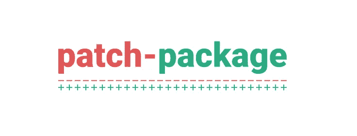
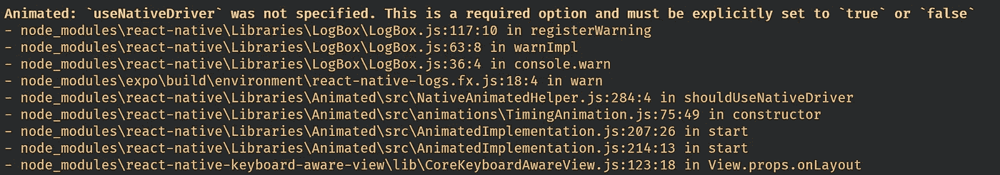
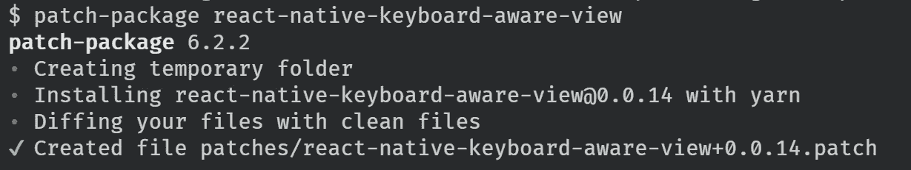
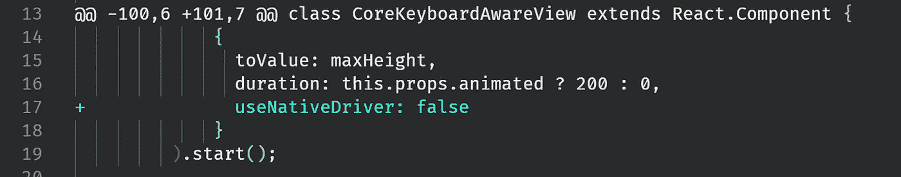

# 使用“补丁包”进行超级简单的 NPM 包修补

> 原文：<https://javascript.plainenglish.io/live-npm-package-patching-with-patch-package-b8f30d47779c?source=collection_archive---------4----------------------->

## 轻松修补软件包。非常简单。

NPM 套餐很棒。没有他们，我们作为开发人员的生活将会更加艰难。事实上，我可能会做些更有趣的事情来谋生。比如养猫。或者玩电锯杂耍。

但是，尽管它们很棒，总有一天你使用的 NPM 软件包中会有一个 bug。没问题吧？您在包的 GitHub repo 上创建了一个问题。或者，作为专业人员，您创建一个包含修复的拉请求。

然后你等待...

并且等待…

还有……

是啊，不。这是不可接受的。

所以你派生出回购，并把它作为你的包源。或者你用你的叉子创建你自己的 NPM 包。

但是如果有更简单的方法不是很好吗？更简单的方法？

进入[补丁包](https://github.com/ds300/patch-package)。



补丁包是我到目前为止发现的最简单的方法..修补程序包。

是的，它确实和罐头上说的一样。

## 如何安装

安装非常简单。添加…

```
"scripts": {
  ...other scripts
  "postinstall": "patch-package"
}
```

…到您的`package.json`文件，并使用 yarn 安装补丁包:

```
yarn add patch-package postinstall-postinstall
```

你可能注意到我们实际上安装了两个包，即补丁包和安装后包。这两者一起工作，这一点稍后会变得清楚。

## 如何使用

要使用修补程序包，请在 node_modules 中的程序包代码中进行修改*，然后运行`patch-package`。就是这样！它将创建一个`patches`文件夹，其中包含用您所做的更改更新您安装的软件包版本所需的差异。*

## 活生生的例子

为了向您展示它是如何工作的，我将对[react-native-keyboard-aware-view 包](https://github.com/VansonLeung/react-native-keyboard-aware-view)应用一个补丁。

在撰写本文时，使用 react-native-keyboard-aware-view 包中的`<KeyboardAwareView>`会导致以下警告:



这显然很糟糕。修复相当简单，在回购上至少有 2 个拉请求。但回购似乎已经死了。所以还是自己修吧。

首先，我们将打开文件`node_modules/react-native-keyboard-aware-view\lib\CodeKeyboardAwareView.js`。然后我们查找方法调用`Animated.timing`的所有实例，并将行`useNativeDriver: false`添加到配置参数中(有 3 个实例)。

然后，我们重新加载我们的应用程序，以确保警告已经消失。是的，所以我们成功地修补了这个包。

然后，我们运行`patch-package`:



瞧啊。补丁包为我们创建了一个补丁文件。它的一个片段看起来像这样:



这清楚地显示了我们所做的改变。

现在，因为我们安装了`postinstall` yarn，所以每次我们安装新的软件包时，它都会运行我们的补丁。我们还可以通过不带参数运行`patch-package`来强制安装补丁。

这就是在等待你的 PR(你**还在创建 PR，对吧)时，补丁包让修复你的本地代码中的一个 bug 变得多么容易。)合并到官方包中。**

**我发现`patch-package`非常有用。我希望你也能。**

**编码快乐！**

***更多内容请看*[***plain English . io***](http://plainenglish.io/)**