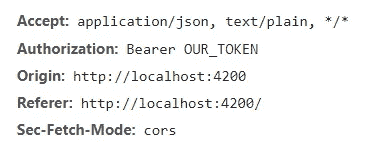

# 使用 JWT 授权加载图像

> 原文：<https://javascript.plainenglish.io/loading-images-with-authorization-8aab33663ba6?source=collection_archive---------0----------------------->

## 或者如何增强原生 HTML

如果你做 JS + HTML 已经有几天了，那么你可能对`img`标签很熟悉。这个概念很简单——在你的标记中放一个`img`标签，提供一个带有图片 URL 的`src`属性，然后砰——你的页面上就有一张图片了。例如，如果我们在`https://somewhere.com/image.png`有一张图片，我们可以这样做:

到目前为止还没有什么新奇的东西，但是如果我们不想让任何人访问这张图片呢？当然，从 API 的角度来看，实现一些基本的认证并不难。据说，JWT 授权现在很流行。但是另一个问题来了——对于 JWT，我们需要一个特殊的字符串——一个令牌，与请求一起传递给服务器，以帮助服务器识别发出请求的用户。当然，如果我们使用一个`HttpClient`实例来获取图像，这没什么大不了的——我们只需在请求中添加带有`options`参数的头。但是我们如何迫使`img`标签通过`HttpClient`实例请求图像呢？

答案是管道。

我们要做的是:

1.  编写一个接受图像 url 的管道，并在放置授权头的同时执行 HTTP 请求，
2.  将`blob`响应转换成一个`base64`字符串，这样它就可以被传递给`src`属性，
3.  将`base64`管柱放入`Promise`中，使其依次通过`async`管，
4.  调用一个`src`属性中的管道，
5.  如果出现问题，可以选择指定一个后备映像，
6.  可以选择创建一个组件来处理所有这些逻辑

让我们从基本管道开始:

所以我们在这里:

1.  从我们的本地服务获取令牌，
2.  放在`headers`里面，
3.  使用这些标题调用图像，
4.  指定`responseType: 'blob'`告诉 Angular 我们正在这里加载一个二进制文件

注意`toPromise`和`async` / `await`的用法。

当然，这只是工作的一半——我们仍然需要将二进制转换成一个`base64`字符串。`FileReader`来了。(我将只提供`transform`方法的实现)

我们只是将文件读取过程包装在一个 Promise 中，所以我们可以将它与`async`管道结合使用:

如果我们在 Chrome 中打开`Network`标签，我们会看到对图片的请求，并找到我们要找的标题:

如果你仔细观察，你会注意到在我们的`transform`方法中我们没有做任何错误处理。如果图像不存在呢？如果出现服务器错误怎么办？不管错误的性质如何，我们都可以提供一个回退图像:

我们只是将 HTTP 请求包装在一个`try` / `catch`块中，并在出错时返回一个回退图像 url。请注意，我们没有承诺包装回退图像 url 字符串，因为该方法已经是`async`，它是自动完成的。

> 可选地，我们也可以用一个`switch`语句为不同的错误场景返回不同的回退图像(一个用于`404`，一个用于`Server Error`，等等)，但这超出了本文的范围。

最后，我们可以编写一个组件，用它的`Authorized`版本替换整个应用程序中的所有`img`标签:

然后像这样使用它:

> **警告**:你需要记住的一件事是 CORS:你的图像服务服务器应该以这样一种方式配置，它接受来自你的 Angular 应用程序正在运行的域的图像的 XHR 调用，否则你会遇到 CORS 错误。此外，您必须提供自定义管道的绝对 URL，否则它将向 Angular 应用程序的域本身发出请求。

## 结论

正如我们所看到的，完全可以用包装器替换原生 HTML 元素来执行定制逻辑。管道在这个过程中也派上了用场。

*跟我上* [*中*](https://medium.com/@Armandotrue) *和*[*Twitter*](https://twitter.com/Armandotrue)*了解更多关于 Angular、Rxjs、React 和 Javascript 的一般信息*。