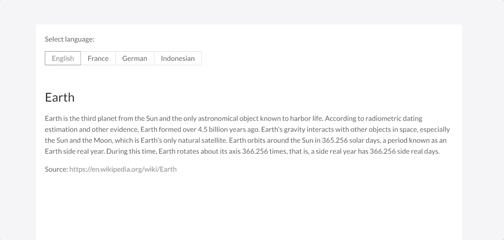
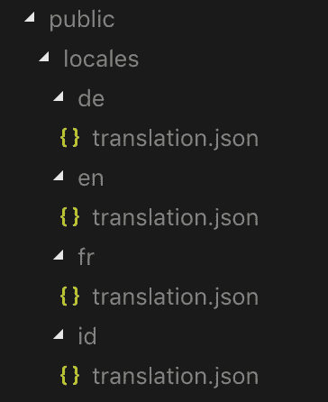

# 本地化您的 React 应用程序

> 原文：<https://javascript.plainenglish.io/localize-your-react-application-5ab3219ee5d5?source=collection_archive---------1----------------------->

## 国际化(i18n)与 i18next 和 react-i18next


Image source: [Pisit Heng](https://unsplash.com/@pisitheng)

国际化(i18n)可能是你现在需要的特性之一。多亏了`i18next`，本地化应用程序的任务可以很容易地完成。在本文中，我将向您展示如何使用`i18next`和`react-i18next`来本地化您的 React 应用程序。

## 这篇文章将涵盖哪些内容？

1.  初始化并使用翻译函数。
2.  处理用户的语言选择。
3.  管理翻译文件。
4.  将语言密钥存储在 Cookie 中。

我将重点介绍如何在 React 应用程序中实现国际化。对于本教程，我使用一个新的 React 应用程序，它是使用组件的 [Create React App](https://reactjs.org/docs/create-a-new-react-app.html) 和 [Ant Design](https://ant.design/) 创建的。您可以按照自己喜欢的方式创建 React 应用程序。

我们想要实现什么？



# 1.初始化并使用翻译功能

安装`i18next`和`react-i18next`。

```
npm install i18next react-i18next --save// oryarn add i18next react-i18next
```

创建一个`i18n.js`文件来存放您的配置。下面是一个`i18n.js`文件内容的例子。

*   `resources`:地区(翻译)数据。
*   `lng`:使用的初始语言。
*   `fallbackLng`:某些翻译未定义时使用的语言。

将其导入到您的`index.js`文件中。

现在您可以在您的组件中使用它。我们将使用`react-i18next`提供的`useTranslation`挂钩。

翻译函数(`t`)接受`resources`中定义的翻译键，例如:`t("title")`(或者如果有嵌套的翻译对象:`t("content.description")`)。

给你。现在如果你刷新你的浏览器，标题文本应该是“地球”。

# 2.处理用户的语言选择

现在让我们让我们的应用程序能够接受用户的选择。我们将使用由`useTranslation`钩子提供的`i18n`实例。然后，创建一个函数来更新语言。

我们使用接受语言键的`i18n.changeLanguage`方法。可用的语言键是在浏览器的`resources` ( `en`、`de`、`fr`或`id`中定义的，现在您可以更改语言并立即看到结果。

注意:我对`Radio`组件使用[蚂蚁设计](https://ant.design/)。您可以为您的应用程序使用 HTML select 标记、radio input 标记或您的自定义组件。

# 3.管理翻译文件

所有的翻译都放在`i18n.js`文件中。如果您的应用程序正在增长，那么该文件将更难维护。为了解决这个问题，我们可以将每个翻译转移到单独的 JSON 文件中。然后，我们的应用程序将根据需要加载这些 JSON 文件。

我们将使用`i18next-http-backend`从后端服务器加载资源。它使用 XMLHttpRequest 或 fetch API 来获取资源文件。

安装`i18next-http-backend`:

```
npm install i18next-http-backend --save// oryarn add i18next-http-backend 
```

在`public`文件夹中创建一个`locales`文件夹。然后为每个语言键创建文件夹。在每个文件夹中添加`translation.json`文件。文件夹结构应该如下所示:



Locale folders and files

将翻译数据从`resources`复制到适当的文件——例如:

```
/* en/translation.json */{
  "title": "Earth",
  "content": {
    "description": "Earth is the third planet...",
    "source": "Source: "
  }
}
```

更新您的`i18n.js`文件:

正如我之前所说的，`i18next-http-backend`用 XMLHttpRequest 加载资源文件，这意味着这个过程是异步的。有时资源文件可能还没有准备好。为了处理它，我们可以使用`React`中的`Suspense`来包装我们的组件。您可以将它放在`index.js`中来包裹所有组件:

现在你回到你的浏览器，看看它是否像预期的那样运行。

# 4.将语言密钥存储在 Cookie 中

您会注意到，如果您刷新浏览器或关闭然后重新打开它，语言将恢复为英语(`en`)。那是因为我们在`i18n.js`中还是硬编码的。我们还没有把它存放在任何更持久的地方。

我将使用 Cookie(带`js-cookie`)来存储语言代码。你可以选择其他方式，如本地存储，甚至在你的后端服务器。

更新`i18n.js`，现在`lng`使用 Cookie 中的语言键。

我还添加了一个回退语言代码，如果 Cookie 值中的`locale`是`undefined`，就使用短路。

不要忘记更新我们的`changeLanguage`功能，以便能够将选择的密钥存储到 Cookie 中。只需在`i18n.changeLanguage(code);`行后添加下面的代码。但是不要忘记先进口`Cookies`。

```
Cookies.set("locale", code);
```

仅此而已。您已经在 React 应用程序中实现了国际化。

# 结论

`i18next`和`react-i18next`是帮助我们在 React 应用程序中实现国际化的强大工具。它们简单易用。完整的指南可在[文档页面](https://www.i18next.com/)上找到。

示例代码可以在[***GitHub***](https://github.com/rezamauliadi/react-18next-learning)***上找到。***

谢了。