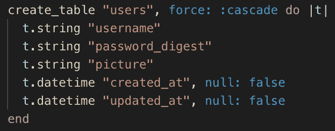
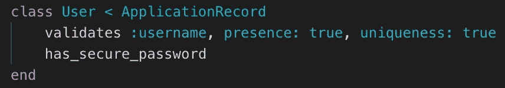
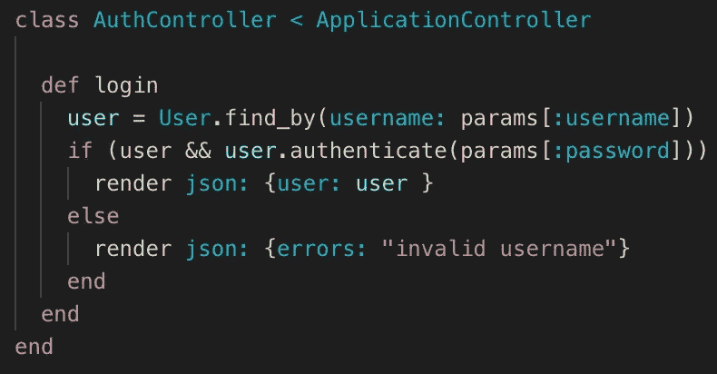
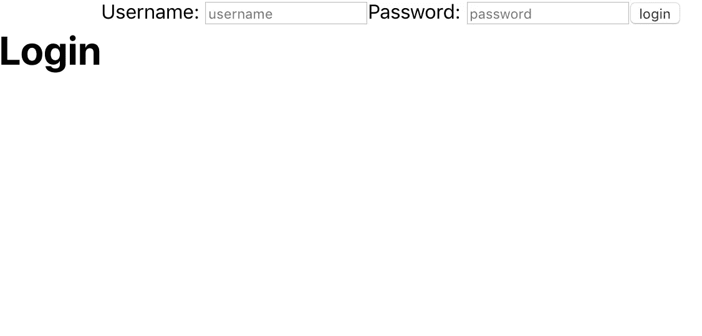
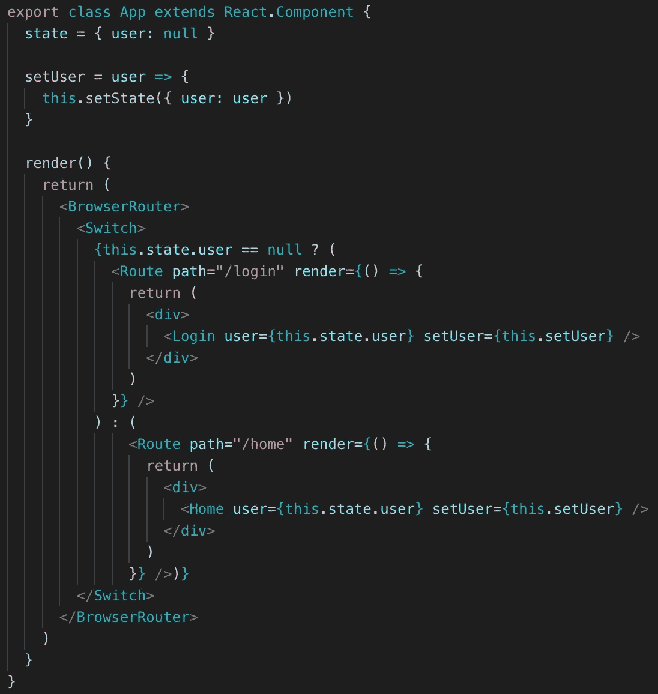
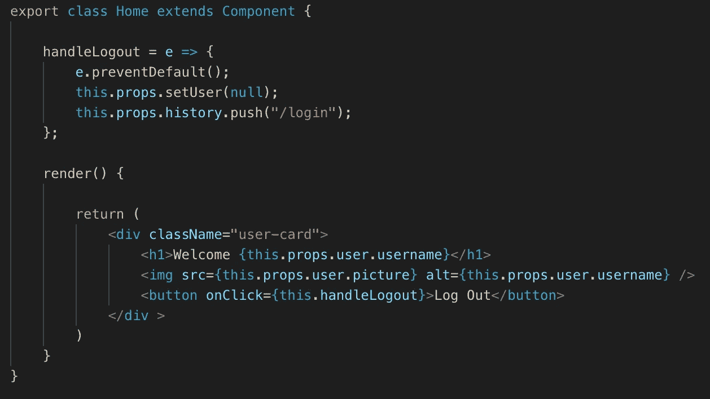
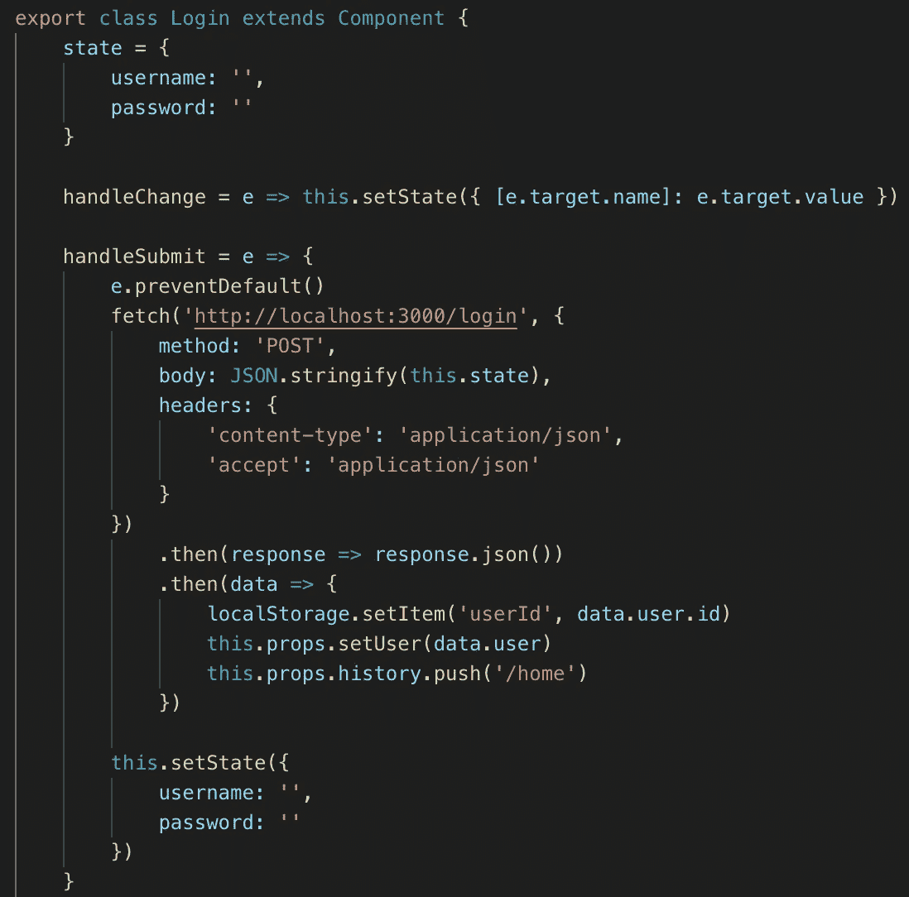
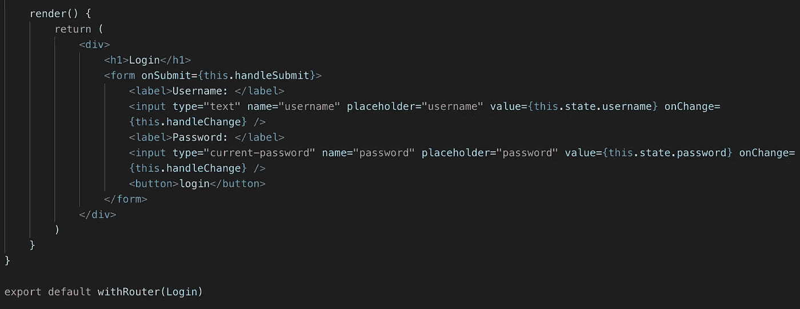

# 在 React & Rails 上登录前端和后端

> 原文：<https://javascript.plainenglish.io/login-front-end-back-end-on-react-rails-5a9de1d6427f?source=collection_archive---------0----------------------->

我要创建一个简单的登录应用程序，连接前端和后端。让我们从我们的后端开始。我将使用 rails，在 rails 中设置了一个新的 API 后，我在下面加入了用户表和用户模型。确保在您的表中使用 password_digest，在您的模型中使用 has_secure_password。



Users Table



User Model

我还确保取消了 BCrypt 的注释，并在 rails 中捆绑安装。

```
gem 'bcrypt', '~> 3.1.7' bundle install 
```

对于登录，我在我的控制器中设置了以下内容，一个自定义的路由登录。我使用了身份验证密码，只有当您取消 BCrypt Gem 的注释并运行软件包安装时，才能再次使用该密码。



Auth Controller for Login

```
post '/login', to: 'auth#login'
```

要记住的另一条信息是，在创建用户时，一旦设置了表，一定要使用 password 而不是 password_digest 来设置用户，这样就会在后端显示密码。

```
User.create(username: "Hitchcock", password: "Alfred", picture: "https://upload.wikimedia.org/wikipedia/commons/thumb/1/10/Alfred_Hitchcock_%281955%29.JPG/440px-Alfred_Hitchcock_%281955%29.JPG")
```

但是 password_digest 将密码隐藏在数据库中。

```
{
**id**: 3,
**username**: "Hitchcock",
**password_digest**: "$2a$12$DxQSsWq2mKHWiRQ77TrRF.GYT0CPvcUc9iJC2O/062kD99l0xRyh.",
**picture**: "[https://upload.wikimedia.org/wikipedia/commons/thumb/1/10/Alfred_Hitchcock_%281955%29.JPG/440px-Alfred_Hitchcock_%281955%29.JPG](https://upload.wikimedia.org/wikipedia/commons/thumb/1/10/Alfred_Hitchcock_%281955%29.JPG/440px-Alfred_Hitchcock_%281955%29.JPG)",
**created_at**: "2019-09-11T16:32:01.564Z",
**updated_at**: "2019-09-11T16:32:01.564Z"
},
```

这就结束了后端。现在我把你带到前端。首先，这是我简单的登录表单。



Beautiful login page

在我的树的顶部，我有一个 App.js，它有两个孩子，Home.js 和 Login.js。在 App.js 中，我将把用户的状态设置为 null。使用 this.state.user 的三元组，如果用户为空，将引导他们登录，否则将引导他们到主页。



App.js

将同样的两个属性传递给 login 和 home 将允许用户登录或注销。这些属性是用户的当前状态，以及 setUser，它将把用户的状态设置为 home 中的 null。



Home.js

当按下注销按钮时，我的 onClick 事件句柄 log out 启动，并首先使用 prop 将用户设置为 null。使用 withRouter 允许我将用户重定向回登录。对于登录，我有一个状态用户名和密码，可以用于我的表单上的值。



Login.js



Login.js continued

连接前端和后端当登录按钮被按下时，我运行一个获取到我在 Ruby 中设置的登录路径的操作，我将使用主体的状态，因为用户名和密码存在于后端。

收到响应后，我将使用 localStorage 并将 userId 设置为已登录用户的用户 Id。如果使用导航条并有许多页面来确保你的用户在所有这些页面上登录，这将是很有帮助的。我还回调了 setUser，从响应中获取数据，并将 user: null 更改为当前登录的用户。最后再次使用 withRouter，用户被重定向到可以注销的主页。

这就完成了一个基本的登录。