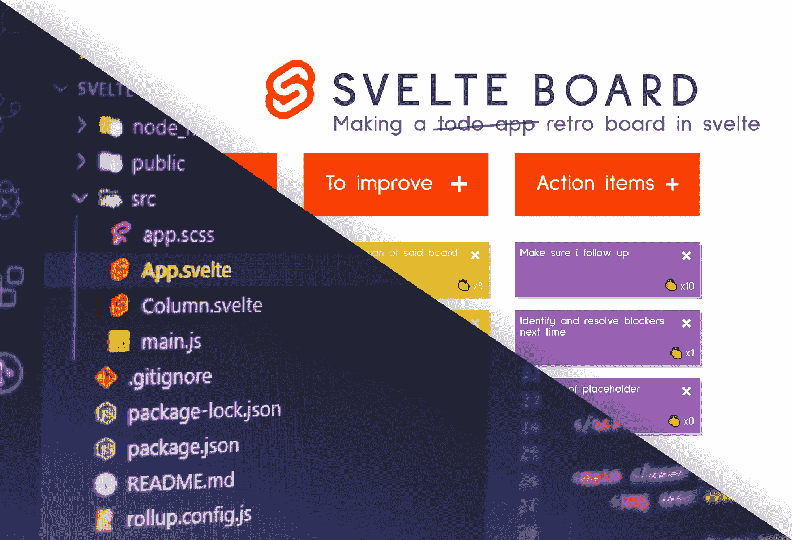
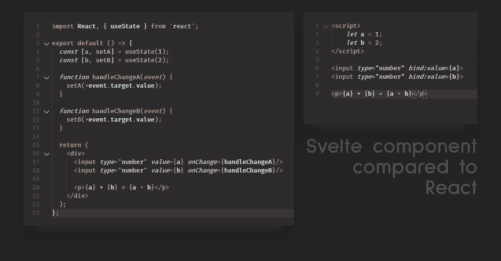
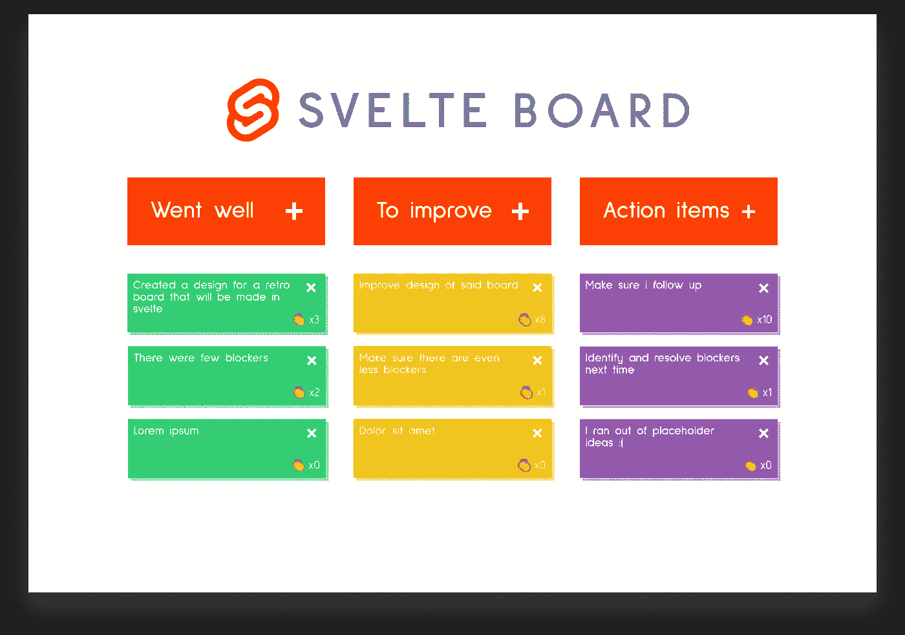
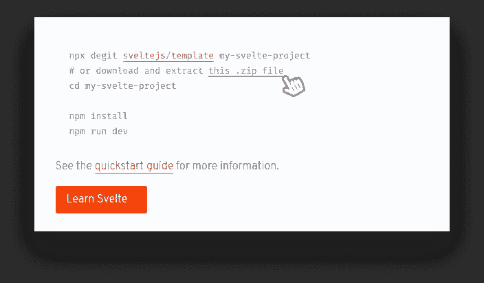
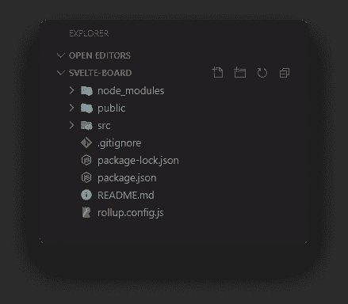
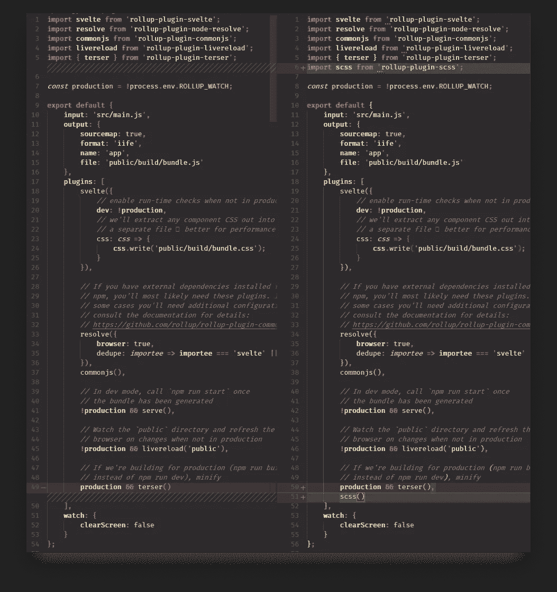
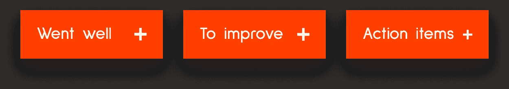
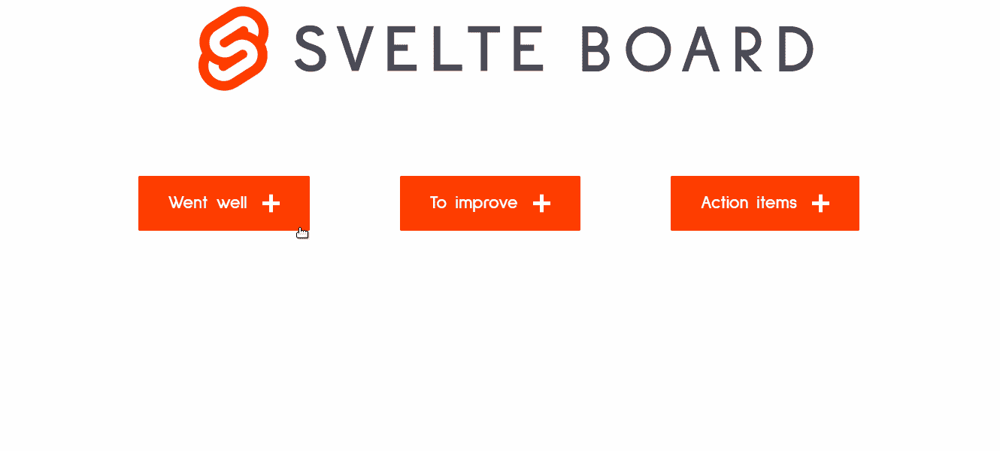
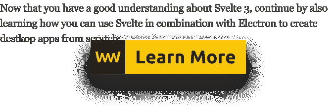

# 调查苗条 3 号

> 原文：<https://javascript.plainenglish.io/looking-into-svelte-3-b3d0b43cd794?source=collection_archive---------1----------------------->

## 从零开始快速创建一个苗条的复古板

[](https://www.webtips.dev/svelte-3)

如果你是一名前端开发人员，你会知道新框架的新版本不时出现。这种趋势似乎没有放缓。

虽然 Svelte 已经存在了一段时间，但是版本 3 在几个月前才刚刚发布。它把自己描述成一个

> 构建用户界面的全新方法

但为什么它是激进的，它与其他大框架如 React、Angular 或 Vue 有什么不同？

首先，我们需要指出，Svelte 是一个编译器，意味着它将在构建时生成你的代码，并且只包含你实际使用的框架中的 JavaScript。这意味着你的包最终会变得更小，从而产生一个更轻量级、更快的应用。

这也意味着你的项目不会有样板代码。如果你碰巧写了一个 hello world 应用程序，你的包不会是 2MB，因为如果你不使用框架中的任何东西，最终的构建中不会包含任何东西。

减少你写的代码量也是 Svelte 的一个重要方面。以下对比摘自官方网站，对比 React 和 Svelte 中的相同成分:



React component on the left, Svelte component on the right

它还试图将反应性引入其核心，不需要外部状态管理库。

为了尝试并展示其优势，同时涵盖核心功能，我们将从头开始创建一个复古板。这是我为这个教程做的最初设计:



这是一个经典的三栏布局，您可以在其中张贴笔记，说明哪些进展顺利，哪些需要改进，以及一些要跟进的行动项目。用户将能够创建、删除、编辑和鼓掌每一个便利贴。

我将在文章的最后为这个项目提供一个 GitHub 链接，这样你就可以避免先摆弄 CSS，然后直接进入编码。因此，不浪费更多的时间，让我们开始设置苗条。

# 设置苗条

启动 Svelte 最简单的方法是转到 [svelte.dev](https://svelte.dev/) ，如果你安装了 [degit](https://github.com/Rich-Harris/degit) ，运行这个命令:

```
npx degit [sveltejs/template](https://github.com/sveltejs/template) svelte-board
```

或者从提供的链接下载并解压缩 zip 文件。无论哪种方式，您都将获得相同的模板。



用`npm i`安装依赖项，用`npm run dev`运行服务器，一切就绪。如果你查看最初的项目结构，你会注意到 Svelte 使用 [rollup](https://rollupjs.org/guide/en/) 作为捆绑器。我们还看到了一个公共文件夹和一个 src 文件夹。所有将成为公共可用资产的东西，比如字体或图像，都应该放在公共文件夹中。任何与你的应用相关的东西都应该在 src 文件夹里。



在 src 文件夹中，你会找到一个`App.svelte`文件。您可以删除内容，因为我们不会使用其中的任何内容。

现在，每当我处理一个新项目时，我的第一步就是让 sass 启动并运行来帮助我处理 CSS。因为这篇文章应该是关于苗条的，所以我不会详细介绍我是如何复制这个设计的，相反，我只会指导你如何添加对 sass 的支持。

# 添加 SCSS 支持

为了增加支持，我们需要`npm i rollup-plugin-scss`。完成后，打开你的`rollup.config.js`文件，在导入文件的末尾添加下面一行:

并用插件数组末尾的`scss()`调用它。



你现在要做的就是在你的 src 文件夹中创建一个`.scss`文件，并将其导入`main.js`。

# 创建纤细的组件

下一步是创建主要组件。细长组件有三个主要部分。

它们有一个`script`标签，用于标记组件的功能。它们有一个`style`标签，其中包含相关组件的样式。默认情况下，它的作用域是组件，所以没有样式冲突。当然，你有标记本身。

如果您不喜欢将脚本、样式和模板放在一个文件中，您可以使用`import`语句来导入您的脚本和 CSS。目前，我们可以将所有东西放在一个地方。

首先，在您的`App.svelte`文件中添加一个空脚本标签和以下内容:

我们将有三列。每一列都有一个包含笔记相关信息的项目；它是内容、点击次数和一个删除按钮。

这都是静态内容，让我们把它变成动态的。我们需要存储棋盘上已经有的物品列表，所以让我们在`script`标签中创建一个多维数组:

每个数组将保存一列的信息。在每个数组中，我们都有一个带有`content`属性的对象列表。为了在模板中显示它们，我们可以使用模板表达式和文本文字。

## 模板表达式

让我们通过使用`#each`表达式来显示脚本标签中`columns`的内容:

逻辑块和动态内容用细花括号表示。除了`#each`，你还可以用`#if`挡，还有我最喜欢的`#await`对付承诺:

回到黑板上，我们将在每一列中有相同的内容，这意味着这是一个完美的机会将它们外包到一个单独的模板中，我们可以在每个循环中调用它。

## 使用嵌套组件

在 src 文件夹中创建一个名为`Column.svelte`的新文件，并将便利贴的内容复制粘贴到其中。

我们需要将便利贴的内容传递给`Column`组件，为了做到这一点，我们必须在这里导出它。我们现在可以通过将新组件导入到`App`组件中来简化我们的列，并在`#each`块中使用它。

要将条目的内容作为道具传递给`Column`组件，我们可以遵循 React 使用的相同模式。

我们现在有了一个非常干净的模板，所以让我们开始添加一些功能。

# 苗条的事件处理程序

我们希望我们的应用中有四种不同的交互方式:

*   添加新项目
*   移除项目
*   编辑现有项目
*   如果我们喜欢这个主意，就给他们鼓掌。

让我们从添加和删除功能开始。

为了添加新的条目，我们希望将新的对象推入到`columns`变量中。我们希望每当单击下面的任何按钮时都出现这种情况:



让我们首先为它创建函数。将以下内容添加到您的`script`标签中:

每当点击一个动作按钮时，我们用一个索引 0、1 或 2 调用这个函数，这取决于我们想要向哪个列添加项目。我们所做的就是在这里将`columns`变量重新分配给`columns`的扩展版本。

为什么我们没有像在其他地方一样在这里使用`Array.push`?这是因为数组突变调用不会触发苗条的重新渲染。相反，您需要重新分配变量。这是因为苗条的反应是基于任务的。

要将函数调用添加到模板中，我们可以使用`on:click`处理程序:

为了将参数传递到函数中，我们可以创建一个 arrow 函数，其中我们使用列的索引来调用`addItem`。

要删除它们，我们可以在`Column`组件中的 remove 按钮上再添加一个`on:click`，并在 script 标签上添加一行，这将从 DOM 中删除父元素:

我还为内容添加了`contenteditable`属性，以便用户可以编辑它。剩下要做的就是实现拍手功能。

为此，我们可以简单地向组件添加一个`claps`变量并显示其值。每次我们单击该元素，它的值就增加 1:

## 添加一些动画

让我们通过添加一个很酷的幻灯片动画来总结一下。Svelte 为简单的淡入淡出、滑动、缩放和模糊动画提供了一些不错的 API。`in:`和`out:`事件用于动画元素的输入和输出。

从`svelte/transition`导入`fly`并添加到`item`:

这将在 0.3 秒内使每个项目从-200px 开始从其结束位置产生动画效果:



# 摘要

正如承诺的那样，你可以克隆和修改来自 GitHub 的项目。

玩苗条真的很有趣，有很大的潜力。很容易上手，学习曲线并不陡峭。如果你碰巧卡住了，那么[文档](https://svelte.dev/docs)是大量的，并且你有许多[示例](https://svelte.dev/examples#hello-world)供你使用。

你也可以在网上玩这个，一旦你开始适应不了，就下载你的代码。

如果你还没有开始，那就试试 Svelte 吧！否则，把你的想法留在框架上。谢谢你的坚持和快乐编码！

[](https://medium.com/@ferencalmasi/membership)[](https://www.webtips.dev/how-to-make-your-very-first-desktop-app-with-electron-and-svelte)