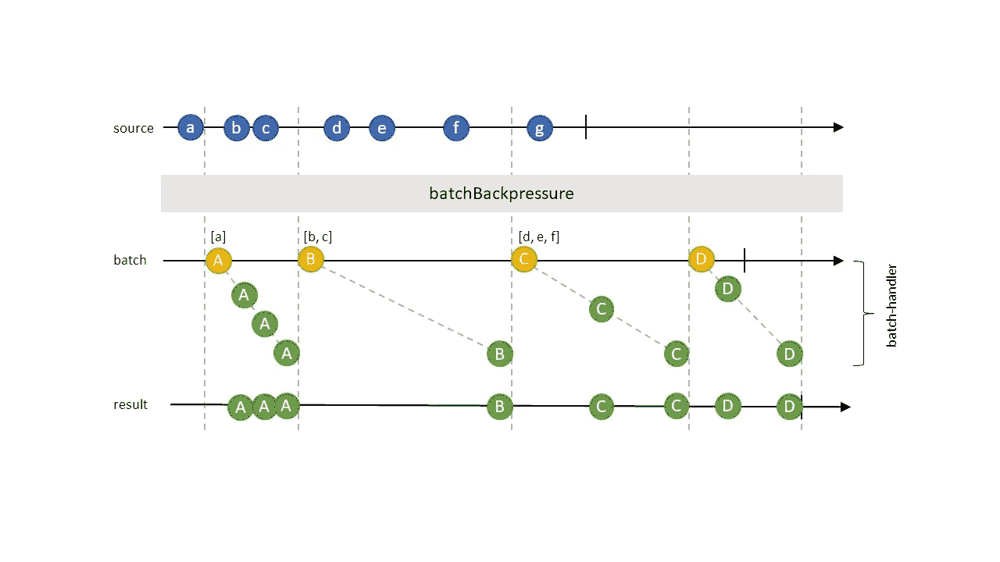

# 使用批量数据的 RxJS 无损背压

> 原文：<https://javascript.plainenglish.io/lossless-back-pressure-for-rxjs-using-batches-of-data-534752fda666?source=collection_archive---------9----------------------->

Photo by [Haley Shives](https://unsplash.com/@haleyshives?utm_source=medium&utm_medium=referral) on [Unsplash](https://unsplash.com?utm_source=medium&utm_medium=referral)

在本文中，我们讨论了一种使用 [RxJS](https://rxjs-dev.firebaseapp.com/api) 框架的无损反压方法。

# 介绍

[反应式编程](http://reactivex.io/)是一种实现事件驱动算法的强大方法。对于浏览器中的事件驱动用户界面来说尤其如此，其中 [RxJS](https://rxjs-dev.firebaseapp.com/api) 是一种常用的实现。

事件驱动编程中的一个常见挑战是处理事件源产生事件的速度快于事件消费者消费事件的速度的情况。这种情况的解决方案称为[背压](http://reactivex.io/documentation/operators/backpressure.html)。我们区分有损背压和无损背压。在有损耗的情况下，策略是忽略某些源事件，因此产生的事件速率与消费者可以应付的速率相匹配。例子包括[采样](https://rxjs-dev.firebaseapp.com/api/operators/sample)，或[节流](https://rxjs-dev.firebaseapp.com/api/operators/throttle) / [去抖动](https://rxjs-dev.firebaseapp.com/api/operators/debounce)。对于无损情况，我们有[缓冲](https://rxjs-dev.firebaseapp.com/api/operators/buffer)或[窗口](https://rxjs-dev.firebaseapp.com/api/operators/window)，它们将源事件组合到一个缓冲区中，并向下游传递该缓冲区(例如每`n`秒)。

这两种方法的共同点在于，它们都假定源事件的速率无法控制。这对于 UI 驱动的事件(如用户与应用程序交互的速率)来说通常是正确的，但对于系统驱动的事件(如文件的读取速率)来说可能不是正确的。如果我们可以控制源速率，那么可以通过暂停事件源来实现无损背压，直到消费者能够再次消费事件。Kevin Ghadyani 在 [RxJS](https://rxjs-dev.firebaseapp.com/api) 中描述了一种有趣的实现方法。

在本文中，我们将讨论[缓冲](https://rxjs-dev.firebaseapp.com/api/operators/buffer)策略的变体，假设对于我们的用例，我们无法控制事件的速率。

# 示例使用案例

在我们的用例中，我们展示了一个显示表单的 web 应用程序，例如，包括文本输入框、下拉框或微调器。该表单由一个可通过 REST 访问的数据库支持。

每当用户对其中一个字段进行更改时，我们都希望立即保存该更改，也就是说，我们不希望用户点击`save`按钮来保存更改。

在这种情况下，很容易发生变化比我们 REST 服务能够处理的更快。特别考虑一个微调控件，它允许通过点击箭头来增加一个整数。变化发生的频率比任何后端都要高得多。

处理这种情况的一种常见方法是[去抖动](https://rxjs-dev.firebaseapp.com/api/operators/debounce)，也就是说，我们将配置一些超时，以便只有在超时内没有交互发生时才会发生 REST 调用。这使我们避免了突发的更改，但是留给我们一个未解决的问题，如何选择超时值。如果它太高，如果应用程序在超时前关闭，我们就有丢失更改的风险。太小的值可能仍然会使后端不堪重负。

# 解决方法

我们的解决方案基于这样一个想法，即我们的 REST 后端能够比单个保存操作更有效地处理**批保存操作**。这似乎是合理的，因为…

*   …我们可以用来支持表单的许多数据库都提供了批量插入或批量更新操作，这些操作比单值操作更有效。
*   …将数据作为批处理发送到 REST 后端节省了单个 HTTP 请求的开销(对于 HTTP/2 来说，这可能不是一个重要因素)。
*   …在执行批处理之前，可以对其进行精简。在上面的 spinner 示例中，一批操作将包含许多相同数值的增量。只保留这些更新中的最新更新就足够了。如果一个批处理包含对多个字段的更新，那么只有它们的最新值必须被持久化，这样就大大减少了有效负载的大小。

考虑到更高效的批处理，我们的解决方案如下:

*   我们跟踪消费者是忙还是闲(即保存操作是否正在进行)
*   如果消费者是空闲的，那么我们用当前事件传递一批大小为`1`的数据
*   如果用户很忙，我们会缓冲所有传入的事件，直到用户空闲。此时，我们立即传递一个带有缓冲值的新批次(如果有的话)。

使用这种方法，我们保证尽可能及时地处理源事件，而不必控制输入速率，也不会让消费者不知所措。

只有当我们能够比单个项目更有效地处理批处理时，这种方法才有意义，否则这种方法只是一种`noop`。

# 履行

我们将这种方法实现为操作符`batch(delegate)`，其中`delegate`的类型为`UnaryFunction<T[], Observable<R>>`，即接受一批源事件并(可选地)产生结果事件的函数。当一个批次的可观测结果排放完成或失败时，我们认为消费者是空闲的(无论操作产生多少结果)。

下图显示了事件的流程。

操作员的参考实现可以在[这里](https://github.com/Carsten-Leue/rx-react-component/blob/master/src/backpressure/backpressure.ts)找到。我很乐意得到更优雅的实现的建议。

# 使用

假设我们有一个用户可以编辑的 web 表单。每次编辑都会产生一个包含字段名和更新值的事件。我们希望以系统能够处理的速度来保存这些编辑。

下面这段代码展示了一个可能的实现。

# 摘要

*   我们引入了一个新的无损耗反压算子。
*   操作员认为批量数据的处理比单个项目更有效。

# 资源

*   [参考实现](https://www.npmjs.com/package/rx-react-component)
*   [RxJS 文档](https://rxjs-dev.firebaseapp.com/api)
*   [反作用背压](http://reactivex.io/documentation/operators/backpressure.html)
*   [可暂停流的无损背压](https://itnext.io/lossless-backpressure-in-rxjs-b6de30a1b6d4)