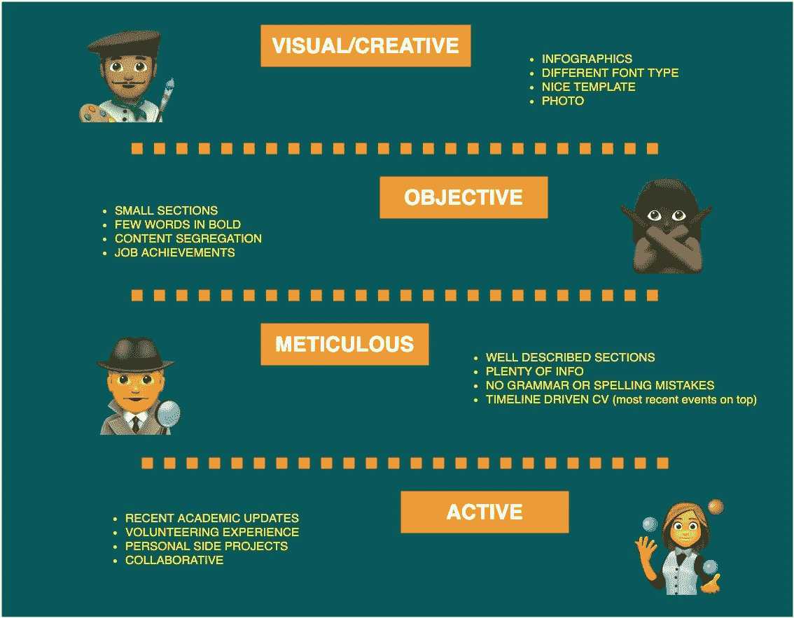

# 找不到工作？你的简历有什么问题

> 原文：<https://javascript.plainenglish.io/lost-your-job-due-to-the-coronavirus-34582905aff5?source=collection_archive---------7----------------------->

Photo by [Sebastian Herrmann](https://unsplash.com/@officestock?utm_source=unsplash&utm_medium=referral&utm_content=creditCopyText) on [Unsplash](https://unsplash.com/s/photos/deal?utm_source=unsplash&utm_medium=referral&utm_content=creditCopyText)

众所周知，疫情冠状病毒是过去几个月失业人数增加的主要原因。因此，许多人更新他们的简历，以便找到一份新工作。

尽管我发现向人力资源专业人士、朋友或招聘人员寻求简历修改/反馈是非常健康的，但我注意到，当面对相互矛盾的建议时(加头衔/不加头衔、经验优先/学术优先、推荐信/无推荐信、签证状态/无签证状态)，人们往往会感到非常困惑。正因为如此，我决定写一篇关于简历内容的意义的文章，而不是在简历中改变什么。这样你就可以自己决定为了实现你的目标要做出什么样的改变。

不要听别人的劝告。有自己的身份。

我从那些需要来自不同群体的简历反馈的专业人士那里听到的最大抱怨之一是，他们最终得到了太多相互矛盾的建议。结果，因为他们想要实现新的想法，他们最终拥有一份没有适当身份的简历。

> 在这种情况下，简历身份是我们在阅读申请人简历时对他们的印象。

简历中的身份是招聘经理通过阅读就能了解你的个性。当有人建议修改你的简历时，问题在于他们通常是基于他们自己的身份或者他们期望在简历中看到的东西，而这些并不总是符合你的简历。

**你的简历能告诉我们你的什么信息**

即使有一些技巧可以帮助你写一份好的简历，也没有一个特定的公式可以达到完美。这完全是关于角色、公司和你自己。我花了大量时间阅读简历，所以我收集了一些有趣的简历细节，这些细节可能会让我对申请人的特点有所了解:

1.  创意:这类人倾向于在简历中做大量视觉上的改变。它通常包含不同的字体、漂亮的颜色组合、独特的内容组织、每页一致的标题、通过信息图表汇总的数据等。他们通常是设计师、艺术家、创作者、前端开发人员、营销人员等。
2.  目标:这一类的人往往非常直截了当，他们的重点是突出与他们职业相关的信息。他们的简历简单易懂。这一类别没有确切的专业类型，但它能告诉我们很多关于申请人的个性。
3.  一丝不苟:这一类的专业人士倾向于对他们的内容进行描述，不太可能有语法或拼写错误。他们的简历可能很难阅读，但当需要在两个不同的候选人之间做出决定时，过多的信息可能很重要。他们在商业分析师、项目经理、质量保证专家等中很常见。
4.  主动:这些专业人士似乎永远不会停止。他们总是参与培训、会议、课程、志愿活动、附带项目等。他们的简历中有时会有比专业经验更多的额外活动。虽然这是领导者和更有经验的专业人士的共同特征，但也可以在乐于学习的同事身上看到。

显然，我们在阅读简历时倾向于不带偏见，但我必须承认，如果我阅读一份前端开发人员的简历，并且它是用白色的普通文档写的，我会感到惊讶。

**应用两分钟阅读测试**

不言而喻，你的简历只是一堆文件中的另一份，因此，你不应该期望招聘经理花太多时间阅读它。你需要做的是确保你的简历在最初的 2 分钟内尽可能地具有可读性。你可以这样做:

1.  建立你的简历时，要考虑你想传达什么样的形象。
2.  花两分钟看完你的简历后，让别人告诉你他们能告诉你什么。
3.  如果大多数人带着和你期望的一样的形象回来，那么你就有一份好的简历。如果没有，我建议你修改一下。
4.  如果人们不能在 2 分钟内读完，那么我会建议你修改简历中的改动。

**记住**总是好的

1.  不要撒谎。
2.  使其易于阅读。没有必要删除信息，但突出重要的。
3.  不要要求别人纠正一切。通过简历比在面试中更好地了解你的语法限制。
4.  不要加太多粗体字/句子。而不是突出信息，这将使你的简历混乱。

**总结一下**

虽然人们对如何写简历有很多建议，但更重要的是理解这些变化的意义以及它们将对读者造成的影响。了解这一点可能正是你需要给求职申请的下一位读者留下深刻印象的。