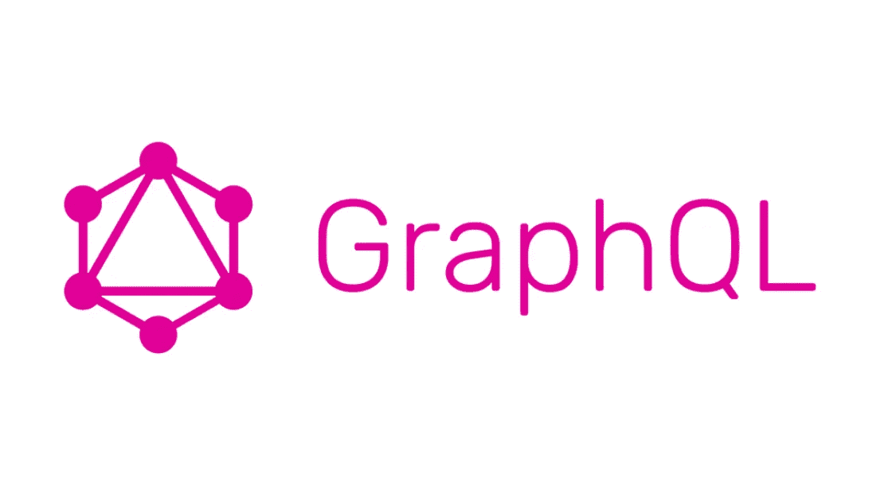
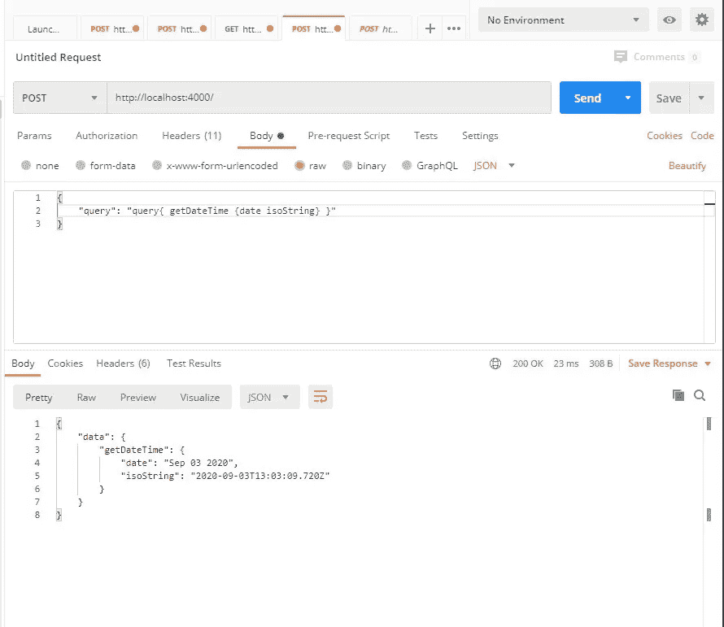
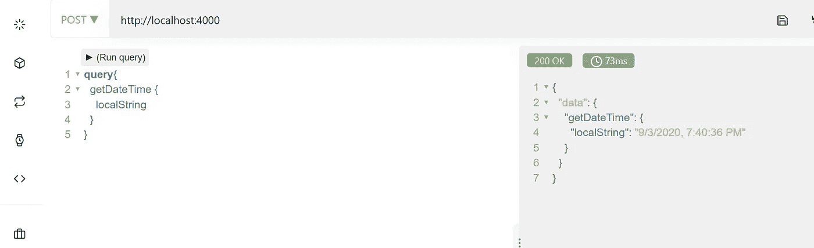

# 爱图表胜过爱休息

> 原文：<https://javascript.plainenglish.io/loving-graphql-more-than-rest-4e213c568635?source=collection_archive---------12----------------------->

自从脸书开源 GraphQL 以来，它的受欢迎程度一直在不断增加，今天几乎无处不在。但是是什么让它如此受欢迎呢？它与基于 REST 的架构相比如何，它会完全取代 REST APIs 吗？以下是我对 GraphQL 的一些看法

当我刚开始学习 GraphQL 的时候，对这个一无所知。我已经有了这样的想法，我将学习一些与 Rest APIs 世界完全不同的东西。但是在我学习 GraphQL 的中途，我意识到甚至在开始学习它之前，我就已经产生了一些非常不切实际的想法，其中最大的想法是

GraphQL 是一个独立的东西，它没有使用我们在 REST APIs 中真正熟悉的东西。

这与现实相差甚远，也很有趣，但对于那些从未接触过 GraphQL，只是看到它在表面上工作的人来说，这就是它的样子。

## 那么 GraphQL 到底是什么呢？

如果我现在用最简单的术语来定义它，我会说它只是一个**规范**。一种非常酷的使用现有网络技术的方式。在幕后，GraphQL 查询只是一个对 API 端点的 HTTP Post 请求。是的，它是对一个端点的 Post 请求，该端点被设计成处理包括 GraphQL 查询的请求，让我们通过构建一个 GraphQL 服务器来快速地看一个例子

为了简单起见，我将使用 Node，但是因为 GraphQL 本身就是一个运行时。我们用什么语言来构建 API 并不重要。让我们快速安装依赖项

`yarn add apollo-server moment`

并构建一个简单的 GraphQL API

运行查询

## **等等，这不是在 GraphQL 中运行查询的方式！**

是的，完全正确，如果你曾经接触过 GraphQL playground，你就会知道，但这就是我上面所说的。在幕后，一个 GraphQL 客户端(考虑 GraphQL playground)向指定的 API 端点/通道发送一个 post 请求，其主体与上面类似。GraphQL 运行时已经知道如何处理请求，因为它对将要获取和发送回的数据有一种模式感。

然而，这通常会导致一个意想不到的行为，当你返回一个你没有在类型定义中指定的值时，GraphQL 会尝试自动类型转换这个值，如果它不起作用，就会爆炸。

*快速提示——对 GraphQL API 的每个请求都被归类为一个查询，包括变异、订阅和查询本身，如果你知道它们是什么的话。*

## Schema 是 GraphQL 如此强大的唯一原因吗？

不，还有更多，真的有更多，GraphQL 为您的 API(尤其是客户端)带来了更多的功能，它允许它们只查询特定的字段，因此它们只能查询所需的数据，而忽略其余的，这导致了更小的传输大小、更少的带宽和延迟。让我们从上面对我们的代码进行更改，并看看它的运行情况

我们向类型 dateTime 添加了另一个字段，这次我们不想查询其他两个字段。这真的非常简单，我们所要做的就是在发出如下请求时指定我们感兴趣的字段

对于一个小的应用程序来说，这并没有增加多少。但是对于一个大的应用程序，你总是想要最优的解决方案。只查询必需字段的想法本身就非常强大，因此它一直是传统 REST 架构中的一种模式，也为检索某些特定数据制定路线。这对于一个小的应用程序来说没有问题，甚至在理论上也没有问题，但是随着应用程序变得越来越大(想想脸书)，连接线变得越来越复杂，你最终会遇到这样的情况，你不得不使用 GraphQL 之类的东西重新设计整个系统，或者可能最终构建另一个 GraphQL。

GraphQL 还提供了更多更酷的东西(比如订阅)，但这些可以留到以后的文章中讨论，因为我想讨论 GraphQL 是否比传统的 REST APIs 更好。

## GraphQL 真的是更好的 REST 并且要完全取代它吗？

我同意 GraphQL 是 rest 的一个更好的版本，它是 REST 的一个非常强大的替代品，但它不会在今天或短期内取代 API。这有几个原因。主要的是

对于一个小的应用程序来说，REST API 可以做 GraphQL API 能做的几乎所有事情。

*因为 GraphQL 允许客户端只查询他们需要的字段，所以给客户端带来了更大的能力。但是这个强大的特性牺牲了服务器端的性能，如果客户端请求大量的嵌套字段，需要多个资源，比如从文件系统或数据库中读取。有数以百万计的此类请求，而您的服务器无法快速扩展，您最终会耗尽资源。*

以上原因就是为什么在**企业界，GraphQL APIs 是和 REST API 结合使用的。**

## GraphQL 的个人体验

在个人层面上，GraphQL 是我构建 API 时的首选，现在我真的还没有构建过任何不包含 graph QL 的东西。仅仅是因为它增加了一个更好的全栈 DX。

你做到了最底层！感谢您的阅读。

## 简单英语的 JavaScript

你知道我们有三份出版物和一个 YouTube 频道吗？在 [**寻找一切的链接 plainenglish.io**](https://plainenglish.io/) ！