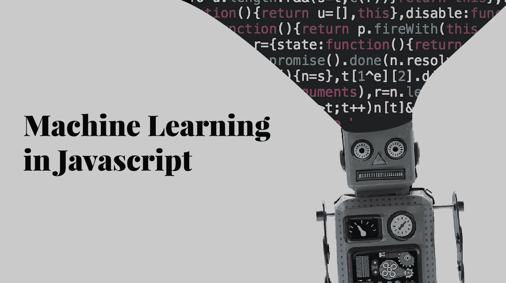
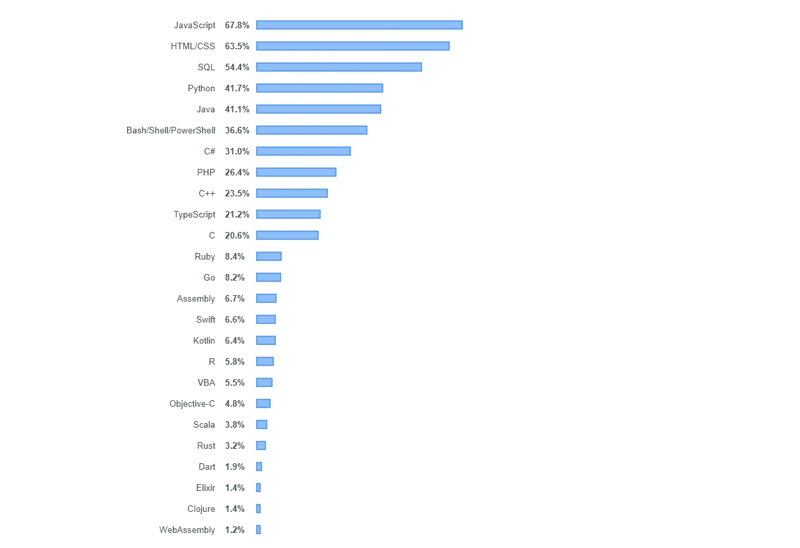
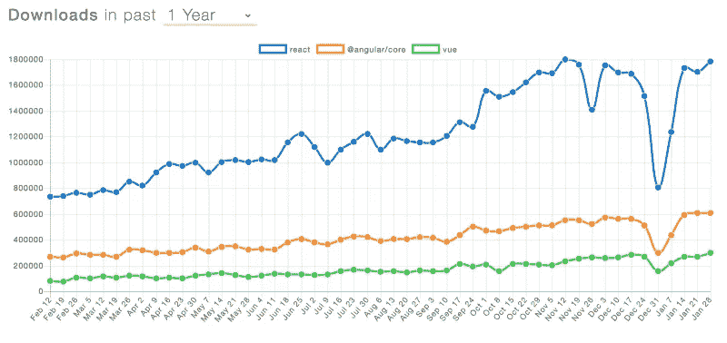

# 用 ML5 进行机器学习。JS-第一部分

> 原文：<https://javascript.plainenglish.io/machine-learning-with-ml5-js-part-i-9991f7d2538d?source=collection_archive---------6----------------------->



> 我试图在几个部分探索 JavaScript 的机器学习和可能性。如果你知道机器学习的基础知识，并且想直接进入编码领域，这将在第二部分(待更新)。尽管如此，我还是建议阅读第一部分，复习一下你的知识。我已经试着让它尽可能简单。让我们直接开始吧。

一段时间以来，机器学习和 JavaScript 一直是一个热门话题，而且似乎并没有减少其受欢迎程度。看来在未来的一段时间内，它们仍将是计算机专业人士谈论最多的话题。

让我们来看看使用 JavaScript 的机器学习，但是首先**为什么使用 JavaScript** ？

*   容易接近
*   简单学习曲线
*   快速原型
*   大生态系统

JavaScript 很容易访问。你有一个浏览器，你可以在你的浏览器上写 JavaScript。这种语言很容易学习，与其他语言相比，它的原型开发速度非常快。此外，JavaScript 在开发人员社区中的受欢迎程度呈指数级增长。



Source: [https://insights.stackoverflow.com/survey/2019#technology](https://insights.stackoverflow.com/survey/2019#technology)

JavaScript 在 React、Angular 和 Vue 等框架中变得流行起来。React 从 2017 年的 708，421 个用户增长到 2018 年的 1，789，699 个用户，变化百分比为 152.2%。同样，Angular 从 229，375 名用户增长到 609，087 名用户，比去年的记录增长了 165.5%。Vue.js 的增长率最为显著，为 397.4%，在短短 1 年内从 60283 用户增长到 299840 用户。你可以猜到 JavaScript 在几年内有多流行。



Source: [https://jsreport.io/javascript-frameworks-by-the-numbers-winter-2018/](https://jsreport.io/javascript-frameworks-by-the-numbers-winter-2018/)

机器学习以对深度学习的介绍为人工智能领域带来了希望。深入研究机器学习，我们必须了解更多根据目的分类的机器学习算法的类型。

*   监督学习
*   无监督学习
*   半监督学习
*   强化学习

# 监督学习

监督学习算法使用带标签的训练数据集来学习将输入变量 ***X*** 变为输出变量 ***Y*** 的映射函数。它在下面的等式中求解 ***f*** :

```
Y = f(X) // solves for f
```

下面我们来看看不同类型的监督学习:

***分类*** *用于预测输出变量为类别形式时给定样本的结果。例如，分类模型可能会查看输入数据，并尝试预测“好”、“中性”或“坏”等标签。*

***回归*** *用于预测输出变量为实值时给定样本的结果。例如，它可以处理输入来预测雨滴、物体的长度等。*

***集合*** *是监督学习。它意味着将多个单独表现较弱的机器学习模型的预测结合起来，产生一个结果。用随机森林打包，用 XGBoost 增强就是其中的例子。*

监督学习的例子:

*   线性回归
*   逻辑回归
*   手推车
*   朴素贝叶斯
*   k-最近邻(KNN)

# 无监督学习

当我们有输入变量但没有相应的输出变量时，使用无监督学习模型。在该模型中训练未标记的数据。当一个人类专家不知道在数据中寻找什么时，这种学习是有用的。它们主要用于模式检测、描述性建模、汇总一组数据，最终提供有意义的见解，并以一种美丽的方式描述数据。

无监督学习是一种描述性模型，包括聚类算法和关联规则学习算法。让我们看看一些不同的无监督学习:

***关联*** *是寻找一个集合中项目同现概率的过程。它主要用于购物篮分析。例如，一个关联模型发现，如果客户购买啤酒，他购买鸡蛋的可能性会增加 70%。*

***聚类*** *用于分组样本，使同一聚类内的对象与另一聚类内的对象相似。*

***降维*** *是通过获得一组主变量来减少所考虑的随机变量的数量的过程。简而言之，它用于减少数据集的变量数量，确保重要数据仍然存在。它可以用特征提取方法和特征选择方法来实现。特征选择选择原始变量的子集，而特征提取执行从高维空间到低维空间的数据转换。*

无监督学习的例子有:

*   推测的
*   k 均值
*   主成分分析

# 半监督学习

半监督学习介于监督学习和非监督学习之间。数据集中没有所有观测值的标签，或者标签存在。在实际情况下，贴标签的成本通常很高，因为这需要熟练的人类专家。因此，半监督学习在大多数没有标签的情况下是有用的，但在少数情况下是存在的。

# 强化学习

强化学习允许模型根据其当前的学习状态和行为来决定最佳的下一步行动。强化学习算法又称代理以迭代的方式不断地从环境中学习，并从环境的经验中学习，直到它探索所有可能的状态，这些状态将最大化回报并最小化风险。

通过一系列的步骤，在试错的基础上给出最好的结果。例如，视频游戏场景。在电子游戏中，玩家需要移动才能得分。强化学习算法玩游戏，并随着时间的推移随机移动，对获得的分数进行各种奖励。它使游戏中的玩家朝着正确的方向移动，以最大化地获得尽可能多的分数。一辆自动驾驶汽车，机器人手是一个现实世界的应用。

强化学习的例子有:

*   q 学习
*   时差
*   深层敌对网络

## 你学到了什么？

您了解了为什么 javascript 是可能的，以及不同类型的学习过程和算法。它为你的知识创造了基础。

## 下一步是什么？

我们看了机器学习算法的基础。让它深入人心。让我们很快在第二部分见面。