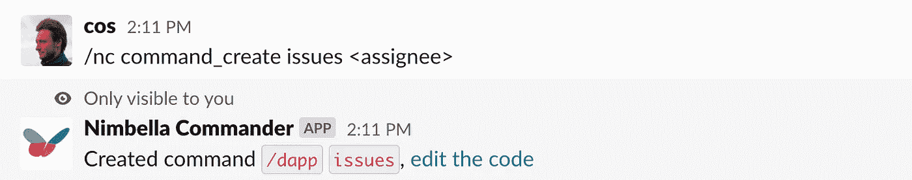
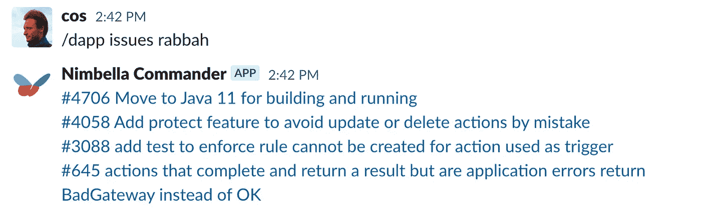

# 使用 JavaScript 创建一个定制的 Slack 命令

> 原文：<https://javascript.plainenglish.io/make-a-custom-slack-command-using-javascript-b91615689895?source=collection_archive---------6----------------------->


Photo by [Tung Minh](https://unsplash.com/@tshusi?utm_source=medium&utm_medium=referral) on [Unsplash](https://unsplash.com?utm_source=medium&utm_medium=referral)

## 这个命令只是一个使用 Apache OpenWhisk 执行的 JavaScript 无服务器函数。

一个朋友创办的公司 Nimbella 刚刚推出了 [Commander](https://nimbella.com/resources-commander/overview#what-is-commander) ，这是一个可以快速创建定制 Slack slash 命令的漂亮工具。

这些命令是使用 Nimbella 的无服务器基础设施执行的 JavaScript 片段，该基础设施基于[Apache open whish](https://github.com/apache/openwhisk)(Nimbella 的人员是贡献者)。因此对该命令的功能没有什么限制。

假设我们需要一个 Slack 命令来显示分配给特定用户的所有未解决的 GitHub 问题。是的，你可以在 GitHub 的界面上这样做，但是需要几次点击。每次都是。仅仅在一个松弛的频道里会很好吗？

我们只需要 4 个小步骤就可以做到。

# 1.将 Nimbella Commander 应用添加到你的 Slack 中

只需点击“添加到时差”按钮[这里](https://unhackai.slack.com/apps/AS833QXL0-nimbella-commander)。它玩得很好，只要求最低限度的权限来完成它的工作。

# 2.在松弛通道上初始化应用程序

转到您想要使用它的 Slack 通道，并运行:

```
/nc dapp_add
```

据我所知，这个步骤为你的频道添加了一个默认的 Commander Slack 应用。然后它将作为`/dapp`可用。如果你想要不同的名字，你可以按照这些步骤创建一个单独的 Slack app [。](https://nimbella.com/resources-commander/guide#create-manage-custom-apps)

# 3.创建函数

我们称它为`issues`，我们希望它将 github 用户作为`assignee`参数。

```
/nc command_create issues <assignee>
```



“编辑代码”链接将带您进入函数的内容。

这里有一点样板文件，但是我们关心的是`_command`的主体。我们将用调用 GitHub API 并返回分配给`assignee`的开放问题的 JS 代码来替换它。很简单，就是普通的 JS。

The code for getting issues for a particular user from [Apache OpenWhisk](https://github.com/apache/openwhisk), the open-source serverless infra Nimbella builds upon. Replace `repo` with yours. Also, yes, living dangerously, no error handling.

最后，调整`_command`函数的返回，使`text`字段成为`formatted_result`而不是占位符字符串。

# 4.我们完了。哦，只需点击“保存”:-)

我们来测试一下。在 Slack 内部，我们运行:

```
/dapp issues rabbah
```



它向我们展示了这个 OpenWhisk dev 还没有解决一些老问题:-)

以上所有对于开源回购来说都很有效。如果你的回购是私人的，你需要向 GitHub 认证，你可以将 GitHub 认证令牌保存在 Nimbella 的[加密密钥管理器](https://nimbella.com/resources-commander/guide#secrets)中。

还有其他几个很酷的功能我还没有涉及到，包括[触发器](https://nimbella.com/resources-commander/guide#triggers)、[自定义应用](https://nimbella.com/resources-commander/guide#create-manage-custom-apps)(这样你就不会被`/dapp`卡住)，以及[用户角色](https://nimbella.com/resources-commander/guide#create-manage-user-roles-groups)。

**编辑:** [现成的命令你只需插入即可。](https://github.com/nimbella/command-sets)

## 资源

*   [Apache OpenWhisk](https://github.com/apache/openwhisk) ，底层无服务器框架
*   [快速入门](https://nimbella.com/resources-commander/quickstart#quickstart)，展示了如何创建一个简单的命令，正如我上面所做的，以及如何安装其他现有的命令
*   [开发者指南](https://nimbella.com/resources-commander/guide#developer-guide)，文档的精华
*   [命令参考](https://nimbella.com/resources-commander/reference#command-reference)