# 使用代码沙箱+堆栈位在 2 分钟内创建一个现代化的 React 站点

> 原文：<https://javascript.plainenglish.io/make-a-modern-react-site-in-2-min-using-code-sandbox-stackbit-18e83c296073?source=collection_archive---------0----------------------->

## 在这篇短文中，您将学习使用 CodeSandbox + Stackbit 来创建一个带有主题和 CMS **的 React 网站！**😲

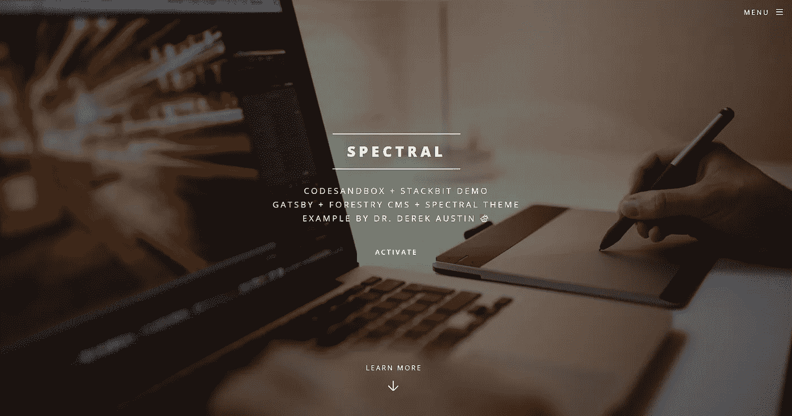

Make this React.js website in under 2 minutes

# 在您的浏览器中尝试现场演示，就在这里，🥳

# 步骤 1:在 CodeSandbox.io 上创建沙箱

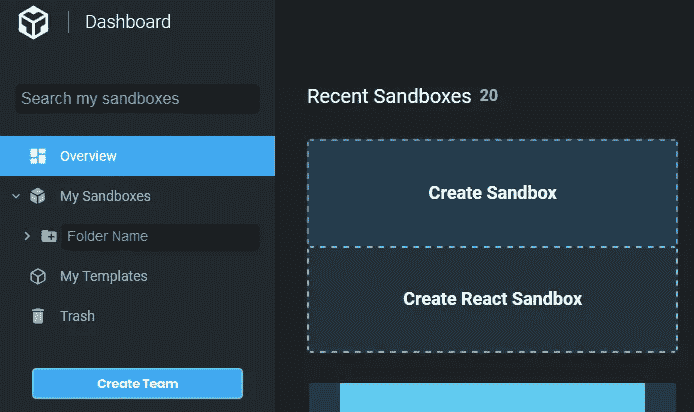

# 第二步:导入→堆栈位→生成沙盒

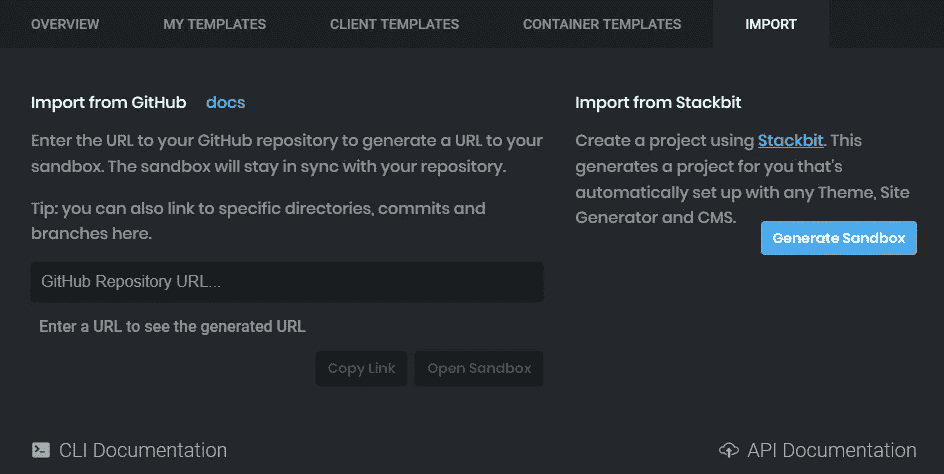

# 步骤 3:在堆栈位中选择主题和 CMS

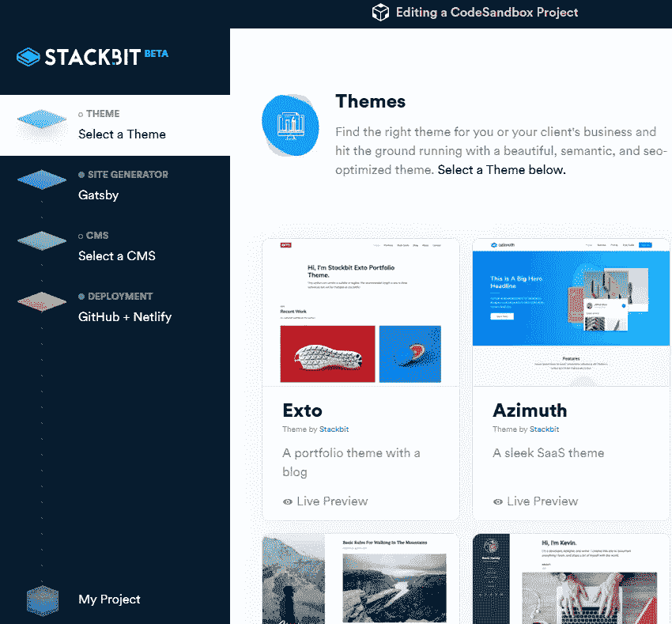

我个人在这个例子中使用了 Gatsby、Forestry.io 和“spectral”主题的组合。林业看起来像是一个整洁的轻量级的、无头的 CMS，从 [https://forestry.io](https://forestry.io) …盖茨比是超级的。

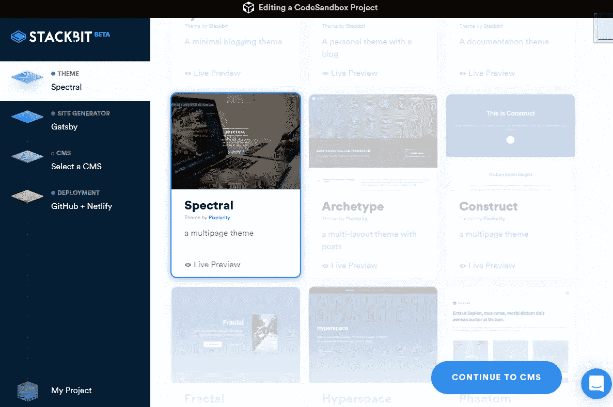

选择主题后，你会被要求继续 CMS。

站点生成器(或 SSG —静态站点生成器)被预选为 Gatsby:

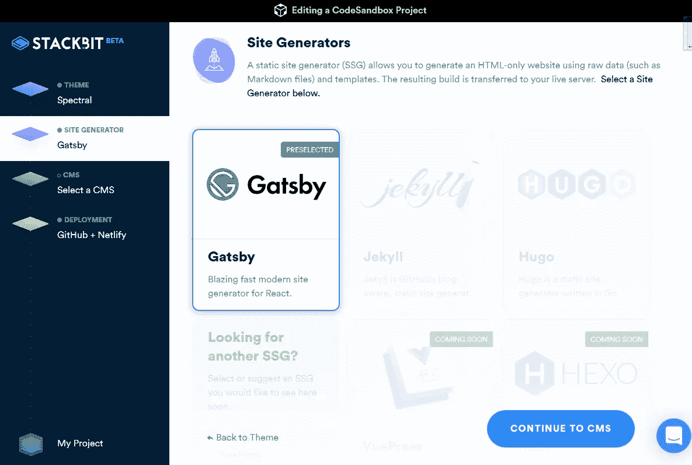

在内容管理系统(CMS)选择屏幕上，目前有两个选择(2019 年 8 月):Forestry 或 Netlify CMS。

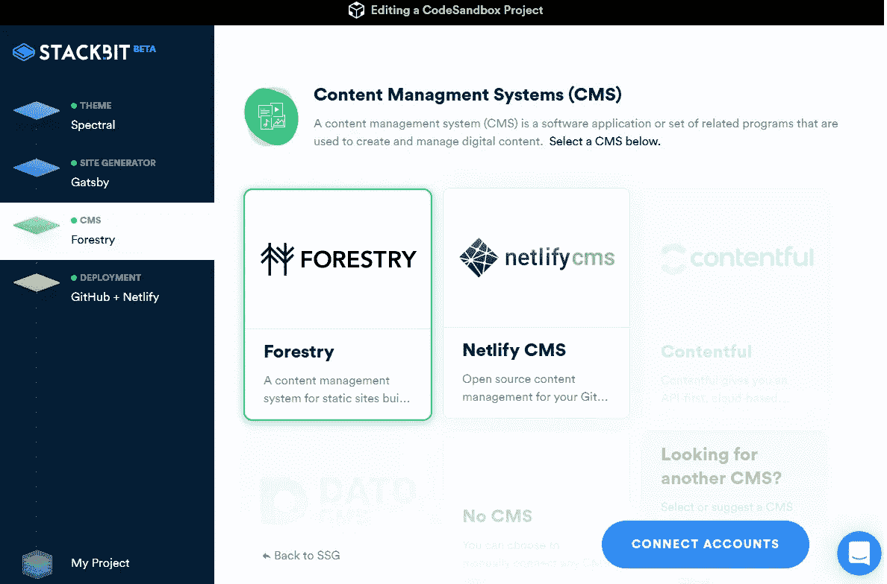

如果你正在使用 Forestry，你必须连接你的帐户，因为 Forestry 是一个远程管理 CMS——你登录 forestry.io 来编辑你的站点。同样，连接你的 Github 帐户，然后创建你的项目！

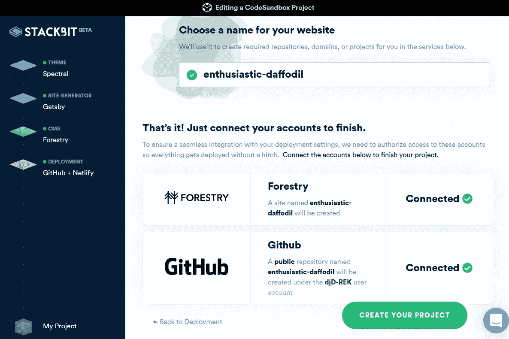

# 第四步:你的网站可以编辑了！

登录 forestry.io 就可以更改内容…林业我用的不多，但是好像很棒！！超级容易使用进行更改。

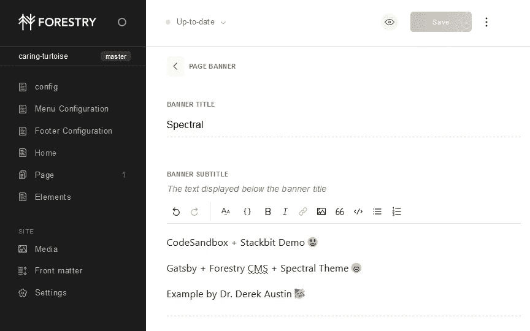

If you chose Forestry as your CMS, then editing the content of your website is managed at forestry.io

# 第五步:回到真正的开发

对开发者来说，推出新网站一直是一项枯燥、重复的任务，直到现在！使用 CodeSandbox + Stackbit 可能意味着多花一两个小时制作你的原型，而不是仅仅运行 *yarn* 😊

# 额外的例子:Netlify CMS

网站开头的例子是用林业制作的。这里有一个相同主题的 CodeSandbox，但是有 Netlify CMS 作为比较:

如果你使用 Netlify CMS，你会收到一个邀请加入 CMS 的电子邮件链接，这个链接是基于你的 GitHub 帐户所连接的电子邮件地址。

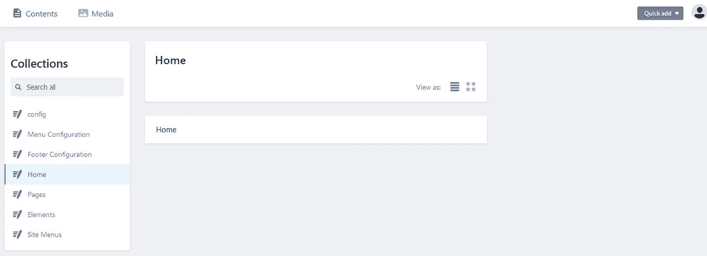

If you chose Netlify CMS, then editing the content of your website is managed at netlify.com

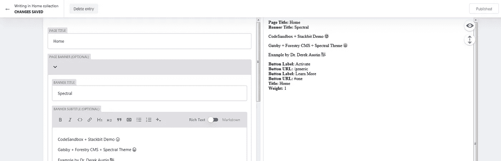

You’ll notice the setup of the spectral theme is identical in both Forestry CMS & Netlify

德里克·奥斯汀博士是《职业编程:如何在 6 个月内成为一名成功的 6 位数程序员》一书的作者，该书现已在亚马逊上出售。