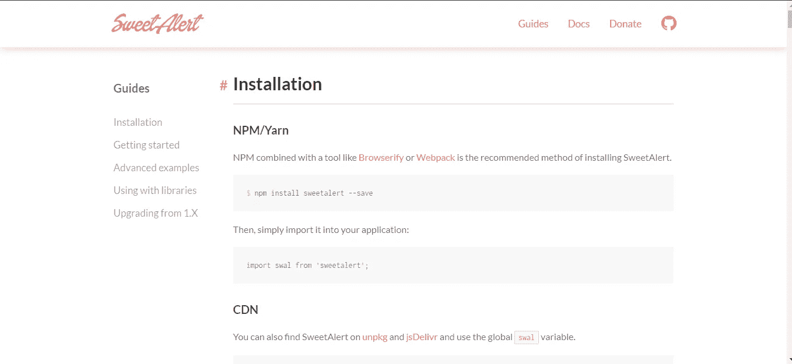
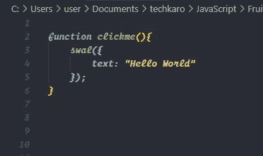
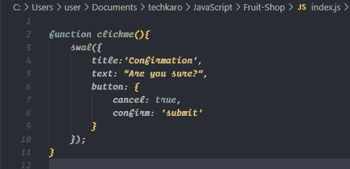
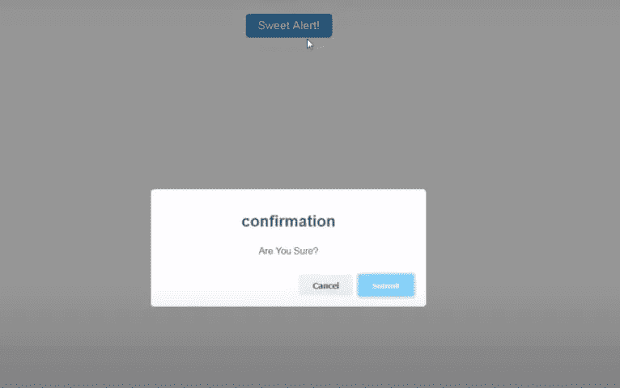
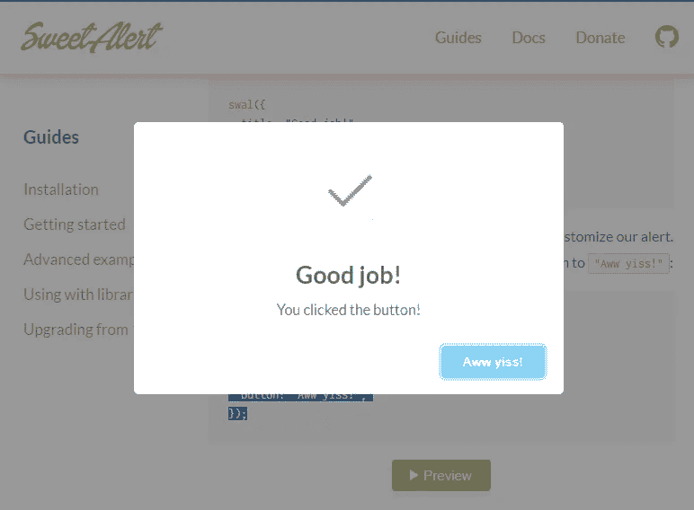

# 用“甜蜜警告”制作引人注目的 JavaScript 弹出窗口

> 原文：<https://javascript.plainenglish.io/make-eye-catching-javascript-popups-with-sweet-alert-470e05ed026d?source=collection_archive---------11----------------------->

## 一个吸引人的用户界面，你可以更好地提醒


Photo by [Sharon McCutcheon](https://unsplash.com/@sharonmccutcheon?utm_source=medium&utm_medium=referral) on [Unsplash](https://unsplash.com?utm_source=medium&utm_medium=referral)

在这篇文章中，我们将探讨和谈论**甜蜜警报**一个 JavaScript 插件，将您的简单警报弹出窗口变成一个非凡的。Sweet Alert 也可以定制，用作输入对话、确认对话等等。我们去看看。



[**甜蜜警报器**](https://sweetalert.js.org/guides/) **t** 的官方页面，在这里可以尝试现场试玩。现在让我们添加最新发布的 **CDN** 链接，并将带有脚本标签的 Sweet Alert `min.js` JavaScript 链接导入到您的网页中。这里是 CDN。

```
<script src="https://unpkg.com/sweetalert/dist/sweetalert.min.js"></script>
```

**SWAL** 代表甜蜜警报，现在让我们从基本的警报弹出窗口开始。我将调用按钮点击事件中的 **SWAL** 函数。然后传递我们想要显示的警告消息，就这样。



Example of SweetAlert

如果您想要一个简单的弹出窗口，这真的很容易，您也可以将标题文本作为第一个参数传递。现在，对于更复杂的问题，如**确认对话**，我们将需要像这样将选项传递给 Sweet Alert，一个标题和一个带有确认消息“您确定吗？”的文本或者任何你想要的东西。



我们可以自定义按钮。首先让我们添加 cancel 按钮，将其设置为 true 以启用 cancel 按钮，另一个是带有文本 submit 的 confirmed 按钮。这是输出。



Sweet Alert 也可以接收用户输入的文本，只需将内容设置为输入即可。你也可以使用图标，比如**成功**、**警告**等等。

```
swal({title: "Good job!",text: "You clicked the button!",icon: "success",button: "Aww yiss!",});
```



这就是 [**甜蜜预警**](https://sweetalert.js.org/guides/) 的基本情况，你可以通过改变 **CSS 进一步定制适合你网站的主题。你可以在指南的官方网站上找到更多相关文档。**

希望你们喜欢这篇文章，感谢阅读。

也看看我的其他文章吧！这也和 **JavaScript** 有关。

[](https://medium.com/javascript-in-plain-english/should-i-use-map-or-foreach-in-javascript-af9da3b4adc3) [## JavaScript 中应该用 map()还是 forEach()。

### 了解何时使用哪种类型的数组方法

medium.com](https://medium.com/javascript-in-plain-english/should-i-use-map-or-foreach-in-javascript-af9da3b4adc3) [](https://medium.com/javascript-in-plain-english/hectic-javascript-interviews-questions-8fdf7ddd0e53) [## 忙乱的 JavaScript 面试问题！

### JavaScript 是异步的还是同步的？JavaScript 是如何工作的？

medium.com](https://medium.com/javascript-in-plain-english/hectic-javascript-interviews-questions-8fdf7ddd0e53) 

# 资源

[](https://sweetalert.js.org/guides/) [## SweetAlert

### NPM 结合 Browserify 或 Webpack 等工具是安装 SweetAlert 的推荐方法。然后，简单地…

sweetalert.js.org](https://sweetalert.js.org/guides/) 

编码快乐！👩‍💻