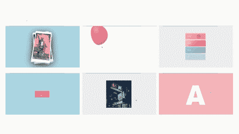
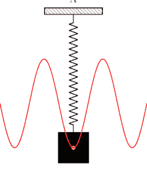
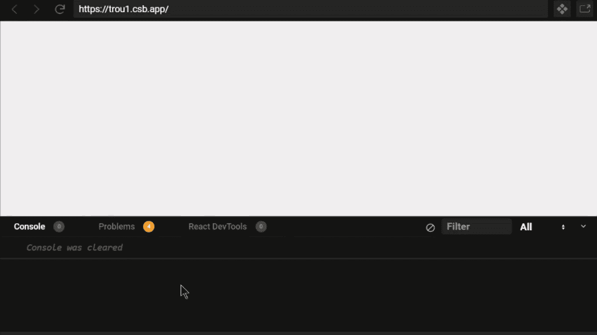
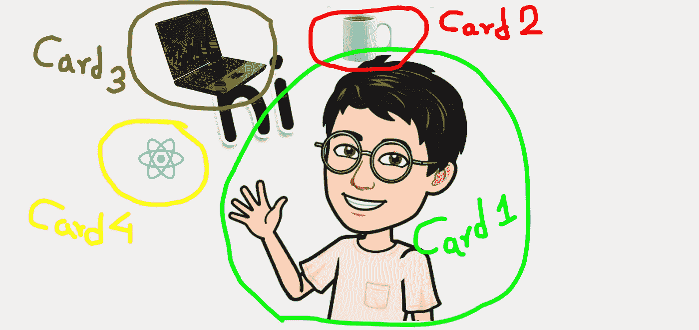

# 使用 React Spring 制作基于物理的动画

> 原文：<https://javascript.plainenglish.io/make-physics-based-animations-with-react-spring-bf49e195752f?source=collection_archive---------2----------------------->



我们都喜欢一个物体看起来有视觉吸引力，而不是静止不动，这完全取决于个人偏好，但我更喜欢它的原因是，它是一种向观众表达你的设计所传达的信息的方式。

自上个世纪以来，我们一直在用动画来娱乐、宣传和讲述能唤起情感的故事。在我们当前的世界中，通过技术的掌握，讲故事和交流情感变得再容易不过了。

在这篇文章中，我们将看到一个叫做 **React Spring** 的惊人的库，它不仅使控制基于组件的动画变得超级容易，而且还提供了*钩子*，可以用一行代码将任何数据转换成动画数据。

# 我们将建造什么？

因为互动和同时学习是最好的学习策略！我们将基于 React Spring 的`useSpring`钩子构建一个迷你项目。结果会是这样的-

这是最简单的，任何你想要编辑或动画的值或属性！只要把它扔进`useSpring`里，它就会帮你做好。您所要做的就是将输出放到您的视图中。

# 什么是 React Spring？

在所有制作组件动画的传统方法中，我们都没能实现惊人的自由动画。换句话说，React 将总是渲染动画的每一帧，从而使它有点慢，不那么平滑。


> React-spring 是一个基于 spring 物理学的动画库，应该涵盖了你的大部分 UI 相关的动画需求。它给你足够灵活的工具来自信地将你的想法投射到移动界面中。

使用 React Spring 的全部目的是通过为您提供更好的体验以及更快的交付和令人难以置信的性能，让您在动画中占据上风。

# 为什么基于物理的动画更好？

基于物理的动画是任何物理实体的模拟如此自然互动的原因。它们经常被用来模仿复杂的、受身体启发的行为。

我们不再考虑**持续时间**或**缓和曲线**，取而代之的是，我们关注实际的物理属性。React Spring 在其所有动画中大量使用了这种逻辑，这就是为什么它被认为像其他真实世界的属性一样工作。



*嗯，迷茫？让我给你解释清楚。想象你从一座建筑上垂直向下扔一个球，球不会问你它应该在多长时间后到达底部，对吗？相反，我们会让物理来说话。这同样适用于反作用力弹簧。*

**想自己试试吗？**继续并 [*检查他们提供的文档*](https://www.react-spring.io/docs/hooks/examples) 。实际上，你会发现所有的例子都是动态的，不以任何方式依赖于时间。你可以点击它们，移动它们，拖动它们，玩它们，它们会像真实世界一样自然流动。

然而，在传统方法中(不依赖于基于物理的动画)，如果过渡/动画已经在运动，则需要您处于闲置状态，这意味着在处理过渡时，您不能单击或做任何其他事情。

# 在项目中安装 Spring

首先，我们首先需要安装库，以便能够在我们的项目中使用它。这就像通过 CLI 安装任何其他软件包一样简单。你可以选择

`npm install react-spring`或`yarn add react-spring`

这取决于您的软件包管理员。你也可以使用任何其他的包管理器来安装，只要确保你输入库名为`react-spring`，你就可以开始了。

# 了解使用 Spring

`useSpring`非常受欢迎，因为它能够将任何传入钩子的值转换成动画值。这个钩子常用的方法是:

*   覆盖先前的值以产生新的值，从而改变动画属性

```
const value = useSpring({overwritingValue: property ? 1 : 0})
```

*   通过使用 **set，将函数作为参数直接传入钩子，并使用返回值更新动画属性。**

```
const [value, set] = useSpring(() => ({returnsValue: 1}))set({returnsValue: property ? 1 : 0}) *//Update using returned value*
```

*   在视图中使用返回的动画值

```
return(
    <animated.div style={value}> In the View </animated.div>
);
```

# 拿钩子

先来导入几个必备品。我们将需要这个项目中的鼠标事件，因为它将是一个视差取决于当前屏幕上的光标的 X 和 Y 坐标。`useSpring`是我们要制作动画的钩子。

# 定义我们的职能

因为我是在`index.js`内部设计这个项目，所以我更喜欢把它命名为**视差**，这样我就可以直接从**反应堆**中渲染它。如果您正在使用另一个子组件或在`App.js`中使用，请随意。

我们制作这个**视差**函数的目的是使用我们的`useSpring`钩子返回`props`和`set`方法调用，因为我们将创建自己的算法来根据我们的意愿移动对象。

当我们在屏幕上移动时，`clientX`和`clientY`捕获鼠标的当前 **X** 和 **Y** 坐标，`set`方法通过将 **X** 和 **Y** 的值发送给`calc`函数来更新属性`xy`。



# 弹簧插值

因为`useSpring`给了我们动画值！在我们的实际视图中，除了用 CSS 属性对其进行插值之外，没有其他方法可以使用它。弹簧插值的一个快速示例是

因为对于这个项目，我们计划在我们的视图中有四个对象，我们打算创建一个视差效果，我们需要想出一些关于如何让这些对象在接收到那些 **X** 和 **Y** 坐标时移动的想法，现在我们已经把它们存储在`xy`中了。

基于我们的坐标在 3D 空间上重新定位对象的最好方法是使用属性`translate3d`，相对地在与鼠标光标相同的方向上移动。它产生一个变换函数，使物体在一个给定的方向上移动。

***注*** *:这些值不是固定的(x/10，x/8+35 等)，你可以使用你喜欢的任何值，这些数字对我来说非常适用，所以我在使用它们。这些数字有助于确定鼠标移动时你的对象从左到右的摆动，所以你可以摆弄它们，直到找到满足你需要的东西。*

# 使用动画 div

到目前为止，在我们的项目中，我们已经设置了逻辑，但我们看不到任何东西，因为我们甚至没有四个对象中的一个来进行测试。不要担心，我们将通过在我们的项目中添加所有必要的样式来改变这一点，同时在我们的`styles.css`中将对象作为`background-image`属性插入

理解样式很容易，但是识别卡片就不容易了！让我来帮你。



这是最后一步，我们已经完成了。为了在我们的视图中看到这些卡*(卡 1、卡 2、卡 3、卡 4)* ，我们必须添加那些**四个 div**，并用正确的卡名标记**类名**，并动画显示它们的变换。我们正在扩展`animated`的 div，它允许 react-springs 在 react 之外激活。

## 瞧，给自己拍一下。

如果你喜欢 React Spring 背后的想法，并有兴趣了解它的更多信息。我建议你去看看这个很酷的项目，自己想办法解决。

我希望你在学习中获得乐趣，并在尝试新事物时得到一个方便的项目。如果你有任何疑问，你可以在下面评论，我会尽快联系你。

感谢您阅读本文。✌️和平

## **用简单的英语写的 JavaScript 的注释:**

我们总是有兴趣帮助推广高质量的内容。如果你有一篇文章想用简单的英语提交给 JavaScript，用你的中级用户名发邮件到 submissions@javascriptinplainenglish.com[给我们，我们会把你添加为作者。](mailto:submissions@javascriptinplainenglish.com)