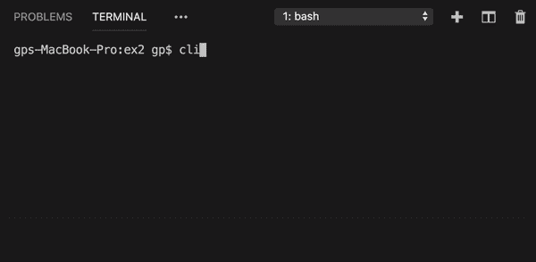
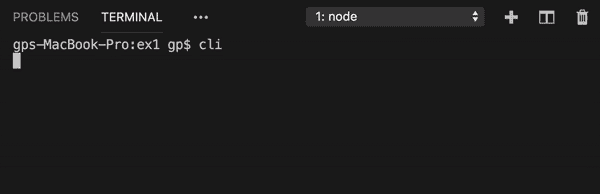

# 用 JavaScript 制作自己的终端(CLI 工具)

> 原文：<https://javascript.plainenglish.io/make-your-own-terminal-cli-tool-with-javascript-c708ea395c0b?source=collection_archive---------1----------------------->



Advanced version CLI



Simple CLI from the scratch

## 您可以每天使用 CLI 程序(如终端、cmd、Powershell 等)进行软件开发。

## 您使用的每一个工具本质上都是其他软件工程师的产品，我们也可以制作自己的 CLI 工具

> 我们自己做 CLI 工具吧~~


Photo by [Greyson Joralemon](https://unsplash.com/@greysonjoralemon?utm_source=medium&utm_medium=referral) on [Unsplash](https://unsplash.com?utm_source=medium&utm_medium=referral)

> 让我们把手弄脏吧

# >首先，让我们制作一个打印“HelloWord”的简单 CLI 工具

*   要创建 CLI，您需要创建两个文件
*   `package.json`:指定设置和配置作为入口点
*   `index.js`:根据 CLI 命令的可执行文件

## Package.json

*配置文件*

```
// package.json{ "name": "node-cli", "version": "0.0.1", "description": "nodejs cli program", "main": "index.js", "scripts": { "test": "echo \"Error: no test specified\" && exit 1" }, "author": "GPLEE", "license": "ISC" }
```

*   在 package.json 中，指定有关当前 CLI 程序的元数据
*   `name`、`version`、`description`、`author`等等

## 索引. js

*可执行文件*

```
// index.js#! /usr/bin/env nodeconsole.log('Hello CLI');
```

*   这个文件只是在控制台上打印出 **Hello CLI**

> 那么，评论的第一行是什么？？

*   在基于 Linux 和 Unix 的操作系统中，T6 不仅仅是一个注释
*   它使用`/usr/bin/env`中注册的**节点**命令命令文件运行
*   然而，在**窗口**中，它只是一个注释

## Package.json

*我们添加****【bin】****属性来实际运行****index . js****文件*

```
// package.json{ "name": "node-cli", "version": "0.0.1", ... ... "license": "ISC",// HERE "bin": { "cli": "./index.js" // FILE NAME & RELATIVE PATH }}
```

*   `bin`属性有可执行文件
*   这类似于键和值对
*   `cli`命令指示运行`index.js`文件

## 运行 CLI

*最后，让我们运行 CLI 在控制台*上打印***Hello CLI***

*   *通过运行`npm i -g`安装 package.json 中的配置*
*   *我们添加了一个名为 **node-cli** 的包，版本为 **0.0.1***

**(您在 package.json 中配置的那个)**

```
*// package.json"name": "node-cli","version": "0.0.1",*
```

*—*

```
*// Terminal console$ npm i -g
+ node-cli@0.0.1
added 1 package from 1 contributor in 0.077s*
```

*   ***仅供参考，**下次在控制台上运行`npm i -g`*

```
*// Terminal console$ npm i - g+ node-cli@0.0.1
updated 1 package in 0.085s*
```

*   *您得到的是`updated 1 package …`响应，而不是`added 1 package ...`结果*
*   ***然后**运行`cli`命令*

**最后* ***你好 CLI！！****

```
*// Terminal console$ cli
Hello CLI*
```

*   *在 Mac、Linux 环境下可能需要追加`sudo`命令(即`sudo cli`*
*   *没有`node_modules`文件夹，因为您没有安装依赖项*

## *CLI 中的 Process.argv*

```
*// index.js#! /usr/bin/env nodeconsole.log('Hello CLI', process.argv);*
```

*   *您可以使用`process.argv`在命令中找到选项*
*   *选项以数组的形式呈现*
*   *每次`index.js`代码更新时**不**需要再次运行`npm i -g`，因为你已经将`package.json`的`bin`属性连接到`cli`命令& `index.js`文件。因此，每次调用`cli`命令时，都可以执行`index.js`文件(它不是来自缓存，因此您可以运行新的更新内容)*

```
*// Terminal console$ cli one two three fourHello CLI [ '/usr/local/Cellar/node/11.6.0/bin/node',
  '/usr/local/bin/cli',
  'one',
  'two',
  'three',
  'four' ]*
```

*   *数组中的**前两个元素**是`node`和`cli`命令的路径。(可能会因 windows 操作系统而异)输出可能会因您的计算机设置&环境而异(这取决于**您在计算机中安装**节点**和 **cli** 命令的位置)***
*   *另外，`one two three four`是作为数组类型出现的*

**

*Photo by [Artem Beliaikin](https://unsplash.com/@belart84?utm_source=medium&utm_medium=referral) on [Unsplash](https://unsplash.com?utm_source=medium&utm_medium=referral)*

# *>第二，通过“用户输入”与用户交互的简单 CLI 工具*

*   *您将使用名为 **readline** 的本地节点模块从用户处获取输入*

```
*// index.js#! /usr/bin/env nodeconst readline = require('readline'); const rl = readline.createInterface({ input: process.stdin, output: process.stdout,});rl.question("How are you doing today? (Happy, Sad)", (answer) => { if(answer === "Happy" || answer === "happy") { console.log("Glad to hear that"); } else if (answer === "Sad" || answer === "sad") { console.log("Hope you feel better tomorrow") } else { console.log("Are you Happy or Sad ?"); }rl.close();});*
```

*   *您使用来自`readline`模块的`createInterface`方法创建`rl`对象*
*   *`process.stdin` & `process.stdout`是控制台输入&输出的流*
*   *`readline`模块接受用户输入并输出以下结果*
*   *`rl`对象`question`方法是向用户提一个问题*
*   *回调函数有一个`answer`参数(用户输入)*
*   *如果所有 I / O(输入&输出)完成，关闭`rl`对象*

> *在这种情况下，我们是否可以通过再次询问用户是否既没有回答“**快乐”**也没有回答“**悲伤”**来改进这个 CLI？*

**

*Photo by [Belinda Fewings](https://unsplash.com/@bel2000a?utm_source=medium&utm_medium=referral) on [Unsplash](https://unsplash.com?utm_source=medium&utm_medium=referral)*

# *>第三，再次询问用户是否回答错误*

```
*#! /usr/bin/env nodeconst readline = require('readline');const rl = readline.createInterface({input: process.stdin,output: process.stdout,});console.clear();const answerCallback = (answer) => { if(answer === "Happy" || answer === "happy") { console.log("Glad to hear that"); rl.close(); } else if (answer === "Sad" || answer === "sad") { console.log("Hope you feel better tomorrow"); rl.close(); } else { console.log("Are you Happy or Sad ?"); rl.question("How are you doing today (Happy, Sad)?  ",     
    answerCallback); }}rl.question("How are you doing today (Happy, Sad)?  ", answerCallback);*
```

*   *使用`console.clear`在程序启动时清除控制台*
*   *然后使用`rl.question`方法询问用户输入&使用`answerCallback`功能得到答案*
*   *如果答案既不是`Sad`也不是`Happy`，则清除控制台并再次递归提问*
*   *如果答案是`Sad`或`Happy`，关闭输入控制台*

> *在这篇文章中，我们练习如何制作一个简单的 CLI 工具，要求用户输入。希望你喜欢阅读它*

*[**更高级的&实用示例可从博客**](http://www.softxml.com/3012/CLI-program-from-scratch) 中获得*

**

*Advanced version CLI*