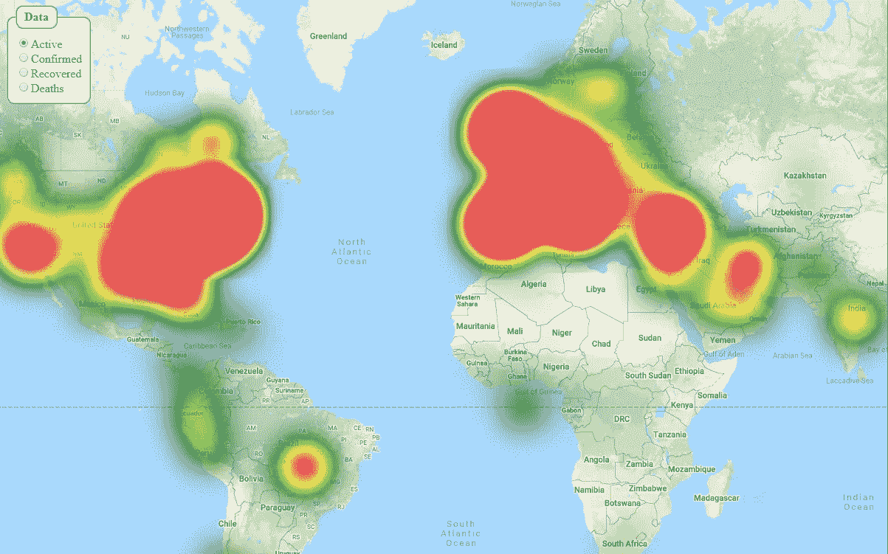

# 使用 Vue 和谷歌地图创建 COVID 地图

> 原文：<https://javascript.plainenglish.io/making-a-covid-map-using-vue-google-maps-89eb70a9f089?source=collection_archive---------8----------------------->



所以我一直使用[冠状病毒地图](https://coronavirus-map.com/)进行每日更新；但我也一直在为谷歌地图制作自己的 Vue 插件，我想我应该测试一下。对于那些正在学习 Vue(中级)或者想要开始自己的(COVID)地图的人来说，这是一个很好的例子。

这就是结果:[资源库(代码)](https://github.com/xon52/covid-map/) | [现场演示](https://xon52.github.io/covid-map/)

# 设置

使用 [Vue CLI](https://cli.vuejs.org/guide/creating-a-project.html) 和默认预设(Babel 和 ESLint)进行非常基本的设置。

我们只是使用带有组件的 *App.vue* 文件，所以我们不需要生成的*视图*文件夹或 *HelloWorld.vue* 组件。我们也没有资产，所以您也可以删除 *Assets* 文件夹。

## [X5-gmaps](https://github.com/xon52/x5-gmaps/)(Vue 的谷歌地图插件)

1.  通过`npm install x5-gmaps`安装
2.  为了让它在 Edge 和 IE 中工作，添加一个[*vue . config . js*](https://github.com/xon52/covid-map/blob/master/vue.config.js)文件，并包含:
    `module.exports = { transpileDependencies: ['x5-gmaps'] }`
3.  [获取一个谷歌 API 密钥](https://developers.google.com/maps/documentation/javascript/get-api-key)
4.  在您的 [*main.js*](https://github.com/xon52/covid-map/blob/master/src/main.js) 文件中导入并[安装插件](https://vuejs.org/v2/guide/plugins.html):

```
// ...
import x5GMaps from 'x5-gmaps'
Vue.use(x5GMaps, { key: GOOGLE_KEY, libraries: ['visualization'] }
// ...
```

## 事件总线

为了在组件之间传递数据，我们将使用一个 [EventBus](https://css-tricks.com/using-event-bus-to-share-props-between-vue-components/) 而不是 [Vuex](https://vuex.vuejs.org/) (你可以将它用于任何比它更大的项目)。我把它叫做 [*bus.js*](https://github.com/xon52/covid-map/blob/master/src/bus.js) 它包含的全部内容是:

```
import Vue from 'vue'
export const EventBus = new Vue()
```

# 成分

我们将只有一个“视图”( *App.vue* ，但它将由两个组件组成: *WorldMap.vue* 和 *MapOptions.vue* 。

## 热图

为了简化起见，我们将把地图覆盖图与 *WorldMap.vue.* 分开。这个覆盖图是 X5-gmap 附带的热图组件，我们称之为 [*HeatMap.vue*](https://github.com/xon52/covid-map/blob/master/src/components/HeatMap.vue) 。

我们从两个 Vue 数据属性开始:`covidDataRaw`(我们下载的原始数据)和`type`(我们映射的数据类型)。

```
data: () => ({
  covidDataRaw: [],
  type: 'active'
}),
```

当组件为`created()`时，我们将使用 [fetch()](https://developer.mozilla.org/en-US/docs/Web/API/Fetch_API/Using_Fetch) 在[Muhammad mustapi](https://medium.com/u/724f7693f760?source=post_page-----89eb70a9f089--------------------------------)的[新冠肺炎-api](https://github.com/mathdroid/covid-19-api) 上获得 COVID 数据。我们还将使用 EventBus 来倾听和响应“类型”变化(来自 *MapOptions.vue* )。

```
created() {
  // Get data
  fetch('[https://covid19.mathdro.id/api/confirmed'](https://covid19.mathdro.id/api/confirmed'))
    .then(response => response.json())
    .then(data => (this.covidDataRaw = data))
    .catch(e => console.error(e))
  // Listen for type change
  EventBus.$on('changeType', type => (this.type = type))
}
```

**注意:在存储库代码中，我有一个备份数据集，如果它不能连接到主数据集，就会被调用，如果主数据集也有问题，就会解析为一个空数组。*

下载的 COVID 数据集几乎是完美的，但是在热图组件中使用它之前，需要稍加修改；所以我们做了一个计算属性`items`返回一个修改过的(和更小的)数组。
我们也可以根据选择的类型设置热图颜色梯度。

```
computed: {
  items() {
    return this.covidDataRaw.map(e => ({
      lat: e.lat,
      lng: e.long,
      active: e.active,
      confirmed: e.confirmed,
      deaths: e.deaths,
      recovered: e.recovered
    }))
  },
  colors() {
    if (this.type === 'recovered') return ['white', 'blue']
    if (this.type === 'deaths') return ['red', 'black']
    return ['green', 'yellow', 'red']
  }
}
```

最后，我们可以将所有这些添加到热图组件中，并添加一些额外的道具以使其看起来更好:

```
<gmaps-heatmap :items="items"
               :weightProp="type"
               :dissipating="false"
               :colors="colors"
               :maxIntensity="20000" />
```

## 世界地图

在 [*WorldMap.vue*](https://github.com/xon52/covid-map/blob/master/src/components/WorldMap.vue) 中没有什么特别的，只有我们刚刚在里面创建的带有热图的 x5-gmaps 地图组件。这些选项使地图居中，设置缩放比例，并关闭谷歌地图的所有控件和按钮。

## MapOptions

同样，[*mapoptions . vue*](https://github.com/xon52/covid-map/blob/master/src/components/MapOptions.vue)也是非常基本的。一组固定在左上角的单选按钮，允许选择映射的数据类型。

有趣的是 EventBus 的使用。Vue 数据属性`type`是单选按钮组所连接到的，因此我们为`type`和[添加了一个观察器，并为热图组件监听的事件](https://vuejs.org/v2/guide/components.html#Emitting-a-Value-With-an-Event)发出，为其赋予新的`type`值。

```
data: () => ({
  type: 'active'
}),
watch: {
  type(newVal) {
    EventBus.$emit('changeType', newVal)
  }
}
```

# 应用

现在所有的组件都准备好了，所以我们可以把它们放在 [*App.vue*](https://github.com/xon52/covid-map/blob/master/src/App.vue) 中。这非常简单，我们所做的就是在固定为全屏的包装 div 中添加 WorldMap 组件和 MapOptions 组件。

# 奔跑

你应该能够运行`npm run serve`并看到我们的目标实现。

# 结论

这当然是一张极其基础的地图。改进包括:

*   地图上的病例数( *x5-gmaps 弹出窗口可能有所帮助*)
*   图表(*例如一个* [*不同的数据集*](https://github.com/open-covid-19/data) *和* [*)*](https://vue-chartjs.org/)
*   放大时重新评估热图(*例如从地图边界过滤数据*)
*   数据新鲜度的指示(*例如每个国家的日期*)

…但这些是另一个教程的内容，或者更好的是，供您创建和共享！

我还在开发我的 [x5-gmaps 插件](https://github.com/xon52/x5-gmaps)；但它是以一种您可以添加自己的组件的方式构建的，这样您就不必等我了！如果你确实使用它，请给它一颗星🌟说你想看什么，或者分享你为它制作的组件。

哦，鼓掌👏。我喜欢鼓掌。

有任何问题，请在这里提问，Github，或者联系我 [chisnall.io](https://chisnall.io/) 。