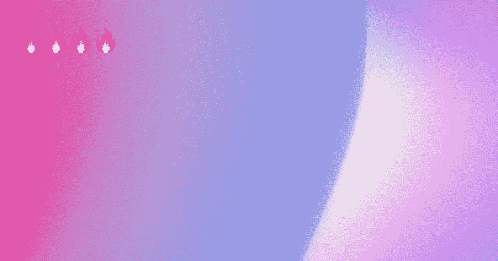

# 用 Javascript 和 WebGL 创建 3d 动画渐变效果

> 原文：<https://javascript.plainenglish.io/making-an-animated-html5-canvas-gradient-effect-62e7f84d7c2f?source=collection_archive---------4----------------------->

我最近对渐变背景很感兴趣。大部分卖产品的网站都是相对静态的，带点活的可以帮助提高转化率。最近，我试图创造一个引人注目的渐变效果，作为我正在做的一个项目网站的背景。我想要的效果应该是 a)简单，b)随机，c)微妙。[最终结果可以在这里找到。](https://github.com/smpnjn/webgl-gradient)



A single frame from the gradient animation

所以我开始了，像任何人一样有一个基本的 CSS 渐变。CSS 渐变曾经是一项相当新的技术，但现在得到了主流浏览器的广泛支持，但对于仍在使用 Internet Explorer 的人来说，拥有一个背景标签作为备份总是好的。

```
**background: rgba(0,0,0,1);
background: linear-gradient(315deg, rgba(0,0,0,1) 0%, rgba(255,255,255,1),1) 100%);**
```

那么很容易——我想——我会写一个简单的 JavaScript 函数来替换上面的 rgba 数字。这很容易做到——但这是一场灾难，所以我不会在这里分享结果。我的第二个尝试是用混合模式在 HTML 画布上移动圆圈。这更有希望，但同样，这并不完全是我所追求的。

最后，受够了，我决定进入第三维度，使用 three.js

# 入门—three.js

我在这个实验中使用 three.js，因为它使 WebGL 变得非常容易。首先，我在同一个文件夹中创建了一个名为 index.html 的新文件和一个名为 script.js 的文件。在 index.html，粘贴下面的空心 HTML 结构。

```
<!DOCTYPE html><html><head> <title>The best gradient effect of your life</title> <script src="script.js"></script></head><body></body></html>
```

# 概念

如果你对 WebGL 一无所知的话，它是一个非常强大的概念，在我开始渐变填充之旅之前我也不知道。据我所知，一个成功的 WebGL 基本上有三个部分——两个着色器和一点 JavaScript 来操纵生成的形状。

## 什么是着色器？

正如我们在这里所描述的，着色器本质上是调整 3D 渲染输出的功能。它们是在屏幕上以 3D 形式呈现某些内容时发生的任务流水线的一部分。

其中一个着色器叫做**顶点着色器**——这将调整页面上的每个‘顶点’点。它基本上对每个点进行迭代，并根据函数中的内容进行调整。另一个是**片段着色器**。把这想象成调整页面上每个点的颜色。

着色器不是用 JavaScript 编写的，它是用 GLSL 编写的，这是一种类似 C 的语言，由 three.js 直接传递给你的 GPU。你可以将这些直接粘贴到 HTML 页面的`<body />`中。正如有人习惯用 JavaScript 编写的那样，这些着色器看起来很奇怪，但它基本上可以分解成几个关键部分。

*   snoise()或 simplex noise 是我们两个着色器中用于生成噪声或随机顶点的函数。你会看到这是如何工作的，但在我们的顶点着色器中，我们调整每个点的 x 和 z 位置来创建一个类似布料的效果。我是怎么想出这个的？事实证明，许多人以前都尝试过这种方法。在这里查看你所有的着色器噪波函数:[https://gist . github . com/patricio Gonzalez vivo/670 c22 f 3966 e 662 D2 f 83](https://gist.github.com/patriciogonzalezvivo/670c22f3966e662d2f83)
*   **统一变量**是我们可以用 three.js 直接从 JavaScript 实时操纵的变量。我们在下面的代码中定义它们，简单地通过在 JavaScript 中更新它们，我们将更新页面上的 3D 形状(这是这个实验中最酷的发现)
*   **gl_Position** 和 **gl_FragColor** 是保留变量，控制我们着色器的最终输出。
*   **vUv** 和 **uv** 是携带我们当前正在调整的顶点信息的变量。

了解更多信息的最佳方式是下载本文中的文件，并尝试更改着色器和 JavaScript 中的一些内容。下面是着色器的最终输出，您可以将其直接粘贴到 HTML 的主体中:

The shader code is in the HTML, although can be pulled into Javascript through any means (for example, a variable containing the code within the Javascript itself)

# Java Script 语言

我已经在顶部的 codepen 中导入了 Three.js 文件，只要记住，如果你想这样做，你必须在服务器上有你的代码。你不能只在浏览器中打开文件。为此，您也可以使用自己计算机的本地主机。

要想更好地了解这三个工具，您可以查看这三个文档。本质上，我们需要创建一个摄像头(用于查看)、一个渲染器(用于将所有内容显示在屏幕上)和一个场景(用于放置对象)。然后，我们将在场景中放置一个薄片或矩形。

这就是统一变量的用武之地。我们将在 JavaScript 中定义它们，然后我们可以更新它们来改变 JavaScript 的呈现过程。我们在这里有一些其他的实用函数，所以请在 codepen 中或者在最后的 git 中查看完整的代码以获得更多的信息。

如果你调整第 42 行，multiplyScalar(5)到 multiplyScalar(1)，你可以完全看到物体，而不用大规模放大。这将让你知道这是如何工作的，因为你会看到它只是一张被扭曲的纸，而渐变中产生的锐线实际上只是纸的一部分与自身重叠。

好了——现在是**动画**。我们将使用 JavaScript 动画帧，因为这个过程可能会变得相当 CPU/GPU 密集型。同样，这里的代码很少，我们可以重新渲染场景，并为 requestAnimationFrame()生成的每一帧更新其值。

# 结论

当我开始这样做时，我知道我想要产生的效果，但不知道如何去做。你可以对这种效果进行应用和调整，为网站背景、标题元素或任何类似的东西提供很大的灵活性。

## 相关链接

*   [Github 回购](https://github.com/smpnjn/webgl-gradient)
*   [Codepen 演示](https://codepen.io/smpnjn/pen/pobGMKp)
*   [Three.js 文档](https://threejs.org/docs/index.html#manual/en/introduction/Creating-a-scene)