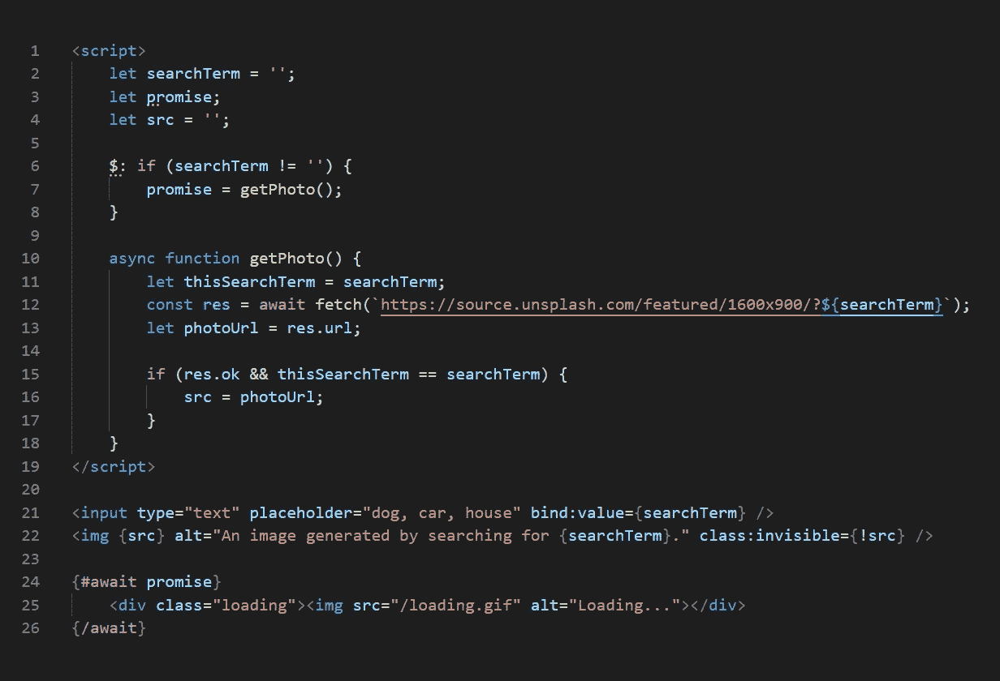
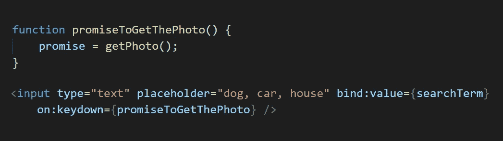
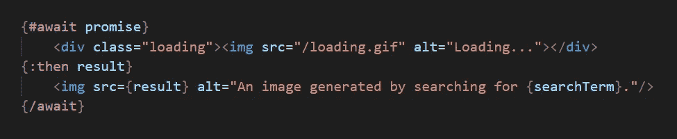
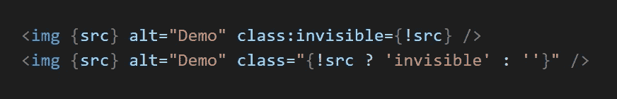
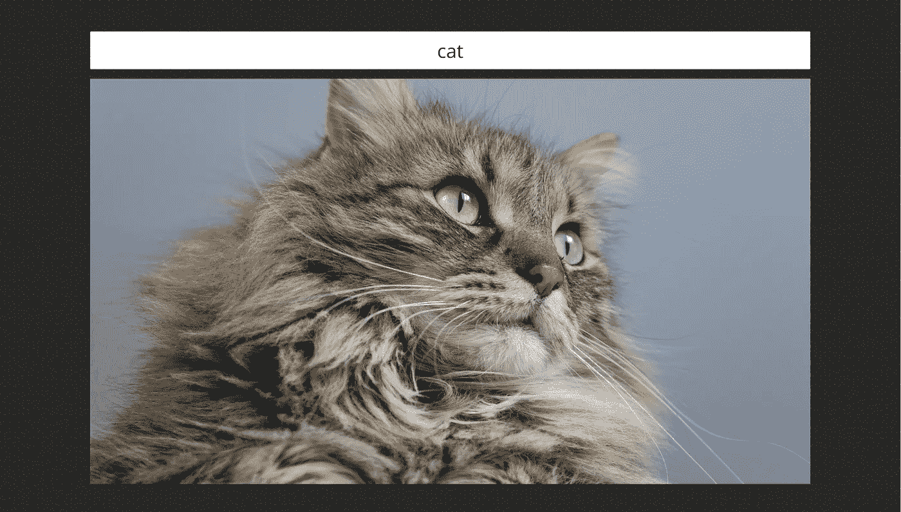

# 如何在 Svelte 中进行 API 调用

> 原文：<https://javascript.plainenglish.io/making-an-api-call-with-sveltejs-and-reactive-declarations-63328ca6ba2d?source=collection_archive---------10----------------------->

最近我迷上了苗条身材。JavaScript 框架的这一个人军团既吸引人又活跃，就像它是被动的一样。在本文中，我将向您介绍该框架的一些基本特性。在 26 行代码中，我将介绍一些有趣的 SvelteJS 特性:反应式声明、带有承诺的异步 API 获取，以及一些简洁的 SvelteJS 特性。

我将要向您展示的代码允许用户通过在常规的旧输入字段中输入搜索查询，从外部 API 获取开源照片。我们从中获取图像的 API 是由 Unsplash 开发的[开放 API——开源图像的免费资源。](https://source.unsplash.com/)

让我从展示我的代码开始:

```
<script>
  let searchTerm = '';
  let promise;
  let src = ''; $: if (searchTerm != '') {
      promise = getPhoto();
  }

  async function getPhoto() {
      let thisSearchTerm = searchTerm;
      const res = await fetch(`https://source.unsplash.com/featured/1600x900/?${searchTerm}`);
      let photoUrl = res.url; if (res.ok && thisSearchTerm == searchTerm) {
          src = photoUrl;
      }
  }
</script><input type="text" placeholder="dog, car, house" bind:value={searchTerm} />{#await promise}
  <div class="loading"></div>
{/await}
```

代码片段可能有点难以阅读，这取决于您阅读本文的设备。为了您的阅读乐趣，我还提供了图片形式的代码。这张图片中的行数是我将在本文的其余部分中用作参考的，不管上面的代码片段中的行数看起来如何。



A screenshot of the code. The image is captured by the author.

让我们浏览一下这段代码。

我们从第 21 行开始，那里有一个输入字段。这个输入字段是我们用来让用户输入搜索查询的。注意，在这一行的末尾，我将输入字段的值绑定到了我的变量“searchTerm”，该变量在第 2 行声明。“bind:value”的意思是指定的变量将反映输入字段的值。

接下来，将注意力转移到第 6 行。这一行以一个美元符号开始，后跟一个逗号，这可能看起来像奇怪的语法。在《窈窕淑女》中，这个二人组象征着[反应宣言](https://svelte.dev/tutorial/reactive-declarations)的开始。这是我最喜欢的苗条身材的特征之一。任何写在“$:”之后的代码都是被动的——只要在它被改变之后提到一个变量，它就会被触发。在我们的例子中，变量“searchTerm”是在冒号后面提到的，这就是每当变量被更新时代码块就会被触发的原因。当然，每当用户在输入字段中键入字符时，该变量都会更新，因为输入字段的值绑定到该变量。

请注意，对于我们的代码，我们实际上不需要使用反应式声明。SvelteJS 配备了大量的[监听器](https://svelte.dev/docs)。例如，我们可以简单地使用 keydown-listener 来代替，并获得相同的结果。



Instead if using a reactive declaration, you could, of course, use a standard observer. The image is captured by the author.

然而，我想说明如何在 SvelteJS 中使用反应式声明。就像魔法观察者一样，它们可以用于几乎无限的场景。

无论是通过被动声明还是使用标准侦听器，代码都将调用一个名为“getPhoto”的异步函数。这个函数在第 7 行被调用。如果您查看函数内部，您将在第 10 行到第 18 行找到，您会发现一些看起来冗余的代码。我们声明了一些局部变量，比如“thisSearchTerm”和“photoUrl ”,它们可能是现有变量的多余副本。但是，请记住，这是一个异步函数，每次用户在输入字段中输入一个字母时都会触发该函数。如果用户键入搜索词“doghouse”，我们将输入这个函数不下八次，第七次调用实际上可能在第八次调用之后结束，这就是为什么我们在第 15 行有一个 If 语句，确保我们总是显示正确的结果，而不是最近的*。*

*我们在第 12 行调用 [Unsplash 的开放 API](https://source.unsplash.com/) 。这个调用是一个简单的 URL，我们将搜索词放在它的最后。您可能已经注意到，在第 7 行，我们将这个异步调用存储在一个承诺中。只要我们在等待一个承诺，第 25 行的代码就会一直运行。在我们的例子中，我们只是在等待图像时显示一个正在加载的 gif。等待承诺在编程语言中很常见。承诺实现后，它返回一个结果。在 SvelteJS 中，处理结果可能是这样的:*

**

*We could also collect the result from the promise, roughly like this. This would make it so that an image is only displayed when no promise is running, as opposed to our current solution, which shows the last image fetched while fetching another. The image is captured by the author.*

*然而，我们的代码看起来不是这样的。我们的代码不需要它。SvelteJS 中的所有变量都是反应性的，包括我们的“src”变量。当我们在第 16 行更新“src”变量时，图像也在这个过程中被更新。事实上，我们可以重写这段代码，完全不使用承诺——我们可以简单地根据异步函数中的布尔集合显示和隐藏 gif。*

*在第 22 行，我们显示图像。“{src}”是“src={src}”的简写形式。如果变量名与属性名相同，可以这样缩短。每当“src”变量更新时，图像显示也会更新。还有，注意线上的最右边。“class:invisible={！src}”意味着只要变量“src”未定义或为空，图像就会有“不可见”类。这是苗条身材的另一种简写。观察下面的两行—输出是相同的:*

**

*The top line is a shorthand for the second line. Indeed, these two lines output the same result. The image is captured by the author.*

*结果是一个功能齐全的应用程序，从一个开放的 API 获取图像。稍加设计，该应用程序可能如下所示:*

**

*An example of what the above code could look like in a browser with a touch of CSS applied to it. In this example, “cat” has been entered into the search bar as a query, and a random image associated with the keyword has been returned from the Unsplash API. If you enter the word “cat” yourself, you will most likely receive a different photo. [This particular photo](https://unsplash.com/photos/1vNvGY11Lds) that I received is a photo by [Lina Angelov](https://unsplash.com/@linataly1?utm_source=unsplash&utm_medium=referral&utm_content=creditCopyText) on Unsplash.*

*SvelteJS 是一个非常适合初学者的 JavaScript 框架，很容易上手。也就是说，这种语言背后的社区仍然很小，所以请在评论中随意发表任何问题，我会尽我所能回答他们。我绝不是苗条身材方面的专家，但正如我所说，我越来越喜欢这个框架。我很欣赏它在不删除任何功能的情况下删除了 React 的许多冗余样板文件。*

*祝你苗条的冒险之旅好运！*