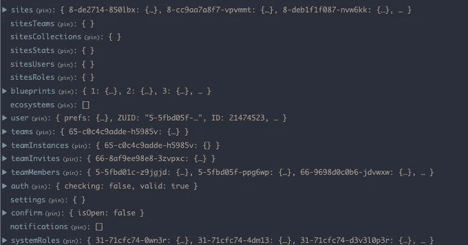
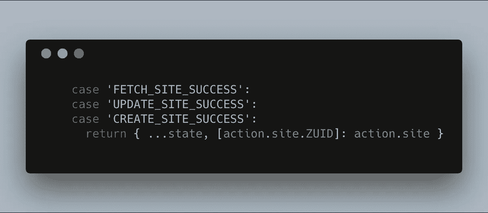
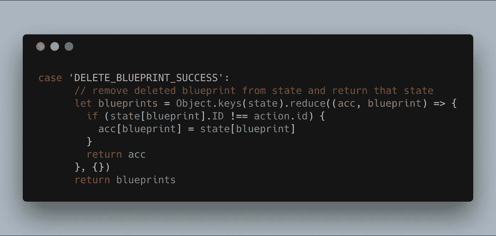
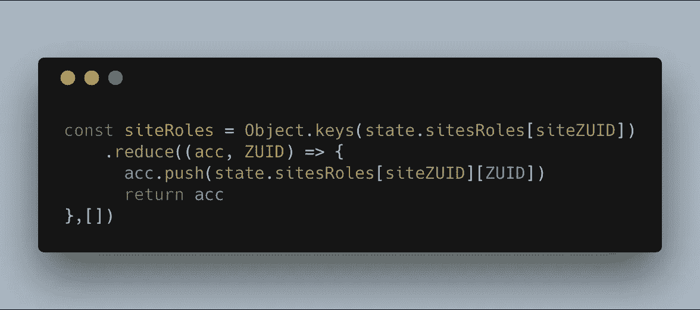
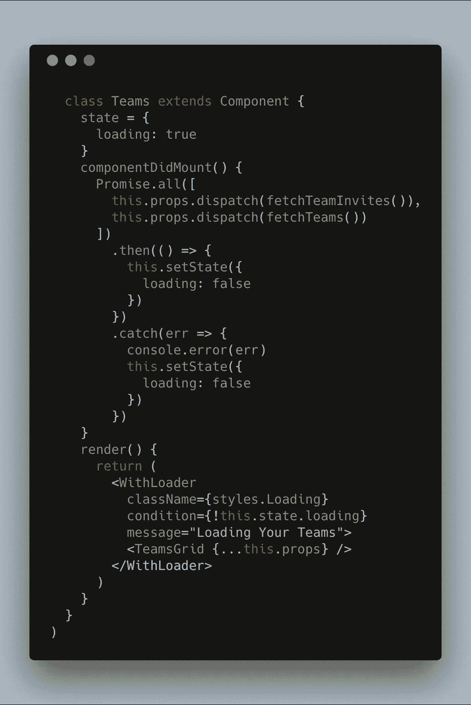

# 在 React/Redux 应用中做出决策

> 原文：<https://javascript.plainenglish.io/making-decisions-in-our-react-redux-app-a1ad7d01a62c?source=collection_archive---------5----------------------->

Photo by [Everaldo Coelho](https://unsplash.com/@_everaldo?utm_source=medium&utm_medium=referral) on [Unsplash](https://unsplash.com?utm_source=medium&utm_medium=referral)

这既是一个通知，也是一个解释。宣布我们的[账户-UI react/redux 应用](https://github.com/zesty-io/accounts-ui)将向公众开放。

我们期待这项工作对开发者开放，让他们观看、学习，甚至告诉我们可以改进的地方。在这个构建的过程中，我们已经做出了决定，事实上，许多决定都值得一遍。

这个应用程序大约有 25000 行代码，所以我们在本文中只能涵盖*的一些*想法。我们最大的决策围绕着使用 React，管理我们的 [Redux](https://github.com/reduxjs/react-redux) 状态，我将介绍我们的[组件库/设计系统](https://github.com/zesty-io/design-system)。

在我们进入细节之前，了解一下关于 [Zesty.io](https://www.zesty.io) 和这个应用负责什么的背景可能会对你有所帮助。Zesty.io 是 SaaS 模式的 WCMS(网络内容管理系统)。

我们专注于中小型企业客户，他们需要通过网站、原生应用、物联网设备等将自己的内容传播到互联网的每个角落。我们讨论的 app 不是内容管理入口，而是账号 app。

我们的用户使用它作为网关来启动实例、管理协作者以及与实例相关的细节。您可以将它视为跨许多实例管理内容的门户。

Photo by [Max Bender](https://unsplash.com/@maxwbender?utm_source=medium&utm_medium=referral) on [Unsplash](https://unsplash.com?utm_source=medium&utm_medium=referral)

开发人员经常嗤之以鼻地说 Redux 和它的样板文件在大多数情况下都是多余的，这并没有错。设置它确实需要做一些工作。然而，那些只是树，我在这里展示森林。我们的问题是数据、持久性和组织。任何将道具传递给 react 组件的人都知道，如果您需要的数据超过几层深度，我会说-

> 令人麻木地重复不断地将这些信息沿着组件链传递到数据的最终目的地。—格兰特·格莱德维尔

现在有几种方法可以解决这个问题。对于不小的数据，在整个应用程序的多个地方都需要，或者来自我们的 API 的多个不同资源，这可能有点棘手。

对于 Zesty 上的新用户，他们创建一个帐户，确认他们的电子邮件地址，然后登录。一旦用户创建了一个实例，并选择了一个蓝图(这些是具有相应数据结构的模板，用于准备使用的内容)，实例概述就会打开，并允许用户编辑实例的多个方面。我们的 Redux 商店看起来像这样-

如您所见，这是相当多的数据。我们有一个用户、蓝图、该用户可能所属的团队、该用户可以访问的实例、每个实例的相关数据以及更多辅助项目，以便做出渲染决策。商店数据被键入一个唯一的 ID。当请求从数据库返回时，有时我们的缩减器很简单。

其他时候，比如从存储中删除数据，虽然不太简单，但还是可以管理的。

在 mapStateToProps 中，我们可以确保只将相关信息传递给每个组件。这严格遵循 redux 文档的建议，因为我们已经对每个商店的数据进行了规范化，因此可以很容易地进行引用。

在我们的整个应用程序中，我们使用这种关键引用方法。有时进行映射很麻烦，但是如果我需要在应用程序的任何地方检查与实例相关的用户角色，我知道该信息的确切位置。

该模式还进一步从数据层抽象出我们的视图。说到视图，让我们来看看我们的组件是如何构造的。

“A local interchange with purple lights and city buildings in the background” by [Denys Nevozhai](https://unsplash.com/@dnevozhai?utm_source=medium&utm_medium=referral) on [Unsplash](https://unsplash.com?utm_source=medium&utm_medium=referral)

我们的应用程序包含验证。我们的公共路线总是可用的，但核心应用程序根本不会呈现，直到用户有一个有效的会话。子应用被分割成每个应用的单独用例，在这种情况下，它们被分解成主应用中的选项卡。我们的团队子应用程序有几个方面可能会感兴趣，并清楚地说明了我们的方法。

在这个子应用程序中，只有一个视图是必需的。主视图负责为该用户所属的或被邀请加入的团队获取初始数据。这些是在`componentDidMount`中使用`promise.all`调用的，因为我们的主`TeamsGrid`元素被包装在我们的`WithLoader`组件中，我们可以根据从 API 返回的调用来决定它的呈现。

预先处理数据允许我们创建一些更干净的组件，不受可能必须发生的初始 API 调用和数据结构更改的影响。

我们的`TeamsGrid`组件呈现出另外三个组件- `CreateTeam`负责团队创建，`InviteCard`呈现用户还不能访问但被邀请的团队，`TeamCard`显示团队中的其他用户以及团队被分配到哪些实例。

这些组件中的每一个都只处理状态的一小部分，并且只使用与该部分相关的动作。分割有助于保持开发过程的简单，这些关注点已经被分离，因此是自治的部分。

现在让我们来看看在紧耦合的场景中这是如何工作的。我是一名用户，我有一个团队正在与我合作。我去看看谁接受了他们的团队邀请，并看到“乔治”加入了我的开发团队，参加了一个令我非常兴奋的项目。

在这一点上，应用程序已经为这个团队获取了我的团队成员，以及我们被分配工作的实例。我点击其中一个实例，我的团队会将我发送到实例子应用程序。我将看到该实例的实例概述，该实例也必须进行 API 调用。

这个组件不知道我刚从 Teams 子应用程序中过来，也不知道我已经有了团队数据，所以它等待从 API 返回的信息进行渲染。

这是对网络资源的浪费，因为我们现在已经快速连续地重复呼叫了。我们还浪费了宝贵的毫秒来等待信息，这些信息很容易从全局状态中的另一个地方被引用。这里不仅有一个全球状态的实际优势，而且这也是一个心智模型的资产。

在开发这个应用程序的过程中，我们能够构建组件，关心它们如何相互协作，而不必关心数据流。

“Wooden pier pathway with white wooden railing” by [Christian Holzinger](https://unsplash.com/@pixelatelier?utm_source=medium&utm_medium=referral) on [Unsplash](https://unsplash.com?utm_source=medium&utm_medium=referral)

所有这些关于组件的讨论都让我渴望讨论这个过程的一个有趣的副产品。本着“可重用”和明确的、声明性的、功能性的、更时髦的开发的精神；我们已经开始构建我们的[设计系统](https://github.com/zesty-io/design-system)。

我们的需求相当简单。我们需要输入上的样式包装器来匹配我们的一般主题，以及一些更具体的布局元素。我们遵循[布拉德·弗罗斯特](http://bradfrost.com/)提出的[原子设计](http://bradfrost.com/blog/post/atomic-web-design/)原则。

随着我们的需求和团队的增长，这个项目将成为我们未来工作的一部分。拥有一个充满标准化组件的存储库将使添加特性变得更快。它还具有双重目的，可以从一个地方更新我们的 UI。

所有这些的首要主题是脱钩。因为我们已经将数据从动作中分离出来，将动作从视图中分离出来，将视图从 UI 元素中分离出来。这允许的自由是显著的，并且最终结果感觉平滑和无缝。

对体系结构的初始投资正在不断获得回报。随着我们的进展，我们计划让更多的工作向公众开放。

我们期待着来自社区的意见，并希望我们的一些决定能帮助一些开发者解决困难的问题。