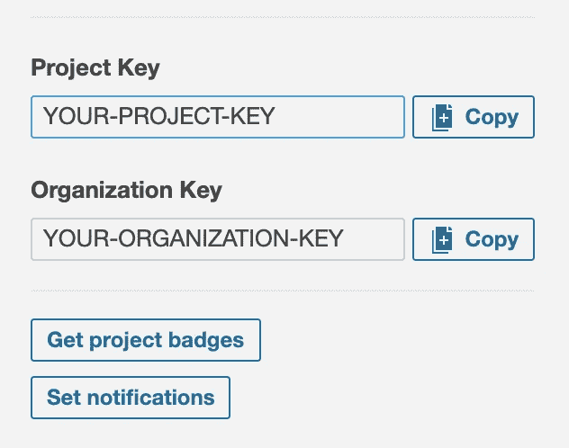

# 如何让 SonarCloud 很好地配合 Jest

> 原文：<https://javascript.plainenglish.io/making-sonarcloud-play-nicely-with-jest-fa271f559024?source=collection_archive---------1----------------------->

如何使用 Github 操作显示 SonarCloud 中 Javascript 应用程序的测试覆盖率。

Photo by [Sai Kiran Anagani](https://unsplash.com/@_imkiran?utm_source=medium&utm_medium=referral) on [Unsplash](https://unsplash.com?utm_source=medium&utm_medium=referral)

今天，我花了一整天的时间试图在 SonarCloud 中显示我的测试覆盖率。我想把我的发现写下来，这样你就不用像我一样浪费太多时间了。

## 回购结构

这是一个非常简单的设置。我使用的是全球安装的 [Jest](https://jestjs.io/) (版本 *25.1.0* )，测试位于测试目录中。

而 [package.json](https://gist.github.com/Davetherave2010/fffc760b53ceadc6b98087b682b8f362) 看起来是这样的:

package.json file

当我运行`npm run test`时，你可以看到它运行`jest --coverage`。

## 安装 Jest 声纳报告器

您不能将 Jest 覆盖数据直接传递给 SonarCloud，因此您需要使用一个中介来将其转换为 SonarCloud 可以理解的格式。

SonarCloud 建议使用 [jest-sonar-reporter](https://www.npmjs.com/package/jest-sonar-reporter) 来完成这项工作。您需要`npm install jest-sonar-reporter --save-dev`，然后您需要更新`package.json`文件中的 jest 设置以包含`"testResultsProcessor": "jest-sonar-reporter"`(我已经将它添加到上面的示例中)。

## 设置 SonarCloud 配置

作为设置的一部分，您需要一个[sonar-project . properties](https://gist.github.com/Davetherave2010/dd17be470a466a9952759c35f14d4aa5#file-sonarcloud-jest-sonar-project-properties)文件(见下文)。

sonar-project.properties file

在这个文件中，你可以看到`sonar.sources`被设置为整个项目(如果你想缩小 SonarCloud 覆盖的范围，可以在这里指定一个路径)。您可以看到我们排除了测试目录中的所有 JS 文件，最重要的是，我们告诉 SonarCloud】文件的位置。每当我们运行`npm run test`时，Jest 都会创建这个 lcov 文件，它包含我们需要传递给 SonarCloud 的覆盖数据。

您可以从 [sonarcloud.io](http://sonarcloud.io) 上的项目仪表盘中获取您的组织和项目密钥。

A screenshot from sonarcloud.io showing where the project and organisation keys are.

## 安装 Github 动作

接下来，每当我制作 PR 或者更新主分支时，我想要自动运行测试。你也许可以用多种方式做到这一点，但我使用的是 [Github 动作](https://github.com/features/actions)。我发现设置这个的最简单的方法是前往 repo Github 并点击`Actions`选项卡。

如果您没有回购工作流，系统会要求您创建一个，否则您需要单击`new workflow`按钮。我正在使用自定义工作流程(点击`setup workflow yourself`)

以下是我使用的工作流程:

main.yml

当您完成编辑后，将该文件提交到您的 repo(您将在`.github/workflows/main.yml`中找到它)。

这不是最复杂的工作流程。我们是这样做的:

1.  获取主分支(我们不合并它——这修复了 SonarCloud 中的一个错误)。
2.  安装项目依赖项。
3.  安装 Jest。
4.  对 PR 进行测试。
5.  运行声纳云扫描。

你需要[在你的`SONAR_TOKEN`回购中设置秘密](https://help.github.com/en/actions/configuring-and-managing-workflows/creating-and-storing-encrypted-secrets#creating-encrypted-secrets)(你在 [sonarcloud.io](http://sonarcloud.io) 上创建令牌)。你不需要创建一个`GITHUB_TOKEN`，因为 Github [会自动创建它](https://help.github.com/en/actions/configuring-and-managing-workflows/authenticating-with-the-github_token#about-the-github_token-secret)。

仅此而已。每当您创建新的 PR 或合并到 master 时，它都会触发工作流，运行测试并将其发送到 SonarCloud。

## 错误消息

*“您正在运行配置项分析，同时启用了自动分析。请考虑禁用其中一个”“*要解决这个问题，您需要在 sonarcloud.io 的[管理选项卡中禁用自动扫描。](https://community.sonarsource.com/t/how-to-disable-auto-scan/20941/2)

*“在 refs/heads 或 refs/remotes/origin 中找不到 ref‘master’。”—* 我在 Github 动作工作流程的第一步中通过获取 master 解决了这个问题

*“检测到浅层克隆，不会提供责备信息。”—* 对此的建议解决方案是将`fetch-depth: 0`添加到`actions/checkout@v2`(参见上面的主工作流程 yml)

希望这有帮助。

感谢阅读！

大卫

**高级前端开发者@**[**trip actions**](https://tripactions.com/)**(通常是** [**招聘**](https://grnh.se/cbeb241d1) **！)**

 [## 阿姆斯特丹开发商 David Endersby - Wed

### 编辑描述

www.davidendersby.me](https://www.davidendersby.me/) 

*更多内容请看*[*plain English . io*](http://plainenglish.io/)