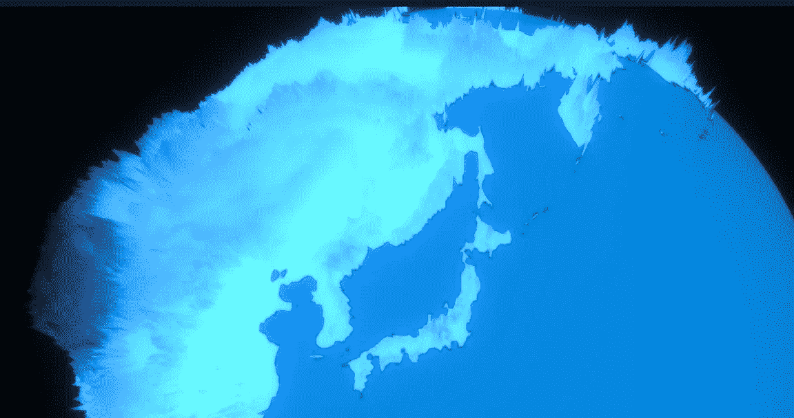
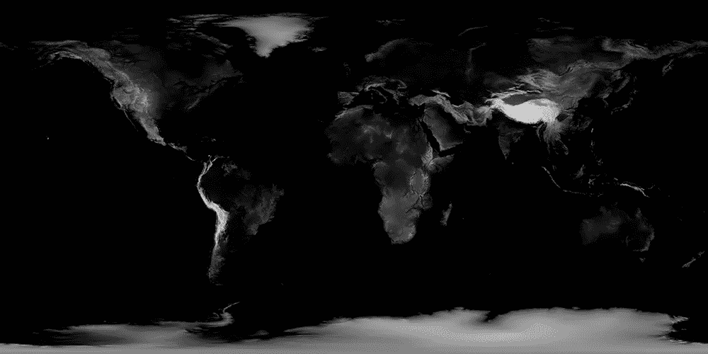

# 用 JavaScript 和 WebGL 制作这个神奇的地球效果

> 原文：<https://javascript.plainenglish.io/making-this-amazing-earth-effect-with-javascript-and-webgl-f3a342133edf?source=collection_archive---------5----------------------->

Demo of the effect

所以有一天我在摆弄球体和纹理，偶然发现了一些非常惊人的例子，人们用纹理把一个球体弄得非常尖。这让我想到了地球上的山脉，以及它们在 WebGL 中的样子。在本教程中，我们将学习如何创造世界，但会使用极其夸张的地理环境。

我想涵盖三个。js)本教程的主要内容

*   **着色器**如何在高层次上工作
*   如何创建**高度图**
*   如何**跨 JS 和着色器**使用形状

****

# **第一步:美国宇航局，不，真的**

****

**所以你要做的第一件事就是去美国国家航空航天局找到他们的地球高度图。美国宇航局在地球上实际上有大量的数据资源，比如海洋深度图，但也许那是未来的项目。**

**下一步是移除海洋。说起来容易做起来难——我必须找到前面提到的海洋地图，减去海洋，因为在海平面上，美国宇航局的高度图完全是黑色的，很难区分。我在 Photoshop 中做了这个，但是在 git 存储库中也有，所以你甚至不用做这个。**

## **但是我们为什么需要这张地图呢？**

**所以这张地图上每个像素的黑暗程度代表了它离海平面有多近。我们可以获取这些数据，并使用着色器，将像素转换到不同的高度。我们可以让山更高，让地更低，我们甚至可以用这些数据来改变像素的颜色。很酷，对吧？**

# **步骤 2: Three.js**

**Three.js 是一个 3D WebGL 包，可以帮助你更容易地完成 WebGL。**什么是 WebGL？**这是我们在网络上制作 3D 东西的方式，也是一种网络标准。**

## **我们如何用我们的地球纹理创建一个球体？**

**首先我们需要从 **three.js** 导入适当的包。您可以创建一个名为 script.js 的新文件，并添加以下代码。*注意——导入只能在服务器上运行，所以你不能只打开 index.html 就指望它能运行，你需要在你的本地主机上运行它。***

**好了，现在我们开始吧。所有这些都将在 DOM 加载后开始，但是我们将使用三个来构建。我没有包括下面所有的代码——你可以在 codepen 或 git repo 中找到——但是有几个要点需要注意:**

*   ****在第 13 行，**我已经把多边形的数量设置为 1024。这需要一点时间来加载，但对于我们想要的效果来说，多边形越多越好。如果你愿意，你可以在测试期间减少 1024 以加快加载速度。**
*   ****在第 15 行**，我们提到了‘制服’。这些是我们可以在 Javascript 中编辑的变量，但是会传递给着色器。我们将使用着色器来制作我们稍后讨论过的高度贴图。**
*   ****在第 19 行**我们提到了纹理，这是我们对地球的描述。**
*   ****在第 21/22 行**，我们提到了着色器。这些都在 HTML 文档中，并且是用类似 C 语言编写的**
*   **在第 45 行我们更新了球体的旋转。这是实时发生的，您可以从 Javascript 更新几乎任何您想要的属性，这给了您很大的灵活性。**

# **步骤 3:着色器**

****

**着色器是大多数 Javascript 开发人员可能会遇到的问题。它们有自己的语言，需要稍加研究才能掌握，但它们存储在 HTML 文档中的**

**简单地说，**我们有两个着色器** — **顶点着色器**，它改变形状上的每个像素，还有**片段着色器**，它改变像素的颜色。**

**我们的顶点着色器是相对简单的**

*   ****在第 1 行**上，我们有 vUv，这是我们当前所在像素的坐标。我们可以做 vUv.x 和 vUv.y 来得到我们的(x，y)坐标**
*   ****在第 7 行**，我们从‘gettexture 1’变量导入纹理。这在之前的 Javascript 变量中被定义为统一的(见上文)。我们可以从中获得大量数据——x、y 和 z 坐标，以及 r、g、b 和 a 颜色细节。在着色器中，每种颜色都在 1 之外，所以应该是 0 到 1 之间的数字。**
*   ****在第 8 行**，我们获取红色数据和阿尔法数据，并将其乘以 20。那有什么用？它计算一个点有多红(在我们的例子中表示它有多黑)，以及它有多透明。所以透明元素将为 0，总位移将等于 0。对于非常白的区域，bumpData 将为 1，这将给出最大值 20。**
*   ****在第 12 行**上，我们将“高度”数据传递到 gl_Position，它实际上存储了传递给 GPU 的所有像素的最终位置。**

**好的——现在我们所有的像素都正确定位了，让**用**片段着色器**给它们正确着色。我们将使用与之前相同的技巧，唯一的复杂性是我们的 Javascript 颜色的统一值是 255 中的 rgb 值——所以我们创建了一个函数，将它们除以 255，得到 1 的值。我们也为完全透明的像素返回不同的颜色(例如水)。****

# **结论**

**这就是我们看到的，一个有人造高峰旋转的冰冷世界。要了解更多信息，您可以查看 three.js 文档。我还建议更新 Javascript 中的一些数字和统一颜色变量，看看你最终会得到什么。你可以做的另一个很酷的技巧是**把开花调到最大**来获得一些非常奇妙的效果**

## **相关链接**

*   **[Github 回购](https://github.com/smpnjn/webgl-globe)**
*   **[Codepen 演示](https://codepen.io/smpnjn/pen/vYXXjOZ)**
*   **[Three.js 文档](https://threejs.org/docs/)**