# 利用 JavaScript 中内置的高阶数组函数

> 原文：<https://javascript.plainenglish.io/making-use-of-built-in-higher-order-array-functions-in-javascript-812f2ad37e12?source=collection_archive---------7----------------------->

## 一些例子，帮助你掌握减少，映射，过滤，一些，寻找，每。

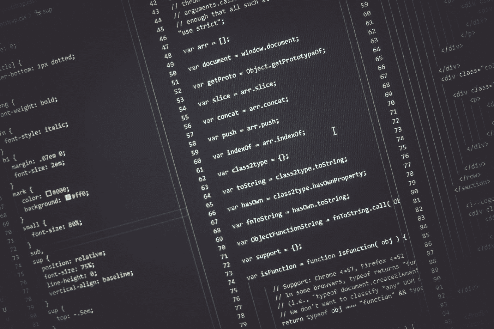

Photo by [Bharat Patil](https://unsplash.com/@bharat_patil_photography?utm_source=medium&utm_medium=referral) on [Unsplash](https://unsplash.com?utm_source=medium&utm_medium=referral)

`Array`是编程中最常见的数据结构。遍历是我们对数组最常见的操作之一。你知道有多少种方法可以循环一个数组吗？

## for-索引

首先，数组是一种索引数据结构。我们可以遍历一个数组的索引。

```
var arr = ['a', 'b', 'c'];for (let i = 0; i < arr.length; i++) {
    console.log(arr[i]);
}
```

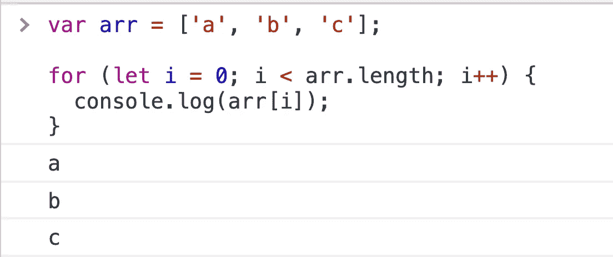

from Chrome console

## 因为在

同时，在 JavaScript 中，我们可以通过 for-in 语法遍历对象的可枚举属性。所有的数组都是对象，所以我们也可以把这个应用到数组上。

```
var arr = ['a', 'b', 'c'];for(let key in arr) {
    console.log(arr[key]);
}
```

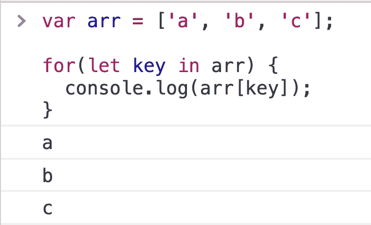

## 对于...来说

ES2015 在 JavaScript 中增加了*迭代器*。使用迭代器最简单的方法是新的`for-of`语句。看起来是这样的:

```
var arr = ['a', 'b', 'c'];for ( let element of arr) {
    console.log(element);
}
```

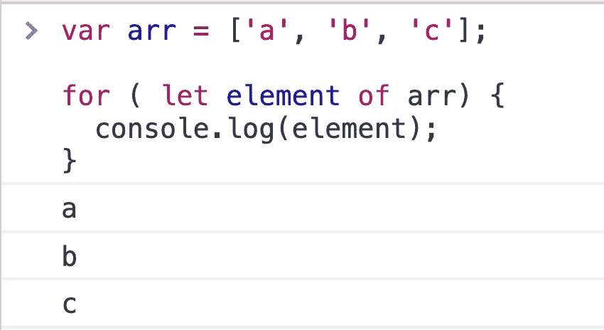

上面的几个 for 循环是遍历数组的经典方法。毫无疑问，在代码中使用上述方法是没有错误的。但是我们的 JavaScript 是函数式编程语言，它为我们提供了很多高阶函数来循环数组。如果我们能够恰当地使用它们，我们可以使代码更加简洁和优雅，并启发我们从不同的角度进行思考。

这些高阶函数是:

*   Array.protorype.map
*   Array.protorype.filter
*   Array.protorype.reduce
*   Array.protorype.some
*   Array.protorype.every

# 地图

`map()`方法**创建一个新的数组**,用调用数组中每个元素的函数的结果填充。

这是`reduce`的一个基本用法:

```
var arr = [1, 2, 3];function double(ele){
  return ele * 2
}arr.map(double)
```

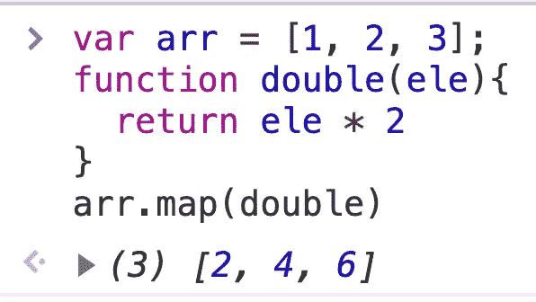

`map`方法接受一个函数作为参数。然后为数组中的每个元素调用这个函数，函数调用的结果被返回以形成一个新的数组

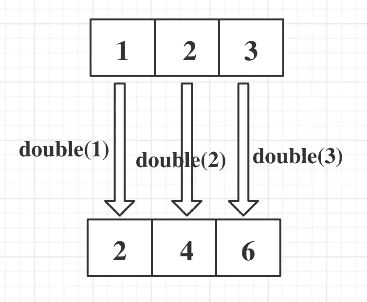

现在我们用几个例子来看看`reduce`方法是如何代替 for-loop 的。

## 1.复制数组

假设现在我们要复制一个数组(不考虑深度克隆)，你会怎么做？对于 for-loop，我们可以这样写:

```
function copy(arr){
  let newArray = [];
  for(let ele of arr){
    newArray.push(ele)
  }
  return newArray;
}
```

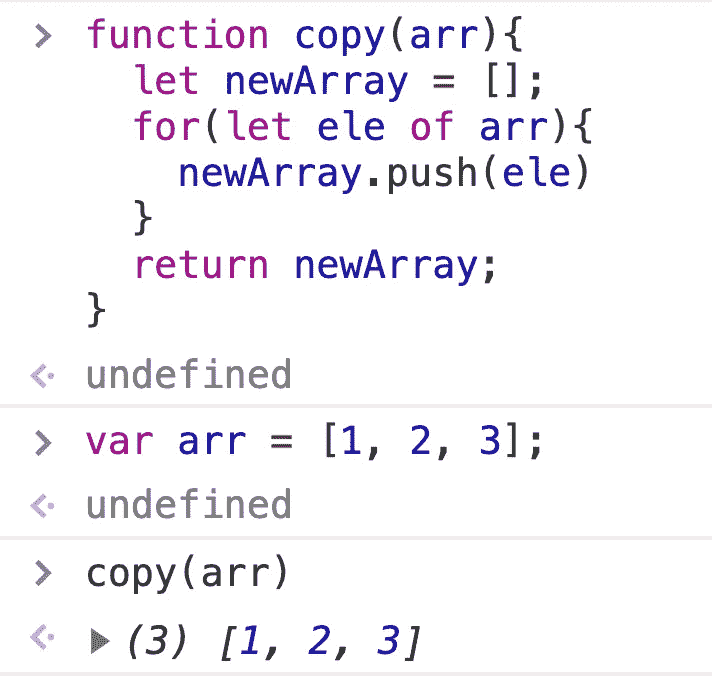

但是如果你习惯用`.map()`，只需要一行代码。

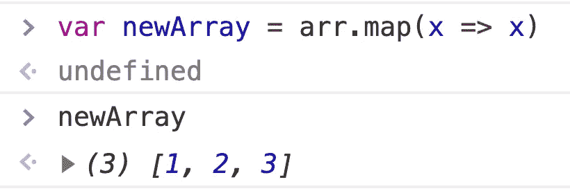

## 2.遍历所有元素并执行相同的修改

假设我们有一个字符数组，我们希望数组中的所有元素都是大写字符串，那么我们该怎么做呢？

带 for 循环:

```
var names = ["Jon", "Sonw", "bitfish", "Tom"];
var upperCaseNames = [];
for(let i = 0; i < names.length ; i= i +1) {
  upperCaseNames[i] = names[i].toUpperCase();
}
console.log(upperCaseNames)
```

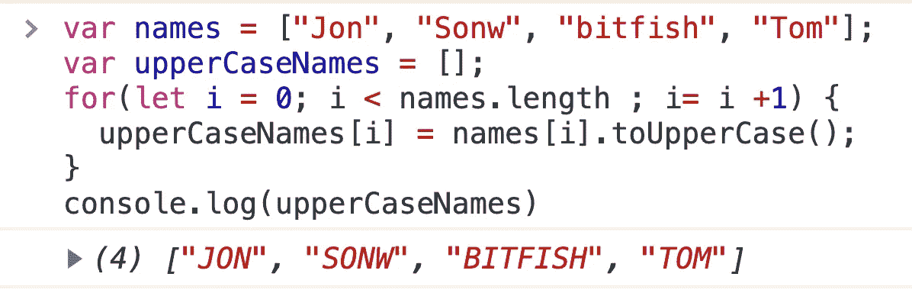

但是有了`map`，任务就很简单了。

```
var names = ["Jon", "Sonw", "bitfish", "Tom"];var upperCaseNames = names.map(ele => ele.toUpperCase())console.log(upperCaseNames)
```

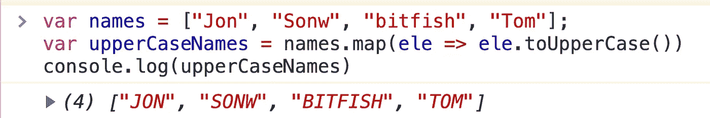

# 过滤器

在一个数组中过滤掉一些不合格的元素也是很常见的，那么我们该怎么写代码呢？

假设我们有一个整数数组，我们想删除所有的奇数，只保留偶数。

带 for 循环:

```
function filterOdd(arr){
  function isEven(n) {
    return n % 2 === 0;
  }
  var evens = []; for(let number of numbers) {
    if(isEven(number)) {
       evens.push(number);
    }
  }
  return evens;
}
```

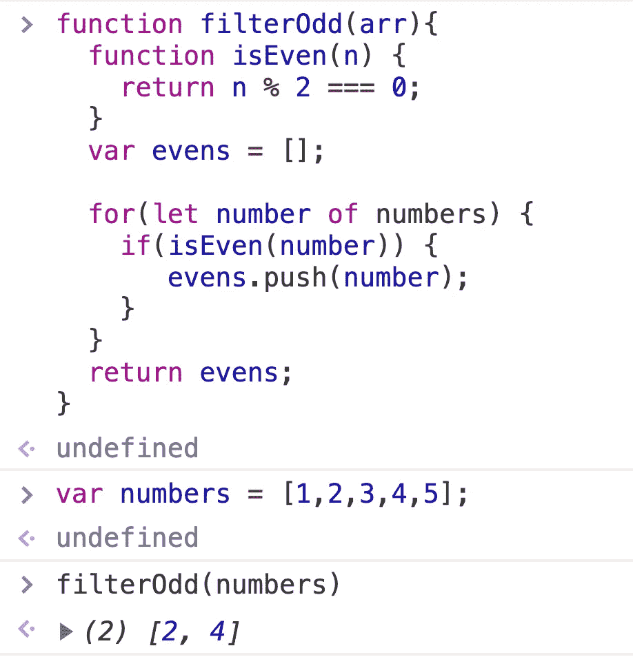

使用`filter`:

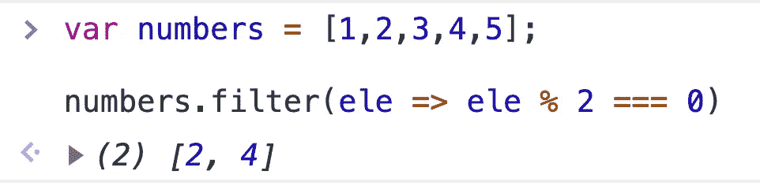

`filter()`方法**创建一个新数组**，其中所有通过测试的元素都由提供的函数实现。

# 减少

`Array.prototype.reduce()`是数组中最强大的方法之一，也是 JavaScript 函数式编程中很有吸引力的特性。但是很遗憾，我发现很多朋友都不习惯用。我来详细介绍一下这个方法，希望能帮到你。

这是`reduce`的一个基本用法:

```
var arr = [1, 2, 3];function reducer(parmar1, parmar2){
}arr.reduce(reducer)
```

`reduce`是一个关于数组原型对象的方法，可以帮助我们操作数组。它会将另一个函数作为它的参数，这个函数可以称为一个`reducer`。

`reducer`需要两个参数。第一个参数 param1 是上次减速器运行的结果。如果这是第一次运行`reducer`，param1 的默认值是数组第一个元素的值。

`reduce`方法遍历数组中的每个元素，就像在 for 循环中一样。并且循环中的电流值被取为 param2。

遍历完数组后，`reduce`将返回最后一次 reducer 计算的结果。

让我们来看一个详细的例子。

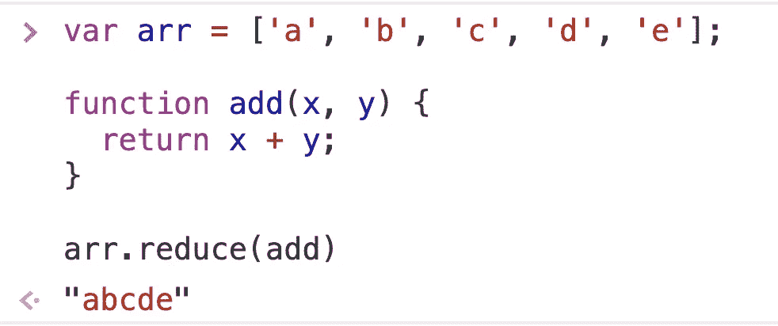

接下来，我们来探究一下上面的代码是如何执行的。

在这段代码中，`reducer`就是`add`。

第一，因为我们第一次执行`add`，数组中的第一个元素`'a'`会被当作`add`的第一个参数，然后循环会从数组的第二个元素`'b'`开始。这次，`'b'`是`add`的第二个参数。

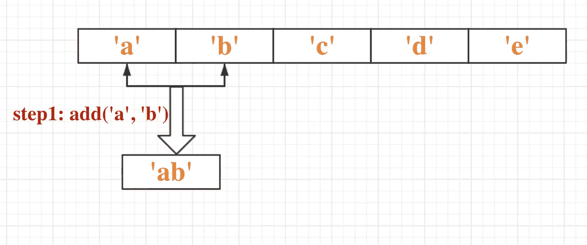

第一次计算后，我们得到结果`'ab'`。该结果将被缓存并在下一次`add`计算中用作 param1。同时，数组中的第三个参数`'c'`将作为`add`的 param2。

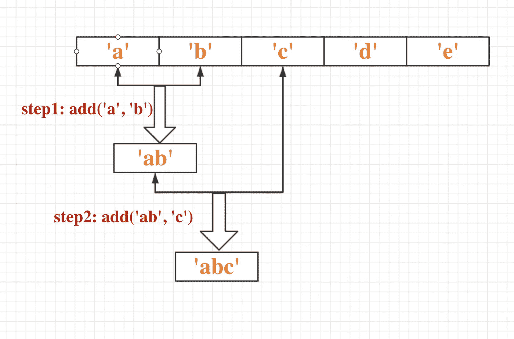

类似地，`reduce`将继续遍历数组中的元素，运行`'abc'`和`'d'`作为`add`的参数。

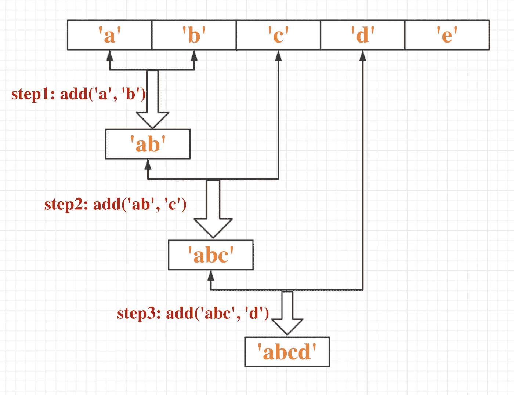

最后，遍历完数组中的最后一个元素后，将返回计算结果。

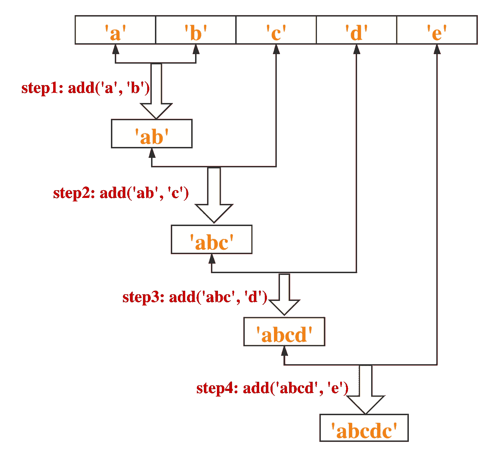

现在我们有了结果:`'abcde'`。

所以，我们可以看到`reduce`也是一种循环数组的方式！它依次取数组中每个元素的值，并执行`reducer`函数。

但是我们可以看到上面的循环并没有那种和谐的美感。因为我们取数组中的第一个元素，也就是`'a'`，作为初始 param1，然后从数组中的第二个元素开始循环得到 param2。

事实上，我们可以将`reduce`中的第二个参数指定为`reducer`函数的 param1 的初始值，所以 param2 将从数组中的第一个元素开始循环得到。

代码如下:

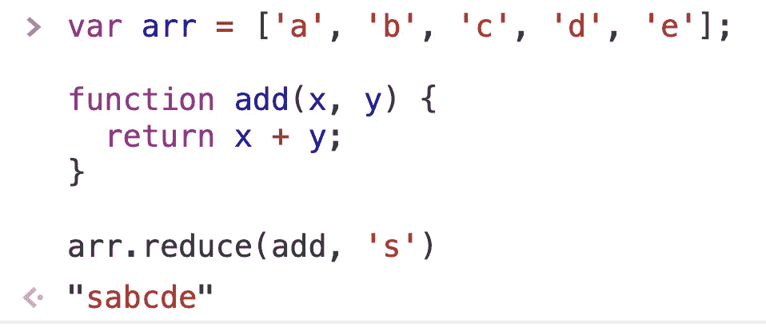

这次我们在第一次调用`reducer`的时候把`'s'`作为 param1，然后从第一个元素开始依次遍历数组。

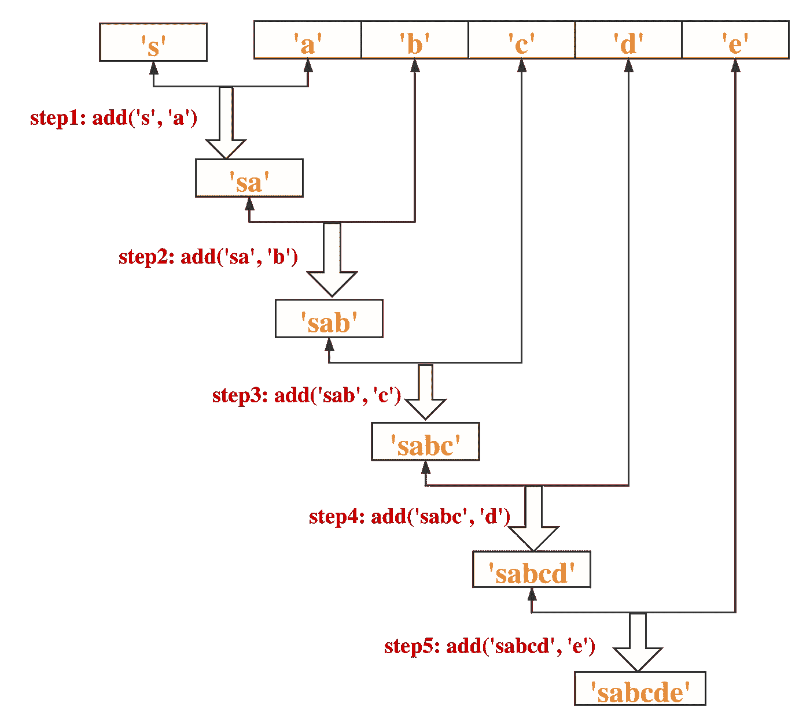

所以我们可以用这个语法来重写我们的第一段代码。

```
var arr = ['a', 'b', 'c', 'd', 'e'];function add(x, y) {
    return x + y;
}arr.reduce(add, '')
```

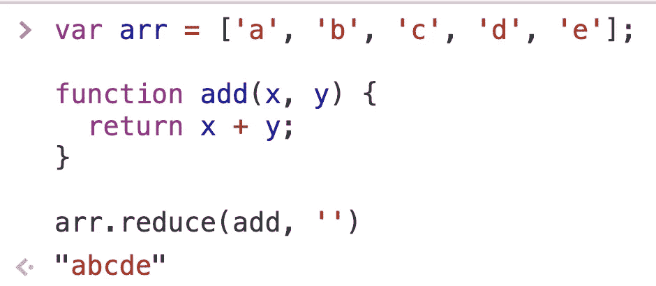

好了，以上就是`reduce`法的基本介绍。让我们回到开头的例子。

现在让我们用几个例子来看看`reduce`方法是如何代替 for-loop 的。

## 1.累积和累积乘法

如果我们想得到数字数组中所有元素的和，你会怎么做？

一般来说，你可以这样写:

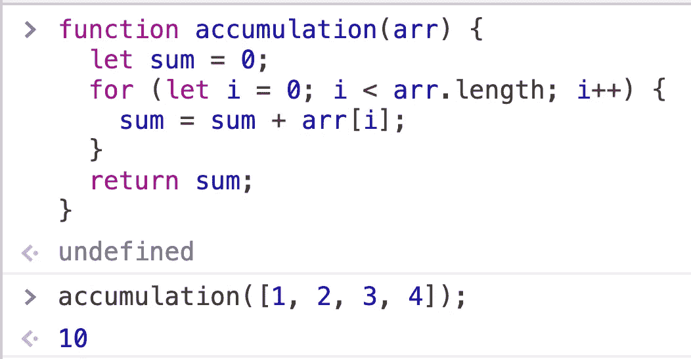

你可以使用`for-in`或者`for-of`来代替，但是只要你使用 for 循环，代码就会显得多余。在这种情况下，`Array.prototype.reduce`可以帮助我们更好地编写代码。

然后让我们看看上面的累加函数是做什么的:

*   将初始`sum`设置为零
*   取出数组中的第一个元素并求和
*   在`sum`中缓存上一步的结果
*   依次取出数组中的其他元素，执行上述操作
*   返回最终结果

我们可以看到，当我们用通俗易懂的英语描述上述步骤时，很明显符合`reduce`的用法。所以我们可以用`reduce`重写上面的代码:

如果您习惯使用箭头函数，上面的代码看起来会更简洁:

所有代码都在一行中！

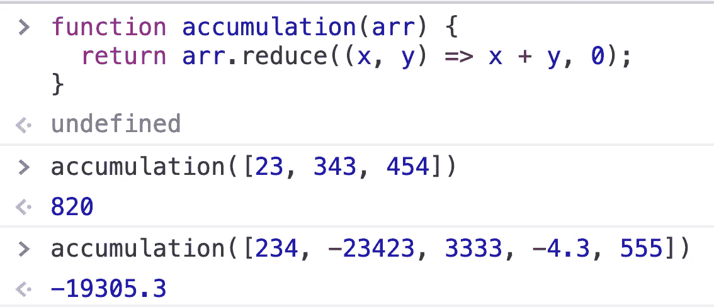

当然，累积乘法和累加是完全一样的:

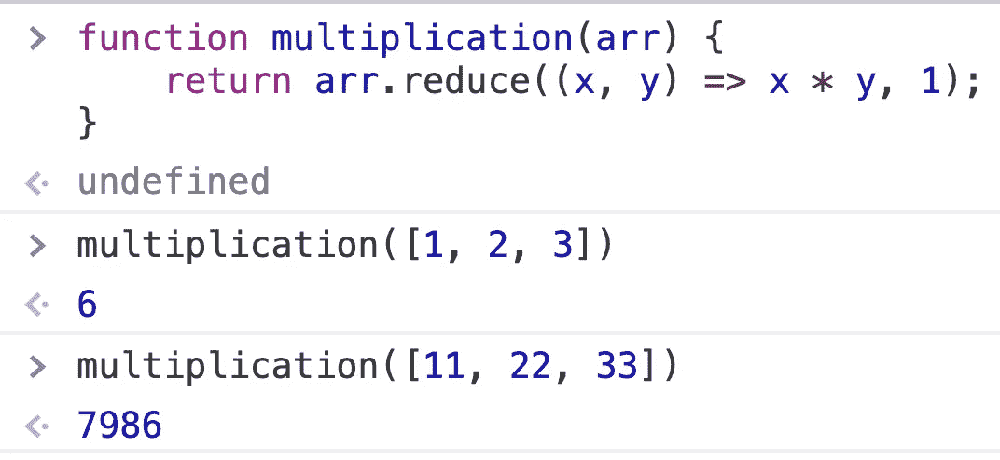

很多时候我们在总结的时候需要加一个砝码，这样更能体现出`reduce`的优雅。

```
const scores = [
  { score: 90, subject: "HTML", weight: 0.2 },
  { score: 95, subject: "CSS", weight: 0.3 },
  { score: 85, subject: "JavaScript", weight: 0.5 }
];const result = scores.reduce((x, y) => x + y.score * y.weight, 0); 
```

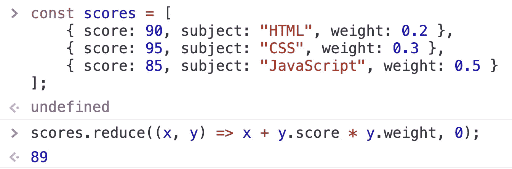

## 2.获取数组的最大值和最小值

如果你想得到一个数组的最大值和最小值，你可以这样写:

和以前一样。如果我们使用`reduce`，我们可以在一行代码中完成。

```
let arr = [3.24, 2.78, 999];arr.reduce((x, y) => Math.max(x, y));arr.reduce((x, y) => Math.min(x, y));
```

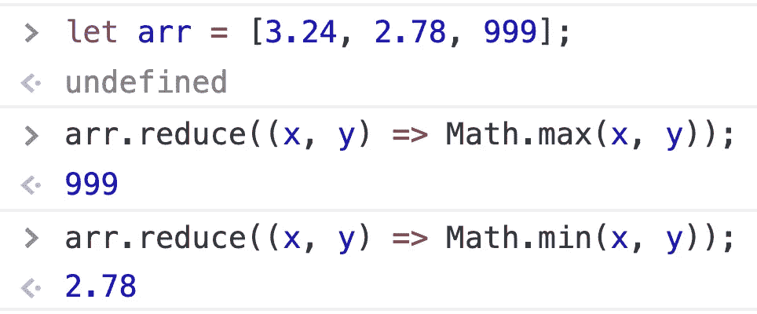

## 3.计算数组中元素的频率

我们经常需要计算数组中每个元素出现的次数。根据 for 循环的语法，我们可以这样写

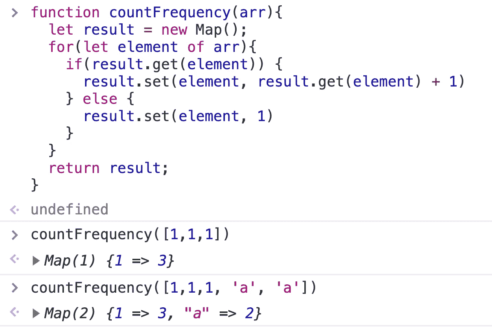

`reduce`方法也可以帮助我们以不同的方式实现这一点。

注意，我们使用 map 对象而不是 object 来存储统计后的频率，因为数组中的元素可能是 object 类型，而 object 的 key 只能是 string 或 symbol 类型。

这里有两个例子:

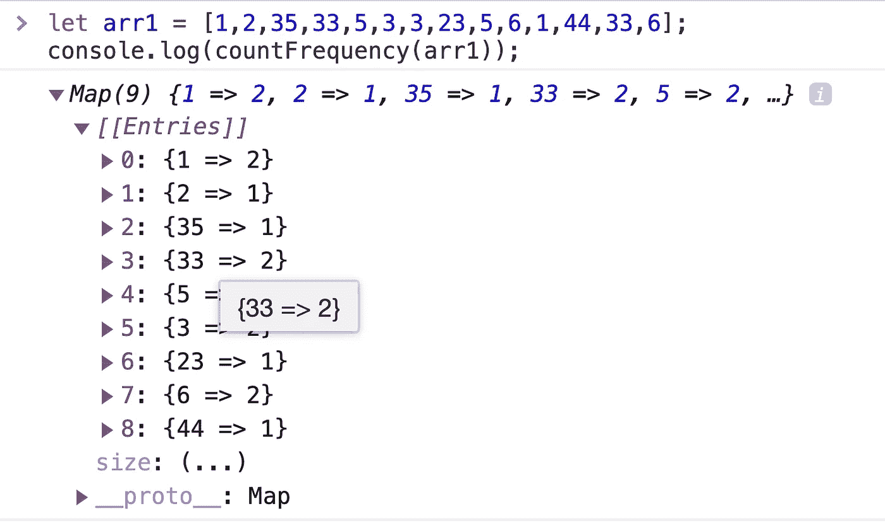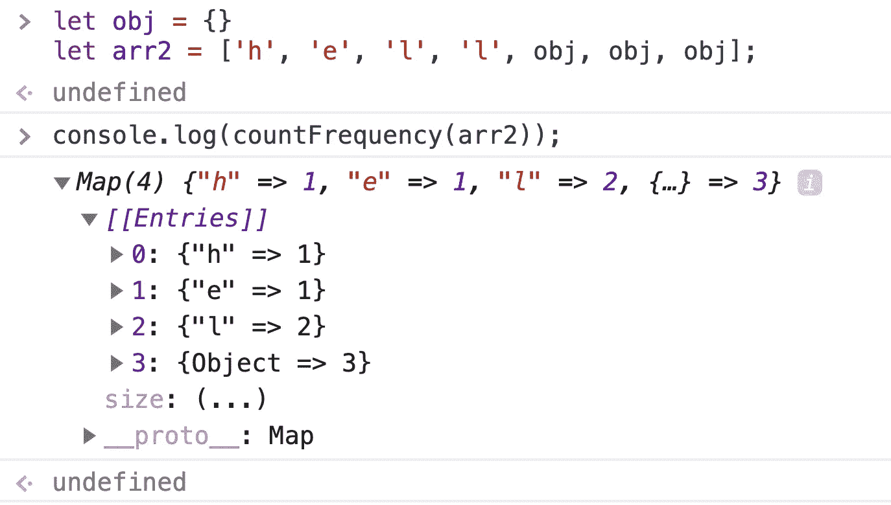

同样，如果要统计字符串中每个字符的出现频率，可以先将字符串转换为字符数组，然后按照上面的方法进行。

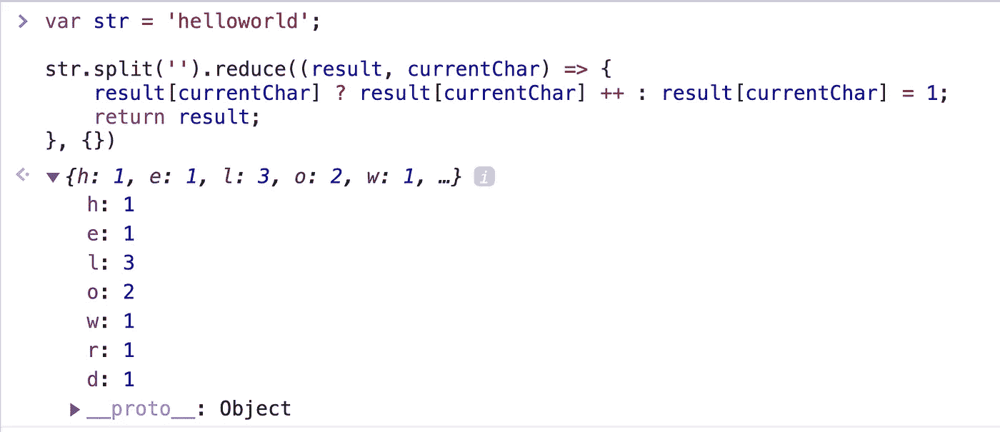

因为字符类型可以用作对象的键，所以我们在这里不使用 Map。

# 一些

我们可能经常检查一个数组是否包含一个满足条件的值。例如，检查数字数组中的任何元素是否是 7 的倍数。

带 for 循环:

```
var numbers = [233, 324, 5666, 324, 456];function hasMutipleOfSeven(numbers){
  for (let number of numbers) {
    if(number % 7 === 0) {
      return true
    }
  }
  return false
}
```

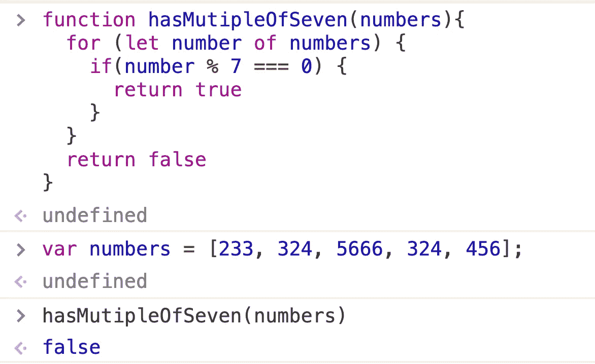

`some()`方法测试数组中是否至少有一个元素通过了由提供的函数实现的测试。它返回一个布尔值。

```
var numbers = [233, 324, 5666, 324, 456];numbers.some(ele => ele % 7 === 0)
```

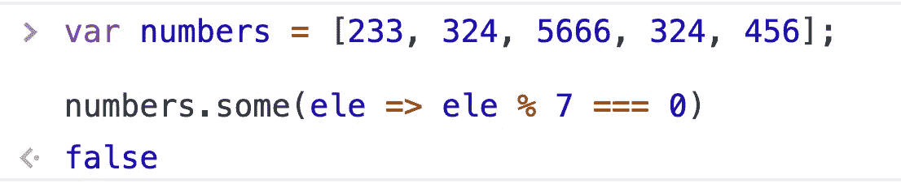

# 每个

有时我们需要检查数组中的每个元素是否满足某个条件。

例如，我们希望检查字符数组中所有元素的第一个字母都是大写的。

带 for 循环:

```
var strArray = ["Tom", "bitfish", "Jerry"]function checkFistLetter(arr){
  for(let str of arr){
    let firstLetter = str.charAt(0);
    if(firstLetter < "a" || firstLetter > "z"){
      return false
    }
  }
  return true
}
```

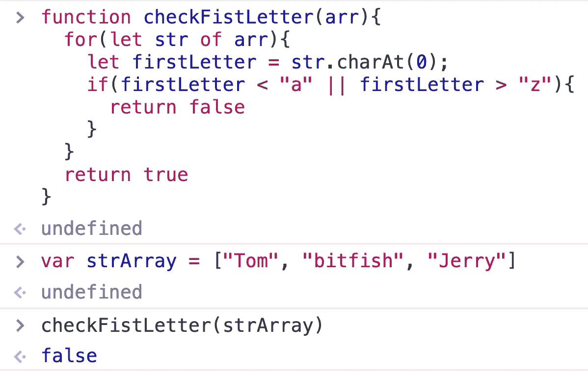

`every()`方法测试数组中的所有元素是否都通过了由提供的函数实现的测试。它返回一个布尔值。

```
var strArray = ["Tom", "bitfish", "Jerry"]strArray.every(str => {
  let firstLetter = str.charAt(0);
  if(firstLetter < "a" || firstLetter > "z"){
    return false
  }
})
```

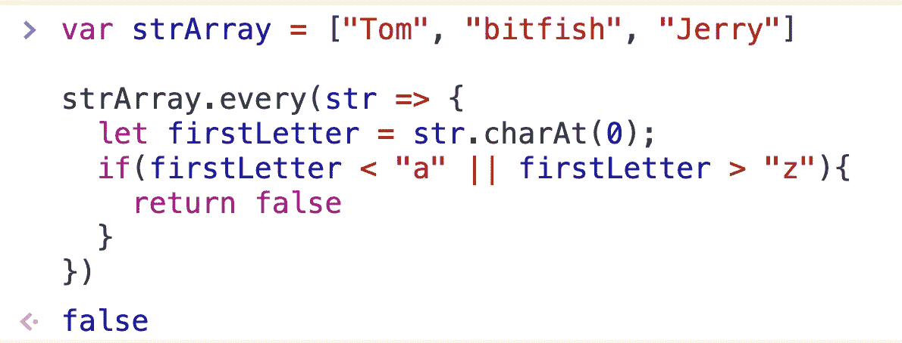

使用这些高阶函数来遍历数组使得我们的代码更具语义性和可读性。同时，不要忘记 JavaScript 是一种函数式编程语言，这些高阶函数的使用可以让我们习惯用函数式编程的思维去思考。

最后，感谢你读到这里，希望这篇文章对你有所帮助。

## **简明英语团队的笔记**

你知道我们有四种出版物吗？给他们一个关注来表达爱意吧:[**JavaScript in Plain English**](https://medium.com/javascript-in-plain-english)，[**AI in Plain English**](https://medium.com/ai-in-plain-english)，[**UX in Plain English**](https://medium.com/ux-in-plain-english)，[**Python in Plain English**](https://medium.com/python-in-plain-english)**—谢谢，继续学习！**

**此外，我们总是有兴趣帮助推广好的内容。如果您有一篇文章想要提交给我们的任何出版物，请发送电子邮件至[**submissions @ plain English . io**](mailto:submissions@plainenglish.io)**，并附上您的媒体用户名和您感兴趣的内容，我们将会回复您！****