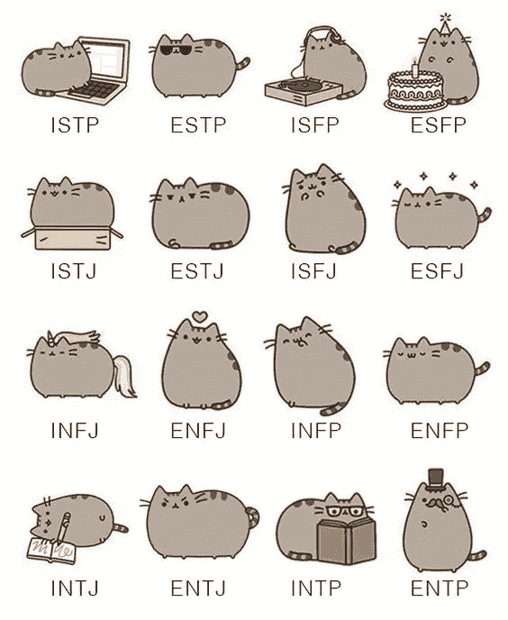

# 开始 Babylon.js

> 原文：<https://javascript.plainenglish.io/making-visual-music-in-real-time-ccd6e7a2b4fe?source=collection_archive---------11----------------------->

## 一口大小的学习:一个迷你系列的编程视觉音乐

New York City (Posted on 9/11/2020) Jonathan Riley, Unsplash

# Babylon.js 用于实时计算机图形

首先，我们为什么要编程实时图形？我猜实时是自然的，不是吗？事情发生在当下。

当计算机图形学慢得令人痛苦时，人们开始开发流水线来减慢速度，研究和计算一帧图形，然后进行构图；有时制作一小段视觉音乐需要几个月的时间。

现在的制作程序没有任何问题，也能出大作。但是为什么实时计算机图形学已经很了不起了，为什么不试一试呢？

只有实时给你真正的动态响应的作品，它也使现场表演成为可能。

# 编程语言与用户界面

很多时候，UI 更快，好的 UI 真的很有帮助。根据定义，它是接口。对于复杂的任务，如 3D 建模，UI 当然有帮助，这就是为什么我们有像 Maya 或 TouchDesigner 这样的东西。

我要说一些听起来很老套的话:语言会解放你的思想。UI 是为常见任务设计的。如果你只知道接口，那么你的工作就有些受限，并符合特定软件工具的风格。

懂一门语言将有助于你理解幕后发生的事情。几乎所有的软件都提供了编程接口，因为 UI 不足以满足所有的需求。

Metropolitan Opera House, Photo by [Alev Takil](https://unsplash.com/@alevtakil?utm_source=unsplash&utm_medium=referral&utm_content=creditCopyText) on [Unsplash](https://unsplash.com/s/photos/programming-experience?utm_source=unsplash&utm_medium=referral&utm_content=creditCopyText)

# 开发者体验

开发者体验最近才成为一个话题。在 c++(T1)占主导地位的时候，我想人们在编程语言和开发环境方面没有太多的选择。

约翰·杜威在他的名著*艺术即体验*中要求人们珍惜生活或工作中任何时刻的体验。

> “一生太短，无法用语言来表达一种情感。然而，在现实中，诗人和小说家在处理情感方面甚至比心理专家更有优势。对于前者，建立一个具体的情境并允许*它*唤起情绪反应。艺术家不是用理性和象征性的术语来描述一种情感，而是“做了孕育这种情感的事情”

事实是，程序员也是人。当一种语言功能强大但难以使用时，它最终会被抛在后面，变得过时。我们会选择一种能完成这项工作的语言，而且最好不是以一种痛苦的方式。

对于实时 3D 图形，前两个选择是 three.js 和 babylon.js，从我自己的体验来说，babylon.js 让生活变得更简单。你要知道 js 代表 JavaScript，是前端编程的主导语言。Babylon.js 现在原生基于 TypeScript，它是 JavaScript 的超集。就像为音乐选择音乐厅一样，语言的选择实际上会影响你的体验。

使用一个政治上不正确的类比，如果我们能得到正确的类型，我们知道如何更好地处理它。

MBTI types as Pusheen the Cat (from [https://teatimewithanintj.tumblr.com/](https://teatimewithanintj.tumblr.com/))

# 迷你系列学习

让我们用 Babylon.js 完成一系列 5 个简短的会话，并制作一个简单的片段。每个会话都大致基于前一个会话。如果您喜欢继续学习，您会发现从每个会话中查看 Github 比基于上一个会话的库进行构建更容易。

Debussy Arabesque No 1 (Made with Babylon.js, Sean Zhai)

1.  为 Babylon.js 和 TypeScript 设置环境。

 [## Babylon.js TypeScript 项目设置

### 快速启动项目，享受 TypeScript 开发的自动化构建过程。

medium.com](https://medium.com/the-innovation/babylon-js-typescript-project-setup-for-the-impatient-d8c71b4a57ad) 

2.创建动画循环。

 [## 一口大小的学习:巴比伦的动画

### 打字稿中的面向对象练习

medium.com](https://medium.com/the-innovation/bite-sized-learning-animation-in-babylon-js-cbf9bcf69331) 

3.在形状中建模参数化形状。

 [## Babylon.js 中的运动建模

### 一口大小的学习:空间中的形状研究

medium.com](https://medium.com/swlh/modeling-with-motion-in-babylon-js-25d0df72a767) 

4.让它听起来有反应。

 [## 音频活动:一个可视化古典音乐的技术练习

### 德彪西阿拉贝斯克№ 1 在巴比伦. js

medium.com](https://medium.com/javascript-in-plain-english/audio-active-a-technical-exercise-on-visualizing-classical-music-a164d49be1a8) 

5.调整粒子系统。

 [## 视觉音乐:从贝拉焦的喷泉中学到什么

### 一口大小的学习:巴比伦的粒子系统

medium.com](https://medium.com/javascript-in-plain-english/visual-music-what-to-learn-from-bellagios-fountains-8ec4f41a2017) 

我将继续建设，并会增加第 6 部分，当它出来。

# 作为体验的视觉音乐

我们都曾在某个时刻被深深触动，以至于我们想一次又一次地重温那段经历。

最终，我们希望创作出一首能与人交流的视觉音乐。编程是实现这一目标的一种可能方式。

干杯。

[Subscribe to Decoded, our official YouTube channel!](https://www.youtube.com/channel/UCtipWUghju290NWcn8jhyAw)