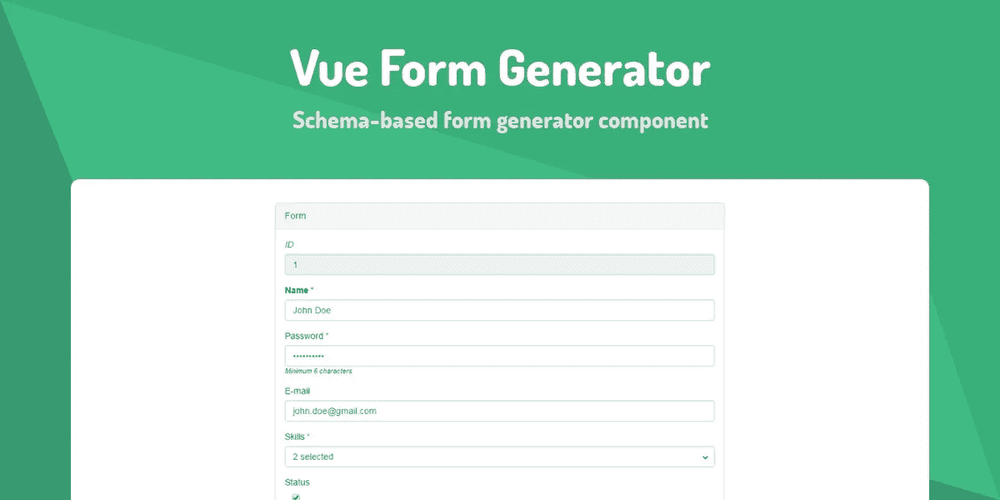

# 使用 Vue Formulate 和 Vue Form Generator 简化 Vue.js 表单

> 原文：<https://javascript.plainenglish.io/making-vue-js-forms-easy-with-vue-formulate-and-vue-form-generator-de513bf0fcaa?source=collection_archive---------1----------------------->


Image from [undraw.co](https://undraw.co/)

如果你从事过一段时间的 web 开发，你会意识到表单是一种痛苦。这是大多数用户与应用程序，尤其是 CRUD 应用程序交互的主要方式。因此，您希望找到创建表单的最简单方法是有道理的。

幸运的是，Vue.js 有一些很棒的包，使得创建表单很容易。在这篇文章中，我们将研究几种用尽可能少的代码创建表单的方法。

# Vue 公式


Vue Formulate

[Vue formula](https://github.com/wearebraid/vue-formulate)采用基于模板的方法来构建表单。所有事情都在组件的模板中处理，而不是指定数据属性。只需要知道两个部分:FormulateForm 和 FormulateInput。

## 装置

要安装 Vue Formulate，请在项目的根目录下运行以下命令:

```
npm install @braid/vue-formulate
```

然后，将 Vue Formulate 作为插件添加到 src/main.js 中:

```
import Vue from 'vue'
import VueFormulate from '@braid/vue-formulate'Vue.use(VueFormulate)
```

您也可以导入它们的样式。如果您使用的是 SCSS，您可以将其添加到您的主 SCSS 文件中:

```
@import '../node_modules/@braid/vue-formulate/themes/snow/snow.scss'
```

如果你正在使用 CSS，你可以添加一个新的 CSS 文件，并在这里添加样式[然后导入到你的 main.js 文件中。](// scss/main.scss @import '../node_modules/@braid/vue-formulate/themes/snow/snow.scss';)

## 注册表单代码

现在，在组件文件模板标记内，您可以添加表单。您将会看到，您实际上只需要了解 FormulateForm 和 FormulateInput 组件就可以使用该表单。

```
<FormulateForm *v-model*="formValues" @submit="handleSubmit">
 <FormulateInput 
  *name*="name" 
  *label*="Name" 
  *validation*="required" 
 />
 <FormulateInput 
  *name*="email" 
  *label*="Email" 
  *validation*="required|email" 
 />
 <FormulateInput 
  *name*="username"
  *label*="Username" 
  *validation*="required" 
 />
 <FormulateInput
  type="password"
  *name*="password" 
  *label*="Password" 
  *validation*="required" 
 />
 <FormulateInput
  *name*="favoriteLanguage"
  *label*="Favorite Language Type"
  *type*="select"
  :*options*="{Javascript: 'Javascript', VueJS: 'VueJS', CSS3: 'CSS3', HTML5: 'HTML5'}"
 />
 <FormulateInput
  *name*="acceptTerms"
  *type*="checkbox"
  *label*="Accepts Terms"
  *validation*="required"/>
 <FormulateInput 
  *type*="submit" 
  *label*="Sign up" />
</FormulateForm>
```

为了处理表单中的值，我们只需要向表单添加一个 v-model，并在导出默认值中添加一个变量。

```
*data*: () => ({
  formValues: {}
 })
```

为了处理提交，向 FormulateForm 添加一个@submit 属性，并在我们的 export default methods 属性中添加一个方法。

```
methods: {
 *handleSubmit*() {
  console*.*log("Form submitted!", this*.*formValues);
 }
}
```

# Vue 表单生成器



Vue Form Generator

[Vue 表单生成器](https://github.com/vue-generators/vue-form-generator)采用基于模式的方法来生成表单。不必为每个表单字段编写 HTML 元素，只需指定模式并向页面添加一个 HTML 元素。它支持 21 种字段类型，并具有内置验证。让我们使用 Vue 表单生成器创建一个用户注册表单。

## 装置

要安装 Vue Form Generator，您需要在项目的根目录下运行以下命令:

```
npm install vue-form-generator
```

接下来，在 main.js 中，您将添加 Vue 表单生成器作为插件，并导入它们的样式:

```
import Vue from 'vue'
import VueFormGenerator from 'vue-form-generator'
import 'vue-form-generator/dist/vfg.css'

Vue.use(VueFormGenerator)
```

## 注册表单代码

现在，您可以在任何 Vue 组件文件中使用 Vue 表单生成器。在组件脚本标签的导出默认值中，我们将为用户注册创建模型。

```
model: {
 name: '',
 email: '',
 username: '',
 password: '',
 favoriteLanguage: [],
 acceptTerms: false
}
```

接下来，我们将创建一个名为 schema 的属性，该属性设置为一个对象，其中包含一个字段数组。

```
schema: {
 fields: [
  {
    type: 'input',
    inputType: 'text',
    label: 'Name',
    model: 'name',
    required: true,
     validator: "string"
  },
  {
    type: 'input',
    inputType: 'email',
    label: 'E-mail',
    model: 'email',
    placeholder: 'email@example.com',
    required: true,
    validator: "email"
  },
  {
    type: 'input',
    inputType: 'text',
    label: 'Username',
    model: 'username',
    readonly: false,
    disabled: false,
    required: true,
    validator: "string"
  },
  {
    type: 'input',
    inputType: 'password',
    label: 'Password',
    model: 'password',
    min: 6,
    required: true,
    hint: 'Minimum 6 characters',
    validator: 'string'
  },
  {
    type: 'select',
    label: 'Favorite Language Type',
    model: 'favoriteLanguage',
    values: ['Javascript', 'VueJS', 'CSS3', 'HTML5']
  },
  {
    type: 'checkbox',
    label: 'Accept Terms',
    model: 'acceptTerms',
    default: false,
    required: true,
    validator: 'required'
  },
  {
   type: "submit",
   *onSubmit*(model) {
    console*.*log("Form submitted!", model);
   },
   label: "",
   buttonText: "Submit",
   validateBeforeSubmit: true
  }
 ]
}
```

设置完字段后，我们可以在表单上设置一些选项:

```
formOptions: {
 validateAfterLoad: false, //Do not validate on load
 validateAfterChanged: true, //Validate after a field is changed
 validateAsync: true
}
```

我们需要做的最后一件事是将组件添加到模板中。

```
<vue-form-generator 
  :schema="schema" 
  :model="model" 
  :options="formOptions"
></vue-form-generator>
```

您将在模式中看到一个类型为“submit”的对象。在那里你还会看到 onSubmit 函数。您将在那里处理提交表单的逻辑。

# 视频演示

Video Demo

# 结论

无论您使用 Vue Formulate 还是 Vue Form Generator，都可以更容易地创建表单。我倾向于 Vue Formulate，因为它需要更少的代码，但是 Vue Form Generator 更健壮。我很想听听你的想法。你更喜欢哪种 Vue 表单包？在下面的回复部分写一行。

下次再见，祝编码愉快！

git Repo:[https://bit bucket . org/the ligent dev/vue-form-builders/src/master/](https://bitbucket.org/TheDiligentDev/vue-form-builders/src/master/)