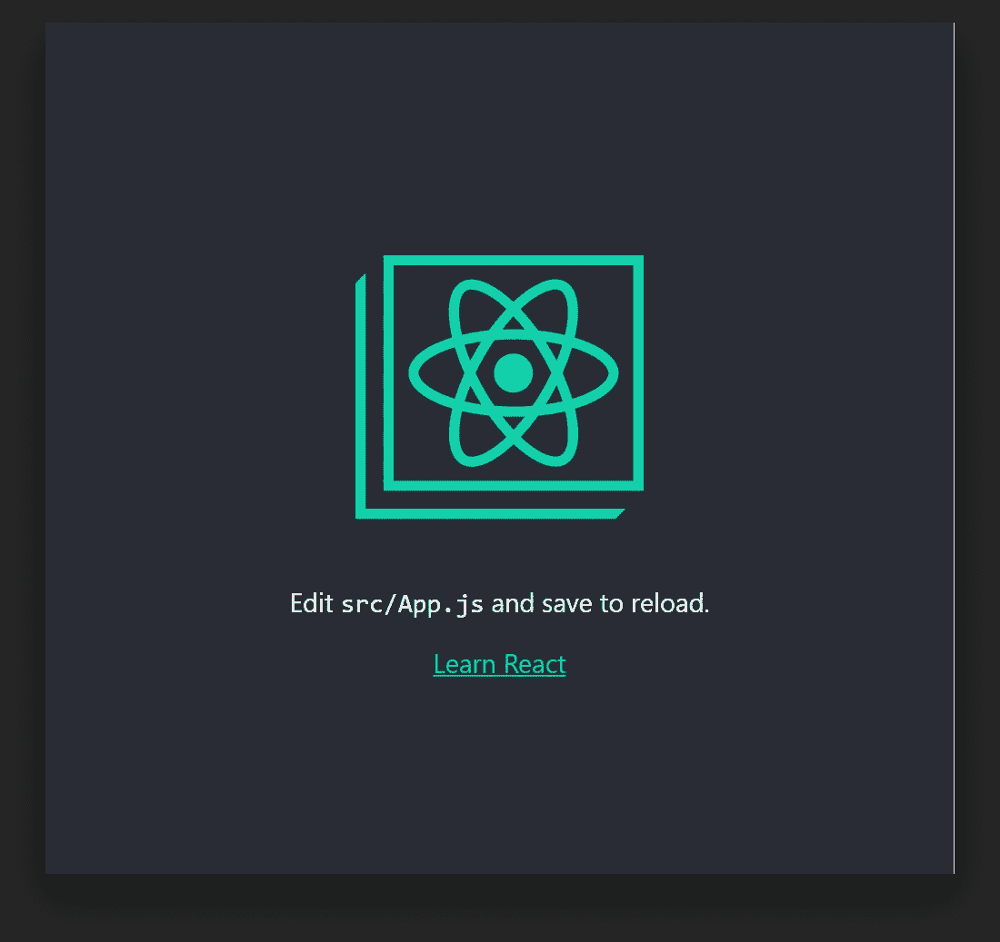
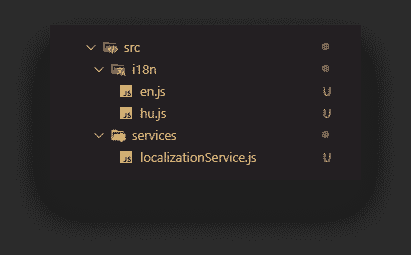
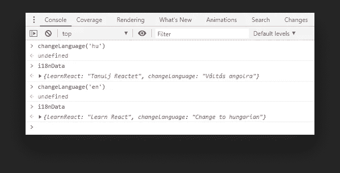
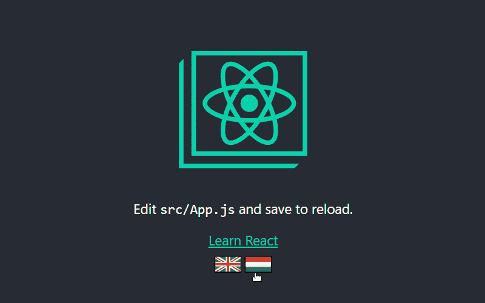
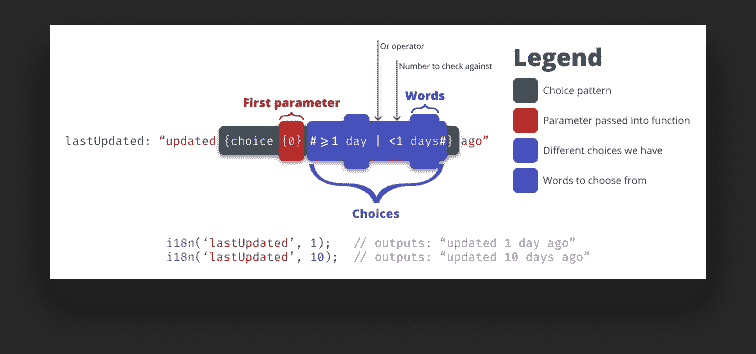
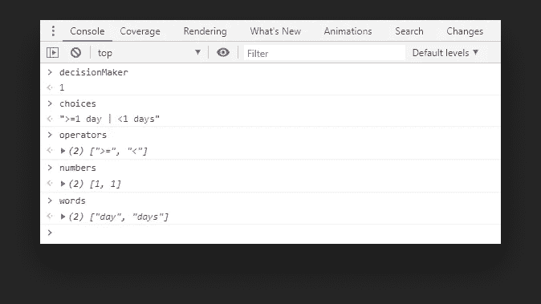
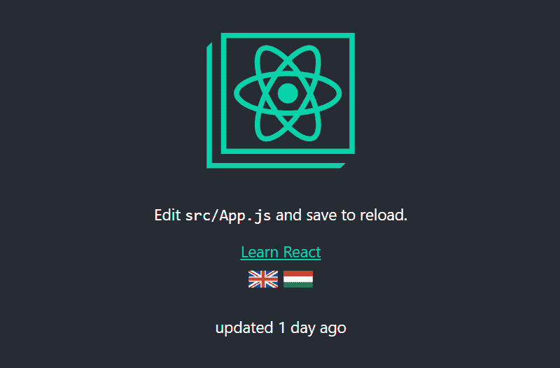

# 用普通的 JavaScript 让你的 React 应用程序多语言化

> 原文：<https://javascript.plainenglish.io/making-your-react-app-multilingual-with-vanilla-javascript-6979937e7ede?source=collection_archive---------4----------------------->

## 使用选择模式支持编写自己的 i18n 服务


Photo by [Ferenc Almasi](https://unsplash.com/@flowforfrank?utm_source=unsplash&utm_medium=referral&utm_content=creditCopyText) on [Unsplash](/@flowforfrank?utm_source=unsplash&utm_medium=referral&utm_content=creditCopyText)

[](https://www.webtips.dev/making-your-react-app-multilingual-with-vanilla-javascript)

在过去，把你的网站变成多语言天堂是一件痛苦的事情。如果您想在不重新加载页面的情况下进行翻译，您必须付出额外的努力。

幸运的是，现在我们有很多选择。每周都会出现新的库，没有一个框架是你找不到特定工具的。

然而，本教程不是关于如何使用一个已经存在的。我们将看看幕后，看看我们如何实现我们自己的本地化服务，根据我们自己的需求定制，没有任何外部依赖。

你唯一需要的是一个 React 应用程序和一些业余时间。所以不要再浪费时间了，让我们开始吧。

# 自举反应

为了避免从头构建一个 React 应用程序，但仍然从一开始就涵盖所有内容，我决定使用 [create-react-app](https://create-react-app.dev/) 。要引导应用程序，运行`npx create-react-app i18n`，其中 i18n 将是文件夹的名称。npx 自带 NPM 5.2 以上版本，所以你应该已经有了。

如果你已经全局安装了`create-react-app`，用`uninstall -g create-react-app`卸载它，确保 npx 使用最新版本。

运行`npm run start`应该会显示以下内容:



# 创建服务

让我们从添加一些文件夹和文件来概述项目结构开始。为了保持事物的分离，我为这项服务创建了一个新文件夹，并将其命名为`localizationService`。我还添加了一个`i18n`文件夹，它将保存所有的本地化密钥，每种语言都在它自己的独立文件中。



每个语言文件将导出一个包含应用程序中使用的所有字符串的对象:

在组件内部，我们希望使用这样的插值键:`{i18n('learnReact')}`将解析为“Learn React”，以防网站以英文显示。如果加载了`hu.js`，将显示匈牙利语翻译。

因此，首先，我们需要将语言文件导入服务。我们可以创建一个包含所有语言的对象，我们希望确保向窗口公开这些键。

我还添加了一个`defaultLanguage`变量来检查浏览器的语言。如果是英语，我们用英语值填充`i18nData`，否则我们退回到匈牙利语。

为了获得给定键的本地化值，我们可以添加`i18n`函数。最简单的形式是，它的唯一目的是根据提供的键返回字符串:

# 在组件中使用服务

为了检查运行中的服务，我在“Learn React”链接下添加了两个新按钮，它们将用于切换语言:

点击图片将调用`changeLanguage`方法，我们传入`data-language`来决定激活哪种语言。然后，我们需要重新呈现组件，以使更改可见。

现在，我们的`App`是一个无状态的功能组件，所以我们不能访问用于强制重新呈现的`this.forceUpdate`。要解决这个问题，将您的`App`函数转换成一个类，然后我们可以添加`changeLanguage`方法:

此外，导入本地化服务以在组件内部使用它。我们还没有定义`window.changeLanguage`，所以让我们回到`localizationService`并用下面的函数扩展它:

我们简单地将`i18nData`重新分配给作为参数传递的语言。要在组件中试用它，请将“Learn React”替换为{i18n('learnReact')}。

如果您使用 create-react-app 引导应用程序，ESLint 将因使用未定义的变量而引发错误。要正确配置它，您可以运行`npm run eject`来访问配置文件，并在您的`.eslintrc`文件中的`globals`内添加一个规则:

或者让它立即消失而不弹出，只需在文件的顶部添加下面一行:

```
*/* global i18n */*
```

您现在可以调用`changeLanguage`来更改`i18nData`中的翻译。



结合强制更新，它将触发一个重新招标，使网站改变语言。



# 添加参数支持

现在，这个服务是非常基本的，它只能返回静态字符串。但是如果我们想要有参数呢？假设我们有一个显示天气状况的字符串，我们有下面的字符串:“今天是 32 度”。显然它并不总是 32°C，它可以改变，所以我们最好将它作为参数传递，例如:{i18n('weatherCondition '，32)}

为了检测将参数注入字符串的位置，我们需要一个特殊的插值语法。大多数模板引擎使用花括号，所以我们可以遵循这个惯例。为了允许插入多个参数，我们还可以从 0 开始对它们进行编号，因此我们可以用{0}、{1}、{2}等来表示参数。

为了继续上面的例子并把所有的东西放在一起，我们将把语言文件中的字符串写成“Today it's {0} degrees ”,其中{0}将代表第一个参数，并将被传递给 i18n 函数的变量所替换。

记住上面提到的一切，我们可以用以下几行扩展本地化服务:

我们的 i18n 函数现在接受第二个参数:`params`。如果没有传递参数，我们使用初始的解决方案:`return window.i18nData[key]`。如果我们有一个参数，*(我们需要显式地检查 0，否则 If 将被评估为 false)* 我们创建一个名为`i18nKey`的新变量，这是我们将返回的内容。

开始时，它的值将是我们从`i18nData`得到的空字符串。为了转换它，我们需要首先检查我们传入的`params`是否是一个对象，因为我们可以有多个参数传入，最好是作为一个数组。如果只有一个值，我们可以用传递给函数的参数替换{0}。否则，我们遍历数组，用传递给函数的值替换每个值。

为了进行测试，向语言文件添加一个新的键:

并在组件内部调用它来查看它的解析。它还可以处理多个参数:

# 添加选择模式支持

它开始变得完整，但是如果我们有一个更复杂的翻译呢？考虑以下情况:我们希望显示用户何时更新了他们的设置，因此我们有一个本地化键，上面写着:“x 天前更新”。基于参数，该字符串可以有多个变量，可以是:

*   1 天前更新
*   10 天前更新

根据天数的不同，单词“day”可以有多种形式。这就是选择模式发挥作用的地方。让我们再次从示例字符串开始，看看我们希望如何在语言文件中编写模式:

我们把所有东西都放在花括号里，我们可以用单词“choice”来表示一个选择模式，后面跟一个参数。在标签之间，我们可以用一个数字定义一个操作符，后面跟着要使用的单词，例如:

*   如果参数小于或等于 1，我们使用单词“日”
*   如果它大于 1，我们使用“天”这个词

我们可以通过将它们连接在一起来定义更多的变化。



The structure of the choice pattern visualized

为了识别这种模式，我们必须使用正则表达式。如果你不熟悉正则表达式，我有一篇关于这个主题的文章，你可以点击[这里](https://www.webtips.dev/understanding-regular-expressions-in-javascript)。

用下面的 if 语句扩展 i18n 函数将使选择模式成为可能:

为了分解它，我们有两个正则表达式；一个用于选择模式，一个用于其中的选择。如果我们有一个匹配，我们创建一些变量:



DecisionMaker is the parameter passed into the function, while numbers is the number to check against

我们想从选择模式中得到单词的正确形式。为此，我们循环遍历第 21 行的单词，并在它们对应的操作符之间切换。如果传递给函数的数字基于`operator`和它后面的数字产生一个真值，我们给它分配一个新的索引。

最后，在第 32 行，我们用传递的参数替换选择模式，并用空格将单词连接在一起。

如果您将这个新段落添加到组件中，您将看到 choice 模式在起作用。将 1 改为 10 也会将“日”改为“天数”:



Choice pattern in action: I’m changing the param while hot reloading is active

# 可能的改进

这是预期的工作，我们可以用它生成一些非常复杂的翻译，但作为一切，这也可以进一步改进。为了给你一些建议，你可以:

*   将语言迁移到后端，只请求网站上使用的语言。这样可以避免在客户端引入所有语言。
*   为了避免污染全局名称空间，请将本地化服务公开的每个函数放入一个容器对象中
*   选择模式只能接受单个单词，添加对句子的支持

总结一下，我们可以看到，处理本地化并不是一件神奇的事情，了解了关键概念，您就可以轻松地实现自己的版本，并且具有接触边界之外的用户的优势。🌍

[](https://medium.com/@ferencalmasi/membership)[](http://webtips.dev/)