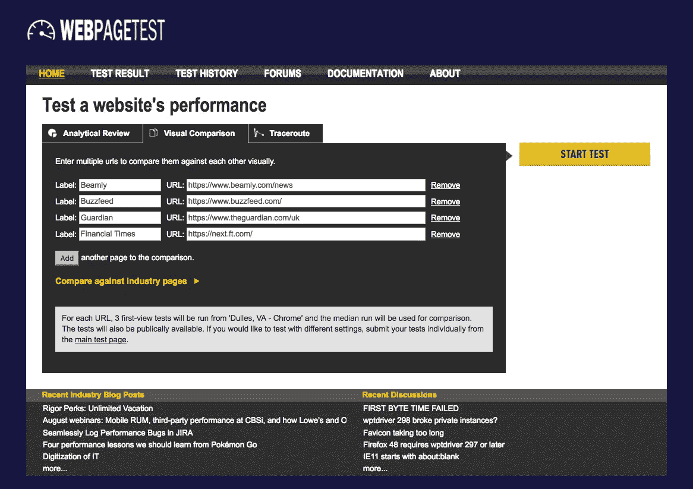

# 让你的利益相关者意识到网站性能的影响

> 原文：<https://javascript.plainenglish.io/making-your-stakeholders-aware-of-the-impact-of-website-performance-b57c31911ed2?source=collection_archive---------8----------------------->

Thanks to [Cris Ovalle](https://unsplash.com/@crisovalle) for this photo

如果你看过我的演讲或者和我一起工作过，你就会知道一件事，那就是当谈到表演的时候，我会有点着迷。

当我在浏览器中打开`webpack-bundle-analyzer`分析一个 JavaScript 包来找出砧板上的下一个是什么时，发现我肯定不会感到不寻常。通常，任何超过 10KB 的都是公平的游戏，看看是否有我可以使用的替代品。

我对 web 性能如此着迷的原因是我了解性能对用户体验的影响。毕竟，我希望使用我制作的网站的用户有很好的用户体验，因为这是我创建网站的原因，我希望我创造的产品能给人们的生活带来改变。

我痴迷的极限是，我是一个单独的开发人员，这可能会限制我自己的影响力。为了增加这种影响，我需要与我正在从事的项目的所有利益相关者一起提高绩效，从我的直属团队一直到负责我所在业务部门的总经理。为了让绩效成为我们衡量自己的关键指标，这些利益相关者必须认同绩效对我们的业务至关重要。

# 围绕绩效标准化你的语言

当我们与利益相关者讨论绩效时，我们必须在团队中使用共同语言。因此，有必要让我们的利益相关者了解不同类型的性能，以及当我们说我们的网站慢(甚至快)时，我们指的是什么。

我们教育利益相关者的一种方式是让他们了解不同种类的绩效。我通常与利益相关者谈论的三个问题如下:

**渲染性能**

“呈现性能”是浏览器开始为用户呈现页面所需的时间。这是浏览器有足够的数据可以开始绘制页面的时候了。

在浏览器开始呈现你的网站之前，你的用户对你的网站的最初体验仅仅是盯着一个空白的白色屏幕。直到浏览器呈现页面，他们才开始看到内容。

衡量页面渲染性能的关键指标是“首次绘制时间”。

**页面加载性能**

“页面加载性能”是指页面准备好所有相关资源(如下载和加载的样式表和图像)所需的时间。在我们的用户今天使用丰富的、大量使用 JavaScript 的页面之前，“页面加载性能”是衡量 web 性能最常用的指标。

问题是，它不再反映用户何时可以使用页面，所以现在不经常使用它。

**感知表现**

感知性能不同于“渲染性能”和“页面加载性能”，因为它主要是根据用户对网站性能的感知来衡量的。具体来说，是用户认为你的网站有多快，而不一定是技术统计所说的速度。

当考虑影响页面感知性能的指标时，您应该考虑“交互时间”和“首次输入延迟”。

# 比较这三种类型的性能

为了进一步展示这三种类型的表演，我在卫报网站上制作了以下视频。为了帮助说明这一点，我在 iPhone 上用慢速 3G 连接加载网站。为什么不看看你自己是否能发现这三种类型的表现？

在播放视频时，您应该能够看到我之前提到的三种类型的性能。这些是:

*   4 秒时，页面开始呈现；这就是“渲染性能”
*   在第 7 秒，我们可以看到内容和图像开始可用；这就是“感知性能”
*   在 32 秒时，我们将看到页面已经完成加载；这就是“页面加载性能”

# 为什么绩效对利益相关者很重要？

在与利益相关方就我们谈论绩效时使用的语言进行标准化后，下一步就是与利益相关方合作，帮助他们理解为什么绩效对您的业务至关重要。

您使用的叙述可能取决于您的利益相关者是谁，仅举几个例子:

对于**设计师**来说，可感知的性能对网站的用户体验有影响。在他们有机会使用你的网站之前，如果你的页面需要很长时间来加载，用户就已经有了不好的体验。

对**客户/产品经理**来说，业绩会影响他们试图实现的目标。大多数客户/产品经理的目标是达到特定的 KPI。这些例子可能是:

*   新注册人数
*   将获取或留住客户的成本降至最低
*   更高的访客回头率
*   访客跳出率更低
*   更高的交互率

对 **SEO 经理**来说，性能对于搜索引擎，尤其是谷歌，分配给你的页面的排名至关重要。

# 用数据证明性能的好处。

为了支持性能正在对您的业务产生影响的说法，您能做的最好的事情就是开始使用数据。

有两种数据可以用来帮助你证明在网站性能上花费的时间是合理的，每一种都需要增加投资来实现。

# 第三方案例研究

我建议你花时间看的第一类数据是其他企业的案例研究，关于性能改进如何使他们的网站受益。

有许多公司乐于分享他们从提高网站性能中获得的积极成果。其中的一些例子是:

*   亚马逊发现，加载页面每延迟**100 毫秒**，他们的销售额就会损失 **1%** 。
*   谷歌体验到，加载搜索结果的额外**500 毫秒**延迟导致流量下降了 **20%**
*   该铁路线减少了 0.3 秒的等待时间，并且每年增加了 800 万张门票的销售。
*   沃尔玛看到每 **1 秒**他们减少页面负载，他们的销售额就**增加**2%。

还有很多企业发现提高网站性能有助于他们的业务。找到这样的案例研究的最好方法是去看看 https://wpostats.com。

从努力的角度来看，查看关于绩效影响的案例研究是最少的努力。价值也是最弱的，因为案例研究中访问网站的用户可能与使用您网站的用户不同，所以您的里程可能会有所不同。

# 你的真实用户数据

除了使用其他网站的案例研究之外，还有一种方法是收集您自己的数据，了解绩效如何影响您的网站。

如何做到这一点就是对页面执行 A/B 测试，确定性能的提高是否会对业务产生积极的影响。

首先，您可以选择一个页面，其中包含您希望客户实现的特定操作(如购买产品)，并设置分析，以便您知道该操作何时完成。然后，您将在该页面上设置一个 A/B 测试，向 50%的用户显示慢速页面，向 50%的用户显示快速页面。

如果无法生成页面，那么您可以用一种省时的方式测试更快的速度，然后考虑为 50%的页面速度越来越慢的用户故意减慢页面速度。

如果您对在自己的网站上捕获数据的更多细节感兴趣，那么请查看这篇文章—[https://medium . com/@ JonthanFielding/programmatically-performant-capture-web-performance-data-using-JavaScript-ab 2571 b 31 FD 3](https://medium.com/@JonthanFielding/programatically-performant-capturing-web-performance-data-using-javascript-ab2571b31fd3)，它讲述了如何使用 Segment 来捕获真实的用户指标。

# 好处难在哪里论证？

对我们来说，很容易将显示业绩增长的指标与 KPI(如注册)的增长联系起来。然而，拥有一个不容易跟踪的高性能站点还有其他影响。

难以衡量收益的关键指标是搜索引擎排名。因此，你不太可能会发现一项研究表明，性能的提高与更好的搜索引擎排名有关。这样做的原因是有大量的因素有助于网站的搜索引擎排名。

这包括在我们控制范围内的事情，例如内容和在我们控制范围之外的事情，包括哪些网站链接到我们的网站和竞争网站的内容。

当谈到搜索引擎优化，我们因此需要采取搜索引擎(谷歌，必应等。)的话，我们的网站性能会影响我们的排名。

# 性能的竞争优势

已经用数据证明了性能的优势，我们可以看到，在一个网站上有性能的竞争优势。因此，重要的是我们要确保我们的网站比我们的竞争对手更有性能。

为了与我们的竞争对手进行比较，我们可以使用网页测试来进行视觉比较。为此，我们可以访问[https://www.webpagetest.org/video/](https://www.webpagetest.org/video/)，并输入我们想要对比的不同竞争对手。

一旦测试运行完毕，你就可以导出一个这样的视频，展示你的网站和你的竞争对手。下面是我制作的一个视频例子，比较了 Beamly 和它的几个竞争对手。

# 我的网站应该快多少？

能够以我们的竞争对手为基准，使我们能够看到我们如何与他们竞争。为了获得竞争优势，我们希望确保我们的网站比竞争对手加载得更快。

Steven Seow 在他的书[“设计和工程时间”](https://amzn.to/2aNzOXN)中确定了我们应该达到的最低目标，他提出了一个 20%的规则。20%法则如下:为了让你的用户感觉到一个任务比另一个任务快，时间差至少要有 20%。

Tim Kadlec 在他的文章“[足够快](https://timkadlec.com/2014/01/fast-enough/)”中总结了这一点在网络上的应用，他说:

> 例如，说一个竞争对手的网站在 5 秒钟内加载。5 秒的 20%就是 1 秒。因此，要想被认为比他们更快，你需要让你的页面运行时间不超过 4 秒(5 秒的加载时间——20%的差异)。

因此，在比较我们的竞争对手时，我们希望查看速度更快的竞争对手的加载时间，然后将我们自己的目标设定为少 20%。然而，对此添加一个警告是很重要的；如果你的竞争对手的网站需要 10 秒钟加载，你只需要在 8 秒钟内加载你的网站，但 8 秒钟仍然是一个非常慢的网站。在这种情况下，你应该力争比你的竞争对手快得多。

# 概括起来

我们网站的性能对于为用户提供良好的用户体验至关重要。作为了解绩效的技术层面的人，确保绩效在我们的工作场所得到支持往往是我们的责任。

为了帮助他们理解绩效的影响，我们需要标准化我们使用的语言，所以我们谈论的是同一件事，作为这一部分，我们需要他们理解我在这篇文章中强调的三种不同类型的绩效。特别注意你的页面的感知性能对你的用户有多重要。

一旦你的利益相关者理解了我们用来谈论性能的语言，那么教育他们拥有一个高性能的网站对业务的好处就变得至关重要了。

我们教育他们认识到这些好处的最好方法是使用数据。这可以通过使用案例研究、关于你的竞争对手的数据以及你拥有的关于你自己的用户的任何数据来实现。