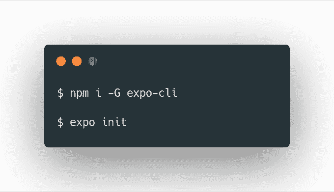
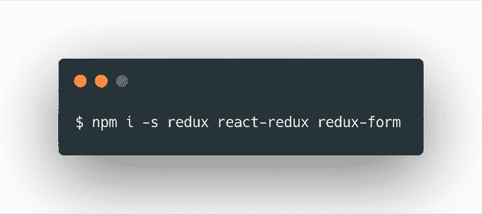
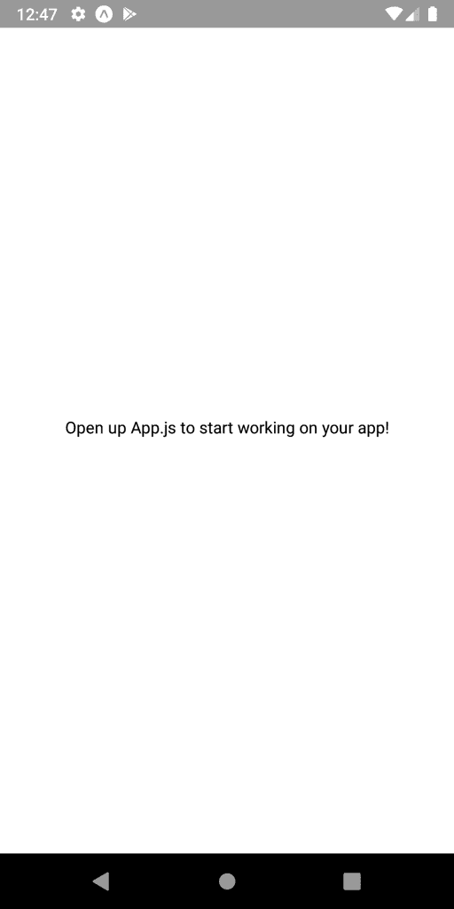
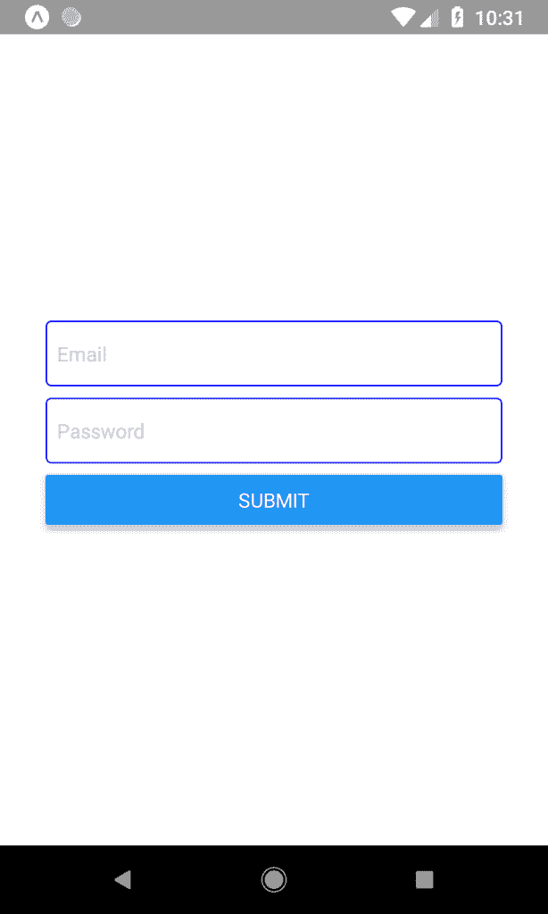
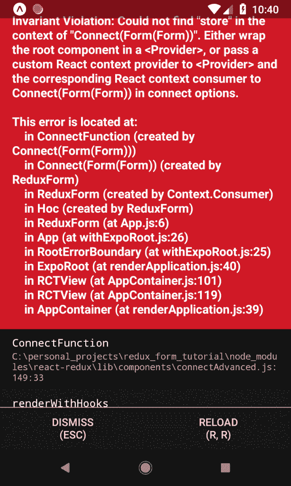
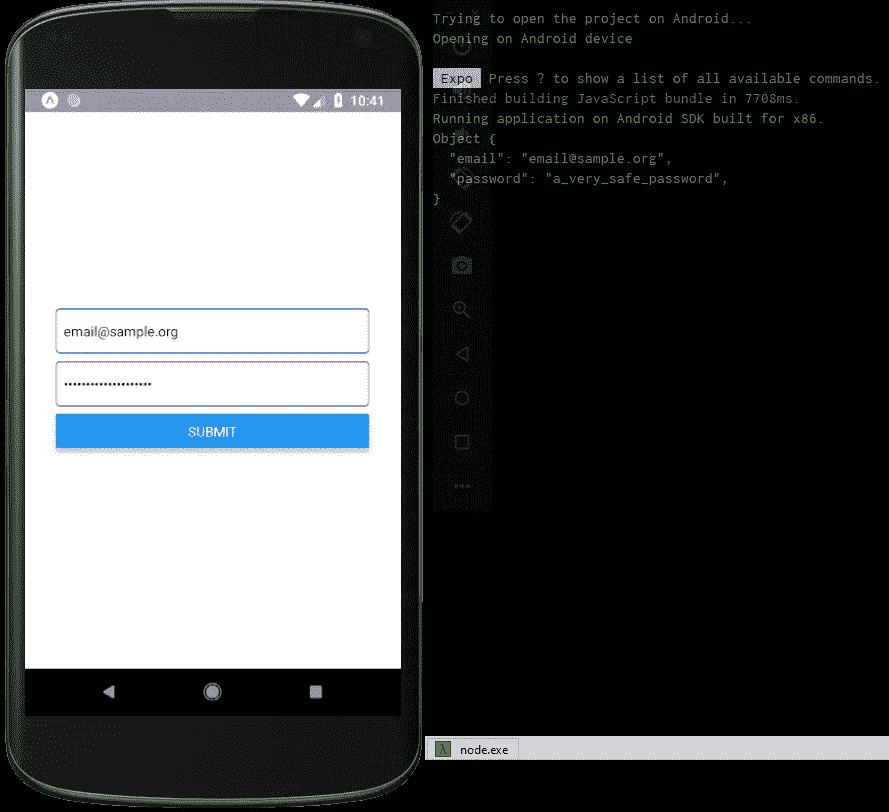
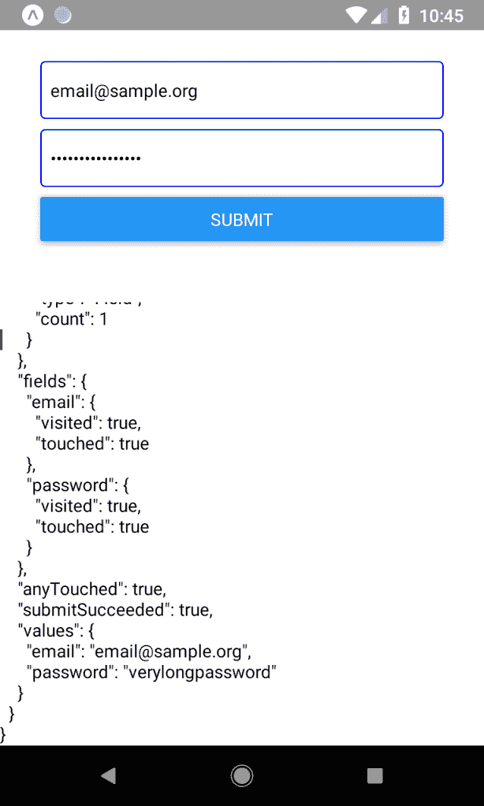

# 用 Redux-Form 管理 React 本机表单状态

> 原文：<https://javascript.plainenglish.io/managing-react-native-form-state-with-redux-form-d5a63c0a5679?source=collection_archive---------4----------------------->

Photo by Kelly Sikkema on Unsplash

在开发移动应用程序时，您可能不得不实现某种形式。这可能是一个简单的登录表单，也可能是一个复杂的报告系统，然而，您将面临一些挑战。你如何验证数据？表单状态存储在哪里？如何控制表单的生命周期？这些问题和许多其他问题的答案在下面等着，我会告诉你如何将 [Redux Form](https://redux-form.com/8.2.2/) 与 React Native 一起使用。

# 为什么一开始要用 Redux？

Redux 是一个全局状态管理的解决方案。你可以用它来存储任何时候定义你的应用的所有东西。但是为什么要用 Redux 来形成状态管理呢？

将状态存储在 Redux 而不是 React 状态有很多原因(比如`useState` hook)。其中一些是:

1.  您需要在应用程序的其他地方访问这些数据。
2.  您有多个相互同步的表单
3.  表单中的数据必须比组件存在的时间长

相反，在某些情况下，Redux 对于一个表单来说是多余的:

1.  这是一次性的表格。卸载组件后，您将不再需要这些数据。
2.  应用程序中的任何其他地方都不需要该表单中的数据。

现在我将教你在 React Native 中用 Redux 表单管理表单状态的方法。

# 创建沙盒应用程序

首先，您需要创建一个简单的应用程序来学习如何使用`redux-form`库。为了简单起见，我们将使用 Expo SDK 来设置一切:

当询问应用类型时，选择*空白*并为您的应用命名。现在您需要添加依赖项:

`redux`是状态管理库本身，`react-redux`有绑定在 react 中使用`redux`，`redux-form`提供了一个 reducer 和一个 HOC(高阶组件)来处理表单状态。如果你现在启动应用程序，你应该会看到 Expo 提供的默认屏幕:

现在你已经准备好使用 Redux 表单进行黑客攻击了。

# 设置 Redux 和 Redux 表单

为了让 Redux Form 处理表单状态，您首先需要一个 Redux 存储。在项目根目录下创建一个文件`store.js`,并将以下代码放入其中:

为了简单起见，我省略了您可能使用或可能不使用的任何额外的减速器。可以看到`formReducer`是从`redux-form`导入的，用 form 键包含在`rootReducer`中。关键很重要，应该一直是`form`。现在让我们创建一个`Form`组件！将该代码放入`Form.js`:

这是一个非常简单的表单，要求输入电子邮件和密码，并做了一些小的修改。它现在应该是这样的:

要将它与 Redux 表单连接起来，您需要做两件事:连接`TextInput`和处理表单提交。编辑`Form.js`这样:

因为 `redux-form`提供了一个`onChange`回调而`TextInput`期望一个`onChangeText`，所以你必须提供一个助手方法来将一个回调函数转换成另一个回调函数(第 12 行)。我们还从 props 中提取了一个`handleSubmit`函数，它是由第 47 行上使用的`reduxForm` HOC(高阶组件)提供的。出于调试的目的，我们只是记录表单值，但是可以随意使用它做一些更复杂的逻辑。

但是，如果您现在尝试启动它，您会得到:

这是因为我们从未将我们的商店从 `store.js`连接到应用程序本身。你可以像这样编辑`App.js`来修复它:

全部完成！现在，如果您按提交按钮，您将看到您的值记录到控制台:

# 额外收获:查看表单状态

取回表单数据很好，但是 Redux Form 提供了更多的功能，但是我现在不打算详细介绍。相反，我将向您展示来自 Redux 的原始表单状态，您可以弄清楚您想用它做什么。为此，在`StateViewer.js`中创建一个新的`StateViewer`组件，并将以下代码放入其中:

`StateViewer`组件获取整个 Redux 表单状态，将其序列化为漂亮的 JSON 并输出到屏幕上。

请注意州中所有不同的字段。您不仅可以获得任意时间点的字段值，还可以查看它们是否被*访问过*或*触摸过*以及提交是否成功。很漂亮，你不觉得吗？

在这篇短文中，我试图向您展示 React Native 中 Redux 表单的强大功能以及如何在您的项目中使用它，请让我知道它对您或您所知道的任何其他表单状态解决方案有何帮助！