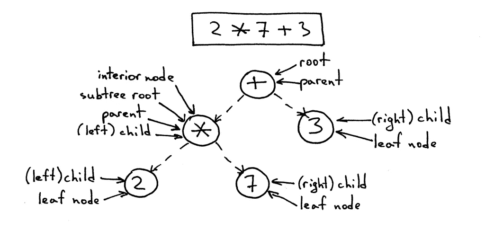

# 用 JavaScript 操作 AST

> 原文：<https://javascript.plainenglish.io/manipulating-ast-with-javascript-baac3b92f1ed?source=collection_archive---------2----------------------->

之前，我已经谈到了如何编写巴别塔转换(T1)，我更深入地探讨了 T2 巴别塔(T3)，通过 T4 展示如何创建定制的 JavaScript 语法(T5)，我展示了巴别塔如何将你的代码解析成 AST，转换它并生成代码。

有了用 Babel 运行 JavaScript AST 的知识和经验，让我们看看如何将这些知识推广到其他语言中。

> *当我提到“其他语言”时，我实际上指的是流行的前端语言，例如:*[*JavaScript*](https://www.ecma-international.org/publications/standards/Ecma-262.htm)*，*[*TypeScript*](http://typescriptlang.org/)*，*[*Sass*](https://sass-lang.com/)*，*[*CSS*](https://www.w3.org/Style/CSS/)*，*
> 
> **当然，不仅限于前端语言。只是用 JavaScript 写的这些语言比其他语言，比如 C++或者 Java，更容易找到解析器。**

# *解析器*

*就像我们如何使用 Babel 来解析和生成 JavaScript 一样，还有其他库可以帮助我们解析和生成我们的语言。*

*找到这些库的一个简单方法是通过 https://astexplorer.net/。*

*选择一种语言后，您会看到一个解析器列表，您可以用它来解析您的语言。例如，如果您选择 **HTML** ，有 [htmlparser2](https://github.com/fb55/htmlparser2) ， [hyntax](https://github.com/nik-garmash/hyntax) ， [parse5](https://github.com/inikulin/parse5) …当您选择其中一个解析器时，您可以立即在右侧面板上看到 AST 的样子，而 Github 链接到右上角的解析器。*

*这里有一个不完整的解析器列表，它是`parse`和`generate`方法:*

*   *HTML(解析:[解析 5](https://github.com/inikulin/parse5/tree/master/packages/parse5) ，解析:`[parse5.parse(str)](https://github.com/inikulin/parse5/blob/master/packages/parse5/docs/index.md#parse)`，生成:  `[parse5.serialize(ast)](https://github.com/inikulin/parse5/blob/master/packages/parse5/docs/index.md#serialize)`)*
*   *Markdown(解析:[备注](https://github.com/remarkjs/remark)，解析:`[unified().use(remarkParse)](https://github.com/remarkjs/remark/tree/master/packages/remark-parse)`，生成:`[unified().use(remarkStringify)](https://github.com/remarkjs/remark/tree/master/packages/remark-stringify)`)*
*   *CSS(解析器: [css 树](https://github.com/csstree/csstree)，解析:`[csstree.parse(str)](https://github.com/csstree/csstree/blob/master/docs/parsing.md)`，生成:`[csstree.generate(ast)](https://github.com/csstree/csstree/blob/master/docs/generate.md)`)*
*   *JavaScript(解析器:[巴别塔](https://babeljs.io)、解析:`[babel.parse(str)](https://babeljs.io/docs/en/babel-parser#babelparserparsecode-options)`、生成:`[babel.generate(ast)](https://babeljs.io/docs/en/babel-generator)`)*

*正如您所看到的，大多数解析器同时提供解析和生成方法。*

*因此，一般来说，您可以使用以下内容作为模板来编写代码转换代码:*

*当然，您可以将一种语言的 AST 转换成另一种语言的 AST，例如:Sass ➡️ CSS，标记➡️ HTML，并使用另一种语言的生成器来生成代码。*

*现在有了这个模板，让我们来谈谈更神奇的*东西，即*变换函数*。**

# **遍历 AST**

**顾名思义，AST 采用树形数据结构。为了磨练操纵 AST 的技能，我们需要回忆起我们对*【算法 101】***深度优先搜索(DFS)** 树遍历算法的远距离记忆。**

**[vaide hai Joshi](https://twitter.com/vaidehijoshi)在[上写了一篇令人惊叹的文章，揭开了深度优先搜索](https://medium.com/basecs/demystifying-depth-first-search-a7c14cccf056)的神秘面纱，我想我没有更好的解释了，所以如果你想回顾一下深度优先搜索，请在我们继续之前去阅读[她的文章](https://medium.com/basecs/demystifying-depth-first-search-a7c14cccf056)。**

**现在您对深度优先搜索的工作原理有了更清楚的了解，AST 上的深度优先搜索应该是这样的:**

**然后我们可以用我们的操纵代码填充`TODO`。**

**如果我们发现自己需要用不同的 AST 操作进行多次遍历，我们会很快意识到将 AST 操作代码和遍历代码混合在一起是*不够干净的*。当然，您会意识到*传递一个回调函数会更干净*，这个函数在我们每次访问一个节点时都会被调用:**

**`visit`功能现在足够通用，您可以将其用于任何 AST:**

**当然，您会认为在回调函数中拥有父节点的信息和当前节点的键/索引会很有用:**

**现在，我们可能会想，我不想为每个被访问的节点得到回调，我只需要为某个节点回调。您可能会想在`visit`函数中添加一个条件:**

**但是你要三思:*如果别人想用* `*visit*` *但是用不同的条件进行回调怎么办？***

**大多数情况下，您只希望回调到特定类型的节点。在这种情况下，您可以将节点类型的映射传入各自的回调函数，而不是传入回调函数:**

**在这一点上，你可能意识到，*嘿，这看起来很像 AST 遍历库！*是的，这就是它们的实现方式。**

**现在我们可以遍历 AST，找到我们感兴趣的节点，所以下一步是操作它们。**

**操纵 AST 可以分为 3 种不同的操作:**

*   **添加节点**
*   **替换节点**
*   **删除节点**

# **添加节点**

**要添加节点，可以将其分配给节点的键控属性:**

**或者如果键控属性是数组，则推送新节点:**

**要将节点添加为同级节点，您可能需要访问该节点的父节点:**

# **替换节点**

**要将当前节点替换为另一个节点，请更新当前节点的父节点的 key 属性:**

**如果父项的键属性是数组:**

# **删除节点**

**要删除当前节点，请删除当前节点的父节点的 key 属性:**

**如果父项的键属性是数组:**

> ******添加*** *、* ***替换*** *、* ***删除*** *节点的操作非常常见，通常作为一个实用函数来实现。****

***然而，有一个重要的步骤**我没有提到:在你改变节点之后，你需要确保遍历仍然正常工作。*****

***对于作为其父节点的键的属性的节点，添加、替换和删除它们通常是可以的。除了替换操作，您可能需要重新访问*“当前节点”*，这是*新的替换节点*。***

***但是，对于数组中的节点，需要特别注意更新循环的数组索引:***

***但是你怎么知道当前节点被删除了呢？***

***嗯，知道一个节点何时被删除有时是一个秘密，它存在于树遍历库中的`remove` util 函数中。***

***当你打电话给`remove`的时候，它可以像设置一面旗帜一样简单:***

***但是有时，不需要从树遍历库中导入`remove` util，`remove`函数在`visitCallback`的`this`中可用:***

***现在你已经学习了操纵 AST 的 3 个基本操作，你可能想知道如何使用这些基本操作来编写一个 codemod 或 AST 转换插件？***

***嗯，在我的[分步指南](https://lihautan.com/step-by-step-guide-for-writing-a-babel-transformation)中，我已经解释过，你可以使用像[http://astexplorer.net/](http://astexplorer.net/)或[巴别 AST 浏览器](https://lihautan.com/babel-ast-explorer)这样的 AST 浏览器来帮助你。***

***您需要:***

*   *****了解您想要更改的代码部分在 AST 中的样子**，这样您就可以针对特定类型的节点，并且***
*   *****知道您希望在 AST** 中看到的最终输出是什么样子，这样您就知道要创建、更新或删除哪些节点。***

***因此，我们将详细阐述这两个步骤。***

# ***瞄准一个节点***

***节点定位，大多数时候，只是一大堆`===`。***

***例如，如果您想要将一个包含一个``和一个 [htmlparser2](https://github.com/fb55/htmlparser2) 中的`<figcaption>`的类`foo`作为目标:***

***您需要检查:***

***为了使它不那么冗长，我们可以将每个检查重构为可重用的函数:***

# ***创建节点***

***有几种方法可以创建 AST 节点。***

***最简单粗暴的方法是**手动创建节点对象**。大多数时候，节点对象是一个 JavaScript 对象。所以您可以手动创建它们:***

***当创建大型复杂的 AST 节点时，它可能会变得笨拙，所以有时库决定提供构建器函数，如 [@babel/types](https://babeljs.io/docs/en/babel-types) 来简化节点创建并提供默认值:***

***它看起来更加简洁和整洁，但很难理解和掌握它是在创建什么节点。***

***所以，创建复杂 AST 节点的更好方法，是使用`parse`函数+ `string`:***

***对于 Babel，有一个神奇的 util 叫做 [@babel/template](https://babeljs.io/docs/en/babel-template) ，在这里您可以使用[模板文字](https://developer.mozilla.org/en-US/docs/Web/JavaScript/Reference/Template_literals)来创建 AST 节点:***

***我们已经经历了:***

*   ***如何使用深度优先搜索算法遍历 AST，***
*   ***3 个基本的 AST 操作，添加、替换和删除，***
*   ***如何在 AST 中定位一个节点，以及***
*   ***如何创建 AST 节点***

***[Dinesh (@flexdinesh)](https://twitter.com/flexdinesh) [发推文](https://twitter.com/flexdinesh/status/1196680010343432192)他口袋里收藏的 AST 资源:***

*   ***[代码转换和带有 ASTs 的林挺](https://frontendmasters.com/courses/linting-asts/)***
*   ***[编写你自己的代码转换以获得乐趣和利润](https://kentcdodds.com/blog/write-your-own-code-transform/)***
*   ***[通过构建自己的 Babel 插件来理解 ASTs](https://www.sitepoint.com/understanding-asts-building-babel-plugin/)***
*   ***[编写你的第一个巴别塔插件](https://github.com/jamiebuilds/babel-handbook/blob/master/translations/en/plugin-handbook.md#toc-writing-your-first-babel-plugin)***
*   ***[这就是我如何构建巴别塔插件](https://medium.com/the-guild/this-is-how-i-build-babel-plug-ins-b0a13dcd0352)***
*   ***[编写我的第一个巴别塔插件](https://varunzxzx.github.io/blog/writing-babel-plugin)***

******原载于***[【https://lihautan.com/】T21](https://lihautan.com/manipulating-ast-with-javascript/)***