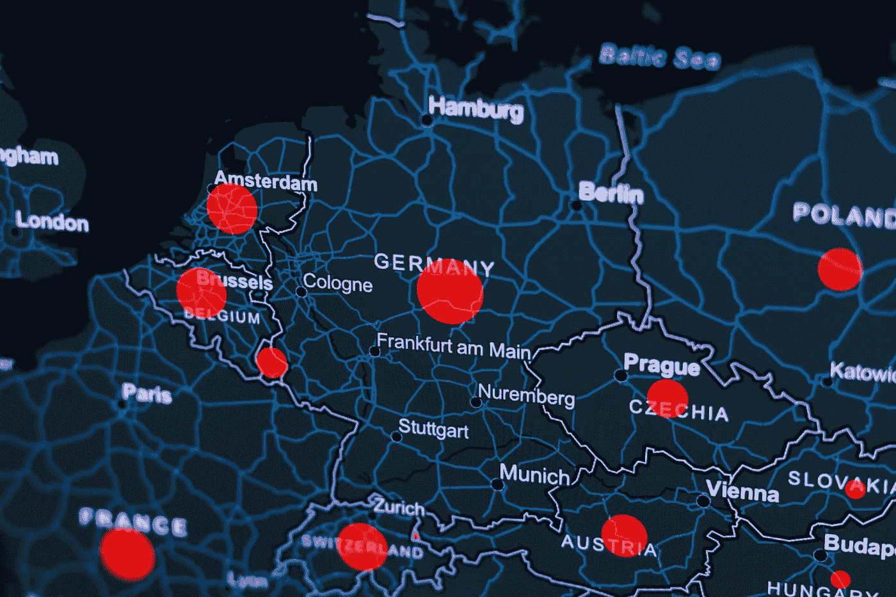
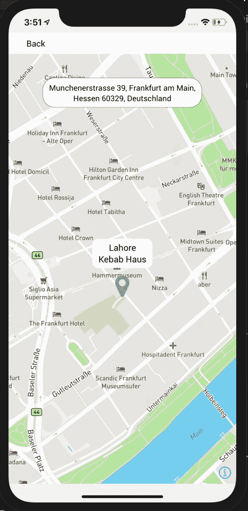

# 在 React Native 中的地图框地图上标记坐标

> 原文：<https://javascript.plainenglish.io/mark-a-coordinate-on-mapbox-map-in-react-native-5d21c71ed46e?source=collection_archive---------2----------------------->

Photo by [KOBU Agency](https://unsplash.com/@kobuagency?utm_source=medium&utm_medium=referral) on [Unsplash](https://unsplash.com?utm_source=medium&utm_medium=referral)

如果您正在构建一个围绕地图和位置的应用程序，您可能需要在屏幕上标记特定的位置/坐标。虽然这对于 iOS 来说很容易，但对于 Android 来说事情可能会变得有点混乱。

我编写了一个例子，说明如何用自定义标记来标记位置，这样它就可以完美地适用于 iOS 和 Android 平台。

# **主屏幕**

首先，创建一个主屏幕，在这里你将放置你的`MapContainer`或任何其他按钮。

[https://github.com/nhammad](https://github.com/nhammad)

# 地图容器

接下来，创建另一个组件，这将是您的地图容器。这将包含几个子组件。

## MapboxGL。地图视图

地图被创建并保存在 MapView 中。注意`Id`字段需要是一个字符串。

## MapboxGL。照相机

有了相机，你基本上可以放大坐标，并在屏幕上显示地图的放大版本。`zoomLevel`和`animationDuration`可以根据需要进行调整。

## MapboxGL。MarkerView

`MarkerView`是我们放置自定义标记的地方。这在 Android 上可能会引起问题。为了避免这种情况，请记住以下几点:

*   确保您的`AnnotationContent`被包裹在视图下。
*   确保你的`MarkerView`本身被包裹在一个视图下。
*   Android 的风格通常会有所不同。试着编写并测试一个在两个平台上都合适的代码。

[https://github.com/nhammad](https://github.com/nhammad)

## 注释内容

这是将显示为标记的内容。即使它是一个单独的组件(例如只是一个图标或者只是文本)，也要确保它被包装在一个`<View>`中。`<Icon>`我已经从`FontAwesome`中使用过了，效果很好，但是你也可以通过添加一个`<Image>` 组件来使用自定义图像(例如:一个 svg 图像)。

[https://github.com/nhammad](https://github.com/nhammad)

## AddressTextBox

这是可选的。如果您想在地图上放置一个额外的项目，您可以这样做。注意，根据 MapboxGL 团队的说法，不可能在`<MapView>`中渲染额外的`<View>`。在我的情况下，它在 iOS 中工作，但在 Android 中不工作。

因此，您必须将它放在`<MapView>`之外，并给它的父容器一个`position: ‘absolute’`。

[https://github.com/nhammad](https://github.com/nhammad)

结果看起来有点像这样。顶部的文本框来自`AddressTextBox`，而标记图标和较小的文本框来自`AnnotationContent`

# marker view vs point annotation vs shape source

MpaboxGL 团队的 Miklós Fazekas 表示，在 iOS 上，PointAnnotation 与 MarkerView 或多或少是一样的。然而，在 Android 上，它是用 ShapeSource + SybolLayer 模拟的。在 Android 中，子 React 本地视图被捕获到静态图像中，然后显示出来。因此，举例来说，你不能在 Android 上放置一个按钮作为 PointAnnotation 的子节点。

PointAnnotations 的一个优点是它们也支持标注。一个`<MapboxGL.Callout>`组件将允许你点击一个注释，并看到一个文本框弹出。

# 如何找到一个位置的坐标

如果出于某种原因，你不能在这里使用 Mapbox，你也可以使用谷歌地图。只需在谷歌地图上打开一个位置，右键单击并选择“这里有什么”。你会看到那个位置的准确坐标。您可以复制坐标并在代码中使用它们。

请注意，坐标需要以数组的形式出现。例如:

`centerCoordinate={[8.5574, 50.7891]}`

希望这有所帮助！

## 简单英语的 JavaScript

你知道我们有三份出版物和一个 YouTube 频道吗？在[T3【plain English . io找到一切的链接！](https://plainenglish.io/)