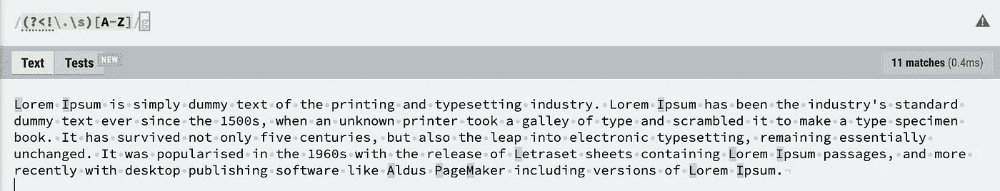
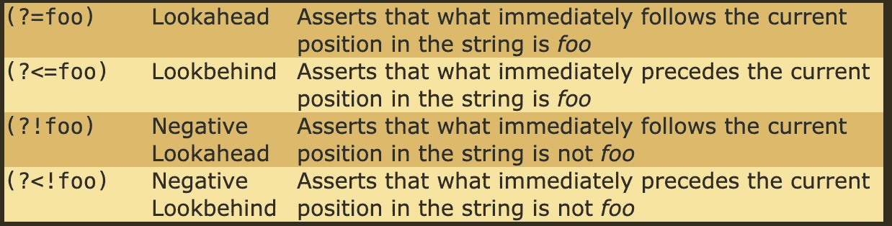
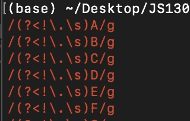

# 掌握 JavaScript 中的正则表达式

> 原文：<https://javascript.plainenglish.io/master-regular-expressions-in-javascript-7a3810b25ed7?source=collection_archive---------3----------------------->

这个指南是为了提升你的 JavaScript 正则表达式游戏。如果你是正则表达式的新手，可以从 Mozilla 的指南开始。

请从头到尾阅读本指南，因为我的一些示例是相互构建的，假设您已经掌握了前面提到的方法和正则表达式语法。

## 使用字符串方法 replace 清理多余的空间

我们可以用一个简单的正则表达式来清除字符串中的空白。下面的例子使用了`\s`和`+`，T0 是用于空格的正则表达式，T1 是用于匹配 1 个或更多前一组的正则表达式。我们使用 JavaScript 字符串方法`replace`找到所有 1 个或更多空格的空格匹配，并用 1 个空格替换它们。

replace 方法非常通用，但最基本的形式是传递一个匹配参数和一个字符串来替换匹配。

注意，这个例子也使用`trim()`来清理前导和尾随空白。通过在正则表达式中使用全局标记，它将替换所有匹配。您也可以使用`replaceAll`，但是它还没有得到普遍支持，并且在 Node.js 中无法工作(截至 11/20/20)。

## 实现您自己的修剪方法

我们也可以实现我们自己的`Customtrim`方法来清除文本中间的空白，而不仅仅是开始/结尾的空白。

或者我们可以更进一步，编写我们自己的前导/尾随正则表达式来清理用于清理内部多空格段的行的开始/结尾。(注意:有一个有用的字符串方法`trimEnd`和`trimStart`，所以这只是为了展示更多的正则表达式😉).

## 使用 RegExp + String.prototype.match

`**match()**`方法检索将*字符串*与[正则表达式](https://developer.mozilla.org/en-US/docs/Web/JavaScript/Guide/Regular_Expressions)进行匹配的结果。— MDN

根据 MDN，`**RegExp**`对象用于匹配文本和模式。创建 RegExp 对象有两种方法，要么用文字符号，要么用构造函数。让我们来看看如何使用构造函数:

这是一个非常人为的例子，但是假设您需要计算这个字符串中的字母数，并且想要使用 regex。您可以编写一个 for 循环，使用 RegExp 构造函数生成所有适用的 RegExp 对象。`gi`部分是标志`g`和`i`，它们被添加到表达式中，用于全局和不区分大小写的匹配。然后，`match`方法找到所有的匹配，我们可以使用`length`方法检查有多少匹配。利用“或空数组”，`|| []`，以防没有匹配，所以你没有在`undefined`的东西上调用`length`方法。

这是字母 a 的`string.match`结果之一，所以我们只是在匹配数组上调用`length`方法。

```
> [ 'a', 'a', 'a', 'a', 'a', 'a', 'a', 'a', 'a', 'a', 'a', 'a', 'a', 'a', 'a', 'a', 'a', 'a', 'a', 'a', 'a', 'a', 'a', 'a', 'a', 'a', 'A', 'a', 'a' ]
```

这就是你的正则表达式的样子:

## 使用带有转义字符+负 lookback 的 RegExp

您可以使您的正则表达式更复杂，以寻找更具体的东西。在这个例子中，我们将看到在 JavaScript 中需要对正则表达式序列中的字符进行转义的例子。

在下面的代码中，`RegExp`的目标是找到不在句子开头的所有大写字母。(为了简单起见，请忽略第一个字母，它不在我们的正则表达式中。)



Testing on [https://regexr.com/](https://regexr.com/)

正则表达式使用了“负向后视”。消极的后视/前视查看字符串前后的文本(取决于您使用的是哪一个)。对于否定的 look back，它会在匹配之前查看与传递的表达式相匹配的文本。如果匹配，那么这最终不是正则表达式匹配，因为我们*不想要那个匹配*。



Table from Rexegg.com [https://www.rexegg.com/regex-lookarounds.html](https://www.rexegg.com/regex-lookarounds.html)

在下面的代码中，正则表达式可能看起来很奇怪。如果你对照我们在上面的[https://regexr.com/](https://regexr.com/)图片上写的表达式，你会发现字符串中有一些额外的反斜杠。这是因为当我们在 JavaScript 字符串中输入字符时，我们必须对它们进行转义，通常我们必须对正则表达式中的字符进行转义，因为它是一个特殊的字符，所以我们有了`\\`。



因为这个测试是针对大写字母的，所以从表达式中删除了`i`标志，因为它测试的是不区分大小写。下面是我们的表情会是什么样子(左图)。

## 替换为函数参数

> 您可以指定一个函数作为第二个参数。在这种情况下，将在执行匹配后调用该函数。请注意，如果第一个参数中的正则表达式是全局的，那么对于要替换的每个完全匹配，该函数将被调用多次。— [MDN](https://developer.mozilla.org/en-US/docs/Web/JavaScript/Reference/Global_Objects/String/replace#Specifying_a_function_as_a_parameter)

语法:

`const newStr = str.replace(regexp|substr, newSubstr|function)`

在本文前面，我们使用了 replace 的一个基本用法，我们只是传递一个正则表达式并用一个给定的字符串替换匹配项。

使用函数选项，我们可以在执行匹配后调用函数来转换字符串。下面，我们有一个我们想要转换的文件名数组。我们想保持 IMG 大写，但小写的生日聚会和万圣节部分的文件名。

我们使用 regex 从字符串中提取匹配项，然后在 replace 中使用一个函数参数来小写字母。我们传递给 replace 方法的函数是一个简单的函数，它将传递给它的字符串小写。

因为我们想让 IMG 大写，所以我们可以使用 regex 提取文件名中在 IMG-后面开始的部分，在-001.jpeg 部分之前结束匹配。正则表达式匹配使用正向后视和正向前视来将我们的匹配包含到字符串的适用部分。

## 使用 RegExp.prototype.test()

`**test()**`方法搜索正则表达式和指定字符串之间的匹配，并返回`true`或`false`。

假设您需要验证一个 pin 码，它可以是 4 位或 6 位数字。我们可以使用一个简单的正则表达式，它使用匹配数字的`\d`和匹配精确数字的量词`{#}`。

在正则表达式本身上调用`test`方法，而不是在字符串上，并且字符串作为参数传递给`test`方法。

在下面的例子中，我们测试了一组有效和无效的字符串，并记录它们是否有效。

## 使用 String.prototype.search()

*"*`***search()***`*方法执行对正则表达式和* `[*String*](https://developer.mozilla.org/en-US/docs/Web/JavaScript/Reference/Global_Objects/String)` *对象之间匹配的搜索。当你想知道一个模式是否被找到，并且知道它在一个字符串中的索引时，使用* `*search()*` *。(如果你只想知道它是否存在，在* `*RegExp*` *原型上使用类似的* `[*test()*](https://developer.mozilla.org/en-US/docs/Web/JavaScript/Reference/Global_Objects/RegExp/test)` *方法，返回一个布尔值。)"— MDN*

在下面的代码中，假设您想要验证用户是否提交了评论，并且评论必须包含“是”或“否”。我们可以在 if 块中使用 search 方法来验证用户提交了有效的响应。(你可以直接用`test()`，但是我现场想不出一个现实的例子。😅)

# String.prototype.split()

在这个例子中，我们有一个各种格式的电话号码数组，我们希望返回一个数组，其中所有的电话号码都被清除了。这个例子非常简单。正则表达式使用字符集来匹配任何一个-、)、(、。、或空格一次或多次。它使用`split`方法将每个数字分割成一个数字数组，然后用一个连字符连接起来。

## 比赛

`**match()**`方法检索将*字符串*与[正则表达式](https://developer.mozilla.org/en-US/docs/Web/JavaScript/Guide/Regular_Expressions)进行匹配的结果。— MDN

我们之前讨论过这个问题，但这里有另一个来自代码战挑战的例子。任务就是简单地计算一个字符串中小写字母的总数。全局标记告诉 match 查找所有匹配项，字符集[a-z]匹配任何小写字母。如前所述，我们添加了`|| []`，因为如果没有匹配，结果将是`undefined`，并且使用`length`方法将在`undefined`上抛出一个错误。

`const lowercaseCount = str => (str.match(/[a-z]/g) || []).length;`

[https://www . codewars . com/kata/56 a 946 CD 7 BD 95 ccab 2000055/JavaScript](https://www.codewars.com/kata/56a946cd7bd95ccab2000055/javascript)

## 火柴人

`**matchAll()**`方法根据 [*正则表达式*](https://developer.mozilla.org/en-US/docs/Web/JavaScript/Guide/Regular_Expressions) 返回匹配一个字符串的所有结果的迭代器，包括[捕获组](https://developer.mozilla.org/en-US/docs/Web/JavaScript/Guide/Regular_Expressions/Groups_and_Ranges)。-MDN

请耐心听我讲最后一个例子。假设您正在键入一个杂货提货订单(Covid times ),并且需要将该订单作为一个对象输入到一个支付软件中。下面的正则表达式查找字符串中所有匹配“# foodItem”格式的条目，并返回包含这些条目的迭代器。然后我们可以在迭代器上使用`for…of`来构建我们的对象。

我希望这些对您在使用这些正则表达式和字符串方法时遇到的更实际的情况有用。如果还有什么不明白的地方，或者如果你想了解更多关于 JavaScript 的不同主题，请在下面留下你的评论！