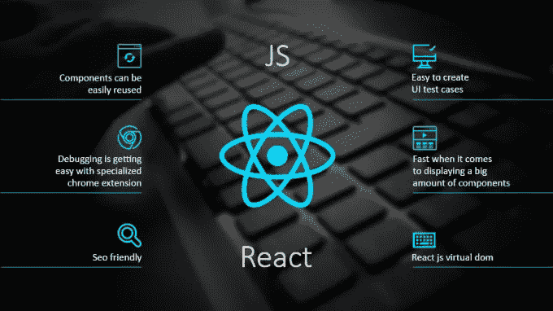

# 掌握这 11 个核心反应概念来征服你的下一次面试

> 原文：<https://javascript.plainenglish.io/master-these-11-core-reactjs-concepts-to-conquer-your-next-interview-61637b61881c?source=collection_archive---------4----------------------->

ReactJS 是一个前端 Javascript 库，由于它的性能、简单的语法和基于组件的方法，受到软件工程师和业内人士的喜爱。

在同样的背景下，对精通 ReactJS 栈的工程师和开发人员的需求也在不断增长。各公司都在寻找经验较少但优秀的反应开发者。

Advantages of ReactJS

在这篇文章中，我试图概述那些在 ReactJS 面试中经常被问到的核心概念。

你准备好了吗？

我们走吧…

# -什么是 ReactJS？

回答这个问题的要点是，它是一个 UI 库，而不是一个框架。这里面试官可以问你一个库和框架的区别。与此相关的另一个问题是 Angular 和 ReactJS 的比较。

# -状态和道具:

与状态和道具相关的问题是 ReactJS 面试中常见的问题。您应该知道，state 存储的是组件固有的对象值，而 props 是 ReactJS 中在组件之间传递的对象值(通常是从父组件传递到子组件)。

# -功能和类别组件:

函数组件和类组件之间的主要区别在于语法。在函数组件中，属性作为参数传递给组件名。而在类组件中，属性作为参数传递给构造函数。在 ReactJS v16.8 之前，在功能组件中操纵“状态”和使用“生命周期”方法是不可能的，但是现在我们可以通过钩子同时使用这两种方法。还询问了与 useState 和 useEffect 挂钩相关的问题。

# -生命周期方法:

生命周期方法用于在组件的“生命周期”中执行不同的操作。面试官可能会问你某个特定的生命周期功能以及它是如何工作的。

# -挂钩:

钩子用于实现功能组件中的状态变化和生命周期。要改变状态，可以使用 useState()钩子，要实现生命周期，可以使用 useEffect()钩子。面试官可能会问你关于 useState()和 useEffect()钩子的内部工作原理。

# -国家管理:

状态管理是 ReactJS 访谈中经常被问到的另一个概念。这方面最流行的库是“react-redux”。Redux 基于 flux 架构。还有其他替代方案，如“反应-未陈述”等。

# -必要的模块:

web 应用程序需要路由来在组件之间导航。在 ReactJS 中，我们可以使用 react-router 和类似的包进行路由。面试官会问你关于这些套餐的问题。如果你为同一个问题开发了两个软件包，那么他可能会问你它们之间的核心区别，你觉得哪个有用，为什么？

# -数据绑定:

ReactJS 遵循单向数据绑定的概念。因此，在这方面，道具是从父组件传递到子组件的。面试可能会问你 Angular 的双向数据绑定和 React 的数据绑定的比较。

# -虚拟 DOM 和实际 DOM:

这是另一个重要的概念。您应该知道虚拟 DOM 在 ReactJS 的上下文中是如何工作的。此外，面试官可能会问你如何区分算法的工作原理。

# -事件处理程序:

ReactJS 中的事件处理程序的用法类似于 JavaScript。但这些处理程序引发的事件本质上是“合成的”。这意味着 ReactJS 中的事件实际上是浏览器本机事件的包装器，以便修复与跨浏览器兼容性相关的问题。

# 记忆化:

记忆化是反应堆中的一个新概念，通过它我们可以在内存中存储一个计算量很大的功能组件。我们可以再次重用该组件，从缓存中调用它。

# **资源:**

*书籍:
- Fullstack React
-破解编码面试*

*储存库:
-*[*https://github.com/Pau1fitz/react-interview*](https://github.com/Pau1fitz/react-interview) *-*[*https://github.com/sudheerj/reactjs-interview-questions*](https://github.com/sudheerj/reactjs-interview-questions)

# 结论:

通常情况下，每个公司在面试中试图关注的都是概念。如果你知道任何一个库或框架的内部工作原理，那么你也可以用它来解决最困难的问题。

***所以，掌握这些概念，祝你下次面试好运！***