# 像专业人士一样掌握 JS console.log

> 原文：<https://javascript.plainenglish.io/mastering-js-console-log-like-a-pro-1c634e6393f9?source=collection_archive---------0----------------------->

## 还是，只用 console.log()调试？嗯，还有很多。

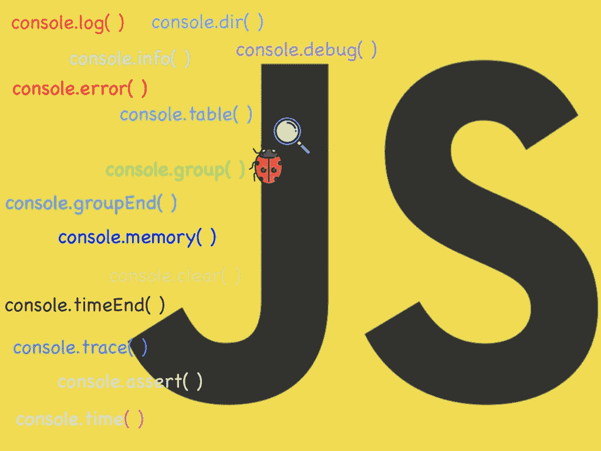

JS CONSOLE

在浏览器控制台中打印消息无疑拯救了所有的开发人员。c

**大多数开发人员都喜欢— *让我们在浏览器中打印消息以了解更多关于这个问题的信息*。我确信我不是唯一一个这样做的人。🤪**

> **调试就像是犯罪电影中的侦探，而你同时也是凶手——菲利普·福特🐛**

**除了最常用的在浏览器中打印消息的 console.log()消息之外，还有许多不同的方法可以使您的调试过程更加容易。下面我们就用例子来一一看看。**

# **console . log()| info()| debug()| warn()| error()**

**这些函数将根据提供给它们的事件类型，用适当的颜色直接打印原始字符串。**

**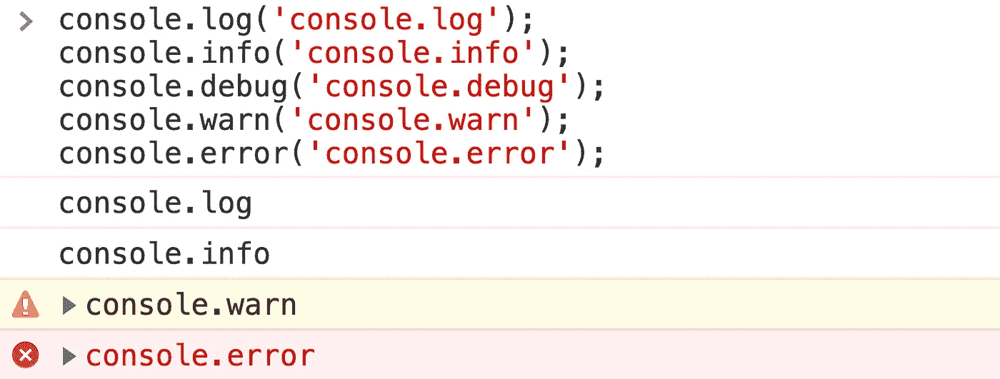**

**console log/info/debug/warn/error**

# **使用占位符**

**下面列出了可以使用的不同占位符:
**%o** —接受一个对象，
**%s** —接受一个字符串，以及
**%d** —代表一个小数或整数**

**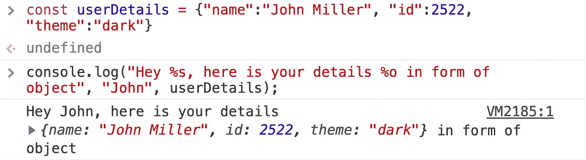**

**placeholders**

# **向控制台消息添加 CSS**

**你所有的控制台信息看起来都一样吗？好吧，从现在开始一切都不一样了，让你的日志看起来更吸引人，因为它对你来说最重要。**

**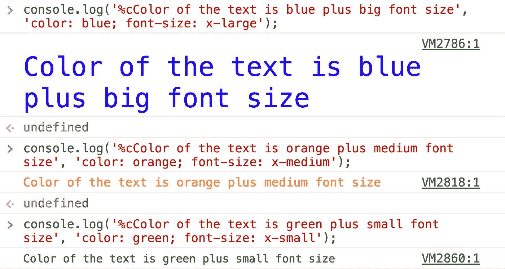**

**Messages with colors**

**只给日志消息中的一个特定单词着色？给你😄**

**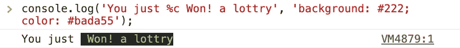**

**highlighting specific word**

# **console.dir()**

**打印指定对象的 JSON 表示。**

****

# **控制台中的 HTML 元素**

**在控制台中获取 HTML 元素，就像检查元素一样**

**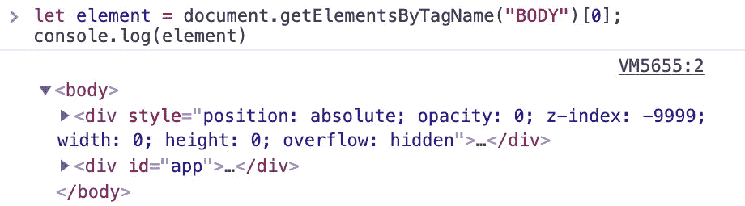**

**HTML Elements**

# **console.table()**

**想以一种恰当且容易理解的方式来看待 JSON 吗？**

**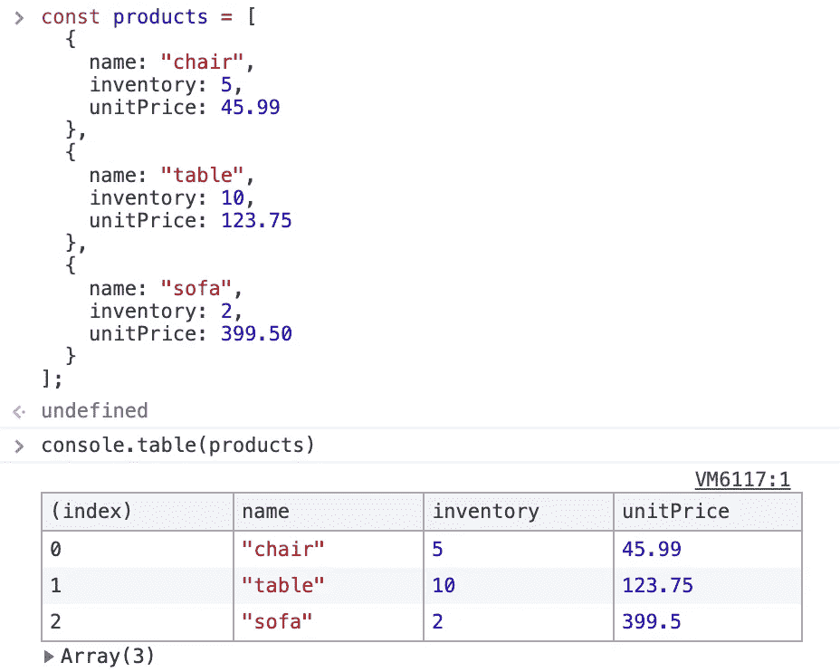**

**Better visualization of an array of objects huh!**

# **console . group()& console . groupend()**

**使用控制台对消息进行分组是很有可能的**

**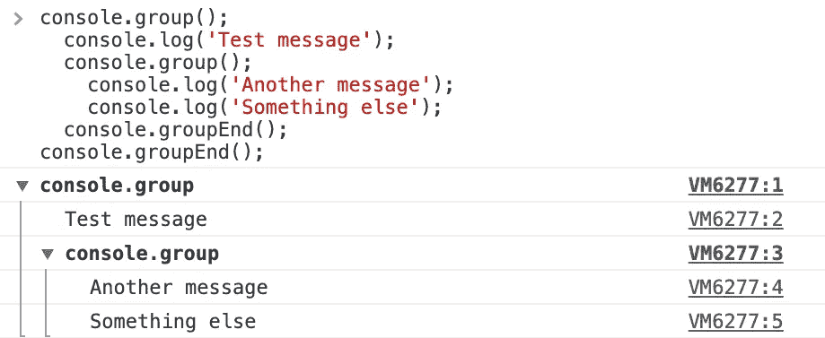**

**Grouping messages**

# **console.count()**

**这个函数记录了这个对`count()`的特定调用被调用的次数。这个函数有一个可选参数`label`。**

**如果提供了`label`，这个函数记录这个特定的`label`调用`count()`的次数。**

**如果省略`label`，该函数记录在该特定行调用`count()`的次数。**

****

**counter**

# **console.assert()**

**当您只想打印一些选定的日志时，这非常方便，也就是说，它只会打印错误的参数。如果第一个论点是真的，它什么也不做。**

****

**Assertion**

# **console.trace()**

**此方法显示一个跟踪，该跟踪显示代码如何在某一点结束。**

**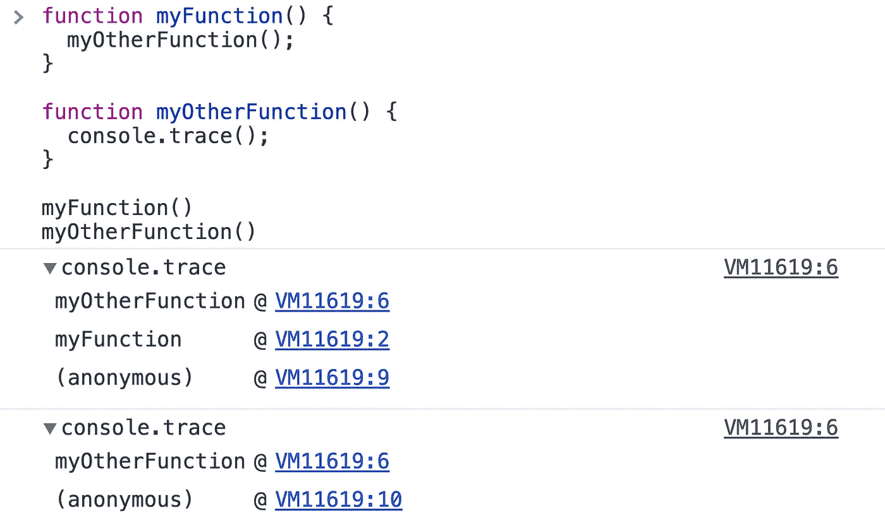**

**Trace**

# **console.time()**

**console.time()是一个跟踪动作所用时间的专用函数，是跟踪 JavaScript 执行所用微时间的更好方法。**

**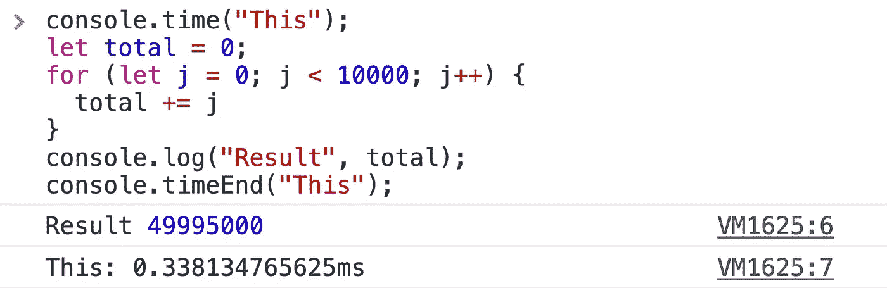**

# **console.memory()**

**想知道我们的 JavaScript 应用程序如何使用浏览器内存吗？**

**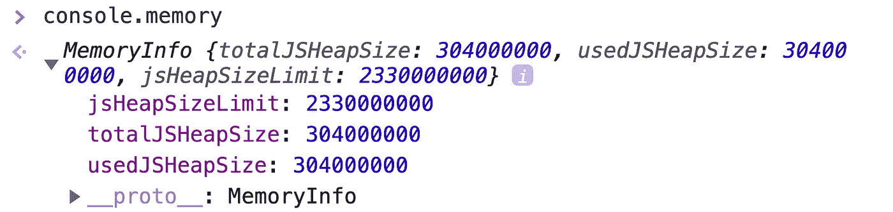**

**Memory**

# **console.clear()**

**这是最后一个，但不是最不重要的😁，要清除您已经了解的所有上述控制台消息，现在应该使用 clear()命令来销毁它们**

**以下是以上所有片段的要点
链接—[https://gist . github . com/Harshmakadia/fc 25 e 56 CB 8 f 49145 f 4c 9b 3528 f 04215 f](https://gist.github.com/Harshmakadia/fc25e56cb8f49145f4c9b3528f04215f)**

**gist**

# **如果你喜欢读这篇文章，你可能也会喜欢我的其他作品:**

*   **[🏆2020 年提升 React 应用性能的 10 个技巧和诀窍](https://medium.com/better-programming/10-tips-and-tricks-to-boost-your-react-apps-performance-in-2020-9388159f6ebf)**
*   **🚀[用 React 钩子替换生命周期方法](https://medium.com/javascript-in-plain-english/lifecycle-methods-substitute-with-react-hooks-b173073052a)**
*   **🙌🏻[提升 JavaScript 和 React 技能的技巧](https://medium.com/better-programming/tips-to-level-up-your-javascript-and-react-skills-62bfbbb9b4d)**

**快乐学习！💻 😀**