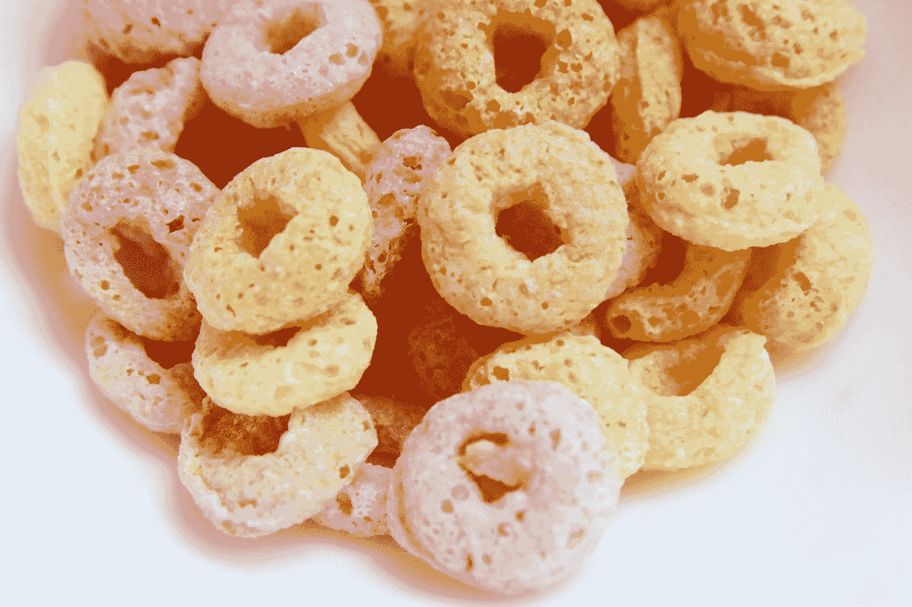

# 材料用户界面—头像和徽章

> 原文：<https://javascript.plainenglish.io/material-ui-avatars-and-badges-2b67ba4e2e6b?source=collection_archive---------1----------------------->



Photo by [Glen Carrie](https://unsplash.com/@glencarrie?utm_source=medium&utm_medium=referral) on [Unsplash](https://unsplash.com?utm_source=medium&utm_medium=referral)

材质 UI 是一个为 React 制作的材质设计库。

这是一组具有材质设计风格的 React 组件。

在这篇文章中，我们将看看如何自定义头像和添加徽章的材料用户界面。

# 后备头像

化身可以使用替代物品进行后退。

它首先寻找的是孩子们。

然后它寻找`alt`文本。

如果这些都不可用，那么将显示通用头像图标。

例如，我们可以写:

```
import React from "react";
import Avatar from "[@material](http://twitter.com/material)-ui/core/Avatar";export default function App() {
  return (
    <div>
      <Avatar src="/broken-image.png" />
    </div>
  );
}
```

然后我们会看到通用的头像图标，因为`broken-image.png`不存在。

# 分组头像

我们可以用`AvatarGroup`组件在一个组中渲染头像。

例如，我们可以写:

```
import React from "react";
import Avatar from "[@material](http://twitter.com/material)-ui/core/Avatar";
import AvatarGroup from "[@material](http://twitter.com/material)-ui/lab/AvatarGroup";
export default function App() {
  return (
    <div>
      <AvatarGroup max={4}>
        {Array(10)
          .fill()
          .map((_, i) => (
            <Avatar alt={`cat ${i}`} src="[http://placekitten.com/200/200](http://placekitten.com/200/200)" />
          ))}
      </AvatarGroup>
    </div>
  );
}
```

显示 10 个头像，但只显示其中的 3 个，加上一个头像以表示还有更多图标。

总共有 4 个图标，这就是`max`道具的价值。

`max`道具让我们限制显示的头像数量。

# 带徽章的头像

我们可以展示一个有徽章的头像。

例如，我们可以写:

```
import React from "react";
import Badge from "[@material](http://twitter.com/material)-ui/core/Badge";
import Avatar from "[@material](http://twitter.com/material)-ui/core/Avatar";
import { withStyles } from "[@material](http://twitter.com/material)-ui/core/styles";const StyledBadge = withStyles(theme => ({
  badge: {
    backgroundColor: "green",
    color: "green",
    boxShadow: `0 0 0 2px ${theme.palette.background.paper}`,
    "&::after": {
      position: "absolute",
      top: 0,
      left: 0,
      width: "100%",
      height: "100%",
      borderRadius: "50%",
      border: "1px solid currentColor",
      content: '""'
    }
  }
}))(Badge);export default function BadgeAvatars() {
  return (
    <div>
      <StyledBadge
        overlap="circle"
        anchorOrigin={{
          vertical: "bottom",
          horizontal: "right"
        }}
        variant="dot"
      >
        <Avatar alt="Remy Sharp" src="http://placekitten.com/200/200" />
      </StyledBadge>
    </div>
  );
}
```

我们创建了一个`StyledBadge`组件，它有一个绿色的背景，位于头像的右下方。

然后我们用`StyledBadge`搭配`overlap`道具，让徽章和头像重叠。

`anchorOrigin`道具将徽章放在右下角，带有`vertical`和`horizontal`属性。

`variant`设置为`dot`显示一个点。

然后我们把我们的`Avatar`放在`StyledBadge`组件里面，把它放在徽章下面。

# 标记

我们可以添加带有`Badge`组件的徽章。

例如，我们可以写:

```
import React from "react";
import Badge from "[@material](http://twitter.com/material)-ui/core/Badge";
import MailIcon from "[@material](http://twitter.com/material)-ui/icons/Mail";export default function App() {
  return (
    <div>
      <Badge badgeContent={10} color="primary">
        <MailIcon />
      </Badge>
    </div>
  );
}
```

我们添加一个带有`Badge`组件的徽章。

`badgeContent`有徽章的内容。

`color`有颜色。`primary`是蓝色。

然后，我们在其中放置一个图标，以显示徽章下方的图标。

# 定制徽章

像许多其他材质 UI 组件一样，我们可以使用`withStyles`函数让我们按照自己想要的方式设计徽章。

例如，我们可以写:

```
import React from "react";
import Badge from "[@material](http://twitter.com/material)-ui/core/Badge";
import { withStyles } from "[@material](http://twitter.com/material)-ui/core/styles";
import IconButton from "[@material](http://twitter.com/material)-ui/core/IconButton";
import MailIcon from "[@material](http://twitter.com/material)-ui/icons/Mail";const StyledBadge = withStyles(theme => ({
  badge: {
    right: -3,
    top: 10,
    border: `2px solid red`,
    padding: "0 3px"
  }
}))(Badge);export default function App() {
  return (
    <IconButton>
      <StyledBadge badgeContent={20} color="secondary">
        <MailIcon />
      </StyledBadge>
    </IconButton>
  );
}
```

用`vadge`类创建一个`StyledBadge`组件。

在`badge`属性中，我们有定位样式、边框和填充。

然后在`App`中，我们有了`IconButton`来添加一个图标按钮。

在它里面，我们有`StyledBadge`组件，我们传入内容和颜色的道具。

# 徽章可见性

我们可以用`invisible`道具让徽章隐形。

例如，我们可以写:

```
import React from "react";
import Badge from "[@material](http://twitter.com/material)-ui/core/Badge";
import Button from "[@material](http://twitter.com/material)-ui/core/Button";
import IconButton from "[@material](http://twitter.com/material)-ui/core/IconButton";
import MailIcon from "[@material](http://twitter.com/material)-ui/icons/Mail";export default function App() {
  const [count, setCount] = React.useState(0); return (
    <>
      <Button
        aria-label="reduce"
        onClick={() => {
          setCount(count => count + 1);
        }}
      >
        increment
      </Button>
      <IconButton>
        <Badge badgeContent={count} color="secondary" invisible={count === 0}>
          <MailIcon />
        </Badge>
      </IconButton>
    </>
  );
}
```

将计数添加到`badgeContent`中。

我们还将`invisible`属性设置为`count === 0`，以便它仅在`count`大于 0 时显示。


Photo by [Ricardo Henrique Vergilio](https://unsplash.com/@rickvergilius?utm_source=medium&utm_medium=referral) on [Unsplash](https://unsplash.com?utm_source=medium&utm_medium=referral)

# 结论

我们可以添加头像来显示名字。

徽章可以在头像或图标上方显示小块数据。

## **简单英语的 JavaScript**

你知道我们有三份出版物和一个 YouTube 频道吗？在[**plain English . io**](https://plainenglish.io/)找到所有内容的链接！