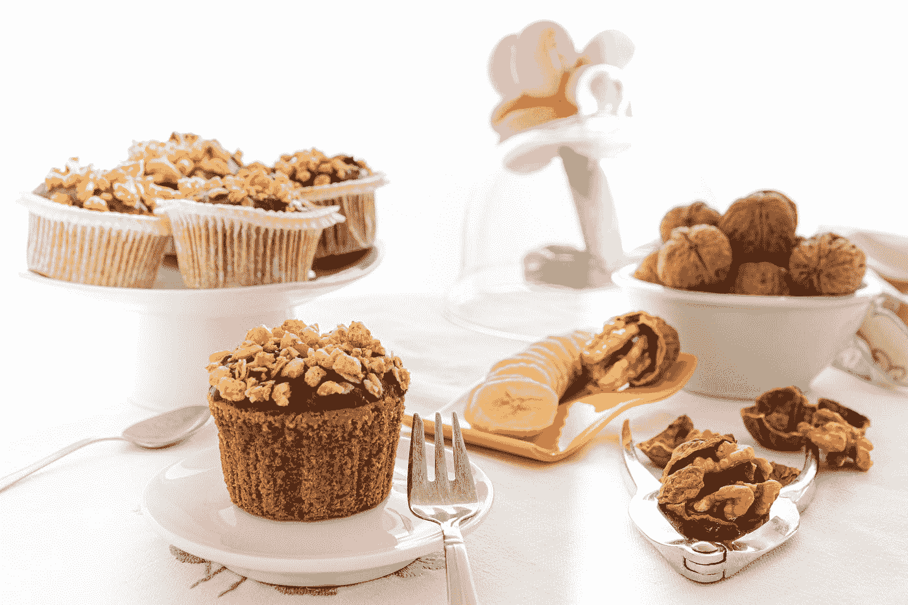
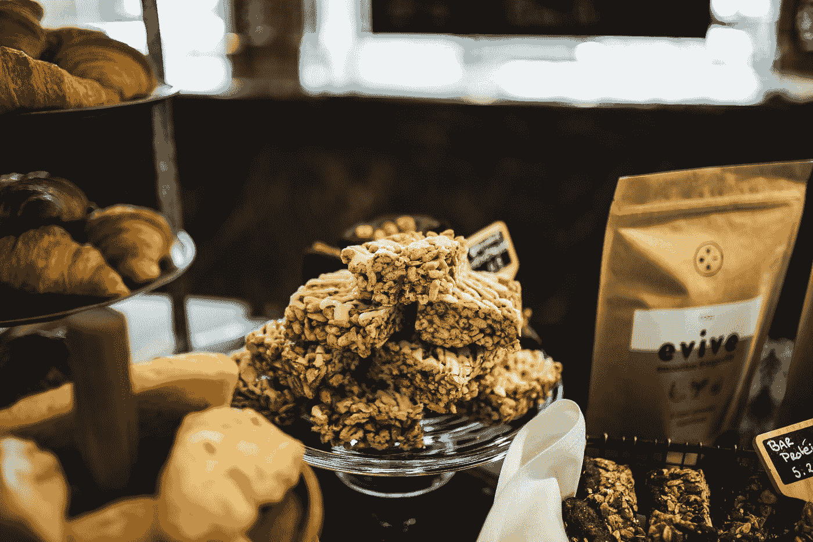

# 材质用户界面—背景和头像

> 原文：<https://javascript.plainenglish.io/material-ui-backdrops-and-avatars-61930c1b3fef?source=collection_archive---------11----------------------->



Photo by [Massimo Adami](https://unsplash.com/@massimo_adami?utm_source=medium&utm_medium=referral) on [Unsplash](https://unsplash.com?utm_source=medium&utm_medium=referral)

材质 UI 是一个为 React 制作的材质设计库。

这是一组具有材质设计风格的 React 组件。

在这篇文章中，我们将看看如何用材质 UI 添加背景和头像。

# 背景

背景让我们强调显示在它上面的组件。

例如，我们可以写:

```
import React from "react";
import Backdrop from "[@material](http://twitter.com/material)-ui/core/Backdrop";
import CircularProgress from "[@material](http://twitter.com/material)-ui/core/CircularProgress";
import Button from "[@material](http://twitter.com/material)-ui/core/Button";export default function App() {
  const [open, setOpen] = React.useState(false);
  const handleClose = () => {
    setOpen(false);
  };
  const handleToggle = () => {
    setOpen(!open);
  }; return (
    <div>
      <Button variant="outlined" color="primary" onClick={handleToggle}>
        Show backdrop
      </Button>
      <Backdrop open={open} onClick={handleClose}>
        <CircularProgress color="inherit" />
      </Backdrop>
    </div>
  );
}
```

用`Backdrop`组件添加背景。

在它里面，我们添加了一个`CircularProgress`来显示一个装载微调器。

`open`道具让我们设定它打开的时间。

`onClick`让我们在点击背景时显示要做的事情。

在我们的例子中，我们通过将`open`状态设置为`false`来关闭它。

# 背景样式

我们也可以设计背景。

例如，我们可以用`color`属性改变内容的颜色:

```
import React from "react";
import Backdrop from "[@material](http://twitter.com/material)-ui/core/Backdrop";
import CircularProgress from "[@material](http://twitter.com/material)-ui/core/CircularProgress";
import Button from "[@material](http://twitter.com/material)-ui/core/Button";
import { makeStyles } from "[@material](http://twitter.com/material)-ui/core/styles";const useStyles = makeStyles(theme => ({
  backdrop: {
    zIndex: theme.zIndex.drawer + 1,
    color: "yellow"
  }
}));export default function App() {
  const classes = useStyles();
  const [open, setOpen] = React.useState(false);
  const handleClose = () => {
    setOpen(false);
  };
  const handleToggle = () => {
    setOpen(!open);
  }; return (
    <div>
      <Button variant="outlined" color="primary" onClick={handleToggle}>
        Show backdrop
      </Button>
      <Backdrop className={classes.backdrop} open={open} onClick={handleClose}>
        <CircularProgress color="inherit" />
      </Backdrop>
    </div>
  );
}
```

我们将`color`设置为`'yellow'`以黄色显示微调器。

此外，我们用`zIndex`属性更改了 z 索引。

# 电影《阿凡达》

要添加一个头像，我们可以使用`Avatar`组件。

要添加一个，我们可以写:

```
import React from "react";
import Avatar from "@material-ui/core/Avatar";export default function App() {
  return (
    <div>
      <Avatar alt="cat" src="http://placekitten.com/200/200" />
    </div>
  );
}
```

我们添加带有`src`属性的`Avatar`组件来设置图像的 URL。

`alt`有文字描述。

# 字母头像

我们也可以在`Avatar`里面添加字母。

例如，我们可以写:

```
import React from "react";
import Avatar from "@material-ui/core/Avatar";export default function App() {
  return (
    <div>
      <Avatar>X</Avatar>
    </div>
  );
}
```

我们添加了`Avatar`组件，在标签之间有一个字母来表示它。

# 头像尺寸

头像的大小是可以改变的。

我们必须用我们自己的风格来改变它。

例如，我们可以写:

```
import React from "react";
import Avatar from "[@material](http://twitter.com/material)-ui/core/Avatar";
import { makeStyles } from "[@material](http://twitter.com/material)-ui/core/styles";const useStyles = makeStyles(theme => ({
  large: {
    width: theme.spacing(8),
    height: theme.spacing(8)
  }
}));export default function App() {
  const classes = useStyles(); return (
    <div>
      <Avatar
        alt="cat"
        src="http://placekitten.com/200/200"
        className={classes.large}
      />
    </div>
  );
}
```

我们使用`makeStyles`函数来创建文件。

我们创建了`large`类来设置`theme.spacing`方法的宽度和高度。

然后我们使用`useStyles`钩子来获取类并应用它。

将`classes.large`类应用于头像，使其变大。

# 图标头像

我们可以在头像里面添加一个图标。

例如，我们可以写:

```
import React from "react";
import Avatar from "[@material](http://twitter.com/material)-ui/core/Avatar";
import { makeStyles } from "[@material](http://twitter.com/material)-ui/core/styles";
import FolderIcon from "[@material](http://twitter.com/material)-ui/icons/Folder";
import { pink } from "[@material](http://twitter.com/material)-ui/core/colors";const useStyles = makeStyles(theme => ({
  pink: {
    color: theme.palette.getContrastText(pink[900]),
    backgroundColor: pink[500]
  }
}));export default function App() {
  const classes = useStyles(); return (
    <div>
      <Avatar className={classes.pink}>
        <FolderIcon />
      </Avatar>
    </div>
  );
}
```

将文件夹图标添加到头像中。

# 化身变体

化身可以具有非圆形形状。

例如，我们可以写:

```
import React from "react";
import Avatar from "[@material](http://twitter.com/material)-ui/core/Avatar";export default function App() {
  return (
    <div>
      <Avatar variant="square">foo</Avatar>
    </div>
  );
}
```

做一个有文字的方形头像。



Photo by [Jade Wulfraat](https://unsplash.com/@jadew?utm_source=medium&utm_medium=referral) on [Unsplash](https://unsplash.com?utm_source=medium&utm_medium=referral)

# 结论

我们可以添加背景来强调某些东西的显示。

头像让我们在一个小容器中显示图标或文本。

## **简明英语 JavaScript**

你知道我们有三份出版物和一个 YouTube 频道吗？在 [**寻找一切的链接 plainenglish.io**](https://plainenglish.io/) ！